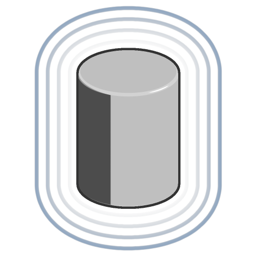

# 圓柱體

<table>
<tr style="border: 0;">
<td width="33.33%" style="border: 0;" valign="top">

<b>收錄於：</b> SDF 函數>原始

</td>
<td width="100.00%" style="border: 0;" valign="top">

## 說明

一個可調整高度、半徑及邊緣圓角的圓柱體的SDF函數。

</td>
</tr>
</table>

>[!INFO]
> 
> 欲了解更多涉及 SDF 函數的概念與工作流程，請前往專門頁面： [使用 SDF 函數](../../working-with-sdf-functions.md)

## 輸入

|  |  |
| :--- | :--- |
| <b>高度</b> *浮標* | 圓柱體從底部起的Z-up高度。  <i>預設值：1</i> |
| <b>半徑</b> *浮標* | 圓柱半徑。  <i>預設值：0.5</i> |
| <b>四捨五入</b> *浮標* | 施加於圓柱邊緣的圓弧半徑。  <i>注意：</i> 硬邊可能出現在圓弧半徑交點處。  <i>預設值：0</i> |
| <b>樞軸位置（地方）</b> *Float3* | 圓柱體局部樞軸的世界空間位置，其中（0， 0， 0）使樞軸位於圓柱中心。  <i>預設值：（0， 0， -0.5）</i> |
| <b>中間位置</b> *Float3* | 圓柱體樞軸的世界空間位置。  <i>預設值：（0， 0， 0）</i> |
| <b>P</b> *Float3* | 轉型後的世界空間位置。 利用此輸入，透過 <b>Offset P</b> 和 <b>Rotate P</b> 節點套用額外的變換。  <i>預設：未變換的世界空間位置。</i> |
