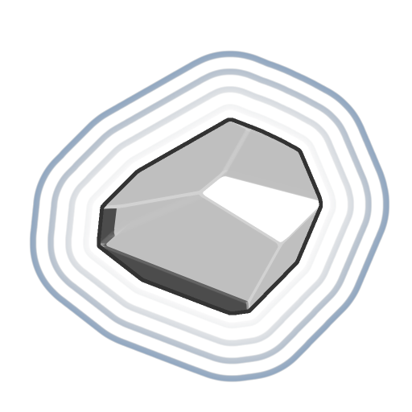

# 搖滾

<table>
<tr style="border: 0;">
<td width="33.33%" style="border: 0;" valign="top">

<b>收錄於：</b> SDF 函數>原始

</td>
<td width="100.00%" style="border: 0;" valign="top">

## 說明

一個用於參數化且可隨機化岩石形狀的 SDF 函數，採用 SDF 函數構建。

</td>
</tr>
</table>

>[!INFO]
> 
> 欲了解更多涉及 SDF 函數的概念與工作流程，請前往專門頁面： [使用 SDF 函數](../../working-with-sdf-functions.md)

## 輸入

|  |  |
| :--- | :--- |
| <b>Max。 面向</b> *整數* | 岩石的最大面數（最多32個）。  <i>預設值：8</i> |
| <b>平滑度</b> *浮標* | 施加在岩石邊緣的圓弧半徑。  <i>預設值：0</i> |
| <b>隨機性</b> *浮標* | 會讓面的方向和距離抖動。 因此，數值越大，岩石越小。  <i>預設值：0</i> |
| <b>種子</b> *浮標* | 隨機性</b>參數的種子<b>。  <i>預設值：0</i> |
| <b>規模</b> *浮標* | 岩石形狀的全球尺度。 在隨機性<b></b>之後<b>、平滑性</b>之前應用。  <i>預設值：0.5</i> |
| <b>中間位置</b> *Float3* | 岩石樞軸的世界空間位置。  <i>預設值：（0， 0， 0.5）</i> |
| <b>P</b> *Float3* | 轉型後的世界空間位置。 利用此輸入，透過 <b>Offset P</b> 和 <b>Rotate P</b> 節點套用額外的變換。 <i>預設：未變換的世界空間位置。</i> |
