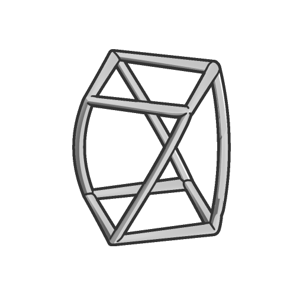

# 扭轉（不精確）

<table>
<tr style="border: 0;">
<td width="33.33%" style="border: 0;" valign="top">

<b>收錄於：</b> SDF 函數> 變換

</td>
<td width="100.00%" style="border: 0;" valign="top">

## 說明

將一個 SDF 形狀繞其 Z 軸，在起點與終點之間旋轉，角度可調整。  <i>注意：</i>由於此變換函數不精確，渲染時可能會出現失真。

</td>
</tr>
</table>

>[!INFO]
> 
> 欲了解更多涉及 SDF 函數的概念與工作流程，請前往專門頁面： [使用 SDF 函數](../../working-with-sdf-functions.md)

## 輸入

|  |  |
| :--- | :--- |
| <b>SDF</b> *浮標* | 輸入的 SDF 形狀。 |
| <b>角度</b> *浮標* | 旋轉的角度，依序是扭轉結束時施加的角度。 |
| <b>開始</b> *浮標* | 扭轉開始的Z軸世界位置。 下面所有的體積都沒有扭曲。 |
| <b>結束</b> *浮標* | 扭轉結束處的 Z 軸世界位置。 上方所有體積均以指定角度均勻旋轉。 |
| <b>P</b> *Float3* | 轉型後的世界空間位置。 利用此輸入，透過 <b>Offset P</b> 和 <b>Rotate P</b> 節點套用額外的變換。  <i>預設：未變換的世界空間位置。</i> |
