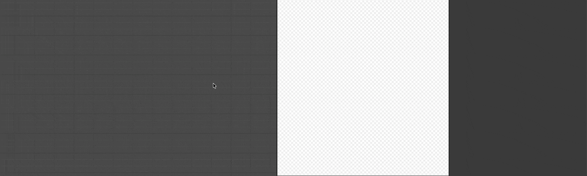

# 與 SDF 函式的處理

在 16.0.0 版本中，Substance 3D Designer 引入了一組強大的節點來撰寫 SDF 函式，這些函式可用於建立和操作程序化的 3D 形狀。

SDF 函數是 Substance 函數圖，結合工具集中可用的 SDF 節點，並套用於支援 SDF 函數的節點中的專用參數。

作為起點，請記住基本工作流程如下：

1. 在 3D 檢視[&#128279;](../../../../compositing-graphs/nodes-reference-for-com/node-library/filters/effects/3d-viewer/3d-viewer.md)節點中撰寫一個 SDF 函數以視覺化結果。
2. 將最終函數圖複製（或 [實](../../../../glossary/glossary.md#instance-node)例化）到支援 SDF 函數 [的節點參數中，例如 Shape splatter v2](../../../../compositing-graphs/nodes-reference-for-com/node-library/texture-generators/patterns/shape-splatter-v2/shape-splatter-v2.md)。

## 什麼是SDF函數？

<table style="border: none">
    <tr style="border: 0">
        <td style="border: 0; vertical-align: top">
            
就像數學函數可以在二維中繪製曲線一樣，它們也可以在三維中繪製為曲面。

有符號距離場是一種數學函數，透過計算空間中任意一點到曲面上最近點的距離，來定義三維空間中的曲面。

讓我們來拆解一下「有符號距離場」這個名稱，以更好地理解它：<ul><li><b>有符號</b> 表示，若點在表面外側或前方，函數回傳正值;若點在表面內側或後方，則回傳負值;若點正好在表面上，則回傳為零。</li><li><b>距離</b> 指的是函數計算空間中任一點到表面上*最近*點的距離。</li><li><b>場的意思</b> 是函數描述一個值域，因為空間中的每個點都有對應的值，代表它與最近曲面的距離。</li></ul>

        </td>
        <td style="border: 0; width: 33%; vertical-align: top">
            
        </td>
    </tr>
</table>

這些功能在電腦圖形中有許多應用，例如繪製表面、陰影投射、輪廓遮罩、碰撞偵測等。

在 Substance 3D Designer 中，SDF 函式用於以程序化方式建立和操作 3D 形狀。

### SDF 函數的輸出與預期用途

SDF 函數節點輸出單一浮點數值：即與最近曲面的有號距離。

但它們還有更多功能：它們內部取得並設定宿主節點需要定義和/或知道的變數值，以便操作和繪製產生的形狀。

這表示這些節點必須用於支援 *SDF 函式* 的節點，因為它知道這些變數並原生整合。

節點包括 [Shape splatter v2](../../../../compositing-graphs/nodes-reference-for-com/node-library/texture-generators/patterns/shape-splatter-v2/shape-splatter-v2.md) 和 [3D 檢視器](../../../../compositing-graphs/nodes-reference-for-com/node-library/filters/effects/3d-viewer/3d-viewer.md)。

### 物質函數圖

SDF 函數節點設計用於專用的 Substance 函數圖，因此僅能在該圖類型中使用。
節點參數若要以函式形式表示，則使用「編輯函數」按鈕。

你需要知道的關於物質函數圖的事項：
* 與 Substance 圖類似，節點連接器是&#x200B;*專門化*&#x200B;的，意即只能連接到代表其類型[&#128279;](../../function-nodes-overview/function-nodes-overview.md#color-coding)、顏色&#x200B;*相符*的其他連接器。
* 節點沒有參數，只能有輸入。 （當然有少數特定例外）
* 該圖只有一個輸出節點。 右鍵點擊節點，選擇 `Set as output` 指定為輸出節點。
* 同樣地，與 Substance 圖類似，還有 *原子* 節點——基礎建構單元——以及 *代表其他 Substance 函數圖的實例* 節點。
* 有獨立的運算子（代數運算子、邏輯運算子和比較運算子）可以對圖中的數值進行運算，但 SDF 節點有 [自己的運算子](#operators)

+++ 定義 SDF 函數的函數圖範例

+++

## 開始

要撰寫 SDF 函式，我們首先需要視覺化它們，以便理解我們調整的節點與參數的影響。

[3D 檢視](../../../../compositing-graphs/nodes-reference-for-com/node-library/filters/effects/3d-viewer/3d-viewer.md)節點有專用模式用來視覺化使用 SDF 函數所產生的形狀：將節點的<b>場景類型</b>參數設為 ，`SDF function`並點擊&#x200B;**編輯函數**&#x200B;按鈕即可開啟將承載 SDF 函式的功能圖。

節點提供專用功能，用以視覺化 SDF 函數的各個面向，讓我們能更直覺且有效率地建構，例如包圍框架與等值線。

[物理太陽/天空](../../../../compositing-graphs/nodes-reference-for-com/node-library/3d-view-library/hdri-tools/physical-sun-sky/physical-sun-sky.md)節點可用於快速設定 3D 檢視器的環境光照。

>[!TIP]
> 
> <table style="border: none"><tr style="border: none"><td style="border: none; vertical-align: top">
所有 SDF 功能節點及其輸入連接器都有工具提示，能讓你更了解它們的用途以及如何使用。

一定要去看看！
</td><td style="border: none; width: 33%; vertical-align: top"></td></tr></table>

### 設定節點值

與 Substance 函數圖中的所有節點一樣，SDF 函數節點沒有參數，只有作為參數使用的輸入連接器。

要設定這些輸入的值，可以使用 [常數節點](../../atomic-function-nodes/constant-nodes/constant-nodes.md) 如 **Float**、 **Float3** 和 **Integer3**。\
你可以用節點選單中常用的方式建立這些節點，或者從連接器拖曳新連線，這樣就能看到篩選出的匹配節點清單。

大多數 SDF 函式節點的輸入連接器都有預設值，並會在工具提示中揭露。

>[!TIP]
> 
> <table style="border: none"><tr style="border: none"><td style="border: none; vertical-align: top">
如果你不需要一直保持某些數值可見，可以用鍵來停靠節點 <code>D</code> ，這樣可以節省空間並清理圖表。

你也可以用註解來追蹤數值。
</td><td style="border: none; width: 67%; vertical-align: top"></td></tr></table>

### 包圍框架

<table style="border: none">
    <tr style="border: none">
        <td style="border: none; vertical-align: top">
            
包圍框是三維空間中的一個框，定義<i>了 SDF 函數在 Shape splatter v2</a> 節點中被評估及繪製<a href="../../../../compositing-graphs/nodes-reference-for-com/node-library/texture-generators/patterns/shape-splatter-v2/shape-splatter-v2.md">的邊界</i>。

如果包圍框架太小，形狀的部分可能會被裁剪。 如果容量過大，可能會導致不必要的計算和更長的處理時間。

<b>包圍框架</b>參數讓你能啟用包圍框架的視覺化。接著你可以透過改變包圍框架大小</b>參數的<b>值來調整包圍框架的大小。

使用 <b>「著色出框</b> 」參數，將包圍框外區域以鮮紅色呈現，這樣你就能相應調整畫面。

        </td>
        <td style="border: none; width: 33%; vertical-align: top">
            
        </td>
    </tr>
</table>

### 等值線

<table style="border: none">
    <tr style="border: none">
        <td style="border: none; vertical-align: top">
            
因為變換形狀涉及實際*轉換它們所繪製的空間*，經過某些變換後所用節點的結果可能會令人驚訝。 在這些情況下，視覺化空間本身會很有幫助，這可以透過視覺化形狀的距離場</i>來實現<i>。

為此，3D 檢視節點使用 <i>等值線</i>，即代表形狀表面給定距離的等高線。 <b>SDF 等值線</b>參數使得這種視覺化成為可能。 等值線繪製在由 SDF 等值線位置</b>參數指定的<b>水平面上。

觀察等值線因變換而變形，有助於理解形狀本身的變換，並相應調整節點參數。

        </td>
        <td style="border: none; width: 33%; vertical-align: top">
            
        </td>
    </tr>
</table>

## SDF 功能節點類別

SDF 函數節點在函式庫中依其功能與用途進行分類。

你可以建立任意數量的函式庫檢視，以組織工作區，使 SDF 功能工具組依類別排列，同時保持所有工具隨時可用。 請前往 **Windows >新資料庫** 檢視以新增獨立的資料庫檢視。

+++ 範例工作區

+++

### 基本體

SDF 功能的基本組件，讓你能創造基本形狀，如球體、方框、圓柱體等。

+++ 節點

[有帽錐體](./sdf-functions-primitives/3d-sdf-capped-cone/3d-sdf-capped-cone.md)\
[有帽錐（2分）](././sdf-functions-primitives/3d-sdf-capped-cone-2-points/3d-sdf-capped-cone-2-points.md)\
[有頂環面](./sdf-functions-primitives/3d-sdf-capped-torus/3d-sdf-capped-torus.md)\
[膠囊](./sdf-functions-primitives/3d-sdf-capsule/3d-sdf-capsule.md)\
[錐體](./sdf-functions-primitives/3d-sdf-cone/3d-sdf-cone.md)\
[立方體](./sdf-functions-primitives/3d-sdf-cube/3d-sdf-cube.md)\
[圓筒](./sdf-functions-primitives/3d-sdf-cylinder/3d-sdf-cylinder.md)\
[圓柱（2點）](./sdf-functions-primitives/3d-sdf-cylinder-2-points/3d-sdf-cylinder-2-points.md)\
[橢球體](./sdf-functions-primitives/3d-sdf-ellipsoid/3d-sdf-ellipsoid.md)\
[細長圓柱體](./sdf-functions-primitives/3d-sdf-elongated-cylinder/3d-sdf-elongated-cylinder.md)\
[接地平面](./sdf-functions-primitives/3d-sdf-ground-plane/3d-sdf-ground-plane.md)\
[螺旋](./sdf-functions-primitives/3d-sdf-helix/3d-sdf-helix.md)\
[六角柱](./sdf-functions-primitives/3d-sdf-hexagonal-prism/3d-sdf-hexagonal-prism.md)\
[無限平面](./sdf-functions-primitives/3d-sdf-infinite-plane/3d-sdf-infinite-plane.md)\
[飛機](./sdf-functions-primitives/3d-sdf-plane/3d-sdf-plane.md)\
[金字塔](./sdf-functions-primitives/3d-sdf-pyramid/3d-sdf-pyramid.md)\
[金字塔方陣](./sdf-functions-primitives/3d-sdf-pyramid-square/3d-sdf-pyramid-square.md)\
[搖滾](./sdf-functions-primitives/3d-sdf-rock/3d-sdf-rock.md)\
[球面](./sdf-functions-primitives/3d-sdf-sphere/3d-sdf-sphere.md)\
[環面](./sdf-functions-primitives/3d-sdf-torus/3d-sdf-torus.md)

+++

### 營運商

這些節點讓你能組合和修改用圖元建立的形狀。 包括：
* **像是 Union[&#128279;](sdf-functions-operators/3d-sdf-op-union/3d-sdf-op-union.md)、[Intersection](sdf-functions-operators/3d-sdf-op-intersection/3d-sdf-op-intersection.md) 和 [Subtrimion](sdf-functions-operators/3d-sdf-op-subtraction/3d-sdf-op-subtraction.md) 這類純布林**&#x200B;運算子，讓你能以不同方式組合形狀。
* **變形布林** 運算子，如 [圓入（Rounding](sdf-functions-operators/3d-sdf-op-rounding/3d-sdf-op-rounding.md) ）和 [變形（Morph](sdf-functions-operators/3d-sdf-op-morph/3d-sdf-op-morph.md) ），能讓你結合形狀並產生混合效果。
* **其他專門**&#x200B;的操作符，如 [&#128279;](sdf-functions-operators/3d-sdf-op-symmetry/3d-sdf-op-symmetry.md)Shell 和 [Symmetry](sdf-functions-operators/3d-sdf-op-shell/3d-sdf-op-shell.md)，能讓你修改和/或複製形狀。

+++ 節點

[交叉口](./sdf-functions-operators/3d-sdf-op-intersection/3d-sdf-op-intersection.md)\
[交集平滑](./sdf-functions-operators/3d-sdf-op-intersection-smooth/3d-sdf-op-intersection-smooth.md)\
[交集曲面](./sdf-functions-operators/3d-sdf-op-intersection-surface/3d-sdf-op-intersection-surface.md)\
[變形](./sdf-functions-operators/3d-sdf-op-morph/3d-sdf-op-morph.md)\
[重複鏡](./sdf-functions-operators/3d-sdf-op-repeat-mirror/3d-sdf-op-repeat-mirror.md)\
[四捨五入](./sdf-functions-operators/3d-sdf-op-rounding/3d-sdf-op-rounding.md)\
[殼牌](./sdf-functions-operators/3d-sdf-op-shell/3d-sdf-op-shell.md)\
[減法](./sdf-functions-operators/3d-sdf-op-subtraction/3d-sdf-op-subtraction.md)\
[減法平滑](./sdf-functions-operators/3d-sdf-op-subtraction-smooth/3d-sdf-op-subtraction-smooth.md)\
[對稱性](./sdf-functions-operators/3d-sdf-op-symmetry/3d-sdf-op-symmetry.md)\
[聯合](./sdf-functions-operators/3d-sdf-op-union/3d-sdf-op-union.md)\
[聯合倒角](./sdf-functions-operators/3d-sdf-op-union-chamfer/3d-sdf-op-union-chamfer.md)\
[聯合平滑](./sdf-functions-operators/3d-sdf-op-union-smooth/3d-sdf-op-union-smooth.md)

+++

### 轉換

形狀可以透過多種方式變換，例如平 [移](sdf-functions-transforms/3d-sdf-transform-offset/3d-sdf-transform-offset.md)、 [旋轉](sdf-functions-transforms/3d-sdf-transform-rotate/3d-sdf-transform-rotate.md)、 [縮放](sdf-functions-transforms/3d-sdf-transform-scale/3d-sdf-transform-scale.md)、 [扭轉](sdf-functions-transforms/3d-sdf-transform-twist/3d-sdf-transform-twist.md) 等。
這些節點讓你能透過變換表面所定義的空間*來執行這些轉換*。

這個空間被稱為 ，請 `P`繼續閱讀下一節，了解它的意義以及空間轉換的運作方式。

+++ 節點

[彎道](./sdf-functions-transforms/3d-sdf-transform-bend/3d-sdf-transform-bend.md)\
[拉長型](./sdf-functions-transforms/3d-sdf-transform-elongate/3d-sdf-transform-elongate.md)\
[翻轉](./sdf-functions-transforms/3d-sdf-transform-flip/3d-sdf-transform-flip.md)\
[偏移](./sdf-functions-transforms/3d-sdf-transform-offset/3d-sdf-transform-offset.md)\
[偏移P](./sdf-functions-transforms/3d-sdf-transform-offset-p/3d-sdf-transform-offset-p.md)\
[旋轉](./sdf-functions-transforms/3d-sdf-transform-rotate/3d-sdf-transform-rotate.md)\
[旋轉P](./sdf-functions-transforms/3d-sdf-transform-rotate-p/3d-sdf-transform-rotate-p.md)\
[規模](./sdf-functions-transforms/3d-sdf-transform-scale/3d-sdf-transform-scale.md)\
[轉折](./sdf-functions-transforms/3d-sdf-transform-twist/3d-sdf-transform-twist.md)

+++

### 材質

基本材質管理可用於使用 SDF 函數產生的形狀。

你可以定義基本材質屬性：顏色、粗糙度和金屬度，用於 3D 檢視器節點的直接視覺化，或作為 Shape splatter v2 節點材質工作的基礎。\
你也可以為形狀的不同部分指派材質 ID，將它們分隔開來。

以下將了解這些節點[&#128279;](#material-id)的應用。

+++ 節點

* [集合材質識別碼](./sdf-functions-material/set-id/set-id.md)
* [舞台布景材料](./sdf-functions-material/set-material/set-material.md)
* [場景顏色](./sdf-functions-material/set-color/set-color.md)
* [集合金屬性](./sdf-functions-material/set-metalness/set-metalness.md)
* [設定粗糙度](./sdf-functions-material/set-roughness/set-roughness.md)

+++

## 「P」輸入

當我們對形狀施加變換，例如偏移或旋轉時，實際上是變換該形狀所處的空間。

如果我們希望轉換能傳播到其他形狀——例如，如果我們想以相同方式旋轉多個形狀——就必須確保它們都使用相同的轉換空間。

轉換後的空間會透過節點的專用 `P` 輸入來共享，這在大多數 SDF 節點中都能找到。\
「P」代表世界空間 **P** osition：一個三維向量，代表世界空間中某點的座標。

[偏移 P](sdf-functions-transforms/3d-sdf-transform-offset-p/3d-sdf-transform-offset-p.md) 和[旋轉 P](sdf-functions-transforms/3d-sdf-transform-rotate-p/3d-sdf-transform-rotate-p.md) 節點會轉換空間，並讓你能將這個轉換傳播到所有應該繼承它的節點。\
例如，多個圖形可以透過連接 `P` 同一個旋轉 P 節點來旋轉。

這不僅僅是方便的問題，更是確保SDF節點在空間中能與相同位置運作。

舉個例子：

球體被重複使用，以視覺化空間為三維網格。 **&#x200B;重複空間。\
若沒有共享 `P`，彎曲圓柱會使用球體所使用的重複空間。\
透過共享 `P`的 ，可以在共享旋轉空間中正確定義形狀。

## 在「Shape splatter v2」節點使用 SDF 函式

當你在 3D 檢視器節點的上下文中完成一個 SDF 函式後，你可以複製整個函式並貼到 [Shape splatter v2](../../../../compositing-graphs/nodes-reference-for-com/node-library/texture-generators/patterns/shape-splatter-v2/shape-splatter-v2.md) 節點，作為該節點的形狀產生器使用。

將 Shape 類型&#x200B;**參數設**&#x200B;為 `SDF function`，然後前往 **Pattern SDF 函數**&#x200B;參數，點擊&#x200B;**編輯函數**&#x200B;按鈕即可開啟該參數的功能圖。
接著你可以把從 3D 檢視器節點複製的函式貼到那張圖裡。 （別忘了再設定函數圖的輸出節點！）

務必調整 **SDF 的包圍框架大小** 參數，使其符合 [你在 3D 檢視節點中使用的包圍框架](#the-bounding-frame) ，並確保形狀繪製正確。

\
*Shape Splatter v2 的&#x200B;**Shape 類型**&#x200B;設定為 `SDF function`。 注意&#x200B;**SDF 邊界框架尺寸**&#x200B;已調整以符合該形狀。*

>[!TIP]
> 
> 若要輕鬆重用 SDF 函式，可以將其複製到新的 Substance 函式圖，並在 3D 檢視器和 Shape splatter v2 節點中作為實例節點&#x200B;**使用**。
> 
> 這帶來多項好處：
> * 你對函式的任何更新都會反映在兩個節點上，不需要再複製貼上。 這對於複雜形狀來說是極大的生活品質提升。
> * 圖可以有一個描述性的名稱，在實例節點中可見，這會讓你使用自己的 SDF 圖形庫更易管理，也讓圖表更易閱讀。
> * 你可以為函數圖建立輸入，然後搭配 Get[&#128279;](../../atomic-function-nodes/get-nodes/get-nodes.md) 節點使用。這些輸入會在實例節點中以輸入連接器的形式暴露，讓你能輕鬆做出形狀的變化。

### 材質識別

SDF 形狀可以被指派一個材質 ID，這是一個整數值，可以用來區分形狀的各個部分，並在 3D 檢視[&#128279;](../../../../compositing-graphs/nodes-reference-for-com/node-library/filters/effects/3d-viewer/3d-viewer.md)器和 [Shape splatter v2](../../../../compositing-graphs/nodes-reference-for-com/node-library/texture-generators/patterns/shape-splatter-v2/shape-splatter-v2.md) 節點中分配不同的材質。

請注意，不同材質 ID 的表面會被硬邊分割成混合形狀，如下範例所示。

在你想標記特定材質 ID 的形狀部分後面，使用 [設定材質 ID](./sdf-functions-material/set-id/set-id.md) 節點，並用 [整數](../../atomic-function-nodes/constant-nodes/constant-nodes.md) 常數節點設定想要的材質 ID 值。\
在 3D 檢視器節點中，設定 **輸出** 參數以 `Material ID` 視覺化形狀的材質 ID。

\
*右側為兩個 3D 檢視節點的輸出，合成顯示形狀（左）與材質 ID（右），說明混合形狀中材質如何插值，而材質 ID 則被分割。*

材質 ID 可由 Shape splatter v2 伴隨節點利用：
* [Shape Splatter v2 的貼圖節點](../../../../compositing-graphs/nodes-reference-for-com/node-library/texture-generators/patterns/shape-splatter-v2-mapper-color/shape-splatter-v2-mapper-color.md) 可以使用這些材質 ID 來指派不同的圖案。
* [形狀濺光 v2 到遮罩](../../../../compositing-graphs/nodes-reference-for-com/node-library/texture-generators/patterns/shape-splatter-v2-to-mask/shape-splatter-v2-to-mask.md) 可以根據形狀的材質 ID 遮罩部分形狀。

<table style="border: none; margin-top: 32px">
    <tr style="border: 0">
        <td style="border: 0; width: 33%">
            <i>Shape splatter v2 映射器色彩中用於色彩映射 的材質 ID</i>
        </td>
        <td style="border: 0; width: 33%">
            <i>用於 Shape splatter v2 映射器色彩中三平面映射 的材質識別碼</i>
        </td>
        <td style="border: 0; width: 33%">
             <i>用於 Shape splatter v2 遮罩 的材質 ID</i>
        </td>
    </tr>
</table>

### 顏色、粗糙度與金屬度

[Set color](./sdf-functions-material/set-color/set-color.md)、[Set roughness](./sdf-functions-material/set-roughness/set-roughness.md) 和 [Set metalness](./sdf-functions-material/set-metalness/set-metalness.md) 節點讓你在 SDF 函式中為形狀定義這些材質屬性。

然後，當該 SDF 函式作為 Shape splatter v2[&#128279;](../../../../compositing-graphs/nodes-reference-for-com/node-library/texture-generators/patterns/shape-splatter-v2/shape-splatter-v2.md) 節點的形狀類型時，這些材質屬性會以 SDF 顏色&#x200B;**、** SDF 粗糙度&#x200B;**和** SDF 金屬度&#x200B;**輸出的貼圖**&#x200B;形式提供。這些地圖可作為使用其他節點進行更複雜材質工作的基礎。

請注意，與材質 ID 不同，數值會 *以漸層形式插* 值於混合形狀間，如下例所示。

<table style="border: none; margin-top: 32px">
    <tr style="border: 0">
        <td style="border: 0; width: 33%">
            <i>SDF 色彩輸出</i>
        </td>
        <td style="border: 0; width: 33%">
             <i>SDF 粗糙度輸出</i>
        </td>
        <td style="border: 0; width: 33%">
            <i>SDF 金屬度輸出</i>
        </td>
    </tr>
</table>

### 材料樣本

<table style="border: none">
    <tr style="border: none">
        <td style="border: none; vertical-align: top">
            
<b>Rusty bolts</b> <a href="../../../../compositing-graphs/creating-compositing-gra/material-samples/material-samples.md">材質範例</a>可供跳入 Shape splatter v2 節點中應用的 SDF 函數。

圖表經過組織與註解，引導你了解結構、節點設定及 SDF 函式設定。

它也 <i>完全可</i> 編輯，因此可以作為沙盒，讓玩家更實際地了解 Shape splatter v2 和 SDF 功能工具組。 你可以製作任意多的範例圖表，歡迎隨意嘗試！

        </td>
        <td style="border: none; width: 20%; vertical-align: top; text-align: right">
            
        </td>
    </tr>
</table>
