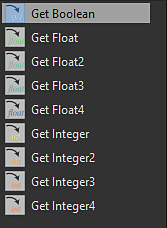

# 取得一個變數值

要在函式中使用變數，你需要「呼叫」它，也就是說需要將變數的值匯入函式。

要做到這點，你需要使用 *Get* 節點：

Get 節點有不同種類：根據你想匯入的值類型選擇正確的節點：

## 將變數指派給 Get 節點

預設情況下，get 節點會顯示警告標誌：表示尚未連結到任何變數。

要連結變數，請進入參數，並在「變數/Get \*\*\*」清單中選擇一個變數（\*\*\*會被你的 Get 節點能呼叫的值類型取代）。

變數名稱會顯示在節點中：

請注意，只有來自 Get 節點相同類型的變數會出現在清單中。

>[!WARNING]
>
> 請注意，使用 *Set* 節點建立的變數不會出現在 *Get* 節點清單中。
> 
> 但你仍然可以透過手動寫入清單名稱來取得變數。
> 
> 別忘了，你可以直接呼叫用 Set 節點建立的變數，如果：
> 
> * Get 和 Set 節點是函數圖，控制同一節點的參數
> * 由 Get *節點圖控制*&#x200B;的參數要麼相同，要麼位於 Set *節點圖的參數*&#x200B;下方，位於參數堆疊中。
