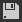

# 2D 視角

本頁說明 Substance 3D Designer 中 2D 檢視&#x200B;**面板的**&#x200B;使用者介面與功能。

## 概觀

[2D 視圖](https://substance3d.adobe.com/)是 Designer 使用者介面的主要面板之一。其主要目的如下：

* 顯示&#x200B;*指定節點*&#x200B;的&#x200B;*值*&#x200B;或&#x200B;*影像*&#x200B;輸出，或經過指定的&#x200B;*節點連接器*
* 顯示點陣[&#128279;](../../resources/bitmap-resource/bitmap-resource.md)圖與[向量圖形](../../resources/vector-graphics-svg-res/vector-graphics-svg-resource.md)資源[&#128279;](../../resources/resources.md)
* 顯示 *其目前所持有內容的額外資訊* ，例如色彩通道或精確的色彩值
* 控制參數的 *裝置*

當顯示的影像或數值被修改時，2D 檢視 *會自動* 更新，以保持與當前資料狀態同步。\
*多個* 2D 檢視面板可隨時啟用，且每個面板可顯示不同的影像或數值。 你可以透過<b>使用者介面面板的針腳</b>功能來控制何時使用新的面板。

### 以 2D 視圖顯示內容

>[!WARNING]
>
> 本節中所有對節點的 *動作提及僅* 適用於 [實體圖](../../compositing-graphs/substance-compositing-graphs.md)。

在 2D 視圖中顯示任何影像最直接的方式是雙擊 *LMB...*

* ...在[&#128279;](../../interface/the-explorer-window/the-explorer-window.md)檔案總管中的[點陣](../../resources/bitmap-resource/bitmap-resource.md)圖或[向量圖形](../../resources/vector-graphics-svg-res/vector-graphics-svg-resource.md)資源上
* ...在圖視圖中 [，節點或節點連接器上](../../interface/the-graph-view/the-graph-view.md)

影像也可以&#x200B;*直接拖放*，方法是按住檔案總管[&#128279;](../../interface/the-explorer-window/the-explorer-window.md)面板中的資源[&#128279;](../../resources/resources.md)鍵 LMB *，或*&#x200B;在圖視圖的節點上按&#x200B;*住 RMB*。

在圖視圖中，你可以透過 <b>「2D 檢視</b> 」的輸出選項將影像傳送到 2D 視圖，該選項可點擊 *RMB*...

* ...在節點&#x200B;***上顯示該節點的輸出。*&#x200B;如果節點有多個輸出，請在子選單中選擇想要的輸出
* ...在&#x200B;**&#x200B;圖視圖&#x200B;*中顯示該圖的輸出*。如果圖表有多個輸出，請在子選單中選擇想要的輸出

載入圖表時，預設會自動在 2D 檢視中顯示其 *第一個輸出* 。 你可以在 [偏好設定](../../interface/preferences-window/preferences-window.md)中停用此行為。 進入 <b>Edit >偏好設定> > Substance 合成圖</b>*，並在開啟圖表</b>選項時取消勾選* <b>2D 視圖中的「View 輸出」。

## 視框

視窗是 *2D 視圖</b>的<b>顯示區域*，讓你能&#x200B;*透過以下滑鼠與鍵盤快捷鍵來瀏覽*&#x200B;顯示影像：

<table>
<tr style="border: 0;">
<td style="border: 0;" valign="top">

* <b>平移：</b> Ctrl+RMB / MMB
* <b>縮放：</b> Alt+RMB / 滑鼠滾輪 / 「顯示縮放」工具：\
  
* <b>調整以符合視窗：</b> F / 「調整到視窗」按鈕 
* <b>調整到 1：1 比例：</b> Z / 「合適比例」按鈕 

</td>
<td style="border: 0;" valign="top">

</td>
</tr>
</table>

使用觸控板（僅限 macOS）

* <b>Pan： </b>兩指滑動
* <b>縮放：</b> 雙指捏合/兩指滑動同時按住指令鍵

>[!IMPORTANT]
>
> 不可用的行動
> 
> *若影像目前顯示大小*&#x200B;低於視窗&#x200B;*大小，則無法*&#x200B;平移影像。
> 
> *若顯示內容*&#x200B;已不存在&#x200B;*，例如圖片的參考節點或資源被刪除，則無法*&#x200B;放大或縮小影像。

>[!NOTE]
>
> 放大方向
> 
> 每種縮放方法會被另一方法反轉：
> 
> * 滑鼠滾輪向上 *會將* 影像拉近
> * Alt+RMB 並向上拖動 *會把* 圖片推開
> 
> 縮放方向可以在偏好設定[&#128279;](../../interface/preferences-window/preferences-window.md)中反轉。

影像原生 *解析度*、 *色彩格式* 與 *位元深度* 顯示在視窗左下角。

除了導航外，該視窗還提供以下功能：

* 平鋪顯示： *在視窗中以平鋪模式重複影像* 。 這有助於檢查圖案或質地的重複效果。 可透過&#x200B;**空白鍵**&#x200B;或**平貼顯示**&#x200B;按鈕啟用
* 實體尺寸顯示：顯示與&#x200B;*圖形物理尺寸[&#128279;](../../compositing-graphs/graph-parameters/graph-parameters.md)屬性相符的影像*，可透過**物理大小比率**&#x200B;按鈕啟用
* 保持觀看大小：此選項 *鎖定顯示縮放* ，讓它在不同圖片中保持一致。 預設是&#x200B;*啟用*&#x200B;的，可以透過「保留觀看大小&#x200B;**」按鈕來關閉**

## 主工具列

2D 檢視</b>面板的<b>主工具列讓你能對顯示的影像做更多操作，並提供以下功能：

+++背景影像
{width="360px"}

你可以 *在目前顯示的圖片上疊加不同的圖片* 。 按下<b>背景圖片</b>按鈕，系統會提示您選擇一個圖片檔案作為覆蓋層。

選擇檔案後，會出現一個新工具列，並包含以下影像覆蓋控制：

<b> 結束：</b> *關閉* 覆蓋控制工具列並 *停用* 背景影像覆蓋。

<b> 載入圖片：</b> 選擇 *另一個圖片檔案* 作為覆蓋層使用。

<b> 來源影像：</b> 將覆蓋影像設定為 *0%* 不透明度。

<b> 背景圖片：</b> 將覆蓋圖設定為 *100%* 不透明度。

<b> 重置：</b> 將覆蓋影像設定為 *50%* 透明度。

滑桿讓你 *能手動控制* 疊加圖像的透明度。

+++

+++匯出影像
{width="360px"}

目前顯示的圖片可以 *匯出成圖片檔案*。 按下<b>儲存影像......</b>按鈕，系統會提示您選擇&#x200B;*匯出檔案的位置*、*名稱*&#x200B;和&#x200B;*檔案格式*。

雖然影像會以 *原生解析度匯出——該解析度* 顯示在視窗左下角——但 *位元深度* 與 *色彩格式* 會 *依所選影像格式* 而異。 例如，32位元浮點精度影像只能以支援此精度的影像格式（如TIFF、EXR和HDR）匯出其完整資料範圍。 若影像格式不支援資料，匯出影像中可能會發生夾片和/或色帶現象。\
一般來說，要注意你打算使用的影像格式提供的精度和功能——浮點運算支援、ICC 輪廓等。

如果是 <b>OCIO</b> 或 <b>Adobe ACE</b> [目前使用色彩管理模式](../../color-management/color-management.md) ，並可 *選擇匯出影像的色彩空間* 。

+++

+++複製到夾板
{width="360px"}

目前顯示的圖片可以 *複製到剪貼板*。 按下<b>「複製圖片到剪貼簿</b>」按鈕，圖片即可貼上到任何第三方軟體，例如 Adobe Photoshop。

影像將以原生解析度以 8 位元&#x200B;*精確度*&#x200B;複製&#x200B;*，該解析度*&#x200B;顯示於視窗左下角。

+++

+++切換圖輸出
{width="360px"}

如果目前顯示的影像是圖形輸出&#x200B;*，你可以*&#x200B;透過<b>選擇輸出</b>按鈕快速切換到任何其他&#x200B;*圖形*&#x200B;輸出。

此功能對其他節點（包括擁有多個輸出的節點）則 *無法* 使用。

+++

+++紫外線覆蓋
{width="357px"}

如果<b>在 3D View[&#128279;](../../interface/3d-view/3d-view.md) 底座的場景</b>選單中啟用<b>了「在 2D View</b> 中顯示 UV」選項，那麼 2D View 中即可使用UV 覆蓋功能。

你可以用 <b>UV</b> 按鈕啟用。 

此時會以彩色線框形式顯示目前在 3D View[&#128279;](../../interface/3d-view/3d-view.md) 中選取的網格 UV。

如果材質顏色資訊在網格檔案中有，則該材質顏色會作為 UV 覆蓋層的顏色。

如果網格有 <b>多個 UV 集合</b>，可以在下拉清單中選擇想要的 UV，該清單可點擊按鈕中「UV」標籤旁的箭頭開啟。

+++

+++圖片資訊
{width="360px"}

你可以透過資訊面板顯示&#x200B;*影像中的精確像素值**和座標*，該面板是透過<b>影像資訊</b>按鈕啟用的。</b> <b>這在檢查 HDR 影像時非常有用，或確保像素間的移動符合預期的進展。

顏色以RGBA</b>和<b>HSV</b>值表示，並根據&#x200B;*影像的精度*&#x200B;顯示，具體<b>如下：

* <b>8位元</b>：0-255 整數 / 0.0-1.0 浮點數

* <b>16位元</b>：0-65532 整數 / 0.0-1.0 浮點數

* <b>16F</b> （16位元浮點）：原始浮點數值

* <b>32F</b> （32位元浮點）：原始浮點數值

像素座標以 <b>X</b> 和 <b>Y</b> 值表示。

+++

+++直方圖
{width="360px"}

你可以用<b>直方圖</b>面板顯示&#x200B;*影像的直方圖*，該面板是透過<b>顯示直方圖</b>按鈕啟用的。

*以下直方圖模式*&#x200B;可供選擇：

* <b>亮度</b>

* <b>紅色</b>

* <b>綠色</b>

* <b>藍色</b>

* <b>RGB</b>

* <b>阿爾法</b>

以下資訊列於各模式：

* <b>像素</b>數：影像中的像素數

* <b>範圍</b>：整個可用值範圍

* <b>使用範圍</b>：從最低值像素到最高值範圍

此外，你可以點擊&#x200B;**直方圖上的 LMB**，或&#x200B;*長按&#x200B;*** LMB** 並&#x200B;*拖曳*&#x200B;直方圖，選取&#x200B;*特定資料區域*。接著會顯示以下資訊以供此選擇：

* **選取**&#x200B;像素：具有所選值的像素數量

* **選擇範圍**：所選部分的價值範圍

* **選擇的最大值**：包含在選定部分中某值的最高像素數

可點擊&#x200B;**直方圖上的右鍵**&#x200B;來清除&#x200B;*選取*。

上述部分數值的表示方式取決於面板下半段所選的精度，具體如下：

* **8位元**：0-255整數

* **16位元**：0-65532整數

* **32 位元**：原始浮點數值

直方圖的某些部分可能包含非常低的像素數值，因此閱讀起來具有挑戰性。 在這種情況下，你可以使用Sqrt **按鈕啟用**&#x200B;平方根&#x200B;**模式，該按鈕會使用&#x200B;*實際數值*的平方根來繪製直方圖。**

+++

## 顯示工具列

預設位於 2D 檢視&#x200B;**面板底部***的&#x200B;**顯示**&#x200B;工具列*，讓你能控制影像在視窗中的顯示方式。

最左邊的區塊包含色彩&#x200B;*與*&#x200B;透明度&#x200B;*的控制*&#x200B;項，*而最*&#x200B;右邊的區塊則包含本頁「視埠」區塊中詳細描述的&#x200B;*視窗*&#x200B;控制項。**

>[!NOTE]
>
> 工具列可利用最&#x200B;*左側的把手*（以三條平行線表示）在 2D 檢視&#x200B;**面板周圍重新定位&#x200B;***。*

{width="360px"}

### 彩色通道

你可以用<b>「色彩通道」</b>按鈕顯示圖片的單一通道。這會開啟一個組合框，讓你選擇顯示紅<b></b>、<b>綠</b><b>、藍</b><b>和阿爾法</b>四個頻道。透過選擇 <b>RGB</b> 選項，所有通道影像的正常畫面會被恢復。

*以下鍵盤快捷鍵*&#x200B;可用來快速切換到不同的色彩頻道：

* RGB： <b>C</b>
* 紅色： <b>R</b>
* 綠色： <b>G</b>
* 藍色： <b>B</b>
* 阿爾法： <b>A</b>

色彩頻道按鈕的&#x200B;*圖示*&#x200B;會根據目前顯示的頻道而改變&#x200B;*。<b>*</b>

>[!NOTE]
>
> 鍵盤快捷鍵只有在 2D 檢視面板有對焦時才能使用。 你可以至少點選此面板一次以確認是否正確。
> 
> 由於面板需要聚焦，這些捷徑&#x200B;*不會干擾**你設定的自訂圖中節點建立捷徑*——詳情請見此[&#128279;](../../interface/preferences-window/preferences-window.md)處。

{width="360px"}

### 透明度切換

透明度顯示可以透過 / <b> 顯示棋盤格</b>按鈕開關。啟用此功能後，透明度會以棋盤格圖案顯示。

有兩種主要的透明度解讀方式，可以透過 / <b>透明度模式</b>按鈕選擇：

<b> 直線：</b> 透明度資訊僅儲存在 alpha 通道中，不影響影像的其他部分

<b> 預乘法：</b> 透明度資訊儲存在 alpha 通道中，且同時影響 RGB 通道，因為它們實際上是與 alpha 通道相乘

為了顯示&#x200B;**&#x200B;正確的顏色，應在 <b>2D 檢視</b>面板中選擇適當的透明度模式，以符合影像創建&#x200B;**&#x200B;時所套用的透明度方法。

{width="360px"}

### 色彩空間

為了最準確的色彩呈現，影像預設會以&#x200B;*與螢幕*&#x200B;使用的&#x200B;*色彩空間相符的色彩空間*&#x200B;顯示。

可用的控制項和 / <b> 色彩空間</b>按鈕的效果會依專案設定[&#128279;](../../interface/preferences-window/project-settings/project-settings.md)中的[色彩管理模式](../../color-management/color-management.md)而定。想了解更多這些控制，請參考本頁的色彩管理區。

<table>
<tr style="border: 0;">
<td style="border: 0;" valign="top">

## 點陣圖繪製工具

<b>點陣圖繪製工具</b>可用於[符合以下條件的點陣資源](../../resources/bitmap-resource/bitmap-resource.md)：

* 點陣圖採用 *8 位元* 精度
* 點陣圖資源會&#x200B;*匯入*&#x200B;套件，不&#x200B;*支援連結影像*

>[!NOTE]
>
> *在 Substance 3D Designer 中建立的新* 點陣圖資源會 *自動符合* 這些條件。

</td>
<td style="border: 0;" valign="top">

</td>
</tr>
</table>

>[!TIP]
>
> 你可以在 [文件中的點陣繪製工具](../../resources/bitmap-resource/bitmap-painting-tools/bitmap-painting-tools.md) 頁面了解更多。

<table>
<tr style="border: 0;">
<td style="border: 0;" valign="top">

## 向量圖形編輯器

<b>Vector 圖形編輯器</b>可用於&#x200B;*匯入的* [SVG 資源](../../resources/vector-graphics-svg-res/vector-graphics-svg-resource.md)，但不&#x200B;*支援連結資源*。

>[!NOTE]
>
> **&#x200B;在 Substance 3D Designer 中新增的 SVG 資源會&#x200B;*自動符合*&#x200B;此標準。

</td>
<td style="border: 0;" valign="top">

</td>
</tr>
</table>

>[!TIP]
>
> 你可以在 [文件中的向量編輯工具](../../resources/vector-graphics-svg-res/vector-editing-tools/vector-editing-tools.md) （已棄用）頁面了解更多。

{width="360px"}

## 色彩管理

2D View</b> 提供簡單的&#x200B;*色彩管理*&#x200B;控制，讓你能選擇&#x200B;*顯示影像時應使用的顯示色彩空間*。<b>

這些控制項會依專案設定[&#128279;](../../interface/preferences-window/project-settings/project-settings.md)中目前[設定的色彩管理模式](../../color-management/color-management.md)調整，具體如下：

* <b>遺留：</b> 你可以將影像置入  sRGB 或  線性 sRGB 色彩空間;
* <b>Adobe ACE：</b>你可以*啟用*&#x200B;色彩管理，並根據 Adobe ACE 引擎偵測到的，設定目前&#x200B;*螢幕*&#x200B;最合適的色彩空間，或*關閉*&#x200B;色彩管理並以 Raw 色彩值顯示影像;
* <b>OCIO：</b>你可以*啟用*&#x200B;色彩管理，並依 OCIO 引擎偵測到的設定最適合目前螢幕&#x200B;*的色彩管理，*&#x200B;使用組合框選擇 OCIO 設定檔[&#128279;](../../color-management/color-management.md)中可用的任何&#x200B;*顯示色彩空間*，或*關閉*&#x200B;色彩管理並使用 Raw 色彩值顯示影像。

>[!WARNING]
>
> 請注意，這些控制 *只* 影響 *顯示的色彩空間*。 *也應考慮影像的原始色彩空間*&#x200B;與&#x200B;*工作色彩空間*，以確保顏色在2D視圖&#x200B;**中**&#x200B;準確顯示。

>[!TIP]
>
> 請前往 [本文件的色彩管理](../../color-management/color-management.md) 章節，了解更多關於此功能及其在 Designer 中更廣泛實作的資訊。
