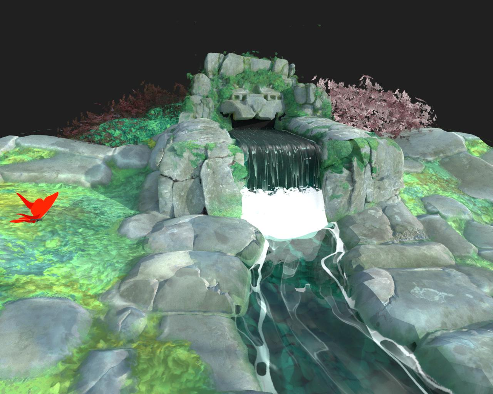

# 3D 渲染器

3D View 提供四種渲染器：

* Adobe 內部 3D 渲染器的兩個版本：Rasterizer 用於即時視覺化並支援陰影，GPU Pathtracer 則用於精確渲染陰影、反射、複雜材質屬性等。
* 兩款已被淘汰的第三方渲染器：OpenGL 和 NVIDIA 的 Iray。

>[!NOTE]
>
> 保持顯示卡驅動程式的最新！
> 
> 新的 3D 渲染器會定期升級，其中一些升級需要更新的 GPU 驅動程式。 請將系統的 GPU 驅動程式更新到最新版本，以獲得最佳的穩定性與渲染功能支援。
> 
> 你可以在這裡找到驅動程式：[NVIDIA](https://www.nvidia.com/Download/index.aspx?lang=en-us)    [AMD](https://www.amd.com/en/support)    [Intel](https://downloadcenter.intel.com/product/80939/Graphics-Drivers)

+++ 光柵化器 / GPU 路徑追蹤器比較

<table>
  <tr>
    <td>
      
       <i>光柵化器</i>
    </td>
    <td>
      
       <i>GPU 路徑追蹤器</i>
    </td>
  </tr>
</table>

+++

Adobe 的 3D 渲染器從零開始打造，支援現代技術，如 [MaterialX](https://materialx.org/) 著色語言與 [USD](https://openusd.org/release/index.html) 場景描述，並準備在整個 Substance 3D 生態系統中提供完整的視覺一致性。

由於依賴 USD，它能利用 Adobe [的 USDFileFormat 外掛](https://github.com/adobe/USD-Fileformat-plugins) 匯入多種 3D 場景格式，如 FBX 和 GLTF，並完整渲染這些場景，包括材質、材質、材質、攝影機與燈光。

+++ 場景匯入：光柵化器與 OpenGL 的比較

<table>
  <tr>
    <td>
      
       <i>光柵化器</i>
    </td>
    <td>
      
       <i>OpenGL</i>
    </td>
  </tr>
</table>

+++

>[!TIP]
>
> 你可以在 [專案設定](../../../interface/preferences-window/project-settings/project-settings.md)的「3D 視圖」區塊中，選擇新 3D 視圖時預設使用的渲染器。

## 點陣化解譯器

+++ 參數

|                                                                 |                                                                                                                                                                                                                                                                             |
|-----------------------------------------------------------------|-----------------------------------------------------------------------------------------------------------------------------------------------------------------------------------------------------------------------------------------------------------------------------|
| **樣本** 浮動 | 指定在影像被視為收斂前需計算的像素樣本數。 |
| **環境遮蔽不透明度** 浮點 | 指定環境遮蔽不透明度的值。 |
| **啟用位移** 布林值 | 規定是否應啟用位移。 |
| **位移閾值** 浮子 | 設定一個閾值來啟用或停用 GPU 貼圖。 |
| **啟用背面剔除布** 林值 | 真實值將使得對法線背向相機的三角形網格進行剔除。 錯誤值會禁用背面剔除。 |
| **診斷模式** 整數 | 它會決定要渲染的診斷模式。 |
| **光柵化陰影模式** 整數 | 指定用於渲染陰影的技術：<ul data-preserve-html="true"> <li data-preserve-html="true"><i>無陰影：</i> 不會渲染陰影。</li> <li data-preserve-html="true"><i>沃克塞爾行進：</i> 三月的陰影光線進入一個體素化的場景。</li> </ul> |
| **光柵化器陰影取樣計數** 整數 | 指定每個像素描繪多少陰影射線。 |
| **光柵化器陰影不透明度** 浮點 | 指定陰影的不透明度，從0.0（無陰影）到1.0（完全陰影）。 |
| **光柵化器可與順序無關透明性，實現** 布林運算 | 渲染時不會考慮透明表面的順序。 這會犧牲一些準確度，以換取更快的透明表面渲染速度。 |
| **啟用光柵化器 SSS** 布林值 | 切換次表面散射效果。 |
| **光柵化器 SSS 樣本計數** 整數 | 指定每個像素在渲染次表面散射時取樣數。 |
| **啟用光柵器累積抗鋸齒** 布林值 | 切換累積抗鋸齒，透過抖動渲染並累積計算每個像素的局部平均顏色，提升渲染影像的平滑度或邊緣。 也就是說，它累積數值以計算平均值。 |
| **光柵化器體素網格解析度** 整數 | 決定用於體素行進光柵器的體素格點的解析度。   較高的數值會帶來更精確的陰影，但代價是性能下降。 |
| **Rasterizer IBL runtime sample count** Integer | 指定當技術設定為 `runtimeSampled`時，計算 IBL 的鏡面反射樣本數量。 |

+++

+++ 地平面

|                               |                                                                                                                                                              |
|-------------------------------|--------------------------------------------------------------------------------------------------------------------------------------------------------------|
| **啟用布** 林運算 | 切換渲染場景中的地面平面。 |
| **高度** 浮車 | 控制地面平面的高度偏移。   若是作者，該值預期會根據場景規模內建適當的偏見。 |
| **陰影強度** 浮動 | 啟用陰影時，控制地面平面陰影的透明度，從0.0（無陰影）到1.0（滿陰影）。 |

+++

{zoomable="yes"}

## GPU 路徑追蹤器

+++ 參數

|                                                     |                                                                                                                                                                                                                                                                                                                                                                                                                                                                                                                                                                                                                                                                                                                               |
|-----------------------------------------------------|-------------------------------------------------------------------------------------------------------------------------------------------------------------------------------------------------------------------------------------------------------------------------------------------------------------------------------------------------------------------------------------------------------------------------------------------------------------------------------------------------------------------------------------------------------------------------------------------------------------------------------------------------------------------------------------------------------------------------------|
| **樣本** 浮動 | 指定在影像被視為收斂前需計算的像素樣本數。 |
| **啟用位移** 布林值 | 規定是否應啟用位移。 |
| **位移閾值** 浮子 | 設定一個閾值來啟用或停用 GPU 貼圖。 |
| **啟用背面剔除布** 林值 | 真實值將使得對法線背向相機的三角形網格進行剔除。 錯誤值會禁用背面剔除。 |
| **像素循環類型** 整數 | 指定用於降低互動式渲染計算解析度的技術：<ul data-preserve-html="true"> <li data-preserve-html="true"><i>無循環：</i> 關閉像素循環並計算每個完整像素取樣。</li> <li data-preserve-html="true"><i>裝置最佳化：</i> 根據用於渲染的裝置選擇理想的像素循環解析度。</li> <li data-preserve-html="true"><i>4x4：</i> 每次循環通過取樣1/16像素。</li> <li data-preserve-html="true"><i>8x8：</i> 每次週期通過取樣 1/64 像素。</li><li data-preserve-html="true"><i>藍噪點：</i> 自適應地取樣若干像素，並以目標幀率為目標。</li> </ul> |
| **診斷模式** 整數 | 它會決定要渲染的診斷模式。 |
| **透過傳輸** 布林值查看背景 | 真實值使背景影像能透過透射或折射物體被看見。   當此現象為假時，透射物體將顯示場景環境的折射影像。 |

+++

+++ 地平面

|                                    |                                                                                                                                                                  |
|------------------------------------|------------------------------------------------------------------------------------------------------------------------------------------------------------------|
| **啟用布** 林運算 | 切換渲染場景中的地面平面。 |
| **高度** 浮車 | 控制地面平面的高度偏移。   若是作者，該值預期會根據場景規模內建適當的偏見。 |
| **陰影強度** 浮動 | 啟用陰影時，控制地面平面陰影的透明度，從0.0（無陰影）到1.0（滿陰影）。 |
| **啟用本地燈布** 林值 | 控制當地光線的直射光是否會造成影子捕捉器。 |
| **啟用反射布** 林 | 控制地面平面上所有反射的可見性。 |
| **反射不透明度** 浮動 | 啟用反射時，控制反射的不透明度，範圍介於 0.0（無反射）到 1.0（全反射）。 |
| **反射粗糙度** 浮子 | 啟用反射時，控制影響反射的地面平面材質粗糙度，從 0.0（完全光面）到 1.0（完全粗糙）。 |

+++

{zoomable="yes"}

## OpenGL

OpenGL 渲染器提供快速即時渲染，預設可依使用情境提供少數著色器：詳見下方清單。

+++ OpenPBR

一個由包括 Adobe 在內主要產業參與者支持、且功能最廣泛的材質模型。

有兩種方法可用於視覺化身高：

<b>視差遮蔽</b> ——透過局部的紫外線變形與遮蔽，假冒高度位移而不改變幾何形狀。

<b>鑲嵌 + 位移</b> - 將幾何體細分，並沿法線位移頂點。

在這裡了解更多關於 OpenPBR 的 Designer [&#128279;](../material-properties/material-properties.md#openpbr)資訊。

+++

+++ Adobe 標準教材

Adobe 標準化著色器。 確保所有 Adobe Substance 3D 應用程式間的正確外觀，並支援廣泛的功能。

有兩種方法可用於視覺化身高：

<b>視差遮蔽</b> ——透過局部的紫外線變形與遮蔽，假冒高度位移而不改變幾何形狀。

<b>鑲嵌 + 位移</b> - 將幾何體細分，並沿法線位移頂點。

Adobe 標準材料在本節[&#128279;](https://experienceleague.adobe.com/en/docs/substance-3d/general-knowledge/asm/adobe-standard-material)文件中有詳細記錄。

+++

+++ AxF SVBRDF

一個專門用於視覺化從 [AxF 檔案](../../../resources/axf-appearance-exchange/axf-appearance-exchange-format.md) 擷取的材質並使用 <b>SVBRDF</b> 表示的著色器。

有兩種方法可用於視覺化身高：

<b>視差遮蔽</b> ——透過局部的紫外線變形與遮蔽，假冒高度位移而不改變幾何形狀。

<b>鑲嵌 + 位移</b> - 將幾何體細分，並沿法線位移頂點。

此著色器目前 *仍在開發* 中，提供材質特性的概覽，但不應用於細微調整，且部分功能尚未支援。

+++

+++ 布林

「舊世代」，非 PBR 正確的著色器。 在標準通道如不透明度、高度和法線旁邊使用漫射、鏡面和光澤通道。

有兩種方法可用於視覺化身高：

<b>視差遮蔽</b> ——透過局部的紫外線變形與遮蔽，假冒高度位移而不改變幾何形狀。

<b>鑲嵌 + 位移</b> - 將幾何體細分，並沿法線位移頂點。

+++

+++ 蘭伯特

非常簡單的 Lambert 光照著色器，只支援漫射通道。 使用舊的點光系統，不支援 HDR 影像光照。

+++

+++ 網格資訊

除錯 unlit shader 以視覺化以下幾何資料：

* 正常

* 正切

* 雙常態

* UV

* UV 磁磚

* 頂點顏色

* 位置（世界空間）

視覺化被鎖定在 [0， 1]。 因此，無法直接讀取螢幕上該範圍以外的數值。

+++

+++ 金屬粗糙度

金屬粗糙度模型的標準PBR材料。 使用基色、金屬色和粗糙度通道。

有兩種方法可用於視覺化身高：

<b>視差遮蔽</b> ——透過局部的紫外線變形與遮蔽，假冒高度位移而不改變幾何形狀。

<b>鑲嵌 + 位移</b> - 將幾何體細分，並沿法線位移頂點。

+++

+++ 金屬粗糙度 - 塗層

金屬粗糙模型的塗層 PBR 材料。 使用基色、金屬色和粗糙度通道，以及額外的「Coat」通道。

有兩種方法可用於視覺化身高：

<b>視差遮蔽</b> ——透過局部的紫外線變形與遮蔽，假冒高度位移而不改變幾何形狀。

<b>鑲嵌 + 位移</b> - 將幾何體細分，並沿法線位移頂點。

+++

+++ 金屬粗糙度 - SSS

金屬粗糙度模型中的次表面散射PBR材料。 使用基色、金屬色和粗糙度通道，以及額外的散射通道。

有兩種方法可用於視覺化身高：

<b>視差遮蔽</b> ——透過局部的紫外線變形與遮蔽，假冒高度位移而不改變幾何形狀。

<b>鑲嵌 + 位移</b> - 將幾何體細分，並沿法線位移頂點。

+++

+++ 鏡面光澤

鏡面光澤模型的標準PBR材料。 使用漫反射、鏡面及光澤通道。

有兩種方法可用於視覺化身高：

<b>視差遮蔽</b> ——透過局部的紫外線變形與遮蔽，假冒高度位移而不改變幾何形狀。

<b>鑲嵌 + 位移</b> - 將幾何體細分，並沿法線位移頂點。

+++

+++ 未點亮

Unlit debug shader 可以在沒有光照的情況下視覺化貼圖。 只使用「彩色」通道。

+++

Designer 也提供使用 GLSLFX 檔案[&#128279;](../../../interface/3d-view/glslfx-shaders/glslfx-shaders.md)為 OpenGL 渲染器自訂著色器的功能。

>[!IMPORTANT]
> 
> 此渲染器已 **被**&#x200B;棄用：不會新增功能，未來的 Designer 版本將被淘汰。

{zoomable="yes"}
