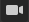
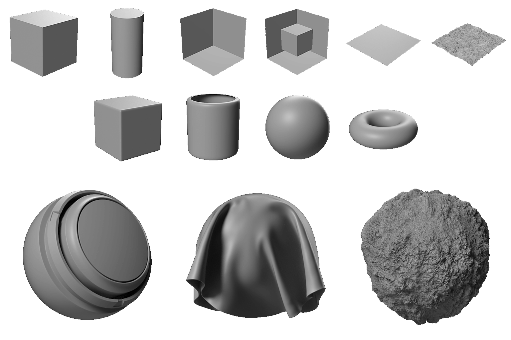
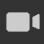

# 3D 檢視

3D 視圖幫助你透過自訂網格和渲染的 PBR 材質來檢視並理解材質。 和所有 Substance 3D Designer 視窗一樣，它透過右鍵選單選項和拖放操作與其他視窗協同運作。

3D 視圖同時提供兩種主要的 3D 場景材質渲染方法：
* 利用 **Rasterizer** 與 **OpenGL** 渲染器實現快速且即時的視覺化
* 使用 **GPU Pathtracer** 渲染器的高品質光線追蹤渲染

更多資訊請見： [3D 渲染器](3d-renderers/3d-renderers.md)

+++ 3D 視角底座

+++

## 視窗互動

以下部分簡要說明如何執行常見動作，並附上動畫動圖說明流程。

### 導航

3D View 攝影機與環境可透過三種方式操作：

* <b>軌道：</b> 左鍵+拖曳
* <b>平移</b>：MMB+拖拉 / Ctrl+RMB+拖拉
* <b>縮放</b>：使用滑鼠滾輪滾動 / RMB+拖曳
* <b>旋轉環境：</b> ⇧+RMB+拖曳
* <b>聚焦在選取的網格：</b> F（如果沒有選取範圍，則聚焦整個場景）
* <b>軌道點燈1：</b> Ctrl+⇧+左鍵+拖曳
* <b>將點燈光 1 移動至接近或遠離原點：</b> Ctrl+⇧+RMB+拖曳
* <b>重置相機軌道位置：</b> R
* <b>重置相機軌道位置與屬性：</b> ⇧+R

使用觸控板（僅限 macOS）

* <b>軌道：</b> 兩指滑動
* <b>聲像：</b> ⇧+兩指滑動
* <b>縮放： </b>兩指捏合 / ⌘+兩指滑動
* <b>旋轉環境：</b> ⇧+兩指滑動

>[!NOTE]
>
> 放大方向
> 
> 每種縮放方法會被另一方法反轉：
> 
> * 滑鼠滾輪向上&#x200B;*拉近場景*
> * 右鍵和拉動 *會把* 場景推開
> 
> 縮放方向可以在偏好設定[&#128279;](../../interface/preferences-window/preferences-window.md)中反轉。

### 選擇與聚焦

你可以直接在視窗中與網格互動：

<b>按住 ⇧ 鍵，然後點擊 LMB 在某個網格上選取。</b> 選取的網格會有藍色輪廓。

<b>按 F 鍵可以聚焦在選中的網格</b>上。 聚焦網格會移動攝影機來構圖並繞著它運行。

<b>在選取</b> 網格時點擊 RMB，即可在情境選單中查看其 [材質動作](#material-actions) 。

<b>按 Esc 取消選取。</b> 游標不一定要在網格上。

{zoomable="yes"}

*選擇、聚焦、取消選擇*

{zoomable="yes"}

*選擇，情境選單*

>[!NOTE]
>
> 這些動作在已 [棄用的 OpenGL](../../interface/3d-view/3d-renderers/3d-renderers.md) 渲染器中不可用。

### 改變環境照明（IBL）

Designer 預設支援基於影像的光照（IBL）。 使用高動態範圍點陣圖來渲染環境光照。

你可以圍繞你的 3D 物件旋轉這個環境，或者載入任一預設或自訂 HDR 光源環境。 請注意，你的 HDR 影像應該使用等矩形投影，且精度為 32 位元浮點。

⇧+RMB+拖曳 <b>則在3D視圖中旋轉環境</b> 。

要設定精確旋轉，請在頂部 3D 檢視工具列使用 <b>環境>編輯</b> ，並在屬性視窗中更改 <b>旋轉角度</b> 滑桿。

若要使用預設的 HDR 光源環境，請點選<b>庫[&#128279;](../../interface/the-library/the-library.md)中 3D View 類別</b>的 <b>HDRI 環境</b>區塊，然後拖放任意圖示至 3D 視圖。

要使用你自己自訂的 HDR 光源環境，請在檔案總管視窗中拖放檔案到套件中匯入 HDR 影像（<b></b>提示時連結該檔案）。然後拖放資源，選擇 <b>緯度/經度全景</b> 作為目標。

### 點燈

到 <b>燈光>編輯屬性</b> ，切換場景中的點燈光。

點光 1 可以透過按住 LMB 或 RMB 並在光照模式下拖曳視窗來繞過場景原點移動。 

在相機模式下  你也可以暫時切換到光影模式，方法是同時按住 Ctrl+⇧ 鍵搭配滑鼠按鍵。

## 以 3D 視圖檢視資料

### 物質圖

你可以在 3D 視圖中將整個材質視為完整材質。 這是最常見的工作方式，會將輸出節點[&#128279;](../../compositing-graphs/nodes-reference-for-com/atomic-nodes/output/output.md)的使用屬性與 3D 視圖材質的相關貼圖槽匹配。這表示你的輸出必須正確設定（使用模板確保如此），並且你選擇了材質/視窗著色器支援

你可以在圖表檢視中點擊 *RMB* 一個空區域[，然後在情境選單中選擇&#x200B;**「在 3D 檢視**&#x200B;中檢視輸出」選項，即可查看所有圖表的](../../interface/the-graph-view/the-graph-view.md)輸出。

你也可以在不打開圖表的情況下查看，方法是在總管底座的[圖形資源中點擊右鍵，並在情境選單中選擇&#x200B;**「在 3D 視圖**&#x200B;中檢視輸出」](../the-explorer-window/the-explorer-window.md)選項。

作為圖表上下文選單的替代方案，你也可以將圖表從 [總管](../the-explorer-window/the-explorer-window.md) 底座拖曳到 3D 視圖，達到相同的效果。

載入圖表&#x200B;*時*，其輸出預設會自動套用在 3D 視圖中。你可以在 [偏好設定](../../interface/preferences-window/preferences-window.md)中停用此行為。 請前往 **Edit > 偏好設定> Graph > Common**，並在開啟圖形&#x200B;**選項時取消勾選** 3D 視圖中的「View 輸出」。

>[!NOTE]
>
> **多重材料槽**
> 
> 如果你使用包含多個單一材質的自訂網格，系統會要求你選擇要將材質指派到哪個材質槽。 使用上述任一方法，點擊老虎機確認你的選擇。 欲了解更多關於材料及其作業的資訊，請閱讀以下詳細章節。

### 個別節點/圖形輸出

你可以在 3D View[&#128279;](https://substance3d.adobe.com/) 中看到任何可用材質通道中的單一輸出。這種方式較少使用，但很適合預覽快速測試或沒有輸出的單一節點。

你可以在圖表檢視[&#128279;](../../interface/the-graph-view/the-graph-view.md)中右鍵點擊任何節點，選擇<b>「在 3D 檢視</b>中檢視」即可。你會看到一份可用頻道清單，讓你分配節點。 點擊任意一鍵確認。

你也可以用 *RMB* 從圖形視圖拖放任意節點到 3D 視圖。 你會看到一份可用頻道清單，讓你分配節點。 點擊任意一鍵確認。

你可以透過在 Explorer[&#128279;](../the-explorer-window/the-explorer-window.md) dock 中展開圖形資源，並用 *LMB* 將該輸出拖曳到 3D 視圖，來查看任何單一的圖形輸出。你會看到一份可用頻道清單，讓你指派節點。 點擊任意一鍵確認。

## 查看（自訂）3D 場景

Designer 提供十幾種預設網格。 這些網格擁有統一且可用的 UV 座標，適用於大多數平鋪貼圖的場景。 也可以匯入並查看自己的 3D 網格。\
透過 <b>頂欄的場景</b> 下拉選單選擇任何預設網格。

關於自訂 3D 場景，請前往 [「與 3D 場景](../../working-with-3d-scenes/working-with-3d-scenes.md) 共作」部分。

## 變更著色器屬性

Designer 預設有幾種不同的 [著色器](../../glossary/glossary.md) ，每個著色器除了貼圖通道外還有其他選項。 它們可以單獨設定。

請注意，Designer [的 3D 渲染器](../../interface/3d-view/3d-renderers/3d-renderers.md) 著色器不同，只有標有「Common」標籤的設定在切換渲染器時會保留。

要更改目前的著色器，請到 **材質** 選單，然後打開你想編輯材質的子選單。

例如，要調整「平面（高解析度）」場景中「材質」的材質屬性`Default`，請前往 **「材質>預設」>「編輯屬性**」。 然後在物業碼頭找到該材料屬性。

著色器可以透過子選單中的「重置材質」或「重置到場景狀態」動作來重置。 如果你是在 3D 視圖中查看 Substance 圖的輸出，你需要重新套用它們。

>[!NOTE]
>
> **關於鑲嵌**
> 
> 網格的鑲嵌可以透過位移彈出視窗中的鑲嵌因子&#x200B;**參數來調整**。[&#128279;](displacement/displacement.md#tessellation)
> 該參數所控制的特定性質會依目前的 3D 渲染器而異：
> 
> * **光柵化器/GPU 路徑追蹤器：** 每個物件的屬性，名為 **Refine 層**&#x200B;級。 在場景瀏覽器[&#128279;](scene-browser/scene-browser.md)中選擇物件`Mesh`以顯示其屬性並直接編輯。
> * **OpenGL：** 一種稱為 **Tessellation factor** 的材質屬性。 直接到 [材質屬性](#change-shader-properties) 編輯。

## 匯出場景

在此頁面[&#128279;](../../working-with-3d-scenes/exporting-scenes/exporting-scenes.md)了解如何匯出 3D 場景。

### 匯出鑲嵌網格（僅限 OpenGL 渲染器）

你可以將 3D View 的<b>網格匯出成 OBJ</b>、<b>FBX</b> 或 <b>PLY</b> 格式的檔案<b>。</b>如果 *啟用了 tessellation* displacement，幾何體的細分會被烘焙到匯出的網格中。

然而，原始網格的頂點法線可能與其新位移的形狀不符，這意味著位移的網格可能無法正確渲染。 你可以用兩種方式來管理：

* 使用網格 *法線貼圖* ，這樣會提供正確的法線
* *在匯出時用網格法線貼圖重新計算網格法線* ，這表示這些法線會被烘焙到匯出的網格中，法線貼圖就不再需要了

要匯出 3D View 網格，請到 <b>Scene > 匯出鑲嵌網格...</b>，設定你對法線重計算的選擇，然後選擇匯出網格的位置、名稱和檔案格式。

>[!NOTE]
>
> 此功能在 **macOS** 上無法&#x200B;*使用*。

>[!IMPORTANT]
>
> 有幾個注意事項
> 
> 如果原始網格有多個材質和/或 UV 集合，這些會合併 *成一個*。
> 
> 匯出過程的長度及檔案大小取決於網格三角形數量與 *鑲嵌因子*。 高鑲嵌因子值會導致不穩定，取決於 GPU 內建記憶體池。
> 
> 話雖如此，鑲嵌網格的頂點數應該和高度圖的像素數相符&#x200B;**。**
> 
> 如果網格密度比高度貼圖高，使用 <b>Phong</b> 貼片時網格會稍微平滑一些，但你應該先確保網格匯出到所需的高度貼圖細節，然後再用其他軟體細化匯出的網格。

>[!WARNING]
>
> **TDR（僅限 Windows）**
> 
> 此功能要求<b>逾時偵測與恢復（TDR</b>）與我們文件本頁[&#128279;](https://experienceleague.adobe.com/zh-hant/docs/substance-3d-painter/using/technical-support/technical-issues/gpu-issues/gpu-drivers-crash-with-long-computations-tdr-crash)建議的值相符，依據設計者技術[要求](../../getting-started/system-requirements/system-requirements.md)。

## 選單列

選單列提供7個與3D檢視相關的選單。 以下是所有可用選項的概述。

+++場景
<b>場景</b>選單處理顯示的幾何體（3D 資源）以及 3D 視圖狀態。3D 資源只包含網格，場景狀態是燈光、攝影機及相關設定，也可以包含網格。

<b>編輯：</b>在屬性[&#128279;](../../interface/properties/properties.md)面板載入場景選項。讓你切換 3D 網格的可見性。

<b>標準原語：</b> 在 3D 視圖中顯示以下任何簡單 3D 網格。

* 立方體

* 圓柱體

* 空心盒

* 內箱

* 平面

* 平面（高解析度）

* 球體

<b>擴展圖元：</b> 在 3D 視圖中顯示以下任一 3D 網格。

* 布料

* 墊子球

* 圓角立方體

* 圓柱體

* 球體2的地塊

* 環面

<b>在 2D 視圖中顯示 UV：</b> 允許將目前選取的網格的 UV 以覆蓋層形式顯示在 [2D 視圖](../2d-view/2d-view.md)中。

<b>從目前場景建立 3D 資源......：</b> 從目前場景中建立一個新的 [3D 場景資源](../../resources/3d-scene-resource/3d-scene-resource.md) 。

<b>載入狀態檔案...： </b>載入外部儲存 [的場景狀態檔案](../../working-with-3d-scenes/working-with-3d-scenes.md) （\*.sbsscn）。 它不會取代 3D 網格，只載入 3D 渲染器、攝影機和燈光的設定。

<b>載入帶有網格的狀態檔案...：</b> 載入外部儲存 [的場景狀態檔案](../../working-with-3d-scenes/working-with-3d-scenes.md) （\*.sbsscn）。 載入 3D 渲染器、攝影機、燈光設定，以及參考的 3D 場景。 .

<b>儲存狀態檔...： </b>將3D視圖的當前狀態儲存到 [場景狀態檔](../../working-with-3d-scenes/working-with-3d-scenes.md) （\*.sbsscn）。

<b>將當前狀態儲存為預設： </b>將 3D 視圖的當前狀態設為 [場景狀態檔案](../../working-with-3d-scenes/working-with-3d-scenes.md) ，預設用於建立新 3D 視圖時。 這個檔案每次重置或初始化 3D 視圖時都會載入，並且可以在專案設定[&#128279;](../../interface/preferences-window/project-settings/project-settings.md)中設定。

<b>出口場景：</b> *（僅 Rasterizer/GPU Pathtracer 渲染器）* 將當前場景匯出為 [扁平化場景](../../working-with-3d-scenes/exporting-scenes/exporting-scenes.md)，僅寫入結果場景，且會遺失原始場景的引用。 匯出場景的內容取決於所選匯出格式所支援的功能。\
可用格式：STL、FBX、GLB、GLTF、PLY、USDC、USD、USD、USDA、USDZ、OBJ。

<b>帶圖層的場景匯出：</b> *（僅 Rasterizer/GPU Pathtracer 渲染器）*將當前場景匯出為 [分層場景](../../working-with-3d-scenes/exporting-scenes/exporting-scenes.md)，所有對原始場景的編輯都會以非破壞性工作流程儲存到獨立檔案。 這功能只適用於 USD 檔案格式。\
可用格式有：USDC、USD、USDA。

<b>輸出拼貼幾何：</b> *（僅限 OpenGL 渲染器）* 將目前帶有鑲嵌的場景匯出為原始幾何體，詳見匯出場景部分。

<b>重置場景： </b>將 3D 視角重置為預設值。

有些軟體更新可能會改變場景狀態檔案的儲存和載入方式。

如果 *場景無法正確* 從檔案還原，建議手動設定場景的狀態，並 *重新匯出* 場景狀態檔案。

+++

+++材質
<b>材質</b>選單會根據載入的 3D 網格和所使用的渲染器而改變。

「材質」選單列出場景中所有分配到網格的材質。 「材料」選單中列出的每種材料都有一個材料動作的子選單：

<b>編輯</b> - 在屬性視窗中編輯目前材質的設定。

<b>著色器列表</b> - 目前 3D 渲染器[&#128279;](../../interface/3d-view/3d-renderers/3d-renderers.md)上所有可用的[著色器](../../glossary/glossary.md)。

<b>載入定義...： </b>（僅限 OpenGL 渲染器）讓你能載入自訂 [的 GLSLFX 著色器。](../../interface/3d-view/glslfx-shaders/glslfx-shaders.md) 著色器會加入上述清單。

<b>重設共用參數：</b> 重置所有在著色器間共用的參數。 例如，在 Rasterizer/GPU Pathtracer 與 OpenGL 渲染器之間切換時，Adobe 標準材質[&#128279;](https://experienceleague.adobe.com/zh-hant/docs/substance-3d/general-knowledge/asm/adobe-standard-material)中的多個參數值會被帶入。

<b>更名：</b> 更換本素材的標籤。

<b>重置材質：</b> 將所有著色器參數重置為預設值。 如果貼圖連接到著色器的任何取樣器，它們就是斷開的。

<b>將材質重設為場景狀態：</b>*（僅限 Rasterizer/GPU Pathtracer 渲染器）*&#x200B;將所有覆寫材質[&#128279;](../../working-with-3d-scenes/overriding-scene-mat/overriding-scene-materials.md)的屬性重置為場景的原始值，包括原始材質（如有的話）。

<b>新增： </b>新增一項內容到清單中。 預設情況下未被使用，並可[透過場景瀏覽器](../../interface/3d-view/scene-browser/scene-browser.md)連接至場景材質[&#128279;](../../working-with-3d-scenes/overriding-scene-mat/overriding-scene-materials.md)。

+++

+++光源
<b>燈光</b>選單只處理較舊的環境燈和點燈。這些燈光不符合 PBR 標準，無法提供與 HDR 影像渲染相同的高品質效果。

<b>編輯：</b> 編輯環境光和兩個點光的個別設定。

<b>重置燈光：</b> 將燈光屬性重置為預設狀態。

+++

+++相機
相機<b></b>選單可以讓你更改相機設定、切換到預設角度，並載入儲存在自訂 3D 網格檔案中的相機角度。

<b>編輯屬性：</b> 在屬性底座中開啟預設相機的設定。

<b>對焦： </b>（F） 將預設相機聚焦在目前選取的網格上。 也就是說，將網格框定框並對齊攝影機樞軸。 若沒有主動選取，則使用場景的全域邊界框。

<b>場景攝影機：</b> 如果場景包含一個或多個攝影機，則在此列出，並使用其設定作為預設，套用到場景的預設攝影機上。

<b>視角：</b> 預設攝影機的預設視角。 這些只影響相機的變換（位置和旋轉）。

* 預設：從物體前方左側拍攝的高角度鏡頭。

* 返回

* 底部

* 正面

* 靠左

* 靠右

* 頂端

<b>儲存渲染...：</b> （Alt+S） 將目前渲染的影像儲存到磁碟，解析度依照渲染器屬性指定，或若設定了覆蓋解析度，則儲存為預設相機屬性。

<b>將渲染複製到剪貼簿：</b> （Alt+C） 將目前渲染的影像複製到剪貼簿，然後貼上到外部影像編輯器中。

<b>重置位置：</b> （R） 重置相機位置。

<b>已選擇重置：</b> （Shift+R）重置相機的位置與屬性。

+++

+++環境
環境<b></b>選單允許你修改與 HDRI 環境相關的設定，用來照明 PBR 正確的材質。

<b>編輯屬性：</b> 提供 HDR 環境設定，用於 PBR 的光照。 具體來說，你可以切換可見度、用預覽調整曝光，並用精確的滑桿設定旋轉......

<b>重置環境：</b> 將所有環境屬性重置為預設值。

+++

+++展示
顯示選單可切換檢視模式、輔助工具及渲染場景的資訊：

<b>軸：</b> 切換視窗中 3D 軸的顯示。

<b>格子：</b> 切換世界顯示。

<b>解析度：</b> 切換小型解析度計數器的顯示。

<b>場景數值：</b> 切換場景統計顯示，例如多邊形數量、材質數量、靜態網格數量等。

<b>渲染時間：</b> 計算完整影像取樣所需的時間。

<b>取樣：</b> 為累積抗鋸齒（光柵化）或路徑追蹤（GPU 路徑追蹤）計算出的像素取樣量。

<b>背面剔除：</b>關閉此選項後&#x200B;*，你可以從兩側看到網格面*。這個選項可與線框搭配使用。

<b>邊界框：</b> 切換網格邊界框的顯示。

<b>線框：</b> 切換網格線框的顯示。

<b>燈光：</b> 切換點燈輔助線的顯示。

<b>頂點切空間：</b> 以彩色裝置顯示所有頂點的切線、雙法線與法向量

其中一些選項可以在場景工具列中透過按鈕切換開啟。

+++

+++渲染器
<b>渲染器</b>選單允許你切換 3D 渲染器，並透過<b>編輯屬性</b>動作存取目前 3D 渲染器的屬性。

可用的渲染器及其設定已在此專頁[&#128279;](../../interface/3d-view/3d-renderers/3d-renderers.md)中詳述。

+++

## 場景工具列

**&#x200B;**&#x200B;場景工具列預設位於 3D 視圖左側邊框，提供觀看與互動場景的控制。

它還能讓你存取 [位移彈出視窗](displacement/displacement.md) 和 [場景瀏覽器](scene-browser/scene-browser.md) 底座。

>[!NOTE]
>
> 工具列可透過最&#x200B;*左邊的把*&#x200B;手（以三條平行線表示）在 3D View **底座周圍重新定位&#x200B;***。*

### 顯示選項

#### 頂端

 

  <b>場景瀏覽器</b>

顯示 3D 場景中所有元素的階層。

>[!INFO]
>
>場景瀏覽器及其功能在專屬頁面[&#128279;](../../interface/3d-view/scene-browser/scene-browser.md)中有詳細介紹。

  <b>精選</b>

允許場景中直接選取網格。

<code>左邊</code> 在場景中選擇一個網格。

選擇場景中的單一網格。 選取的網格在視窗中有藍色輪廓，並在場景瀏覽器[&#128279;](../../interface/3d-view/scene-browser/scene-browser.md)中被高亮顯示。

選定網格會有一個情境選單，點擊右鍵即可顯示<code></code>.

網格也可在相機或光照模式中選擇，按 <code>Shift+左鍵鍵</code>.

 

    <b>相機</b>

可直接控制場景中的攝影機。

<code>左邊</code> 攝影機繞目標軌道旋轉。 <code>人民幣</code> 將攝影機移近或遠離目標。

 

  <b>表演環境</b>

這個按鈕用來切換場景環境的顯示。 同樣的設定可以在 3D View 選單列的 Environment > Edit</b> 後，在 Properties dock <b>找到。

 

  <b>光</b>

可直接控制場景中的點燈1。

<code>左邊</code> 將攝影機繞場景原點旋轉。 <code>人民幣</code> 將光線移近或遠離場景的起點。

 

  <b>渲染器設定</b>

在屬性[&#128279;](../properties/properties.md)底座中顯示目前渲染器的設定。

 

  <b>啟用 Pathtracer</b>

切換 GPU Pathtracer[&#128279;](3d-renderers/3d-renderers.md#gpu-pathtracer) 渲染器的選擇。

 

  <b>啟用陰影</b>

切換光柵化[&#128279;](3d-renderers/3d-renderers.md#rasterizer)器渲染器中即時陰影的渲染。

 

  <b>啟用接地平面</b>

切換 Rasterizer[&#128279;](3d-renderers/3d-renderers.md#rasterizer) 和 [GPU Pathtracer](3d-renderers/3d-renderers.md#gpu-pathtracer) 渲染器中地面平面的渲染。

 

  <b>遷移</b>

顯示 [位移彈出視窗](displacement/displacement.md)。

 

#### 底部

 

  <b>格網</b>

切換世界格子的顯示。

 

  <b>場景統計</b>

切換場景統計顯示，例如多邊形數量、材質數量、靜態網格數量等。

 

  <b>軸心國</b>

切換視窗中 3D 軸的顯示。

 

#### 僅支援 OpenGL 渲染器

 

<b>背面剔除</b>

關閉這個選項後，*你就能從兩側看到網格面*。這個選項可以和線框圖搭配使用。

 

<b>邊界盒</b>

切換網格邊界框的顯示。

 

<b>頂點切空間</b>

以彩色裝置顯示所有頂點的切線、雙法向與法向量。

 

<b>線框</b>

切換網格顯示為線框圖。

## 顯示工具列

預設位於 3D 檢視</b>面板底部<b>*的<b>顯示</b>工具列*，讓你控制渲染後影像在視窗中的顯示方式。

>[!NOTE]
>
> 工具列可透過最&#x200B;*左邊的把*&#x200B;手（以三條平行線表示）在 3D View **底座周圍重新定位&#x200B;***。*

### 3D 渲染 AOV

<table style="margin-top: 32px; margin-bottom: 32px">
    <tr style="border: 0; vertical-align: top">
        <td style="border: 0">
            
你可以用  3D 渲染 AOV 按鈕顯示不同的 <a href="../../glossary/glossary.md#aov">AOV</a></b>。<b>

            
AOV 讓你能單獨檢查網格和材質資訊，方便專注工作和除錯。

            
部分 AOV 的 <i>HDR 數值</i> 在視窗中被固定為 1（純白）或 0（純黑）。 要檢查完整範圍的數值，你可以將 AOV 的 3D 渲染匯出成支援 HDR 值的影像檔案格式，例如 <code>.exr</code>。 使用 <code>Camera > Save render...</code> 選單選項匯出目前的 AOV。

            
<i>注意：</i> AOV 僅在使用 Rasterizer 與 GPU Pathtracer <a href="./3d-renderers/3d-renderers.md">3D 渲染器</a>時使用。

        </td>
        <td style="width: 33%; border: 0">
            
        </td>
    </tr>
</table>

### 彩色通道

你可以用<b>「色彩通道」</b>按鈕顯示圖片的單一通道。這會開啟一個組合框，讓你選擇顯示紅<b></b>、<b>綠</b><b>、藍</b>三頻道。透過選擇 <b>RGB</b> 選項，所有通道影像的正常畫面會被恢復。

色彩頻道按鈕的&#x200B;*圖示*&#x200B;會根據目前顯示的頻道而改變&#x200B;*。<b>*</b>

### 色彩空間

為了最準確的色彩呈現，影像預設會以&#x200B;*與螢幕*&#x200B;使用的&#x200B;*色彩空間相符的色彩空間*&#x200B;顯示。

可用的控制會依專案設定[&#128279;](../../interface/preferences-window/project-settings/project-settings.md)中的色彩管理模式而定。想了解更多這些控制，請參考 [本頁的色彩管理](../../color-management/color-management.md) 區。
