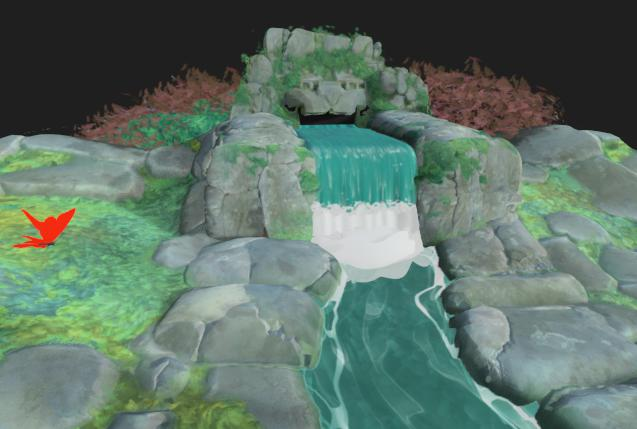

# 後續影響

{zoomable="yes"}

在相機屬性中，你可以啟用後期特效來強化渲染效果或檢查特定材質屬性。

這些效果是內部開發的，僅提供給 Rasterizer 和 GPU Pathtracer [渲染器](../../../../interface/3d-view/3d-renderers/3d-renderers.md)使用。

在儲存 [3D 場景資源](../../../../resources/3d-scene-resource/3d-scene-resource.md) 或 [場景狀態檔案](../../../../working-with-3d-scenes/working-with-3d-scenes.md) 時啟用的任何後製效果，都會被保存為場景狀態的一部分。

<table>
<tr style="border: 0;">
<td style="border: 0;" valign="top">

## 色調對應

</td>
<td style="border: 0;" valign="top">

### 光暈

</td>
<td style="border: 0;" valign="top">

### 景深

</td>
<td style="border: 0;" valign="top">

</td>
</tr>
</table>

## 色調對應

根據特定演算法和/或查找表（LUT）重新映射渲染的顏色。

這樣可以改善不同塗裝間的顏色一致性。 例如，Blender 中也有 AgX 色調映射器。

+++Reinhard

<table>
  <tr>
    <td>
      
       <i>之前</i>
    </td>
    <td>
      
       <i>之後</i>
    </td>
  </tr>
</table>

+++

+++阿坦

<table>
  <tr>
    <td>
      
       <i>之前</i>
    </td>
    <td>
      
       <i>之後</i>
    </td>
  </tr>
</table>

+++

+++經驗

<table>
  <tr>
    <td>
      
       <i>之前</i>
    </td>
    <td>
      
       <i>之後</i>
    </td>
  </tr>
</table>

+++

+++日誌

<table>
  <tr>
    <td>
      
       <i>之前</i>
    </td>
    <td>
      
       <i>之後</i>
    </td>
  </tr>
</table>

+++

+++A牌

<table>
  <tr>
    <td>
      
       <i>之前</i>
    </td>
    <td>
      
       <i>之後</i>
    </td>
  </tr>
</table>

+++

+++海爾

<table>
  <tr>
    <td>
      
       <i>之前</i>
    </td>
    <td>
      
       <i>之後</i>
    </td>
  </tr>
</table>

+++

+++中性

<table>
  <tr>
    <td>
      
       <i>之前</i>
    </td>
    <td>
      
       <i>之後</i>
    </td>
  </tr>
</table>

+++

+++AGX

<table>
  <tr>
    <td>
      
       <i>之前</i>
    </td>
    <td>
      
       <i>之後</i>
    </td>
  </tr>
</table>

+++

+++PBR 中性線

<table>
  <tr>
    <td>
      
       <i>之前</i>
    </td>
    <td>
      
       <i>之後</i>
    </td>
  </tr>
</table>

+++

## 光暈

模擬鏡頭內光線邊緣從非常明亮區域向外散射到光線較少區域的效果。

此效果受場景光線、相機曝光及發光材料影響。

+++臨界值
亮度值，光暈應該能看到。

*左：1.0 / 右：4.0*

<table>
  <tr>
    <td>
      
       <i>之前</i>
    </td>
    <td>
      
       <i>之後</i>
    </td>
  </tr>
</table>

+++

+++衰減
蓬鬆衰減斜坡，值越低，布隆半徑越短。

*左：1.0 / 右：0.6*

<table>
  <tr>
    <td>
      
       <i>之前</i>
    </td>
    <td>
      
       <i>之後</i>
    </td>
  </tr>
</table>

+++

+++關卡
那綻放的強烈程度。 較高的光度會帶來更明亮、更明顯的光線條紋。

*左：8.0 / 右：2.0*

<table>
  <tr>
    <td>
      
       <i>之前</i>
    </td>
    <td>
      
       <i>之後</i>
    </td>
  </tr>
</table>

+++

+++顏色偏移
將受花影響區域的色調偏向較暖色調。

*左：0.0 / 右：0.8*

<table>
  <tr>
    <td>
      
       <i>之前</i>
    </td>
    <td>
      
       <i>之後</i>
    </td>
  </tr>
</table>

+++

## 景深

模擬相機鏡頭引起的光學現象，使得距離遠近的物體變得模糊。

此效果會受到相機的「光圈」與「對焦距離」參數影響。

>[!TIP]
>
> 要快速調整相機對焦，將游標放在你想對焦的場景位置，按下 Ctrl+LMB（Windows）或 Cmd+LMB（macOS），即可自動將對焦距離設定到該位置。

+++最大半徑
模糊效果的最大半徑。

*左：32.0 / 右：4.0*

<table>
  <tr>
    <td>
      
       <i>之前</i>
    </td>
    <td>
      
       <i>之後</i>
    </td>
  </tr>
</table>

+++

+++複合強度
從對焦距離向外擴散的模糊效果大小。

*左邊：0.2 / 右邊：0.05*

<table>
  <tr>
    <td>
      
       <i>之前</i>
    </td>
    <td>
      
       <i>之後</i>
    </td>
  </tr>
</table>

+++

+++縱向像差
在遠離焦距時，像差的強度。

像差模擬不同波長光的焦距略有差異，導致顏色看起來偏移，且焦距有細微差異。

*左：0.0 / 右：1.0*

<table>
  <tr>
    <td>
      
       <i>之前</i>
    </td>
    <td>
      
       <i>之後</i>
    </td>
  </tr>
</table>

+++

+++消色差像差
規定該像差是否應為消色差，意即部分或所有顏色具有相同的焦距。

這使得模糊效果看起來更均勻分布。

*左：真 / 右：假*

<table>
  <tr>
    <td>
      
       <i>之前</i>
    </td>
    <td>
      
       <i>之後</i>
    </td>
  </tr>
</table>

+++

+++貓眼
在場景中啟用貓眼效果，模擬斜角進入的光線並非進入圓盤，而是進入不均勻的橢圓，造成失真。

這種效應在較大光圈時更明顯——也就是光圈值較低。

*左：真 / 右：假*

<table>
  <tr>
    <td>
      
       <i>之前</i>
    </td>
    <td>
      
       <i>之後</i>
    </td>
  </tr>
</table>

+++
