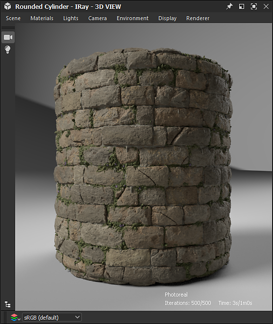
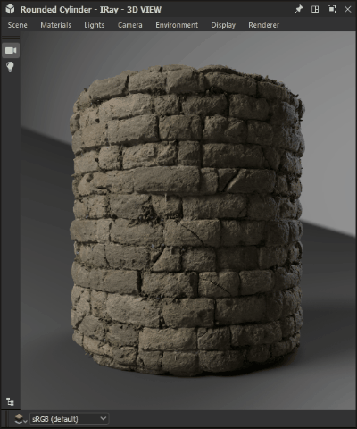

# 伊雷

本頁介紹 Substance 3D Designer[&#128279;](https://www.adobe.com/tw/products/substance3d-designer.html) 3D 檢視面板中的 Iray 渲染器，提供互動路徑追蹤，支援 CPU 及/或 GPU 加速（僅限 Nvidia GPU）進行寫實渲染。

>[!WARNING]
> 
> Iray 渲染器及所有相關功能於 Designer 16.0.0 版本中被移除。
> 
> 更多資訊請見： [MDL 圖表與 Iray 終止生命週期](../../../technical-issues/mdl-graph-iray-eol/mdl-graph-iray-eol.md)

<table>
<tr style="border: 0;">
<td style="border: 0;" valign="top">

## 概觀

<b>Iray</b> 是一種高度 *互動* 且直覺的物理渲染技術，透過模擬光線與材質的物理行為，產生 *逼真的影像* 。 想了解更多，請造訪 [Nvidia Iray](https://www.nvidia.com/en-us/design-visualization/iray/) 網頁。

</td>
<td style="border: 0;" valign="top">

</td>
</tr>

<tr style="border: 0;">
<td style="border: 0;" valign="top">

由於 3D View 使用 Iray 的 *漸進式渲染器*，只要每個像素至少取樣一個，影像就會產生。 隨著抽樣迭代進行，影像會&#x200B;*自動更新*，導致初始粗略影像在每次迭代&#x200B;*中變得*&#x200B;更乾淨。

渲染器可在 3D 檢視[&#128279;](../../../interface/3d-view/3d-view.md)面板中使用：打開<b>渲染器</b>選單，選擇 <b>Iray</b> 選項，將該 3D 檢視面板中使用的渲染器切換到 Iray。\
切換到 Iray 渲染器 *會改變部分 3D 視圖選單中的選項* 。 這些變更會在下方的 <b>3D 視角</b> 章節中說明。

預設情況下，漸進式渲染會從選擇 Iray 渲染器後立即開始。 渲染過程會持續進行，直到 *滿足以下條件* 之一：

* *執行最大取樣*&#x200B;數量
* *渲染時間*&#x200B;限制已達成

請參閱 <b>本頁的渲染器</b> 部分，了解如何調整這些條件。

</td>
<td style="border: 0;" valign="top">

*材質：[Mark Foreman* *](https://www.artstation.com/oggyart)製作[的中世紀城牆](https://oggyart.artstation.com/projects/Xnzx0a)**，可於我們的 [Substance 3D 資產](https://substance3d.adobe.com/assets)**&#x200B;庫取得*

</td>
</tr>
</table>

>[!WARNING]
>
> 任何時候只能 *執行一個* Iray 渲染實例。\
> 這表示當 3D 視圖面板使用此渲染器時， **其他 3D 視圖面板的渲染器** 選單會 *被禁用* ，這些面板預設使用 **OpenGL** 渲染器。

## 3D 視圖選項

### 場景

在場景</b>選單中選擇<b>編輯</b>選項<b>，即可在屬性</b>面板中找到 Iray <b>專屬的場景屬性。

* <b>啟用：</b>當物件設為 *False* 時，物件會被隱藏，不再&#x200B;*對場景有貢獻*

顯示元件

* <b>可見</b>：當物件設為 *False* 時，物件雖隱藏，但仍 *對* 場景有貢獻——例如反射光線、吸收光線並投射陰影

網格顯示元件

* 行政區劃
  * <b>方法</b>：用於程序化將網格細分為更細幾何形狀的方法
    * *無*：不適用細分
    * *參數*&#x200B;化：將網格 `4^x` 細分為三角形，其中 `x` 是此參數所指定的值
    * *長度*：將網格細分，直到所有邊在物件空間中的長度都低於最小長度參數所指定的值
  * <b>最小長度</b>：將網格細分至所有邊的長度都低於物件空間指定值（僅適用於 *長度* 方法）
  * <b>次數</b>：應應用於網格的細分迭代次數（僅適用於 *參數化* 方法）

>[!WARNING]
>
> 將網格 *細分會在渲染前及渲染期間呈指數* 級增加處理時間。 我們建議在輸入價值時保持 *保守* 。\
> 要小心參數方法使用&#x200B;*高&#x200B;***數字**&#x200B;值，而&#x200B;*長度方法使用低&#x200B;***最小長度**&#x200B;值。

### 材質

由於 Iray 依賴 [NVIDIA 開發的 MDL 著色模型](https://www.nvidia.com/en-us/design-visualization/technologies/material-definition-language/) ，場景材質的可用材質會被 Designer 載入的 MDL 函式庫取代。 本函式庫使用以下資料來源建置：

* Designer 安裝中包含的 MDL 檔案
* 使用者在載[入的專案檔案中列出](../../../interface/preferences-window/project-settings/project-settings.md)的目錄中找到[的 MDL 檔案](../../../pipeline-and-project-con/project-configuration-fil/project-configuration-files-sbsprj.md)
* 如果 [安裝了 NVIDIA vMaterials](https://developer.nvidia.com/vmaterials) 函式庫

>[!NOTE]
>
> 想更深入了解 MDL 著色模型，可以參考 [由 NVIDIA 撰寫並維護的 MDL 手冊](http://mdlhandbook.com/)。

<table>
<tr style="border: 0;">
<td style="border: 0;" valign="top">

已載入 MDL 材料的累積清單可在材料</b>選單中取得<b>，該材料的子選單下方如右側圖片所示。

此外，若 [在 Designer 中載入 MDL 圖](../../../mdl-graphs/creating-an-mdl-graph/creating-an-mdl-graph.md) ，則可套用至場景中的任何材質。 此時，該資料會被加入可用的 MDL 材料清單。

此選單中其他值得注意的選項包括：

* 選擇<b>編輯</b>選項，即可在屬性</b>面板中存取 MDL *的暴露輸入*<b>，並根據需要調整材質
* <b>載入...</b>選項可以手動&#x200B;*載入任何 MDL 檔案*，加入累積清單並套用到場景中
* 「 <b>匯出預設...</b> 」選項會 <b>開啟「匯出 MDL 材質預設</b> 」對話框，讓你能用 3D 視圖中套用的設定匯出預設的 MDL 檔案

</td>
<td style="border: 0;" valign="top">

</td>
</tr>
</table>

>[!NOTE]
>
> 載入 **MDL 圖形**&#x200B;時，3D 視圖渲染器會 *自動切換到&#x200B;**Iray*** 來載入並套用。

### 相機

OpenGL 和 Iray 在相機設定上的主要差異在於 *景深* 的管理方式。 事實上，Iray 作為物理精確的渲染器，景深會根據相機 *光圈*「自然」產生。

當選擇 Iray 渲染器時，攝影機屬性中可參考以下幾個參數：

* <b>對焦距離</b>：與焦點相機的距離——即影像最銳利的位置
* <b>光圈直徑</b>：驅動相機光圈的數值。 數值越低，焦點前後的影像元素越銳利——簡單來說，這個數值控制景深效果的強度

### 環境

打開<b>環境</b>選單，選擇<b>編輯</b>選項，在屬性</b>面板中顯示環境屬性<b>。

以下物業可供使用：

圓頂

* <b>圓頂類型</b>：設定包圍場景的物件，環境貼圖投影於此上
  * *無限球面*：無限球形環境
  * *地面*：無限球形環境，但地面平面有紋理
  * *球*&#x200B;體：有限大小、具有自訂半徑的球形圓頂
  * *帶地面*&#x200B;的球體：有限大小的球形圓頂，具有自訂半徑，將環境下半部投射到分隔球體上下的平面上
  * *帶地面*&#x200B;的盒子：有限尺寸的箱狀圓頂，具有自訂寬度、高度和長度，將環境下部投影到分隔盒子上下的平面上
* <b>旋轉角度</b>：控制圓頂繞 *Y 軸的旋轉角度*
* <b>半徑</b>：球體的半徑（僅適用於&#x200B;**&#x200B;球體及&#x200B;*帶有地面*&#x200B;圓頂的球體類型）
* <b>寬度</b>：盒子的寬度（僅適用於 *有地面* 圓頂的盒子類型）
* <b>高度</b>：箱體的高度（僅適用於 *有地面* 圓頂的箱子類型）
* <b>長度</b>：箱體長度（僅適用於 *有地面* 圓頂的箱體）
* <b>視覺化</b>：可實現有限大小環境幾何的假色疊加。 這可以用來將幾何體與捕捉到的環境貼圖投影對齊（僅適用於&#x200B;*球體，*&#x200B;球體對應地面&#x200B;**，Box 對應地面&#x200B;**&#x200B;圓頂類型）

>[!NOTE]
>
> 對於有限大小的圓頂，所有場景幾何體都應該被 *圓頂包圍* 。

圓頂球場\
以下參數適用於&#x200B;**&#x200B;地面、*帶有地面*&#x200B;的球體以及&#x200B;*帶有地面*&#x200B;圓頂的盒子：

* **接地**：啟用接地平面
* **位置**：有限圓頂原點的位置（亦適用於 *球* 面圓頂類型）
* **反射率**：地面反射的不透明度與色調，黑色表示反射不可見
* **光澤性**：地面反射的光澤性
* **陰影強度**：投射在地面上的陰影的不透明度
* **貼圖縮放**：控制環境貼圖投影在地面上的大小（同樣適用於 *球* 形圓頂類型）

以下展示了部分這些設定的影響：

+++顯示環境

<table>
  <tr>
    <td>
      
       <i>之前</i>
    </td>
    <td>
      
       <i>之後</i>
    </td>
  </tr>
</table>

+++

+++啟用接地平面

<table>
  <tr>
    <td>
      
       <i>之前</i>
    </td>
    <td>
      
       <i>之後</i>
    </td>
  </tr>
</table>

+++

+++旋轉環境

+++

+++調整接地平面

+++

+++調整無限球面

+++

+++調整包覆盒

+++

### 展示

這些選項會在渲染後的影像上顯示 *一個文字疊加* 層，並提供有關渲染的有用資訊。

* <b>經過時間</b>：渲染過程的秒數。 當達成其中一個結束條件時，這個計時器和渲染過程都會停止
* <b>迭代</b>次數：執行的抽樣迭代次數。 當達成其中一個結束條件時，這個計數器和渲染過程都會停止
* <b>渲染方法</b>：所使用的渲染路徑。 在大多數情況下，本地機器會使用 Photoreal
* <b>解析度</b>：有效渲染解析度。 如果相機屬性中的「使用視窗解析度」選項設為 False，影像的比例會自動調整以符合解析度比例
* <b>場景統計</b>：與渲染場景相關的統計數據列表，包含三角形數量、材質數量等

{width="512px"}

### 渲染器

打開渲染器</b>選單，選擇<b>編輯</b>選項，在屬性</b>面板中顯示渲染器屬性<b>。<b>

漸進式渲染

* <b>最小取樣</b>數：在考慮停止漸進渲染標準前，每像素需計算的最小取樣數
* <b>最大取樣數</b>：如果每個像素已經渲染了這個取樣數，就自動停止漸進式渲染
* <b>最大時間（秒）：</b>以秒為單位，之後漸進式渲染應自動終止
* <b>啟用</b>苛性取樣器：用專用的苛散取樣器來增強預設取樣器。 焦散是光線通過非不透明物體的結果，因此只有在場景中任何物體施加 [支持半透明的 MDL](../../../mdl-graphs/creating-an-mdl-graph/creating-an-mdl-graph.md) 材料時才需要
* <b>啟用</b>螢火蟲濾鏡：啟用螢火蟲濾鏡，該濾鏡使用預先定義的演算法，隨著渲染進行，移除計算出的影像中的螢火蟲。 螢火蟲是影像中孤立&#x200B;**&#x200B;像素明顯比鄰近像素亮的&#x200B;*視覺偽影*，且是因為射線樣本不足以準確判斷光線分布所致
* 去噪後\
  Iray 渲染器使用 [NVIDIA Optix AI 加速去噪](https://developer.nvidia.com/optix-denoiser) 演算法，在渲染過程中對影像進行迭代高品質去噪。

  * <b>啟用</b>：允許在設定的渲染迭代時觸發預先定義&#x200B;*的去噪演算法*，並持續運作直到&#x200B;**&#x200B;渲染結束
  * <b>開始迭代</b>：若已啟用去噪器，此選項會設定去噪過程開始的迭代時間。 這可以防止去噪器的效能開銷影響互動性，例如在移動攝影機時。 此外，前幾次迭代通常不適合作為去噪器的輸入，因為收斂不足，導致結果不理想。

以下圖片比較展示了部分環境的影響：

+++苛性取樣器

<table>
  <tr>
    <td>
      
       <i>之前</i>
    </td>
    <td>
      
       <i>之後</i>
    </td>
  </tr>
</table>

+++

+++螢火蟲過濾器

<table>
  <tr>
    <td>
      
       <i>之前</i>
    </td>
    <td>
      
       <i>之後</i>
    </td>
  </tr>
</table>

+++

+++後去噪器

<table>
  <tr>
    <td>
      
       <i>之前</i>
    </td>
    <td>
      
       <i>之後</i>
    </td>
  </tr>
</table>

+++

*材質：NVIDIA在MDL Core定義&#x200B;**中提供的厚玻璃MDL* &#x200B;**

## 硬體加速

Iray 渲染器僅在 NVIDIA GPU 上提供硬體加速，帶來以下優點：

* 渲染速度顯著提升
* [Optix AI 加速去噪](https://developer.nvidia.com/optix-denoiser)（詳見本頁渲染器</b>章節中的<b>「後去噪器」）

你可以在<b>偏好設定[&#128279;](../../../interface/preferences-window/preferences-window.md)視窗的 3D 檢視</b>區選擇 Iray 應該用於渲染的硬體，如右側圖片所示。

當偵測到支援的 GPU 時，會在此區塊列出，預設自動 *選擇* ，CPU 則會被取消。 任何手動變更都會覆蓋這個自動行為，讓你的自訂變更能保存到未來的會話中。

>[!NOTE]
>
> 如果偵測到並列出支援的 GPU，我們強烈建議 *不要選擇* 該 CPU，因為使用 CPU 進行 Iray 渲染會 *大幅影響* 應用程式的整體效能與反應速度。

>[!WARNING]
>
> GPU 硬體加速採用 [NVIDIA CUDA](https://developer.nvidia.com/cuda-zone) 技術。 確保你的 *顯示卡驅動程式是最新的* ，以達到最佳的相容性和可靠性。 在這裡[&#128279;](https://www.nvidia.com/Download/index.aspx?lang=en-us)找到你 NVIDIA GPU 的最新驅動程式。\
> 對於多GPU配置，建議關閉 *SLI* 並只選擇一顆GPU以達到最佳可靠性。

