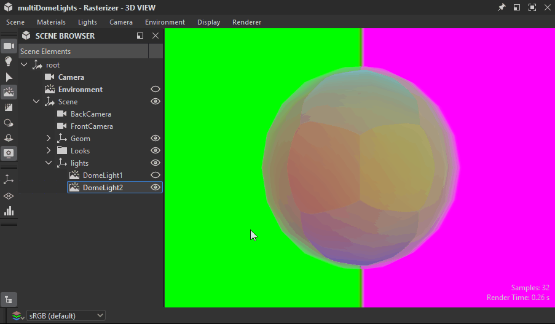

# 場景瀏覽器

3D 視圖的場景瀏覽器會列出場景中的所有元素及其階層結構。

它提供選擇物件、切換可見性，以及選擇哪些材質要 [覆蓋場景材質](../../../working-with-3d-scenes/overriding-scene-mat/overriding-scene-materials.md)的控制。

由於 Designer 使用 [USD](https://openusd.org/release/index.html) 來描述和管理其場景，其術語與概念都位於該場景樹中。

透過點擊 3D 視圖場景工具列[&#128279;](../../../interface/3d-view/3d-view.md)中專用的切換按鈕來顯示。

{zoomable="yes"}

<table>
<tr style="border: 0;">
<td style="border: 0;" valign="top">

## 場景樹

</td>
<td style="border: 0;" valign="top">

### 切換場景中的物件

</td>
<td style="border: 0;" valign="top">

### 連接材料

</td>
</tr>
</table>

## 場景樹

<table>
<tr style="border: 0;">
<td width="100.00%" style="border: 0;" valign="top">

場景瀏覽器會顯示以階層樹狀排列的物件清單。

物件會被子系到其他物件，直到場景的根節點。 父物件有一個箭頭按鈕，用來展開或摺疊其子物件的清單。

</td>
<td width="33.33%" style="border: 0;" valign="top">

{zoomable="yes"}

</td>
</tr>
</table>

將游標停留在樹中任一物品上幾秒鐘，會顯示提示，內容如下：

* <b>路徑：</b> 場景中物體的完整路徑。
* <b>TypeName：</b> 物件的 USD 類型。
* <b>文件說明：</b> 關於物件作為 USD 場景元素的詳細資訊。

網格還有額外資訊：頂點數量、面數和 UV 數量。

### 由 Designer 新增的物件

<table>
<tr style="border: 0;">
<td width="100.00%" style="border: 0;" valign="top">

設計器會將一些物件加入任何已載入的場景。 Designer 新增的物件會以粗體</b>標示<b>。

當使用「編輯...」時，在燈光、攝影機和環境選單中操作，這些都是被編輯的物件，無論場景中是否有其他燈光、攝影機或環境。

這些物件在匯出[&#128279;](../../../working-with-3d-scenes/exporting-scenes/exporting-scenes.md)時會包含在場景中。

</td>
<td width="33.33%" style="border: 0;" valign="top">

{zoomable="yes"}

</td>
</tr>
</table>

* <b>攝影機：</b> 場景的預設攝影機。 這是你在 Designer 中唯一能互動的相機。 載入場景中包含的任何攝影機會被加入預設攝影機的預設。
* <b>環境：</b> 場景的預設環境。 任何套用到場景環境的貼圖，都會只套用到該環境。 同樣地，旋轉環境只會影響該環境。\
  當載入的場景包含一個或多個環境燈（[以美金為 DomeLight](https://openusd.org/release/user_guides/schemas/usdLux/DomeLight.html) ）時，預設環境會自動被停用，以免干擾場景的環境光照。
* <b>點光 #：</b> 如果在 Lights > Edit 屬性中啟用了 Designer 的任何點光，每個點光都會被加入場景中。

## 切換場景中的物件

### 所有類型

場景中任何物件都可以啟用或停用。 當物件被停用時，該物體不再對場景有貢獻：它不會投射陰影、發射或反射光線。

父物件的狀態會延續到其子物件，因此停用父物件也會使其子物件失效。

物件的可見性可以透過點擊其眼睛按鈕  或從其情境選單切換。 選單中提供了幾個管理場景物件可見性的操作：

* <b>隱藏：</b> 停用選取的物件。
* <b>顯示：</b> 啟用所選物件。

有些動作會特別影響網格的可見性：

* <b>僅顯示：</b> 停用所有網格，僅選中那個及其子網格。
* <b>全部顯示：</b> 啟用所有網格。

父物件有以下額外動作：

* <b>隱藏子節點：</b> 遞迴地停用所選物件的所有子節點。
* <b>顯示子節點：</b> 遞迴啟用所選物件的所有子節點。
* <b>展開所有子節點：</b> 遞迴展開選取物件下的所有子節點清單。
* <b>摺疊所有子節點：</b> 遞迴地將所選物件下所有子節點的清單合併。

{zoomable="yes"}

### 環境

任何環境燈（DomeLight）的可見性都可以像其他物件一樣啟用或關閉。

當環境燈被關閉時，其對場景的光源貢獻也會被禁用。

若啟用多個環境燈，其光照貢獻會&#x200B;**&#x200B;累積。

{zoomable="yes"}

### 光源

場景中的任何燈光也是一樣：每個燈都可以單獨切換。

{zoomable="yes"}

## 連接材料

場景瀏覽器也允許你將任何覆寫的材質連接到 3D 檢視 [器材質選單](../../../interface/3d-view/3d-view.md)中 Designer 列出的其他材質。

<table>
<tr style="border: 0;">
<td style="border: 0;" valign="top">

Designer 列出的材質是場景樹中至少用於一個網格的材質物件。

當 [覆蓋](../../../working-with-3d-scenes/overriding-scene-mat/overriding-scene-materials.md) 這些材料時，Designer 會建立一份副本，並加上數字後綴。

被覆寫的材料會在其上下文選單中提供額外項目：「[連接材料](../../../working-with-3d-scenes/overriding-scene-mat/overriding-scene-materials.md)」子選單列出所有可用材料可用來覆寫該材料。

</td>
<td style="border: 0;" valign="top">

{zoomable="yes"}

</td>
</tr>
</table>
