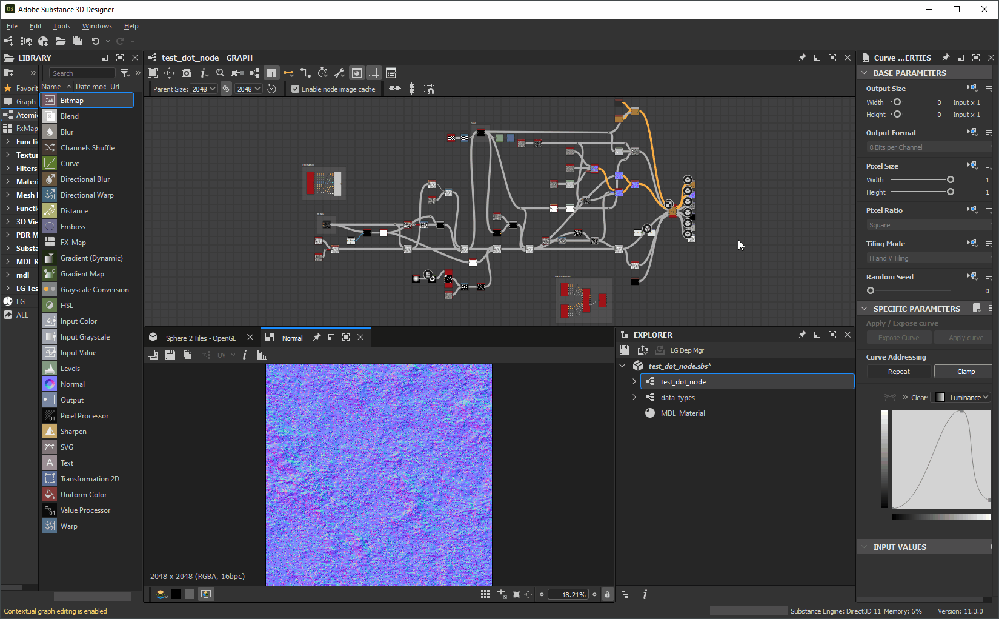

# 客製化您的工作空間

本頁介紹如何在 Adobe Substance 3D Designer](https://www.adobe.com/products/substance3d-designer.html) 的使用者介面中排列面板[，並善用其功能來提升您的工作流程。

<table>
<tr style="border: 0;">
<td width="100.00%" style="border: 0;" valign="top">

## Windows 選單

這個選單讓你管理 Designer 的主要使用者介面元素。 每個選項都在<b>本頁](../the-main-toolbar/the-main-toolbar.md) Windows</b> 主工具列的部分[說明。在這裡，我們將提供與此菜單相關的額外概念。

### 顯示/隱藏視圖

若要顯示或隱藏特定介面項目，請在 *Windows* 選單中點擊其名稱。 展示項目會勾  選。

### 讓碼頭上有美景

在 Designer 中，dock 是一個 *與其內容*&#x200B;分離的容器。 這表示 <b>圖書館</b> 底座可能存在但空無一物，因為它沒有 *圖書館視圖*。

<b>新檔案總管</b>、<b>新 3D 視圖</b>與<b>新函式庫視圖</b>選項會建立視圖，視圖將依使用者介面當前狀態排列：

* 如果有空的 dock，就會在裡面建立 *新的檢視*
* 若無&#x200B;*空碼頭*，*則會建立新碼頭*&#x200B;以存放新視圖

</td>
<td width="33.33%" style="border: 0;" valign="top">

</td>
</tr>
</table>

## 碼頭尺寸調整

碼頭可以透過移動任何邊框來調整大小。 其他碼頭會動態調整大小以配合。

## 移動碼頭

任何底座都可以透過標題 *列*&#x200B;在主視窗內移動。 根據碼頭移動的位置，碼頭會調整大小以適應。

## Tabbing docks

碼頭可以堆疊成分頁。 這對於儲存螢幕空間或彙整彼此相關的視角非常有用。

你可以透過標題列 *移動碼頭來標記現有底座* ，例如碼頭不會調整大小或移動，但目標底座周圍會出現一個 *框架* 。

## 脫離對接

底座可以脫離到 *浮動視窗，該視窗* 可調整大小並移出主視窗，包括移至另一個顯示器。

這可以透過兩種方式完成：

* 用標題 *列* 移動底座，然後把它 *放在主視窗* 外或主視窗 *裡不是底座*&#x200B;的區域。 你可以透過在主視窗&#x200B;*中將這個底座移到另一個底座*&#x200B;上，或點擊<b>重新對接按鈕來重新對</b>接;
* 點擊 <b> 脫離底座</b> 按鈕。 使用此方法 *脫離底座後，只能* 透過點擊 <b> 重新對接</b> 按鈕重新對接。

## 最大化碼頭容量

任何碼頭都可以最大化以符合該區域或其 *母窗*&#x200B;戶：

* 停靠的停靠區會覆蓋整個主視窗&#x200B;*區域*，不包括標題列、主工具列和狀態列
* 未停靠的底座會分布在整個顯示器上&#x200B;**

碼頭的最大化有兩種方式：

* 將游標放在 *底座* 上，按下 <b>Shift+Space</b> 鍵
* 點擊他們的 <b> Maximise</b> 按鈕

最大化碼頭可最小化為其最大化前&#x200B;*所佔*&#x200B;據的大小與位置。這可以透過三種方式進行：

* 將游標放在 *底座* 上，按下 <b>Shift+Space</b> 鍵
* 點擊他們的 <b> 「最小化</b> 」按鈕
* 打開 <b>Windows</b> 選單並選擇 <b>「視窗未最大化</b> 」選項

>[!NOTE]
>
> 一次只能 *最大化一個* 碼頭。

>[!IMPORTANT]
>
> 當對接埠被最大化時，某些介面行為可能會有所不同：
> 
> * 自動出現或更新的碼頭會在背景中進行（例如屬性、2D 視圖）
> * Windows 選單中的選單項目是&#x200B;*被停用&#x200B;*****&#x200B;的
> * 底座標題列中的按鈕是 *被禁用* 的
> * 主視窗&#x200B;*中最大值的碼頭不得使用標題欄移動*

## 釘銷碼頭

固定 *底座可以防止它被其他內容或不同的視圖填滿* 。

當底座被釘選時，未來應該顯示的內容會被 *建立新的底座* 來承載。 這個新底座不會被釘選，因此可以更新並承載新內容。

要釘選底座，請點擊它的<b>釘選</b>按鈕。接著&#x200B;*你可以用「Unpin</b>」<b>按鈕解除固定*，讓它再次&#x200B;*可用*&#x200B;來承載任何新內容。

*同時可以固定多個*&#x200B;碼頭，包括多個同類型的&#x200B;*碼頭*。

釘住碼頭會讓你擁有以下能力：

* 同時顯示與調整多個節點的屬性
* 同時顯示兩個或更多位圖
* 同時處理多個圖表

## 關閉碼頭

任何碼頭都可以按下<b></b>關閉按鈕來關閉。

## 重設介面佈局

透過開啟 <b>Windows</b> 選單並選擇 <b>重設版面選項</b> ，整個使用者介面可重設為預設配置。

它們的顯示狀態也會被重置，這表示關閉的停靠點可能會被&#x200B;*重新開啟*（e.g. 3D視圖），顯示的停靠點也會關閉&#x200B;**（例如主控台、相依性管理器、由外掛建立的停靠點）。

