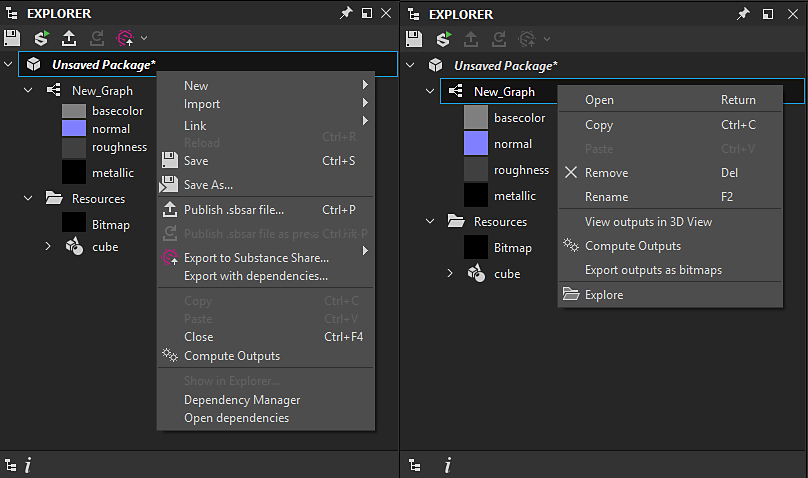

# 工作空間

工作區被劃分為稱為 <b>docks</b> 的獨立區域，可以 [調整大小、移動或從 Designer 主視窗中移除](../interface/customizing-your-wor/customizing-your-workspace.md) ，變成浮動式 dock。

這是 Designer 預設的底座配置：

<table>
<tr style="border: 0;">
<td style="border: 0;" valign="top">

<b>1</b> 主選單與工具列

<b>2</b> 探險者

<b>3</b> 圖視圖

</td>
<td style="border: 0;" valign="top">

<b>4</b> 性質

<b>5</b> 2D 視角

</td>
<td style="border: 0;" valign="top">

<b>6</b> 3D 視角

<b>7</b> 圖書館

</td>
</tr>
</table>

>[!NOTE]
>
> 介面縮放
> 
> Designer 從作業系統&#x200B;*取得特定尺度的使用者介面元素*。因此，任何對使用者介面縮放的調整都應在作業系統的顯示設定中進行。
> 
> 為了確保在 Designer 中正確套用顯示設定，請 *登出* 作業系統使用者會話，並在更改這些設定後再登入。

<table>
<tr style="border: 0;">
<td style="border: 0;" valign="top">

## 主選單與工具列

主工具列讓你能進入額外選單，例如[偏好設定視窗](../interface/preferences-window/preferences-window.md) ，還有幾個按鈕可以快速建立新的 Substance 圖表和套件。

</td>
<td style="border: 0;" valign="top">

</td>
</tr>
</table>

* <b>檔案：</b>讓你建立新的套件和資源，以及儲存和關閉你目前正在處理的套件。 此選單的功能也可透過工具列的快速按鈕使用。
* <b>編輯：</b>提供復原與重做功能（下方快速按鈕提供），以及 [偏好設定](../interface/preferences-window/preferences-window.md)，方便深入自訂。
* <b>工具：</b>控制物質引擎，並讓你能存取插件管理器。
* <b>視窗：</b>允許你隱藏或顯示任何視窗（有些預設是隱藏的），並能將視窗配置重設回預設。
* <b>協助：</b>提供更多資訊與線上資源，如 Substance Academy 或此文件網站。

## 總管

[檔案總管視窗](the-explorer-window/the-explorer-window.md) 是與任何檔案和資源互動的主要方式。 它提供的選項比主工具列的檔案選單還多，這裡是每次工作工作階段的開始和結束。

## 圖視圖

[Graph View dock](../interface/the-graph-view/the-graph-view.md) 是 Substance 3D Designer 中最重要的視窗。 它能顯示 Designer[ 中任何圖形（Substance 圖](../compositing-graphs/substance-compositing-graphs.md)、[Substance 函數圖](../function-graphs/function-graphs.md)、 [FX-Map 圖](../function-graphs/fxmaps/fxmaps.md)）的節點網絡，並允許你建立與編輯這些圖。

## 屬性

[物業碼頭](https://helpx.adobe.com/substance-3d/unlisted/documentation/sddoc/parameters-ui-129368153.html)是最技術性的窗口。 它始終具上下文敏感性，會呈現滑桿、下拉選單及其他改變所選資源或節點行為的元素。

## 2D 視角

[2D 檢視](../interface/2d-view/2d-view.md) 是最簡單的預覽工具。 它與圖形緊密結合：雙擊圖形檢視中任一節點，會將視覺結果顯示到二維檢視中。

## 3D 檢視

[3D 視圖](../interface/3d-view/3d-view.md) 是最互動且最先進的預覽視窗。 與 2D View 不同，它使用多種不同的輸出貼圖來渲染完整材質。 這表示你會看到所有通道，例如基色、法線和粗糙度。

## 圖書館

[Library 底座](../interface/the-library/the-library.md)預設提供 Designer 函式庫中所有內容的存取權，以及你的 [自訂內容](../interface/the-library/managing-custom-content/managing-custom-content-and-filters.md)。 為了更了解函式庫中原子節點與實例節點的差異，請務必閱讀 [節點概覽](https://helpx.adobe.com/substance-designer/using/nodes-overview.html)。

