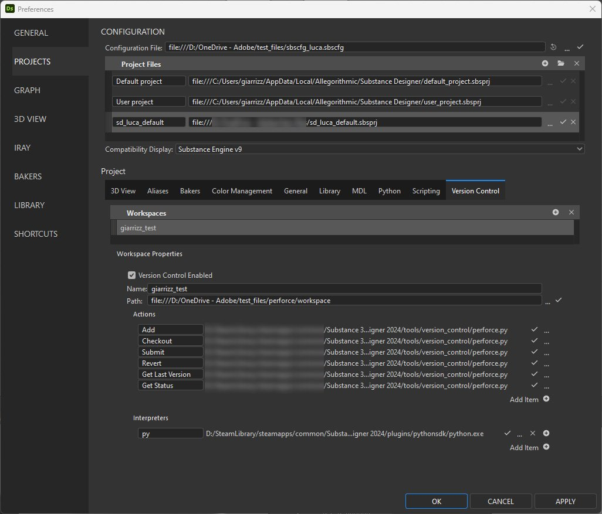
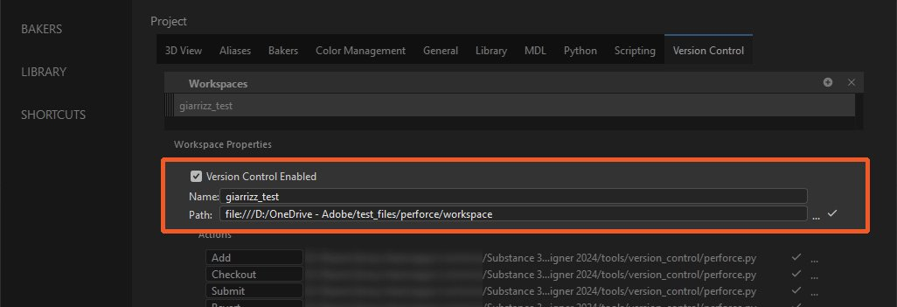

# 版本控制

>[!IMPORTANT]
>
> Substance 3D Designer 14.0.0 版本<b>將 Perforce 支援升級至 <b>Python 3</b>。</b>
> 
> 確保你的其他腳本和版本控制環境都相應調整。

Designer 提供 Perforce](https://www.perforce.com/) （P4） 版本控制系統的 Python 整合[。

整合後在檔案總管](../../../interface/the-explorer-window/the-explorer-window.md)的套件情境選單中新增了自訂的「版本控制」子選單，並新增[自訂圖示以匹配 P4 中套件的狀態。

## 準備P4

在 P4V](https://www.perforce.com/products/helix-core-apps/helix-visual-client-p4v) 中[，請記下工作區名稱與路徑，如下所示：

{zoomable="yes"}

在任何文字編輯器或 IDE 中，開啟位於 Designer 安裝中的腳本：「*tools/version\_control/perforce.py*」。

在第 19 行，編輯路徑到系統中 &#39;p4&#39; 執行檔</b>的位置<b>。\
在下方範例中，這條路徑是「*c：/Program Files/Perforce/p4.exe*」。

```
## Editable variables

cPerforceP4AbsPath = os.path.abspath("c:/Program Files/Perforce/p4.exe")

cVerbose = False
```


## 在 Designer 中的設定

版本控制可在專案設定中設定 [，該設定](../../../interface/preferences-window/project-settings/project-settings.md)可在設計者 [偏好設定](../../../interface/preferences-window/preferences-window.md)中取得。

{zoomable="yes"}

1. 前往「編輯>偏好設定」
1. 前往「專案」，選擇目標 [專案檔案](../../../pipeline-and-project-con/project-configuration-fil/project-configuration-files-sbsprj.md) ，然後進入「版本控制」標籤
1. 請檢查「啟用版本控制」
1. 請在「工作區」區填寫以下資訊：

   * <b>名稱：</b> 輸入你之前從 P4V 取得的「工作區名稱」
   * <b>路徑：</b> 輸入你之前從 P4V 取得的「工作空間路徑」

{zoomable="yes"}

### 設定動作

這些動作會在檔案總管套件的情境選單中顯示。 有預設的動作符合大多數版本控制工具的概念：

* 所有動作標籤都可以根據需要更改。
* 所有動作都需要腳本才能有效。

你可以使用：

* 每個&#x200B;*動作一個腳本*
* 所有動作都用一個腳本&#x200B;**

所有動作的起始腳本可在 Designer 安裝中取得：&#39;*tools/version\_control/perforce.py*&#39;。

>[!IMPORTANT]
>
> 要讓套件可用，必須儲存在「Workspace path」下（例如「f：/Dev/perforce *」下*）

1. 在<b>動作</b>群組中，點擊「...</b>」新增動作按鈕<b>
1. 在 Designer 安裝中選擇以下腳本：&#39;*tools/version\_control/perforce.py*&#39;
1. 腳本應該會自動為其他所有動作設定。

{zoomable="yes"}

### 設定自訂動作

由於所有版本控制工具都不同且包含許多功能，我們允許使用者新增自訂動作。

1. 點擊「新增項目」
1. 填寫新動作的標籤，並設定其腳本路徑

### 設定腳本直譯器

1. 在「解譯器」區塊，點選「新增項目」
1. 設定腳本副檔名或後綴，以及直譯器可執行檔的路徑
1. 編輯 perforce.py 腳本以更新「p4」二進位檔的位置

{zoomable="yes"}

## 如何使用版本控制

1. 建立一個新套件
1. 將套件存於「Workspace path」目錄下
1. 點擊套件上的右鍵：你現在可以進入「版本控制」子選單了
1. 根據工作區中套件檔案的狀態，有幾個動作可用：

   * <b>新增：</b> 將檔案標記為「ToAdd」
   * <b>提交：</b> 提交所選的套件。 此動作會顯示一個指定變更訊息的對話框（見下文）
   * <b>還原：</b> 還原修改內容。 此動作會顯示一個選擇要還原檔案的對話框（見下文）
   * <b>結帳：</b> 請從車站借閱檔案
   * <b>取得最新版本：</b> 從倉庫取回最新版本
   * <b>重新整理狀態：</b> 重新整理套件檔案狀態

   <table>
   <tr style="border: 0;">
   <td style="border: 0;" valign="top">

   {zoomable="yes"}

   </td>
   <td style="border: 0;" valign="top">

   {zoomable="yes"}

   </td>
   </tr>
   </table>

>[!NOTE]
>
> 所有動作都支援多重選擇
> 
> 對於 P4 及其他使用唯讀檔案權限限制修改的版本控制工具，使用者必須先檢查套件後再修改。
> 
> 唯讀套件檔案在 SD 中無法修改。

包裹將根據狀態顯示以下圖示：

<table>
<tr style="border: 0;">
<td style="border: 0;" valign="top">


最新資訊

</td>
<td style="border: 0;" valign="top">


退房

</td>
<td style="border: 0;" valign="top">


標記為新增

</td>
<td style="border: 0;" valign="top">


車站裡沒有

</td>
</tr>
</table>

請注意，包裹若未更新，會標示警告標誌。

## 動作腳本

每個動作執行的指令如下：

my\_script <b>*工作區名稱 工作空間路徑 行動名稱[ActionArgs]*</b>

<b>WorkspaceName：</b> 工作區名稱

<b>WorkspacePath：</b> 工作區根目錄的路徑

<b>ActionName：</b> 動作名稱：

* *add：* 用於「Add」動作
* *結帳：* 關於「結帳」動作
* *submit：* 對於「Submit」動作
* *revert：* 用於「Revert」動作
* *get\_last\_version：* 用於「取得最後版本」動作
* *get\_status：* 用於「Get Status」動作

標籤在專案設定中設定，將 &#39; &#39; 字元替換為 &#39;\_&#39; — 例如：「My Action」=> 「My\_Action」。

<b>ActionArgs：</b> 動作的參數：

* *-desc*：用於「提交」動作的描述字串
* *-檔案：* 檔案清單
* *-files\_list：* 包含每行檔案清單的文字檔

<b>get\_status</b>：根據指定檔案的狀態回傳一個值：

* 0：未定義狀態
* 1：不要在車站
* 2：舊版本（非最新版本）
* 3：最新版本（最新）
* 4：退房
* 5：標記為加法
* 其他行動：
  * 0：成功
  * 其他：錯誤
