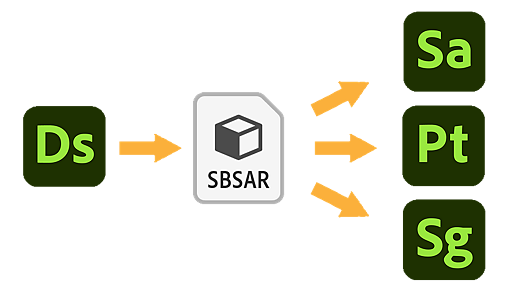

# 傳送至...  互通性

{width="512px"}

Adobe Substance 3D Designer 與 Substance 3D Sampler[&#128279;](https://www.adobe.com/products/substance3d-sampler.html)、[Substance 3D Painter](https://www.adobe.com/products/substance3d-painter.html) 及 [Substance 3D Stager](https://www.adobe.com/products/substance3d-stager.html) 具有互通性。它讓你能 *快速傳送* 和 *重寄* 作品，促進 Substance 3D 生態系統的迭代。

工作流程通常如下：

1. 在 Substance 圖的屬性中設定 <b>Type</b> 屬性[&#128279;](../../../compositing-graphs/graph-parameters/graph-parameters.md)
1. 在 [Explorer](../the-explorer-window.md) 面板中，選擇你想寄出的包裹
1. 在檔案總管的 <b>發佈/發送</b> 下拉選單中，選擇目標應用程式
1. 對圖形進行修改
1. 重複步驟 3 重新傳送套件，並更新已發送的資產並加入你的變更

>[!WARNING]
>
> Steam</b> 版本沒有&#x200B;*互<b>通功能*。

<table>
<tr style="border: 0;">
<td style="border: 0;" valign="top">

## 設定圖型別

實體圖可以有許多功能。 你必須事先定義圖表的具體功能，確保它能正確傳送過去。

在 <b></b>Substance 圖屬性[&#128279;](../../../compositing-graphs/graph-parameters/graph-parameters.md)的屬性區塊中，有一個<b>類型</b>選項，並有一個下拉選單，包含以下選項：

</td>
<td style="border: 0;" valign="top">


</td>
</tr>
</table>

* **如果你沒設定，預設類型是未指定** 。 根據你寄給哪個應用程式，可能會有不同的解讀。 [例如，Substance 3D Painter](https://www.adobe.com/products/substance3d-painter.html) 會預設為 Material;
* **標準材料**&#x200B;適用於多通道PBR材料，且輸出需正確標[&#128279;](../../../compositing-graphs/nodes-reference-for-com/atomic-nodes/output/output.md)示;
* **貼花材質**&#x200B;用於多通道 PBR 材質，帶有 alpha 通道，可作為 Substance 3D Painter[&#128279;](https://www.adobe.com/products/substance3d-painter.html) 或 [Substance 3D 取樣器的](https://www.adobe.com/products/substance3d-sampler.html)貼花;
* **Atlas Material** 用於多通道 PBR 材質，包含多個圖譜影像，適用於 [&#128279;](../../../compositing-graphs/nodes-reference-for-com/node-library/material-filters/scan-processing/atlas-scatter/atlas-scatter.md)Designer 或 [Substance 3D Sampler](https://www.adobe.com/products/substance3d-sampler.html) 中的 Atlas Scatter 節點;
* **濾鏡** 用於通用濾鏡，兩者皆用於 [Substance 3D Painter](https://www.adobe.com/products/substance3d-painter.html) 或 [Substance 3D 取樣器](https://www.adobe.com/products/substance3d-sampler.html);
* **基於網格的產生器** 是用於多輸入遮罩產生器的。 此系統僅由 [Substance 3D Painter](https://www.adobe.com/products/substance3d-painter.html)使用;
* **材質產生器** 適用於單通道貼圖，如 2D 程序化和噪音;
* **環境光** 用於單通道光照環境，用於照亮場景與物件;
* **光源貼圖** 是針對實體光源套用單通道貼圖。

<table>
<tr style="border: 0;">
<td style="border: 0;" valign="top">

## 「送出」選單

傳送過程涉及 [在幕後將一個或多個套件發佈](../../../compositing-graphs/publishing-asset-files/publishing-substance-3d-asset-files-sbsar.md) 到 Substance 3D 資產檔案（SBSAR）。

傳送內容可透過以下方式進行：

* 右鍵點選套件，並在情境選單中開啟 <b>「送出...</b> 」子選單，然後選擇 <b>目標應用程式的「送出...</b> 」選項;
* 點選<b>檔案總管面板頂端的「發佈/送出</b>」按鈕，然後選擇<b>目標應用程式的「寄出...</b>」選項。

</td>
<td style="border: 0;" valign="top">


</td>
</tr>
</table>

### 重新發送

當再次傳送已送&#x200B;*出一次*&#x200B;的套件到&#x200B;*同一目標*&#x200B;應用程式時，該資產會在目標應用程式中更新&#x200B;**&#x200B;為新版本。

## 發送給玩家

[Substance Player](https://helpx.adobe.com/substance-3d-player/home.html) 支援 ** <b>Substance 3D 檔案</b>（SBS）與 <b>Substance 3D 資產</b>（SBSAR）。

傳送給玩家需要使用者手動定位&#x200B;*Substance Player 執行檔*，可完成：

* 當被提示玩家自安裝 Designer 後是否 *未被找到* ;
* 在工具</b>選單中，<b>隨時使用<b>物質播放器>定位......</b>選項。

在 Player 中，接收 Designer 的訊號需要使用者手動定位 Substance 3D Designer *安裝目錄* ，這可做：

* 當被問到設計師自安裝 Player 後是否從未 *被找到* 時;
* 在選項</b>選單中，<b>隨時使用<b>「尋找 Adobe Substance 3D 設計師</b>」選項。

>[!NOTE]
>
> 當將 Substance 3D 檔案（SBS）傳送到 Player 時，Substance 3D 資產（SBSAR）會以暫存檔&#x200B;*的形式發佈*。

## 議題

你可能會在寄送包裹時遇到錯誤，例如：

```
Error sending package to Substance 3D Painter. Check the console for details. SBSAR export failed.
```


這通常是因為標準誤差和警告，修正它們以解決問題：

* 你的圖中沒有 [定義輸出](../../../compositing-graphs/nodes-reference-for-com/atomic-nodes/output/output.md)節點。 新增輸出節點並連接到它們;
* 在函式圖[&#128279;](../../../function-graphs/function-graphs.md)中缺少[&#128279;](../../../function-graphs/nodes-reference-for-fun/atomic-function-nodes/get-nodes/get-nodes.md)或損壞的變數。透過 *受影響淋巴結上的黃色警告徽* 章追蹤他們。
