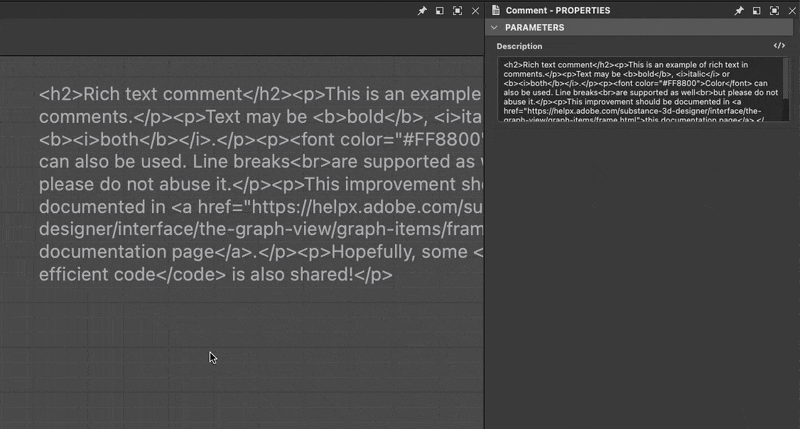

# 留言

<table>
<tr style="border: 0;">
<td width="25.00%" style="border: 0;" valign="top">

</td>
<td width="100.00%" style="border: 0;" valign="top">

註解只是一段可以放置在圖表任意位置的自由漂浮文字。

它旨在註解和解釋圖表的部分。 其 <b>描述</b> 屬性則是儲存正在顯示的文字。

</td>
</tr>
</table>

>[!NOTE]
>
> 註解有自動換行功能，旨在減少其在圖表中的佔用。

## 建立留言

預設的註解類型會獨立於圖中的節點放置。

它可以透過以下方式創建：

+++節點選單
在圖譜檢視中按 <b>空白鍵</b> 開啟 <b>節點選單</b>，並在列表中選擇「註解」項目。

在搜尋欄輸入「comment」，可以快速顯示該項目並找到。

+++

+++捷徑
如果某個快捷鍵被映射到偏好設定[&#128279;](../../../../interface/preferences-window/preferences-window.md)中的「註解」項目，當圖表檢視有焦點時，請按該快捷鍵。

+++

+++情境選單
在圖視圖中，請對任意物件或空白區域按下 <b>右鍵</b> ，並選擇 <b>新增註解</b> 選項。

+++

+++圖工具列
在 Graph View 工具列中，點擊節點調色盤</b>中的<b>「Comment」按鈕。

+++

+++圖書館
在函式庫中，選擇 <b>圖項目</b> 類別，然後拖放「註解」項目到圖檢視中。

+++

>[!TIP]
>
> 當留言被建立時，其「描述」屬性會自動獲得焦點，讓你能立即編輯留言文字。

## 家長留言

<table>
<tr style="border: 0;">
<td width="100.00%" style="border: 0;" valign="top">

父級註解是指附加 *在圖中特定節點* 上的註解，當該節點被移動時，註解會跟著移動;當該節點被刪除時，註解也會隨之刪除。

當選取單一&#x200B;*節點或透過該節點的情境選單時產生*&#x200B;的註解，則會被子處理到該節點。

</td>
<td width="33.33%" style="border: 0;" valign="top">

</td>
</tr>
</table>

## HTML 格式化

文字可以用 HTML 標籤來格式化。 這種格式是透過<b>評論<b>的 Description</b> 屬性中的 HTML 標記</b>按鈕切換的。

>[!TIP]
>
> 想了解更多此功能，請參閱<b>框架[&#128279;](../../../../interface/the-graph-view/graph-items/frame/frame.md)文件的說明</b>部分。

