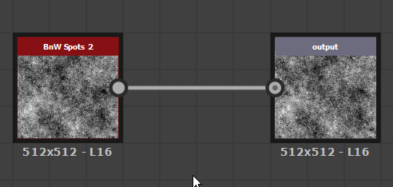

# 點節點（亦稱 Portal）

<table>
<tr style="border: 0;">
<td width="25.00%" style="border: 0;" valign="top">

</td>
<td width="100.00%" style="border: 0;" valign="top">

<b>Dot</b> 節點是一個輔助工具，讓你可以透過重新路由和分組連接來簡化和整理圖表。它對於有許多長連線跨越其他連接或節點的圖特別有用。

一對 Dot 節點可用作 <b>通道</b> ，隱藏跨越長距離的連線，或在連接路由困難的地點隱藏。

</td>
</tr>
</table>

## 建立點節點

點節點可以任何圖型態、以下任一方式添加：

+++連結插入
按住 <b>Alt</b> 鍵並懸停在連線上顯示點節點預覽，然後點擊左鍵在該連接點上新增點節點。

{width="512px"}

+++

+++節點連接器
在從節點連接器拖曳新連線時按下 <b>Alt</b> 鍵，即可在該位置插入 Dot 節點。

你可以繼續拖曳新連線，重複這個操作，讓該連線以你喜歡的方式路由。

+++

+++節點選單
按 <b>空白鍵</b> 顯示 <b>節點選單</b>，然後選擇「Dot」項目，或在搜尋欄輸入「dot」，這樣可以快速浮現該項目並找到它。

+++

>[!TIP]
>
> 當 Dot 節點建立時，它的「Name」屬性會自動獲得焦點，讓你能立即編輯該節點的名稱。

<table>
<tr style="border: 0;">
<td style="border: 0;" valign="top">

## 連結合併

按 ALT 並將 Dot 節點移到連結上，可以合併多個節點連線。

</td>
<td style="border: 0;" valign="top">

{width="512px"}

</td>
</tr>
</table>

## 入口

<table>
<tr style="border: 0;">
<td width="16.67%" style="border: 0;" valign="top">

</td>
<td width="100.00%" style="border: 0;" valign="top">

點節點可以作為 <b>入口</b> ，在圖中傳送長距離資料，而不會有冗長的連結，影響可讀性。 這實際上隱藏了點節點之間的連結。

</td>
</tr>
</table>

### 創建傳送門

當傳送端點節點命名時，兩個 Dot 節點——發射端與接收端之間會自動建立一個入口。 命名點節點是透過在其 Name</b> 屬性中<b>設定唯一識別碼來完成。

當圖中存在一個或多個命名的點節點時，任何點節點都可以透過以下方式作為接收者連接到該圖：

* 建立接收端輸入與發射端輸出之間的連結;
* 在接收端 <b>的輸入入口</b> 屬性中選擇發射器名稱。

複製或複製接收器可保留其與發射器作為入口的連接。

### 識別入口

用作入口的點節點會在用作入口的連接器旁放置無線訊號圖示。

選擇任何用作傳送門的 Dot 節點，會以虛線顯示其與其他傳送門的隱藏連結。

### 刪除傳送門

當發射器<b></b>名稱被清除，或隱藏連線被以下方式刪除時，傳送門會被刪除：

* 選擇一個傳送門，然後選擇隱藏連線並刪除它;
* 選擇接收器，然後在屬性中按下<b>輸入入口</b>下拉選單旁<b>的 X</b> 鍵。

>[!IMPORTANT]
>
> FX-Map 圖[&#128279;](../../../../function-graphs/fxmaps/fxmaps.md)不支援將點節點作為入口。

看看這個關於點節點作為傳送門的教學：
