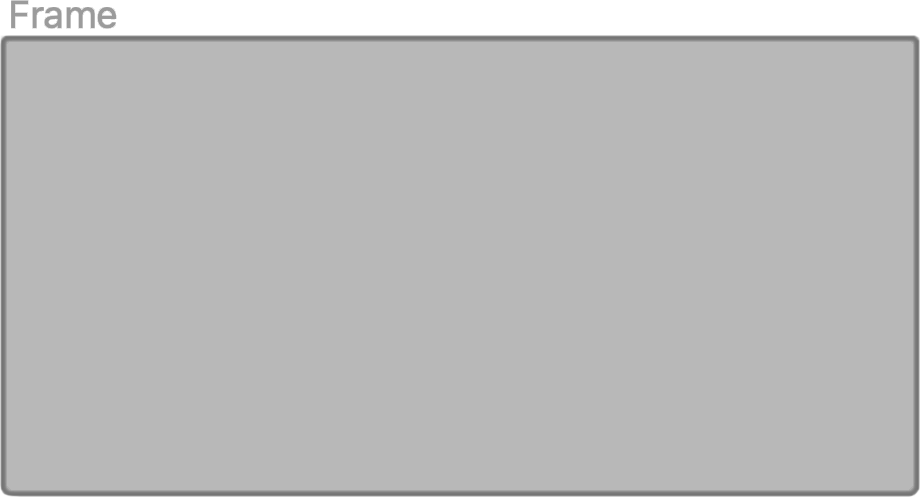
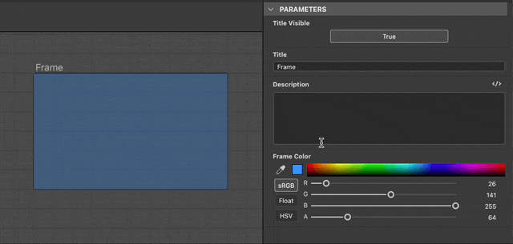
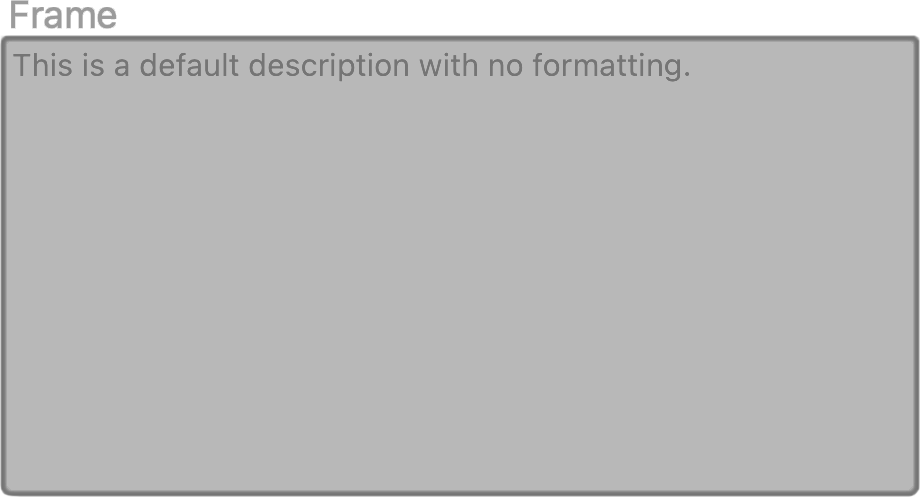
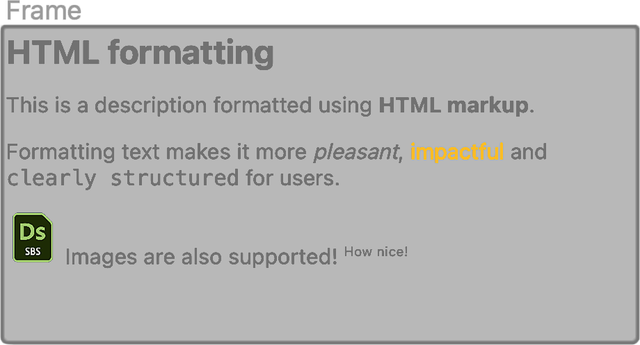
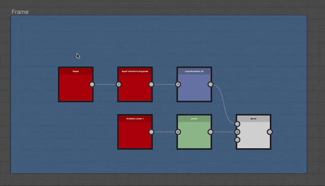
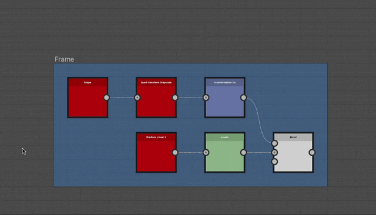

# 邊框

<table>
<tr style="border: 0;">
<td width="25.00%" style="border: 0;" valign="top">


</td>
<td width="100.00%" style="border: 0;" valign="top">

框架透過視覺化將圖中的物件分組，讓你能輕鬆將所有物件集中移動，從而簡化圖表的可讀性和佈局。

例如，可以為框架命名和著色，使圖結構在整體檢視時清晰呈現，這在圖複雜度增加時非常有幫助。

它們也可以被註解，因此作為說明某些節點為何以特定方式設置的文件工具。

</td>
</tr>
</table>

## 外觀

根據滑鼠游標的位置或是否屬於選取範圍，畫面會以不同的視覺風格呈現，告訴你是否以及如何與它互動。

+++預設
預設框架為矩形，角為圓角，填充其框架顏色</b>屬性中<b>所選的顏色。該顏色的較深色調會塗在框架輪廓上。

標題設定在 <b>標題</b> 屬性中以灰色置於畫面左上角。




+++

+++標頭懸停
當滑鼠移至畫面頂部時，會顯示一個標題條。

可透過拖曳該標題列或標題來移動畫面。


+++

+++已選取
選取後，標題與框架輪廓會以白色高亮顯示。 輪廓變得更粗。


+++

## 建立框架

框架可以以下任一方式添加任何圖類型：

+++節點選單
在圖譜檢視中按 <b>空白鍵</b> 開啟 <b>節點選單</b>，並選擇列表中的「框架」項目。

在搜尋欄輸入「frame」即可快速顯示該物品並找到。

+++

+++捷徑
如果在偏好設定](../../../../interface/preferences-window/preferences-window.md)中將鍵盤快捷鍵映射到「Frame」項目[，當圖形檢視有焦點時，按下該快捷鍵即可。

+++

+++情境選單
在圖表檢視中，對任意物件或空白區域按下 <b>右鍵</b> ，選擇 <b>新增畫面</b> 選項。

+++

+++圖工具列
在 Graph View 工具列中，點擊節點調色盤</b>中的<b>「Frame」按鈕。

+++

+++圖書館
在函式庫中，選擇 <b>圖項目</b> 類別，然後拖放「框架」項目到圖譜檢視中。

+++

### 框架選曲

如果在建立框架時，圖形中有選取範圍是啟用的，該框架會自動調整，以完整包含所選物件。

基於此，使用鍵盤快捷鍵建立框架能讓在圖表中框出內容更快。

{width="480px"}

>[!TIP]
>
> 當一個框架被建立時，它的「標題」屬性會自動聚焦，讓你能立即編輯該框架的標題。

## 操作框架

<table>
<tr style="border: 0;">
<td style="border: 0;" valign="top">

影格可以透過拖曳標題列或標題列來 <b>平移</b> ，並 <b>透過拖曳任一邊框或角落來調整大小</b> 。

圖中突顯了平移（藍色）和調整大小（黃色）的互動區域。

</td>
<td style="border: 0;" valign="top">


</td>
</tr>
</table>

<table>
<tr style="border: 0;">
<td style="border: 0;" valign="top">

### 網格捕捉

預設情況下，當畫面移動或調整大小時，會自動吸附到中等格子上。

按住 <b>Ctrl</b> （Windows）或 <b>Cmd</b> （macOS）鍵，將這個吸附移到小格子上，方便更細緻地調整。

</td>
<td style="border: 0;" valign="top">


</td>
</tr>
</table>

## 屬性

當選取框架時，屬性底座中可選[](../../../../interface/properties/properties.md)出以下屬性：

+++標題
<b>標題</b>位於畫面左上角。可透過「 <b>產權可見</b> 」屬性來開啟或關閉產權顯示。

標題大小可以鎖定在最小螢幕尺寸，這樣縮小圖時仍能清晰閱讀。 你可以透過在圖表檢視](../../../../interface/the-graph-view/the-graph-view.md)工具列的資訊</b>下拉選單[中勾選「框架標題」<b>選項來達成此目標。

{width="640px"}


+++

+++說明
<b>描述</b>是可選的額外文字，可用來標註框架內容。

文字可以用 HTML 標籤來格式化。 此格式可透過點擊  <b>HTML 標記</b> 按鈕切換。

詳情請見下方的說明區。

{width="640px"}


+++

+++顏色
<b>框架顏色</b>用於填滿圖形檢視中的畫面。使用色彩選擇器來選擇任何顏色。

顏色的 alpha 通道控制 *畫面的不透明度* ，值為 0 表示畫面完全透明。

{width="640px"}


+++

## 說明

框架內可標註文字。 文字對齊於左側，從畫面左上角開始。 使用框架的 [描述](#properties) 屬性來編輯該文字。

<table>
<tr style="border: 0;">
<td style="border: 0;" valign="top">

### 標準

<b>標題</b>以粗體字體顯示在畫面左上方。標題的可見性可以開關。

它的尺寸可以鎖定在最小螢幕尺寸，這樣縮小圖時仍能保持可讀性。 你可以透過在圖表檢視](../../../../interface/the-graph-view/the-graph-view.md)工具列的資訊</b>下拉選單[中勾選「框架標題」<b>選項來達成此目標。

</td>
<td style="border: 0;" valign="top">

{zoomable="yes"}

</td>
</tr>
</table>

<table>
<tr style="border: 0;">
<td style="border: 0;" valign="top">

### HTML 格式化

文字可以透過框架的 <b>Description</b> 屬性中的 HTML 標籤來格式化。 格式化必須透過<b>該屬性中的 HTML 標記</b>按鈕來啟用。

</td>
<td style="border: 0;" valign="top">

{zoomable="yes"}

</td>
</tr>
</table>

你可以將此範例複製貼上到框架的描述屬性中，親自測試此功能：

```
<h2>HTML formatting</h2>

<p>This is a description formatted using <b>HTML markup</b>.</p>

<p>Formattig text makes it more <i>pleasant</i>, <font color="#CC8822">impactful</font> and <code>clearly structured</code> for users.</p>

<p>  Images are also supported! <sup>How nice!</sup></p>
```


以下是一些用於格式化文字的有用標籤清單：

+++HTML 格式標籤

|  |  |
| --- | --- |
| 粗體字 | &lt;b>...&lt;/b> |
| 斜體 | &lt;i>...&lt;/i> |
| 顏色 | &lt;font color=&quot;#4A567C&quot;>...&lt;/font> |
| 段落 | &lt;p>...&lt;/p> |
| 換行 | &lt;br> |
| 標題 | &lt;h1>...&lt;/h1>, &lt;h2>...&lt;/h2>等等。 |
| 影像 | &lt;img src=&quot;{path\_to\_image}&quot;> |
| 上標 | &lt;sub>...&lt;/sub> |
| 無序清單（項目符號） | &lt;ul>   &lt;li>...&lt;/li>   &lt;li>...&lt;/li>  &lt;/ul> |
| 有序列表（數字） | &lt;ol>   &lt;li>...&lt;/li>   &lt;li>...&lt;/li>  &lt;/ol> |
| 程式碼 | &lt;code>...&lt;/code> |


+++

## 包含規則

若物件符合其包含規則，則視為包含在框架中。 這些規則會依物件和特殊情況而有所不同。 以下列出了它們。

每幅插圖中的黃色符號代表必須完全在框架範圍內的點或區域，才能包含物件。

+++節點
<b>使用中心點</b>。

徽章、連接器及節點下方顯示的資訊皆被忽略。

節點的高度可能不同，取決於輸入或輸出連接器的數量。

當連接器被顯示或隱藏、新增或移除時，節點的高度會從中心&#x200B;*開始*&#x200B;調整。

因此，節點中心點的位置不應在被 *刻意移動*&#x200B;之前改變。


<b>使用主機&#x200B;*節點的* c</b><b>進入點</b>。

主機節點是節點被對接的節點。

若多個節點停靠在一條鏈中，最後一個停靠節點的宿主節點將被使用整條鏈。

徽章、連接器及節點下方顯示的資訊皆被忽略。


+++

+++點節點
<b>使用點的中心點</b>。

連接器、傳送門圖示和名稱都被忽略了。


+++

+++留言
<b>使用評論&#x200B;*邊界框*&#x200B;的中心點</b>（黃色輪廓）。

家長留言不遵守留言的包含規則。

取而代之的是<b>使用父&#x200B;*節點的*&#x200B;中心點</b>。

徽章、連接器及節點下方顯示的資訊皆被忽略。


+++

+++瓶子
<b>使用圖示尖端</b>。


+++

+++框架
<b>巢狀框架的包圍盒</b>被使用。

這表示巢狀框架必須完全位於另一個框架的範圍內，才能被納入後者。

標題被忽略了。


+++

## 尺寸與內容的配合


當你在圖表中做調整時，畫面可能不再優雅地調整到內容上。 在這種情況下，可以自動調整畫面的位置和大小，使其能根據內容的跨度調整，並以一個介質格作為填充。

要做到這點，請點擊 <b>畫面標題欄或標題欄上的右鍵</b> （見 [外觀](#appearance) ），並在情境選單中選擇 <b>「尺寸對內容</b> 」選項。

>[!NOTE]
>
> 只要至少 *有一個* 圖物件符合框架的 [包含規則](../../../../interface/the-graph-view/graph-items/frame/frame.md)，該選項就可用。

<table>
<tr style="border: 0;">
<td style="border: 0;" valign="top">

### 符合描述文字

如果框架有描述，會調整以利用描述旁邊的空格（如果可能的話）。

若該空間內無物品可放入，則框架高度會進一步調整以符合描述。

</td>
<td style="border: 0;" valign="top">


</td>
</tr>
</table>

+++範例
{width="640px"}


+++

## 自動展開


隨著圖的成長，影格內容可能需要重新排列。 節點可能會移動以騰出空間給新增內容，或是內容需要更拉開以促進可讀性。

為了方便調整，移動包含物件](#inclusion-rules)時可以自動展開畫面[：在移動物件時按住 <b>Shift</b> 鍵，讓框架邊框自動調整，保持該物件在範圍內。

這同樣適用於可能包含多個物件的選擇。 此時，每個物件的主機影格會同時調整。

如果物件未完全被框架的邊界包圍，但仍符合其[包含規則](#inclusion-rules)，按下 Shift</b> 鍵後，框架會被調整為完全包圍，並額外填充一個介質格子<b>。

>[!NOTE]
>
> 雖然 <b>在移動過程中任何時候按下或放開 Shift</b> 鍵以觸發或取消自動調整畫面，但 *完成動作時必須* 長按才能有效執行調整。

+++範例
{width="640px"}


+++
