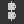

# 節點對齊工具

{zoomable="yes"}

節點對齊工具讓你能將節點排列成圖表，以提升其可讀性與撰寫體驗。 它們提供節點對齊、均勻分配並將它們吸附到網格上的動作。

它們只</b>作用於目前選擇的<b>節點。

>[!NOTE]
>
> 鍵盤快速鍵
> 
> 部分動作有快捷鍵可快速存取：H、V 和 S。它們會用括號顯示在下方動作列表中。
> 
> 請注意，這些鍵會覆蓋 [任何分配給節點](../../../interface/preferences-window/preferences-window.md)的鍵盤快捷鍵。

## 路線

節點可水平與垂直對齊，每個軸向有三種模式：

### 水平對齊

<b> 左側：</b> 將所選節點的左側對齊到最左側節點的左側。

<b> 中心（H）：</b> 將所選節點的水平中心對齊於包圍它們的邊界框的水平中心。

<b> 右側：</b> 將所選節點的右側對齊到最右側節點的右側。

<table>
<tr style="border: 0;">
<td style="border: 0;" valign="top">

{zoomable="yes"}

*左*

</td>
<td style="border: 0;" valign="top">

{zoomable="yes"}

*中心*

</td>
<td style="border: 0;" valign="top">

{zoomable="yes"}

*對*

</td>
</tr>
</table>

### 垂直對齊

<b> 頂端：</b> 將所選節點的上端對齊到最上端節點的頂端。

<b> 中間（V）：</b> 將所選節點的垂直中心對齊於包圍它們的包圍框的垂直中心。

<b> 底部：</b> 將所選節點的底部對齊到最下方節點的底部。

<table>
<tr style="border: 0;">
<td style="border: 0;" valign="top">

{zoomable="yes"}

*頂端*

</td>
<td style="border: 0;" valign="top">

{zoomable="yes"}

*中間*

</td>
<td style="border: 0;" valign="top">

{zoomable="yes"}

*底部*

</td>
</tr>
</table>

### 堆疊

<b>堆疊</b>選項可以<b>避免使用陣營時的重疊</b>。預設是啟用的。

啟用後，節點會盡可能移動到參考位置，直到與選取中的其他節點碰撞。 這實際上是在選定軸上堆疊它們，每個節點之間留出一個介質格子的邊距。

{zoomable="yes"}

## 發行版本

節點可以在當前選擇的兩個極端節點間均勻分布於目標軸上的各節點。

<b> 水平方向：</b> 節點均勻分布於選擇中最左邊和最右側的節點。

<b> 垂直方向：</b> 節點均勻分布於選擇中最頂端與最下方的節點。

這些分布旨在確保 <b>節點間距均勻</b> ，無論節點大小如何。

當多個節點的中心在所選軸上完全對齊時，它們會保持不變，並在分布中被視為 <b>一體</b> 。 **&#x200B;最大對齊節點用於計算偶數間距。

請注意，當所選節點的總大小大於所選軸上的可用空間時，可能會發生重疊。

<table>
<tr style="border: 0;">
<td width="58.33%" style="border: 0;" valign="top">

{zoomable="yes"}

*水平方向*

</td>
<td width="100.00%" style="border: 0;" valign="top">

{zoomable="yes"}

*垂直方向*

</td>
</tr>
</table>

<table>
<tr style="border: 0;">
<td width="58.33%" style="border: 0;" valign="top">

## 網格捕捉

<b>Snap （S） </b> 動作會移動每個選中的節點，使其左上角位於中等格子上最近的點。

</td>
<td width="100.00%" style="border: 0;" valign="top">

{zoomable="yes"}

</td>
</tr>
</table>
