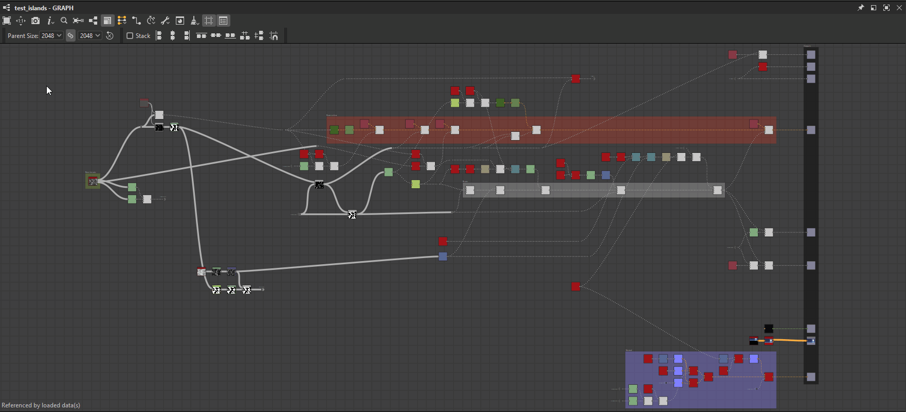
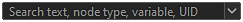
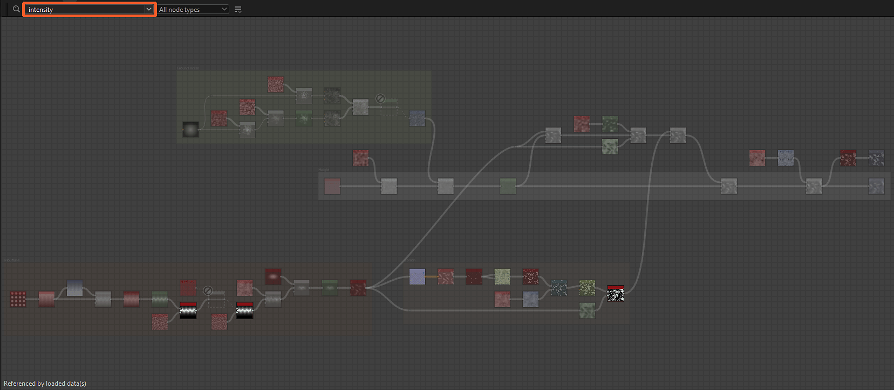

# 節點尋找器

{zoomable="yes"}

節點搜尋工具允許你使用文字查詢來搜尋 <b>節點和變數</b> 。所有不符合查詢的節點都會調暗，使結果更突出。

查詢可符合以下任一條件：

* <b>實例節點參考的圖</b>的識別碼
* 一個 <b>用於節點參數函式的暴露參數或變數</b> 的識別碼
* 節點的 <b>UID</b> （唯一識別碼）
* 節點的 <b>標籤</b>

搜尋可遞迴遍歷[圖實例](../../../compositing-graphs/creating-compositing-gra/graph-instances-sub-gra/graph-instances-sub-graphs.md)，因此節點與變數能跨子圖[&#128279;](../../../compositing-graphs/creating-compositing-gra/graph-instances-sub-gra/graph-instances-sub-graphs.md)被找到。如果你不確定要搜尋的確切詞彙，有模糊搜尋選項可用來套用容差。

## 介面

節點尋找器可透過兩種方式存取：

在圖視圖中，按 <b>Ctrl+F</b> （Windows）/ <b>Cmd+F</b> （macOS）即可顯示節點搜尋工具列，並自動將焦點設定在查詢欄位。 這讓你能快速進行搜尋。

在 Graph View 工具列中，點擊<b>節點搜尋器按鈕</b> 即可顯示節點搜尋工具列。 顯示後，只有點擊這個按鈕才能關閉工具列。

<b>搜尋會遍</b>歷圖表。 換句話說，當透過以下動作開啟圖表時，搜尋仍然保持活躍：

* 實例節點：在上下文中開啟參考（Ctrl+E / Cmd+E）（*注意：*&#x200B;在上下文中進行圖形編輯需在 Edit > Preferences > Graph 中啟用）
* 像素處理器：編輯功能（Ctrl+E / Cmd+E）
* 值處理器：編輯功能（Ctrl+E / Cmd+E）
* FX-Map：編輯FX-Map圖（Ctrl+E / Cmd+E）
* 節點參數：編輯函數

{zoomable="yes"}

### 搜尋查詢

{zoomable="yes"}

搜尋詞可以輸入此欄位，箭頭按鈕會開啟包含當前情境中部分變數的查詢建議清單。

請參考[下方的搜尋查詢](#search-query)區，了解更多您可以執行的查詢。

### 節點類型

{zoomable="yes"}

這個組合框可以讓你篩選搜尋結果，只保留特定類型的節點。

請注意，所有實例節點都是 *同一類型的* 節點——事實上是「實例」類型——而原子節點則各自是獨立的類型。

+++節點類型列表
該列表是依照當前圖型態的上下文而設。

{zoomable="yes"}

*用於合成圖的節點類型*

{zoomable="yes"}

*函數圖的節點類型*

+++

+++尋找原子節點
{zoomable="yes"}

*在物質圖中搜尋「Levels」節點類型*

+++

+++搜尋實例節點
{zoomable="yes"}

*在 Substance 圖中搜尋「Instance」節點類型*

{zoomable="yes"}

*在 Substance 函數圖中搜尋「實例」節點類型*

+++

### 搜尋選項

<table>
<tr style="border: 0;">
<td width="100.00%" style="border: 0;" valign="top">

<b>搜尋選項按鈕</b>會開啟一個可用於搜尋的設定清單，這些設定可以開關。

想了解更多這些選項，請參考下方的搜尋選項區塊。

</td>
<td width="33.33%" style="border: 0;" valign="top">

{zoomable="yes"}

</td>
</tr>
</table>

## 搜尋查詢

要尋找節點，會將文字查詢與以下列出的節點屬性進行比對。

>[!NOTE]
>
> 你的查詢應在輸入時注意以下注意事項：
> 
> * 搜尋不區分大小寫。 例如，「我的節點標籤」和「我的節點標籤」會回傳相同的結果。
> * 查詢前後的空白則被忽略。
> * 在同一張圖中不能同時執行多個查詢。 例如，「關卡模糊」不會同時對應「關卡」和「模糊」節點。 同樣地，邏輯運算子也不被支援。

<table>
<tr style="border: 0;">
<td width="100.00%" style="border: 0;" valign="top">

### 實例圖識別碼

[實例節點](../../../compositing-graphs/creating-compositing-gra/graph-instances-sub-gra/graph-instances-sub-graphs.md) 可透過 <b>其所參考圖的識別碼</b> 找到。

</td>
<td width="33.33%" style="border: 0;" valign="top">

{zoomable="yes"}

*點擊圖片可放大*

</td>
</tr>
</table>

+++Explorer 中的識別碼
圖會在 Explorer 中依其識別碼列出。

{zoomable="yes"}

+++

+++實例節點工具提示中的識別碼
實例節點的工具提示包含其參考圖的識別碼。

{zoomable="yes"}

+++

<table>
<tr style="border: 0;">
<td width="100.00%" style="border: 0;" valign="top">

### 暴露參數與變數

可直接搜尋暴露參數[&#128279;](../../../compositing-graphs/manage-parameters/exposing-a-parameter/exposing-a-parameter.md)的識別碼或其他變數。

</td>
<td width="33.33%" style="border: 0;" valign="top">

{zoomable="yes"}

*點擊圖片可放大*

</td>
</tr>
</table>

+++查詢建議
查詢欄位可以展開，顯示一串建議。

這些包括 [目前圖型態的內建變數](../../../function-graphs/variables/system-variables/system-variables.md) ，以及圖中暴露參數的識別碼。

{zoomable="yes"}

暴露參數的識別碼也可以直接複製或編輯到 [Substance 圖屬性](../../../compositing-graphs/graph-parameters/graph-parameters.md)中。

{zoomable="yes"}

*點擊圖片可放大*

+++

+++從控制台的警告/錯誤中搜尋變數
當某個圖表因節點使用的變數而產生<b>錯誤或警告時，請前往 <b>Windows > 主控台</b>顯示包含該變數的完整錯誤/警告</b>訊息。接著你可以將此變數複製貼上到 Node Finder 查詢欄位，快速找到造成問題的節點。

變數也可以直接從 SBS 檔案中的 XML 資料複製，使用任何文字編輯器。

{zoomable="yes"}

+++

+++取得/集合節點
當搜尋圖中的變數（包括外露參數）時，搜尋會標示 [Get](../../../function-graphs/nodes-reference-for-fun/atomic-function-nodes/get-nodes/get-nodes.md) 或 [Set](../../../function-graphs/fxmaps/using-functions-in-fxmaps/using-the-set-sequence/using-the-set-sequence-nodes.md) 節點在該節點參數函式中使用該變數的所有節點。

{zoomable="yes"}

+++

<table>
<tr style="border: 0;">
<td width="100.00%" style="border: 0;" valign="top">

### 節點 UID

圖中的每個節點都有一個唯一的識別碼（UID），可用來搜尋該節點。

</td>
<td width="33.33%" style="border: 0;" valign="top">

{zoomable="yes"}

*點擊圖片可放大*

</td>
</tr>
</table>

+++複製節點的 UID
節點的 UID 可以從其上下文選單複製到剪貼簿。

動作會以此格式複製 UID：

uid=1234567890

{zoomable="yes"}

+++

+++從控制台的警告/錯誤中搜尋節點的 UID
當某個圖表有節點提出錯誤或警告時，請前往 Windows > 主控台顯示完整的錯誤/警告訊息，其中包含該節點的 <b>UID</b>。 接著你可以將此 UID 複製貼上到 Node Finder 查詢欄位，快速找到造成問題的節點。

節點 UID 也可以直接從 SBS 檔案中的 XML 資料複製，使用任何文字編輯器。

{zoomable="yes"}

+++

### 節點標籤

節點也可以用標籤來找到。

在關閉模糊搜尋後，使用精確標籤搜尋特定節點特別有效。

## 搜尋選項

<table>
<tr style="border: 0;">
<td width="100.00%" style="border: 0;" valign="top">

<b>搜尋選項按鈕</b>可以切換<b>遞迴</b>模式和<b>模糊</b>模式來搜尋節點。

兩者都可以同時啟用。

</td>
<td width="33.33%" style="border: 0;" valign="top">

{zoomable="yes"}

</td>
</tr>
</table>

### 遞迴模式

啟用此選項，讓搜尋遍歷 [圖實例](../../../compositing-graphs/creating-compositing-gra/graph-instances-sub-gra/graph-instances-sub-graphs.md) ，包含子 [圖](../../../compositing-graphs/creating-compositing-gra/graph-instances-sub-gra/graph-instances-sub-graphs.md)的結果。

這個選項在排查圖表時可能很重要，尤其是當你需要透過主控台中從警告或錯誤訊息中取得的 UID 來尋找節點時。

{zoomable="yes"}

*右側的查詢會標示下方的實例節點，因為它左邊的參考圖與該查詢有匹配*

+++範例一
{zoomable="yes"}

實例節點參考一個圖，該圖中多個節點與查詢相符。

+++

+++範例二
{zoomable="yes"}

啟用「遞迴搜尋」選項後，會標示一個實例節點，該節點參考一個圖形，該圖形中像素處理器節點使用與查詢相符的變數。

+++

### 模糊模式

如果你不確定查詢的確切拼法，這些選項可以讓結果有 <b>容差</b> 。

請注意，使用此選項很可能會導致不想要的配對。

{zoomable="yes"}
