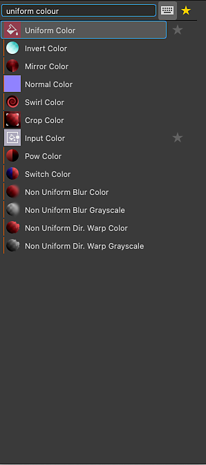
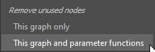

# 圖視圖

本頁介紹 Substance 3D Designer 的圖形檢視底座。

圖視圖是 Substance 3D Designer[&#128279;](https://www.adobe.com/tw/products/substance3d-designer.html) 的主要視窗，你可以在這裡撰寫和編輯圖表。圖視圖有兩個主要區域：頂部的工具列，提供快速存取特定功能，以及節點放置的實際圖區。

圖形檢視適用於所有圖形類型，但在 Substance 圖[&#128279;](../../compositing-graphs/substance-compositing-graphs.md)、[函數圖](../../function-graphs/function-graphs.md)與 [FX-Map 圖](../../function-graphs/fxmaps/fxmaps.md)之間略有差異，主要在工具列區域。

## 視窗導航

該圖可透過以下操作來導航：

* <b>平移：</b> 雙鍵 / Ctrl+RMB
* <b>縮放：</b> 滑鼠滾輪 / Alt + RMB

使用觸控板（僅限 macOS）

* <b>Pan： </b>兩指滑動
* <b>縮放：</b> 雙指捏合/兩指滑動同時按住指令鍵

>[!NOTE]
>
> 放大方向
> 
> 每種縮放方法會被另一方法反轉：
> 
> * 滑鼠滾輪向上 *拉近圖表* 視圖
> * Alt+RMB 並向上 *拖曳會把* 圖形視圖推開
> 
> 縮放方向可以在偏好設定[&#128279;](../../interface/preferences-window/preferences-window.md)中反轉。

你可以 <b>用 F 鍵專注於</b> 選取的節點，或如果沒有選取，則專注於整個圖表。

導航也可以透過使用<b>導航圖釘</b>和 F2 鍵來進行，詳見[&#128279;](../../interface/the-graph-view/graph-items/graph-items.md)下方[圖表項目](#graph-items)。

## 移動物體

在物件（例如節點或圖項目）上點擊 LMB，然後長按並拖曳游標即可 <b>在圖中移動節點</b> 。 若選取多個物件，所有選取物件與游標下方的物件一同移動。

如果游標 <b>在移動物件時觸及圖視圖的邊界</b> ，視圖會朝游標方向平移。 注意，隨著游標離邊界越遠，盤子速度越快。\
這同樣適用於跨越圖形檢視邊界繪製選取框。

預設情況下，物件在移動時會 <b>被吸附到格子</b> 上。 移動物件時按住 Ctrl（Windows）或 ⌘ （macOS）鍵可以關閉那個吸附功能。

## 圖表項目

有幾個輔助物件可用來協助組織和導航圖表，特別是當圖逐漸發展成複雜的節點網絡時，閱讀起來可能很有挑戰性：

<b>點節點</b> 讓你能重新路由和合併連接，也可以用作 <b>隱藏長連接或難以管理連接的入口</b> ;

<b>Frames</b> 幫助你將節點分組，並以明顯的標題和顏色標示;

<b>註解讓你</b> 能追蹤節點或節點群組的用途，並做出其他有用的註解;

<b>導航圖釘</b> 讓玩家能快速跳轉到圖表中的興趣點。

>[!NOTE]
>
> 更多資訊請參閱 [本文件的圖表項目](../../interface/the-graph-view/graph-items/graph-items.md) 區塊。

## 圖形上下文選單

在圖表中空格點選 RMB 時，會出現一個情境選單，並可包含以下選項：

<b>新增節點：</b> 打開節點選單以在圖表中新增節點;

<b>新增註解：</b> 新增一個無子級 [的註解](../../interface/the-graph-view/graph-items/graph-items.md) 圖物件;

<b>新增框架：</b>新增框架[&#128279;](../../interface/the-graph-view/graph-items/graph-items.md)圖形物件;

<b>新增 pin：</b> 新增 [Pin](../../interface/the-graph-view/graph-items/graph-items.md) 圖形物件;

<b>新增點數節點：</b> 新增一個 [點](../../interface/the-graph-view/graph-items/graph-items.md) 數節點;

<b>在 3D 視圖中檢視輸出：</b>透過匹配使用情況，將所有圖形輸出指派給 3D 視圖[&#128279;](../../interface/3d-view/3d-view.md)中的材料，詳見[下方「與 3D 視圖](#interacting-with-the-3d-view)互動」;

<b>在 3D 視圖中重置與檢視輸出：</b>在 3D 視圖[&#128279;](../../interface/3d-view/3d-view.md)中重置材料，並透過匹配使用方式將所有圖形輸出指派給該材質，詳見[下方「與 3D 視圖](#interacting-with-the-3d-view)互動」;

<b>以 2D 視圖檢視輸出：</b>在 2D 視圖[&#128279;](../../interface/2d-view/2d-view.md)中顯示圖表的其中一個輸出，詳見[下方與 2D 視圖](#interacting-with-the-2d-view)互動;

<b>計算節點縮圖：</b> 觸發計算圖中所有節點的結果——這些節點將儲存在 [影像快取](../../interface/preferences-window/preferences-window.md) 中——並使用它們的第一個輸出作為縮圖;

<b>清除節點縮圖：</b> 清除 [包含圖中所有節點結果的影像快取](../../interface/preferences-window/preferences-window.md) ，進而清除該節點的縮圖;

<b>Save package：</b> 儲存包含此圖的套件;

<b>貼上：</b> 將目前複製在剪貼簿中的節點，包括它們的上游連接，貼到游標的位置。 若游標不在圖形檢視視窗中，節點會置於視窗中心。

<b>無連結貼上：</b> 將目前複製在剪貼簿中的節點（不含上游連接）貼到游標位置。 若游標不在圖形檢視視窗中，節點會置於視窗中心。

<b>全部選取：</b> 選取圖中的所有節點;

<b>先前的釘腳：</b> 導覽到圖中前一個 [釘腳](../../interface/the-graph-view/graph-items/graph-items.md) 物件;

<b>下一個圖釘：</b> 導航到圖中下一個 [圖釘](../../interface/the-graph-view/graph-items/graph-items.md) 物件;

<b>複製選取：</b> 將選取的節點、連線及參數值複製到剪貼簿;

<b>刪除選擇：</b> 刪除所選節點;

<b>刪除並重新連結：</b> 刪除所選節點，並以從其上游節點直接連接下游節點（如可能）取代;

<b>重複選取：</b> 在同一圖中，將選取的節點（包括上游連線）複製到游標所在的位置。 若游標不在圖形檢視視窗中，節點會置於視窗中心。

<b>重複選取但不連結：</b> 在同一圖中，將選取的節點（不含上游連接）複製到游標所在的位置。 若游標不在圖形檢視視窗中，節點會置於視窗中心。

<b>選擇上游節點：</b> 選擇所選節點上游的所有節點;

<b>選擇下游節點：</b> 選擇所選節點下游的所有節點;

<b>交換連結\*：</b> 交換所選輸入與輸出連接器之間的連接;

<b>停用節點/選擇：</b> 停用所選節點，使其不影響串流結果，詳見 <b>下方「停用節點</b> 」。

<b>\*：</b> 僅在選擇包含兩個連結，或三個節點且其中兩個節點連接到同一第三個節點的輸入時可用。

## 節點工作

圖主要是節點的載體，節點能接收、生成和修改資料，然後輸出為圖的結果。 使用節點包含以下概念與動作。

### 建立與管理節點

節點可以五種方式放置於圖中，無論圖類型為何：

* 點擊或拖曳節點工具列上的圖示（見下文）。 只有 [原子節點](../../compositing-graphs/nodes-reference-for-com/atomic-nodes/atomic-nodes.md) 才能這樣放置。
* 右鍵點擊圖表的一個空白區域，然後選擇 <b>新增節點</b>。 只有 [原子節點](../../compositing-graphs/nodes-reference-for-com/atomic-nodes/atomic-nodes.md) 才能這樣放置。
* 從圖書館檢視拖曳縮圖到圖表檢視。 此方法適用於[所有類型的節點，包括節點實例](../../compositing-graphs/nodes-reference-for-com/node-library/node-library.md)。
* 按 <b>空白鍵</b> 進入 <b>節點選單</b>。 詳見下方。
* 使用映射到節點的鍵盤快捷鍵。 映射是在偏好設定視窗[&#128279;](../../interface/preferences-window/preferences-window.md)中進行。

如果在選擇另一個節點時放置了節點，Designer 會嘗試自動將新節點連接到舊節點。\
這種自動連線總是會將新節點置於舊節點 *之後* 。

移除節點有兩種方式，取決於你希望如何處理遺失連結：

* 選擇節點並按下刪除，或右鍵點擊選擇 <b>刪除選取</b>。 這會破壞所有現有連線，可能導致功能故障。
* 選擇節點並按退格鍵，或右鍵點擊選擇 <b>刪除並重新連結</b>。 此方法嘗試盡可能保留連結，防止功能故障。

<table>
<tr style="border: 0;">
<td width="100.00%" style="border: 0;" valign="top">

### 節點選單

在圖視圖中按 <b>空白鍵</b> 會顯示節點選單。

這個選單透過搜尋介面提供存取函式庫[&#128279;](../../interface/the-library/the-library.md)中所有節點，並讓你喜愛的節點出現在清單頂端。

您可以使用方向鍵瀏覽搜尋結果。 清單會 *循環*，使用第一個項目的「向上」箭頭鍵會跳到最後一個項目。

搜尋是 *模糊的*，意思是它對搜尋詞中的細微差異很寬容。 例如，「顏色」對「顏色」、「正規化」與「正規化」等等。

如果在圖表中選取單一&#x200B;**&#x200B;節點，或是拖曳節點連接器產生節點選單，搜尋結果會自動&#x200B;*依輸出類型篩選*。\
例如，只有具有 [灰階類型的主要輸入](../../compositing-graphs/inheritance-compositing/inheritance-in-substance-compositing-graphs.md) 的節點才會被列出為灰階類型的輸出。

</td>
<td width="33.33%" style="border: 0;" valign="top">

</td>
</tr>
</table>

### 選擇節點

你可以選擇一個或多個節點來複製、刪除、在圖表上移動它們等等。

要選擇 *單一* 節點，將游標放在該節點並點擊 LMB。

要選擇 *多個* 節點，有多種方法可供選擇：

* <b>一個一個：</b> 按住 Ctrl，然後點選節點的 LMB。 未被選取的節點會 *加入* 選擇，而被選取的節點則從 *選取中移除* ;
* <b>選取框：</b> 在圖表的空格點選 LMB， *長按後拖* 曳游標繪製選取框。 釋放左鍵時會選擇至少部分包含&#x200B;*在盒子中的節點*;
* <b>上游：</b>在節點上點擊 RMB 並選擇「<b>選擇上游節點」</b>選項：選擇該節點及所有與該節點&#x200B;**&#x200B;輸入相連的串流節點;
* <b>下游：</b> 在節點上點擊 RMB，選擇 <b>「選擇下游節點」</b> 選項：選擇該節點及所有連接該節點 *輸出* 的串流節點。

### 節點上下文選單

點擊節點上的右鍵時，會出現一個情境選單，並可能包含以下選項：

<b>以 2D 視圖檢視輸出：</b>在 2D 視圖[&#128279;](../../interface/2d-view/2d-view.md)中顯示節點的其中一個輸出，詳見[下方與 2D 視圖](#interacting-with-the-2d-view)互動;

<b>3D 視圖</b>中的檢視：透過匹配使用情況，將所有節點的輸出指派給 3D 視圖[&#128279;](../../interface/3d-view/3d-view.md)中的材料，詳見[下方「與 3D 視圖](#interacting-with-the-3d-view)互動」;

<b>重置並以 3D 視圖檢視：</b>在 3D 視圖[&#128279;](../../interface/3d-view/3d-view.md)中重置材質，並透過匹配使用量將節點所有輸出指派給該材質，詳見[下方「與 3D 視圖](#interacting-with-the-3d-view)互動」;

<b>以 3D 視圖查看輸出\*：</b>透過匹配使用情況，將特定節點輸出指派給 3D 視圖[&#128279;](../../interface/3d-view/3d-view.md)中的材料;

<b>新增註解：</b> 建立註 [解](../../interface/the-graph-view/graph-items/graph-items.md) 圖物件並將其父節點設定;

<b>新增框架：</b>建立框架[&#128279;](../../interface/the-graph-view/graph-items/graph-items.md)圖形物件並將其擬合到所選節點;

<b>將資訊複製到剪貼簿：</b> 將節點的唯一識別碼（UID）複製到剪貼簿;

<b>參數外露：</b> 顯示 [該節點的「暴露節點參數](../../compositing-graphs/manage-parameters/exposing-a-parameter/exposing-a-parameter.md) 對話框」;

<b>Create\*：</b> 為每個節點的輸入和/或輸出建立輸入和/或輸出節點;

<b>Open reference\*：</b>將該節點[&#128279;](../../compositing-graphs/creating-compositing-gra/graph-instances-sub-gra/graph-instances-sub-graphs.md)所參考的圖載入為獨立的圖視圖分頁;

<b>在上下文中開啟參考\*\*：</b>將該節點[&#128279;](../../compositing-graphs/creating-compositing-gra/graph-instances-sub-gra/graph-instances-sub-graphs.md)在當前圖上下文中所參考的圖載入，作為現有圖視圖分頁中的麵包屑;

<b>從選取建立圖：</b> 將選取的節點複製到新圖中;

<b>複製選取：</b> 將選取的節點、連線及參數值複製到剪貼簿;

<b>刪除選擇：</b> 刪除所選節點;

<b>刪除並重新連結：</b> 刪除所選節點，並以從其上游節點直接連接下游節點（如可能）取代;

<b>重複選擇：</b> 在同一圖中重複選取的節點及其上游連線;

<b>重複選取但不連結：</b> 重複選取同一圖中所選節點，但不包含其上游連線;

<b>選擇上游節點：</b> 選擇所選節點上游的所有節點;

<b>選擇下游節點：</b> 選擇所選節點下游的所有節點;

<b>交換連結\*\*\*：</b> 交換所選輸入與輸出連接器之間的連接;

<b>停用節點/選擇：</b> 停用該節點或所選節點，使其不影響串流結果，詳見 <b>下方「停用節點</b> 」。

<b>\*</b>：僅適用於 [圖實例](../../compositing-graphs/creating-compositing-gra/graph-instances-sub-gra/graph-instances-sub-graphs.md) 節點。\
<b>\*\*：</b>僅適用於[圖實例](../../compositing-graphs/creating-compositing-gra/graph-instances-sub-gra/graph-instances-sub-graphs.md)節點，且在<b>偏好設定[&#128279;](../../interface/preferences-window/preferences-window.md)中勾選啟用上下文編輯</b>選項時。\
<b>\*\*\*</b> ：僅在選擇包含兩個連結，或三個節點且其中兩個節點連接到同一第三個節點的輸入時使用。

>[!IMPORTANT]
>
> 如果&#x200B;*游標*&#x200B;放在節點&#x200B;*上點擊 RMB*，這些情境選單選項會針對該&#x200B;*節點，*&#x200B;無論圖表中&#x200B;*是否選取*&#x200B;其他節點。
> 
> 因此，為了獲得穩定可預測的結果，建議總是將游標放在你想用情境選單動作鎖定的節點上。

### 連接節點

節點 A 的 *輸出連接器* 可以連接到另一個節點 B 的 *輸入連接器*，這樣 B 就會使用 A 的資料輸出來執行計算。

>[!NOTE]
>
> 節點上的所有連接器 *不* 一定都必須連接。 保持連接器裸露會導致以下情況：
> 
> * 對於 *輸入* 連接器：節點會退回到該輸入的預設值設定;
> * 對於 *輸出* 連接器：計算圖時資料會被忽略並丟棄。

你可以<b>在每個連接器上點擊 LMB，*順序不*&#x200B;限，建立</b>新連結。\
此外，若在選擇節點 A 時建立節點 B，則 *節點 A 的第一個輸出* 會自動連接到 *節點 B 的主要輸入* 。

可對 *現有* 連結執行以下操作：

<b>刪除：</b>點擊連結的左鍵並按下&#x200B;*刪除*<b></b>鍵，或用 Alt 點擊任何有連結的連結來刪除連結。Alt 點擊會刪除該連線上的所有連結;

<b>複製：</b> 按住 Ctrl，點擊連接器上的 LMB，然後拖曳游標來複製連結。 點擊另一個連接器的左鍵（LMB）即可連接連結;

<b>移動：</b> 連結可透過按住 Shift 鍵、點擊連接器的左鍵並拖曳游標來從一個連接器移動到另一個連接器。 點擊另一個連接器的 LMB 鍵即可連接連結。

### 停用節點

>[!NOTE]
>
> 這只適用於 [物質圖](../../compositing-graphs/substance-compositing-graphs.md)。

節點可以被停用，使其 *在圖中不影響* ，但不需要斷開或刪除。

被停用的節點具有以下行為：

* 它們以   <b>殘障</b> 徽章&#x200B;*、*&#x200B;虛線&#x200B;*輪廓及內部*&#x200B;重道* 連結取代縮圖顯示;
* 節點會以主要 *輸入*&#x200B;輸出接收到的資料;
* 停用節點可以串 *連* 起來;
* 它們的性質與連結 *不會被修改*;
* 他們的停用狀態會被 *儲存* 並持續存在於多個會話中;
* 發佈到 SBSAR 時，所產生的檔案會 *考慮* 節點的停用狀態——也就是說，你看到的就是你得到的。

你可以透過 <b>Shift+D</b> 鍵擊落，或在圖表中右鍵點擊，在情境選單中選擇 <b>「停用節點/停用選擇</b> 項目」來停用一個或一組已選取的節點。

>[!IMPORTANT]
>
> 只有符合以下條件的節點才能被停用：
> 
> * 節點至少 *有一個輸入*
> * 節點只有 *一個輸出*
> * *主要輸入與輸出的類型*&#x200B;必須&#x200B;*相符*——即灰階對灰階，顏色對顏色
> * 所有被選中的節點必須具有 *相同的狀態* ——也就是說，所有節點都必須啟用，啟用規則相同

{width="512px"}

## 與2D視圖互動

>[!NOTE]
>
> 這只適用於 [物質圖](../../compositing-graphs/substance-compositing-graphs.md)。

若要在 2D 視圖[&#128279;](../../interface/2d-view/2d-view.md)中顯示節點輸出，請雙擊節點上的 LMB，或點擊該節點的 RMB，然後在情境選單中選擇「[以 2D 視圖](#interacting-with-the-2d-view)檢視輸出」的選項。如果節點有多個輸出，請在子選單中選擇想要的輸出。

你可以在2D視圖中顯示任何圖形輸出，方法是點擊圖形視圖[&#128279;](https://substance3d.adobe.com/)中空白區域的右鍵，並在情境選單中選擇[「2D視圖](#interacting-with-the-2d-view)中檢視輸出」。如果圖有多個輸出，請在子選單中選擇想要的輸出。

## 與 3D 視圖互動

>[!NOTE]
>
> 這只適用於 [物質圖](../../compositing-graphs/substance-compositing-graphs.md)。

要在 3D 視圖[&#128279;](../../interface/3d-view/3d-view.md)中套用節點輸出，請點擊節點上的 RMB，並在情境選單中選擇「<b>在 3D 視圖</b>中檢視」選項。如果節點有多個輸出，請在子選單中選擇想要的輸出。 然後選擇目前在 3D 視圖中使用的著色器的目標通道。

（*[僅限* Substance 圖](../../compositing-graphs/substance-compositing-graphs.md)）你可以在 3D 視圖中點擊空白區域的 RMB，然後在情境選單中選擇<b>「在 3D 視圖</b>中檢視輸出」選項來套用所有圖形輸出。確保圖中有一個或多個 [輸出](../../compositing-graphs/nodes-reference-for-com/atomic-nodes/output/output.md) 節點，且 [設定正確](../../compositing-graphs/nodes-reference-for-com/atomic-nodes/output/output.md)。

## 工具列

>[!NOTE]
>
> 完整清單僅適用於 [物質圖表](../../compositing-graphs/substance-compositing-graphs.md)。 其他圖類型則有 *有限的* 這類選項。

### 圖形工具

主工具列可在每種圖形類型中找到，提供通用功能，以及切換其他工具列的可視性。 你可以找到以下功能：

  <b>焦點選擇</b> （F）\
聚焦於選擇，或是整個場景（如果選擇為空）。

  <b>重置縮放</b> （Z）\
將目前的縮放等級恢復到預設狀態，並將視圖置中於圖表中央。 可以是放大或縮小。

  <b>匯出圖視圖\
</b>以 1：1 解析度匯出完整圖表作為影像。 分享整個圖表的截圖很有用。

  <b>節點資訊\
</b>*- 顯示連接器名稱：* 切換節點上每個連接器的名稱顯示。\
*- 顯示節點徽章：* 切換所有節點的節點徽章。\
*- 顯示節點大小：* 切換節點解析度顯示（[僅限 Substance 圖表](../../compositing-graphs/substance-compositing-graphs.md) ）。\
*- 顯示時序：* 切換每個節點毫秒時序的顯示（[僅限 Substance 圖表](../../compositing-graphs/substance-compositing-graphs.md) ）。\
*- 縮小時限制文字縮放：*&#x200B;將圖表項目[&#128279;](../../interface/the-graph-view/graph-items/graph-items.md)的文字保持在超過縮放閾值的恆定螢幕大小，縮小時文字清晰可見。

<b> 節點搜尋</b> 器（Ctrl+F）\
啟用工具尋找圖表中的節點、暴露參數及其他變數。 詳情請見 [專屬頁面](../../interface/the-graph-view/node-finder/node-finder.md)。

  <b>高光流\
</b>選取目前選擇節點之前或之後連接的任何節點。 它適合追蹤複雜的節點路徑。

  <b>節點調色盤\
</b>顯示或隱藏節點工具列，請見下方。

  <b>矩形連結\
</b>在節點間切換圓形或矩形連結。 FX-Maps 不提供 [。](../../compositing-graphs/nodes-reference-for-com/atomic-nodes/fx-map/fx-map.md)

  <b>節點對齊工具\
</b>讓工具能夠排列圖中選取的節點。 詳情請見 [專屬頁面](../../interface/the-graph-view/node-alignment-tools/node-alignment-tools.md)。

僅在物質圖表[&#128279;](../../compositing-graphs/substance-compositing-graphs.md)上：

  <b>父體大小\
</b>切換父解析度控制設定的顯示，詳見下方。

  <b>連結建立模式</b> （1、2、3）\
可選擇標準（1）、材料（2）及緊湊材料（3）連結建立模式，分別或批次連結節點連接器。 詳情請見 [專屬頁面](../../interface/the-graph-view/link-creation-modes/link-creation-modes.md)。

  <b>時序控制\
</b>讓你重置所有節點和時間點。

  <b>工具\
</b>*- 清潔：* 移除所有未連接 [輸出](../../compositing-graphs/nodes-reference-for-com/atomic-nodes/output/output.md) 節點的串流節點。\
*- 匯出輸出：* 開啟 [點陣圖匯出介面](../../compositing-graphs/exporting-bitmaps/exporting-bitmaps.md)。\
*- 重新匯出輸出：* 再次執行先前的匯出操作。\
*- PSD 匯出器：* 開啟 [PSD 匯出器](../../compositing-graphs/exporting-psd-files/exporting-psd-files.md) 介面。

  <b>節點影像快取\
</b>切換節點影像快取切換的顯示，詳見下文。

 移除未使用的節點\
</b>顯示移除圖表中未使用節點的選項，詳見下文。

### 節點調色盤

節點工具列會依圖類型而異：

 
<b>[實體圖](../../compositing-graphs/substance-compositing-graphs.md)：參見[原子節點](../../compositing-graphs/nodes-reference-for-com/atomic-nodes/atomic-nodes.md)與[圖項目](../../interface/the-graph-view/graph-items/graph-items.md)</b>。

 
<b>[實體函數圖](../../function-graphs/function-graphs.md)：</b> 請參見 [圖題](../../interface/the-graph-view/graph-items/graph-items.md)。

 
<b>[FX-Map 圖表](../../compositing-graphs/nodes-reference-for-com/atomic-nodes/fx-map/fx-map.md)：</b> 請參見 [圖表項目。](../../interface/the-graph-view/graph-items/graph-items.md)

### 父體大小

此工具列僅在 [Substance 圖](../../compositing-graphs/substance-compositing-graphs.md)中提供，並設定[圖父&#x200B;*圖*&#x200B;的輸出大小](../../compositing-graphs/output-size/output-size.md)，若使用&#x200B;*相對於父[*&#x200B;繼承法](../../compositing-graphs/inheritance-compositing/inheritance-in-substance-compositing-graphs.md)，則會影響圖的輸出大小。

水平與垂直大小預設連結，但非正方形材質可解除 *連結* 。 數值也可以重設為預設值 256 x 256。

### 節點影像快取

此功能切換了在計算 [Substance 圖](../../compositing-graphs/substance-compositing-graphs.md)節點時的快取使用。

當節點被計算時，其輸出影像會儲存在記憶體中——即快取——以便在該節點未受變更影響時，在重新計算圖時可 *重複使用* 。 這表示只有圖中實際變化的部分會被重新計算。

此快取的記憶體儲存限制可在偏好設定的一般</b>區塊[中<b>，於記憶體</b>區塊中更改<b>。](../../interface/preferences-window/preferences-window.md)

啟用此選項大幅提升圖形計算的整體響應速度，但代價是 Designer 記憶體使用量大幅增加。

### 移除未使用的節點

當你在圖表中迭代並嘗試各種方法時，有些對最終結果毫無影響的節點可能會被遺漏。 這不僅增加了雜亂，也造成浪費計算，因為所有節點都在圖渲染的第一階段就被評估。

移除未使用節點</b>工具會刪除所有不&#x200B;*屬於串流的節點*，而串流最終&#x200B;*以輸出*&#x200B;節點結束。唯一的例外是 *輸入* 節點，因為刪除這些節點會改變 [參考此圖的實例節點](../../compositing-graphs/creating-compositing-gra/graph-instances-sub-gra/graph-instances-sub-graphs.md) 介面。

第一個選項是將清潔功能專門應用於 *目前* 的圖表。

如果目前的圖是 [Substance 圖](../../compositing-graphs/substance-compositing-graphs.md)，則會啟用第二個選項，讓你能 *將所有節點參數函數* 納入清潔過程。 這表示如果控制節點參數值的 [函式圖](../../function-graphs/function-graphs.md) 有未使用的節點，該圖也會依照相同規則進行清理。

清理完成後，會顯示一個報告對話框。 你可以在 <b>控制台</b>找到更多細節，日誌標 `GraphCleaner`註為 。 這些日誌會包含每個圖和參數函數被移除的節點數。

清理可以一次性在所有受影響的圖表中&#x200B;**&#x200B;復原。
