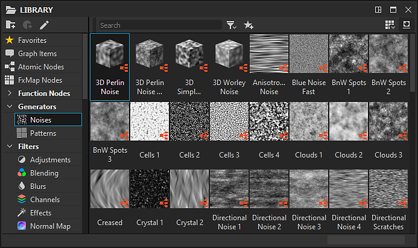
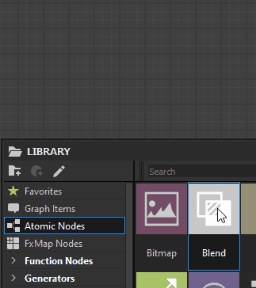
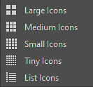

# 圖書館

本頁介紹 **Substance 3D Designer 的函式庫** 面板、其版面設計，以及提供搜尋和篩選內容的工具。

## 概觀

圖書館面板是一個分割視圖&#x200B;*的資源管理器*，你可以在這裡找到並收集所有&#x200B;*需要在圖表中處理的資產*。</b> <b>

它會&#x200B;*監控硬碟或網路上的資料夾*，這些資料夾會被加入[專案設定](../../interface/preferences-window/project-settings/project-settings.md)中的「圖書館監控路徑[&#128279;](https://docs.substance3d.com/display/SDDOC/Project+Settings#ProjectSettings-proj-libraryLibrary)」清單。這些資料夾中發生的任何變更——新增、移除及更新內容——都會 *帶* 入 <b>圖書館</b>。

>[!WARNING]
>
> **關於自訂內容**
> 
> 雖然你的自訂資源會被加入 **圖書館**，但由於現有分類的篩選規則，可能看不到。 我們建議你自行建立篩選器，並以資料夾組織，確保在專案進行時能可靠找到你的內容。\
> 更多資訊請參閱 [文件中的「管理自訂內容與篩選器](./managing-custom-content/managing-custom-content-and-filters.md) 」章節。

圖書館&#x200B;**&#x200B;**&#x200B;可監控所有支援[的資產 資源](../../resources/resources.md)：

* 來自 [物質套件](../../getting-started/overview/overview.md) （SBS）與 [物質檔案](../../getting-started/overview/overview.md) （SBSAR）的圖表
* [點陣圖影像](../../resources/bitmap-resource/bitmap-resource.md)
* [向量影像](../../resources/vector-graphics-svg-res/vector-graphics-svg-resource.md)
* [函數圖](../../function-graphs/function-graphs.md)
* [AxF 檔案](../../resources/axf-appearance-exchange/axf-appearance-exchange-format.md)
* [字體](../../resources/font-resource/font-resource.md)
* [3D 場景](../../resources/3d-scene-resource/3d-scene-resource.md)

面板分為兩大部分：

* 左側的  **分類** 區
* **右側的內容**&#x200B;區塊

## 類別

位於圖書館</b>面板左側<b>的<b>分類</b>區塊，包含所有資產&#x200B;*類別*（即資料夾）和&#x200B;*篩選*&#x200B;器，呈現樹狀視圖。\
您可以點擊此樹狀圖中的任何項目，以顯示其內容以及所有子項目&#x200B;*的內容*。

### 類別

預設分類和篩選器包含所有隨 Designer 出貨的素材。 這些內容無法被編輯或移除。\
預設類別包括：

* 收藏：收集你標記為「收藏」的所有資產
* [圖項目](../../interface/the-graph-view/graph-items/graph-items.md)：列出用於組織圖的特殊物件
* [原子節點](../../compositing-graphs/nodes-reference-for-com/atomic-nodes/atomic-nodes.md)：列出 Substance 圖的 [原子節點](../../compositing-graphs/substance-compositing-graphs.md)
* [FX-Map 節點](../../function-graphs/fxmaps/fxmaps.md)：包含由 FX-Map[&#128279;](../../compositing-graphs/nodes-reference-for-com/atomic-nodes/fx-map/fx-map.md) 節點計算的圖形專屬節點
* [功能節點](../../function-graphs/nodes-reference-for-fun/atomic-function-nodes/atomic-function-nodes.md)：列出函數圖的 [原子節點](../../function-graphs/function-graphs.md)
* [紋理產生器](../../compositing-graphs/nodes-reference-for-com/node-library/texture-generators/texture-generators.md)：包含代表 [實體圖](../../compositing-graphs/substance-compositing-graphs.md) 的節點，能自主產生內容
* [過濾器](../../compositing-graphs/nodes-reference-for-com/node-library/filters/filters.md)：包含代表 [修改輸入的實體圖](../../compositing-graphs/substance-compositing-graphs.md) 節點
* [樣條與路徑工具](../../compositing-graphs/nodes-reference-for-com/node-library/spline-paths-tools/spline-paths-tools.md)：樣條[&#128279;](../../compositing-graphs/nodes-reference-for-com/node-library/spline-paths-tools/spline-tools/spline-tools.md)與[路徑](../../compositing-graphs/nodes-reference-for-com/node-library/spline-paths-tools/path-tools/path-tools.md)節點目錄
* [SDF 功能](../../function-graphs/nodes-reference-for-fun/function-node-library/function-node-library.md#sdf-functions)：包含用於 3D SDF 函式的創建節點，與 Shape splatter v2[&#128279;](../../compositing-graphs/nodes-reference-for-com/node-library/texture-generators/patterns/shape-splatter-v2/shape-splatter-v2.md) 及 [3D 檢視](../../compositing-graphs/nodes-reference-for-com/node-library/filters/effects/3d-viewer/3d-viewer.md)器節點搭配使用
* [函數](../../function-graphs/nodes-reference-for-fun/function-node-library/function-node-library.md)：包含代表 [函數圖的節點](../../function-graphs/the-function-graph/the-function-graph.md)
* [3D 視圖](../3d-view/3d-view.md)：提供與用於 3D 場景中基於影像光照的地圖相關的內容——例如 3D View[&#128279;](../../interface/3d-view/3d-view.md) 中的環境貼圖，以及用於製作環境貼圖的節點
* PBR 材質：可用作佔位符，用以測試其他節點、「配方」或自訂工作區設置的預製材料。 想了解撰寫資料，我們建議參考我們專門 [的](../../compositing-graphs/creating-compositing-gra/material-samples/material-samples.md)教材範例。
* [值](../../compositing-graphs/nodes-reference-for-com/node-library/values/constant.md)：用於在 Substance 圖中產生簡單值的節點。

## 內容

圖書館內容<b>以標示縮圖&#x200B;*形式呈現*。</b>這些縮圖會根據以下因素呈現不同的面向：

* [SBS 與 SBSAR](../../getting-started/overview/overview.md) 檔案中的 [Substance 圖](../../compositing-graphs/substance-compositing-graphs.md)以第一個&#x200B;*輸出*&#x200B;表示，若圖作者設定了自訂圖示，則以&#x200B;*圖示*&#x200B;表示[&#128279;](../../getting-started/overview/overview.md)
* [位圖](../../resources/bitmap-resource/bitmap-resource.md) 與 [向量圖形（SVG）](../../resources/vector-graphics-svg-res/vector-graphics-svg-resource.md) 則由 *點陣圖本身的微型渲染* 來表示
* [3D 網格](https://helpx.adobe.com/substance-3d/unlisted/documentation/sddoc/3d-mesh-resource-200574577.html)、 [功能圖](../../function-graphs/the-function-graph/the-function-graph.md)、 [字型](../../resources/font-resource/font-resource.md) 與 [AxF](../../resources/axf-appearance-exchange/axf-appearance-exchange-format.md) 檔案皆以 *每種類型的通用圖示* 表示

>[!WARNING]
>
> **如果有縮圖問題**
> 
> 我們建議的故障排除步驟，針對任何與函式庫縮圖相關的問題（圖片錯誤、渲染卡在刷新圖示上等） 是手動觸發 *縮圖刷新*。\
> 要做到這點，請使用&#x200B;**偏好設定視窗[&#128279;](../../interface/preferences-window/preferences-window.md)庫區塊中的[&#128279;](../../interface/preferences-window/preferences-window.md)「重建縮圖**」按鈕。

<table>
<tr style="border: 0;">
<td width="100.00%" style="border: 0;" valign="top">

### 使用圖書館的資產

要使用函式庫中的資產，將 *它拖曳* 到想要的位置。\
你可以在內容</b>區塊中按住 <b>Ctrl</b> 鍵並點擊項目，選擇&#x200B;*多個*&#x200B;項目<b>。在這種情況下，拖放操作會在整個選取&#x200B;*過程中將節點置入圖*&#x200B;中。

</td>
<td width="41.67%" style="border: 0;" valign="top">

</td>
</tr>
</table>

### 以名稱搜尋資產

位於內容</b>區左上角<b>的<b>搜尋</b>欄，讓你可以依名稱&#x200B;*搜尋*&#x200B;任何資產。以這種方式搜尋內容時，分類區的當前選擇<b></b>會被忽略，而是&#x200B;*搜尋整個圖書館</b>中<b>的內容*。\
你可以依圖表類型&#x200B;*篩選搜尋結果*，使用<b>搜尋</b><b>欄旁的「篩選...</b>」圖示。

>[!NOTE]
>
> 搜尋欄會考慮你尋找的資產名稱，也會 *包含該資產可能包含的標籤* ，或 *是它所屬的類別* 。\
> 例如，輸入「*Normal*」會列出所有可用來產生或修改法線貼圖的資產。 這是發掘新節點、進而產生新可能性的好方法！

<table>
<tr style="border: 0;">
<td width="100.00%" style="border: 0;" valign="top">

### 庫資產視覺化

透過<b>顯示模式</b>下拉按鈕，你可以選擇內容項目的顯示大小。

</td>
<td width="25.00%" style="border: 0;" valign="top">

</td>
</tr>
</table>

<table>
<tr style="border: 0;">
<td style="border: 0;" valign="top">

 **切換標籤**&#x200B;按鈕可以顯示或隱藏節點的標籤。

</td>
<td style="border: 0;" valign="top">

</td>
</tr>
</table>

<table>
<tr style="border: 0;">
<td style="border: 0;" valign="top">

將游標放在內容項目上時，若作者提供說明，短時間 *後會出現提示，顯示該項目的描述* 。\
*右鍵點擊* 該項目可顯示更多資訊，包括該項目來源檔案的路徑。

</td>
<td style="border: 0;" valign="top">

</td>
</tr>
</table>

>[!NOTE]
>
> 例如[&#128279;](../../compositing-graphs/creating-compositing-gra/graph-instances-sub-gra/graph-instances-sub-graphs.md)節點——即非原子節點，此路徑是一個&#x200B;*超連結*，會在系統的檔案瀏覽器中顯示檔案。\
> 原子節點使用特殊的別名路徑（例如， `graphatomic://`， ， `structure://`...） 該庫無法點擊，因為它指向內部函式庫。

<table>
<tr style="border: 0;">
<td style="border: 0;" valign="top">

### 我的最愛

你可以使用<b>「新增到最愛</b>」按鈕，將內容</b>區塊<b>中的任何項目加入你的<b>收藏</b>清單。這個按鈕還能讓你 *從這個清單中移除* 已經新增的內容。\
當內容加入此清單時，會在函式庫的「最愛</b>」類別中提供<b>，且在搜尋圖中節點時，若搜尋詞與該節點相符，該節點會顯示&#x200B;*在節點選單列表的最上方</b><b>*。<b></b>

</td>
<td style="border: 0;" valign="top">

</td>
</tr>
</table>
