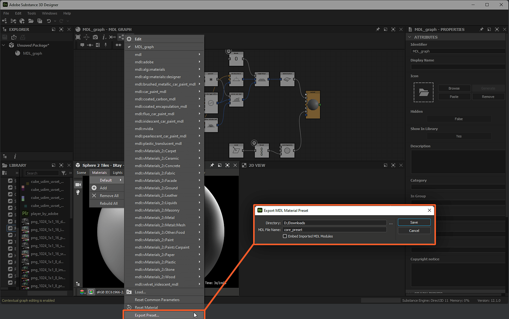

# 匯出 MDL 內容

本頁說明 Substance 3D Designer 中與 [MDL 圖表](../../mdl-graphs/mdl-graphs.md) 及材質相關的匯出流程。

## 概觀

一旦 MDL 材質在 Designer 中被撰寫，就必須匯出成能 *承載材質定義* 並由支援 MDL 的渲染器讀取的格式。 MDL 使用專有格式來傳輸稱為 MDL 模組的材質定義，這些模組以不同格式撰寫與封裝，且皆可從 Designer 內部匯出。

>[!NOTE]
>
> 所有這些格式都可以直接用 *文字編輯器* 開啟——有時還需要用檔案管理器解壓——以檢視它們所包含的物質定義。

## MDL 模組（\*.mdl）

這是材料定義的基本交換檔案格式。 MDL 模組定義如下：

* 材料的特性與行為
* 其暴露的參數與預設值
* 其註解（即元資料）：作者、標籤、分類等

匯出 MDL 模組是在套件&#x200B;*層級執行*。若要匯出特定套件的 MDL 模組，請點擊<b>檔案總管[&#128279;](../../interface/the-explorer-window/the-explorer-window.md)中的「匯出 MDL 模組</b>」按鈕，或在&#x200B;*套件的情境選單*&#x200B;中選擇相同的選項。選擇匯出後的 MDL 模組的目標位置與名稱，匯 <b>出報告</b> 對話框會顯示，並列出匯出過程中記錄的訊息清單。

匯出後的模組將包含&#x200B;*套件中由 [MDL 圖](../../mdl-graphs/mdl-graphs.md)定義的所有* MDL 材料定義。

>[!NOTE]
>
> 在 NVIDIA [MDL 規範](https://developer.download.nvidia.com/designworks/mdl-sdk/secure/MDL_spec_1.6.1_16Dec2019.pdf?__token__=exp=1776166178~hmac=38656bc9d8199764568d1fa0d4d945b90c57638ebd37b100a402bdc983e518ee&t=eyJscyI6ImdzZW8iLCJsc2QiOiJodHRwczovL3d3dy5nb29nbGUuY29tLyJ9)第 4 節和第 15 節中，了解更多關於 MDL 模組的資訊。

>[!NOTE]
>
> 遵循此範本的警告： `x appears to be invalid whereas it was expected to be an mdl::call` 是由於 MDL 資料在 MDL 圖中處理方式所致，且可 *安全忽略*。

*檔案總管中的「匯出 MDL 模組」路徑，以及產生的匯出報告對話框*

### MDL 預設 （\*.mdl）

MDL 模組預設與其基礎模組大致相同，唯一差別是預設值不同—— [詳情請見此](https://www.migenius.com/doc/realityserver/latest/resources/general/iray/api_reference/iray/html/classmi_1_1neuraylib_1_1IMdl__factory.html#details)處。

分配給場景材質 `my_material` 的 MDL 材質預設可從以下位置匯出：

* [在 Explorer](../../interface/the-explorer-window/the-explorer-window.md) 面板中，點擊 <b>MDL 圖表資源的 RMB</b>，並在情境選單中選擇<b>「匯出預設...</b>」選項
* [3D 檢視](../../interface/3d-view/3d-view.md)面板，使用<b>材質>我的_material >匯出預設......</b>選單選項

選單選項會 <b>開啟「匯出 MDL 材質預設</b> 」對話框，提供以下選項：

* <b>目錄</b>：MDL 模組匯出的目標位置
* <b>MDL 檔案名稱</b>：MDL 模組的名稱
* <b>嵌入匯入 MDL 模組</b>：若 MDL 模組依賴匯入模組——即有任何模組相依性，勾選此選項後，模組相依性會&#x200B;**&#x200B;嵌入匯出後的 MDL 模組中，使其實際上&#x200B;*自給自足*，但代價是檔案大小與動態繼承

匯出後的預設會使用材質 *參數在 3D 視圖中的當前值* 作為 *新的預設* 值。 這些值可以透過「材料>我的_material >編輯</b>」選項來修改<b>，該選項會在屬性面板中顯示材質的暴露參數。

>[!WARNING]
>
> 從 [Explorer](../../interface/the-explorer-window/the-explorer-window.md) 面板匯出 MDL 模組會產生一個包含&#x200B;*套件中 MDL 圖表定義的所有* MDL 材料的模組;而從 [3D 檢視](../../interface/3d-view/3d-view.md)匯出 MDL 預設時，MDL 模組只會&#x200B;*儲存*&#x200B;套用到&#x200B;*選單中所選材料*&#x200B;的 MDL 材料定義——在此`my_material`範例中。

*3D 視圖中的「匯出預設」路徑，以及產生的匯出 MDL 材質預設對話框*

## MDL 模組壓縮檔（\*.mdr）

MDL 模組壓縮檔將 MDL 模組（如上文）與材質&#x200B;*、readme 檔案等資源*&#x200B;合併成一個&#x200B;*可傳輸的檔案*。

匯出 MDL 模組封存是在套件&#x200B;*層級執行*。若要匯出特定套件的 MDL 模組歸檔，請在檔案總管中點擊「匯出 MDL 模組歸檔</b>」按鈕，或在&#x200B;*套件的情境選單*&#x200B;中選擇相同的選項。<b>[&#128279;](../../interface/the-explorer-window/the-explorer-window.md)選擇匯出後的 MDL 模組歸檔的目標位置與名稱，匯 <b>出報告</b> 對話框會顯示，並列出匯出過程中記錄的訊息清單。

匯出的模組檔案庫將包含 MDL 模組，*儲存套件中 MDL 圖[&#128279;](../../mdl-graphs/mdl-graphs.md)所定義的所有* MDL 材料定義。如果 [Substance 圖](../../compositing-graphs/substance-compositing-graphs.md) 被 [實例化成 MDL 圖](../../mdl-graphs/compositing-graphs-and/substance-compositing-graphs-and-mdl-materials.md) ，並連接到前往 [Root](../../mdl-graphs/main-mdl-graph-concepts/main-mdl-graph-concepts.md) 節點的串流，它輸出的紋理會被 *儲存到壓縮*&#x200B;檔中。

除了這些項目外，該檔案還包含一個 <b>MANIFEST</b> 檔案，描述 MDL 模組檔案的以下中繼資料：

* `mdl`：用於匯出模組壓縮檔的 MDL 版本——例如「1.5」
* `version`： 模組封存檔版本 – 例如，「1.0.0」
* `module`模組檔案庫名稱 – 例如，「：:p br\_metallic\_roughness\_basic」
* `exports.material`模組檔案庫中定義的材料名稱 – 例如：「：:p br\_metallic\_roughness\_basic：：MDL\_graph」

>[!NOTE]
>
> 想了解更多關於 MDL 檔案格式的資訊，請參閱 NVIDIA [MDL 規範](https://developer.download.nvidia.com/designworks/mdl-sdk/secure/MDL_spec_1.6.1_16Dec2019.pdf?__token__=exp=1776166178~hmac=38656bc9d8199764568d1fa0d4d945b90c57638ebd37b100a402bdc983e518ee&t=eyJscyI6ImdzZW8iLCJsc2QiOiJodHRwczovL3d3dy5nb29nbGUuY29tLyJ9)附錄 C。

*檔案總管中的「匯出 MDL 模組歸檔」路徑，以及產生的匯出報告對話框*

## MDL 封裝模組（\*.mdle）

具有暴露參數的 MDL 圖可匯出為封裝的 MDL 材料。 封裝 *將資料* 包裝成專用類別，使資料 *無法直接*&#x200B;存取。

例如，雖然你仍能修改暴露參數的值來控制材料行為，但 *這些參數的定義* 在封裝的 MDL 模組中無法 *取得* 。

匯出封裝的 MDL 模組可在 MDL 圖層級的檔案總管[&#128279;](../../interface/the-explorer-window/the-explorer-window.md)中，透過在 MDL 圖的情境選單中選擇<b>「匯出為 .mdle</b>」選項來完成。選擇匯出後的 MDL 封裝模組的目標位置與名稱，匯 <b>出報告</b> 對話框會顯示，並列出匯出過程中記錄的訊息清單。

*只有*&#x200B;所選 MDL 圖&#x200B;*的*&#x200B;材料定義會包含在匯出的封裝 MDL 模組中。

>[!NOTE]
>
> 請參考 NVIDIA [MDL 規範](https://developer.download.nvidia.com/designworks/mdl-sdk/secure/MDL_spec_1.6.1_16Dec2019.pdf?__token__=exp=1776166178~hmac=38656bc9d8199764568d1fa0d4d945b90c57638ebd37b100a402bdc983e518ee&t=eyJscyI6ImdzZW8iLCJsc2QiOiJodHRwczovL3d3dy5nb29nbGUuY29tLyJ9) [第 13.5 節及 MDL SDK API](https://raytracing-docs.nvidia.com/mdl/api/mi_neuray_example_mdle.html) 中關於封裝材質定義的更多資訊。

*檔案總管中的「匯出為 mdle」路徑，以及產生的匯出報告對話框*
