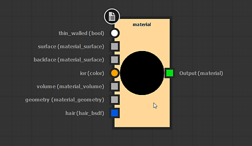

# 主要 MDL 圖形概念

本頁呈現 MDL 圖形[&#128279;](../../mdl-graphs/mdl-graphs.md)特有*的主要概念*，並需充分理解以充分利用 Substance 3D Designer 中的此圖形類型。

<table>
<tr style="border: 0;">
<td style="border: 0;" valign="top">

## 伊雷

MDL 材質使用針對物理基礎渲染解決方案的描述，而 Designer 中嵌入的 Iray[&#128279;](../../interface/3d-view/iray/iray.md) 渲染器支援此描述。因此，顯示 MDL 圖形&#x200B;*的結果需要在主動[的 3D 檢視](../../interface/3d-view/3d-view.md)面板中選擇 Iray 渲染器*。

</td>
<td style="border: 0;" valign="top">

</td>
</tr>
</table>

當建立或載入 MDL 圖形時，Designer 找到的第一個 [未釘選](../../interface/customizing-your-wor/customizing-your-workspace.md) 的 3D 視圖面板會 *自動切換* 到 [Iray](../../interface/3d-view/iray/iray.md) 渲染器。 若無 3D 視圖可用， *將建立新的* 3D 視圖面板，並切換至 Iray 渲染器以承載正在編輯的 MDL 材質渲染。

當 Iray 渲染器在 3D 檢視面板中選取時，該面板的材質選單可以讓你在可用的 MDL 材質之間切換，這些材質包括在 Explorer 面板載入的材質，以及 Designer MDL 函式庫中的材質。 想了解更多關於在 Iray 中使用 MDL 材料的資訊，請參閱 [本文件的 Iray](../../interface/3d-view/iray/iray.md) 章節。

## 根節點

MDL 圖的結果由 <b>根</b> 節點定義。 只要圖中的任何節點輸出資料類型為 <b>material</b>， *即 material 定義*，即可設定為根節點。 MDL 圖可能 *只有一個* 根節點。

一般而言，可設定為 Root 的節點可自&#x200B;*給自足*，因為它已包含可透過傳遞資料給輸入&#x200B;**&#x200B;來自訂的材料定義。\
舉例來說，如果你想處理類似玻璃的材質，可能會想用 Glass 材質定義作為 Root 節點作為起點，但這並非 *必須*。 許多材料節點被模板化，可利用豐富的 MDL 節點列表轉換成任何複雜材料。

根節點包含縮圖，預覽其目前輸出。

*MDL 圖中的根節點及其屬性在[屬性](../../interface/properties/properties.md)**面板中顯示*

## 連接器與類型

由於 MDL 圖中的資料型別遠多於 Designer 中的其他圖，你可能會看到節點連接器的獨特外觀。 以下列出了需要理解的重要概念。

連接器形狀

*連接器*&#x200B;的形狀顯示資料型&#x200B;*別是均勻*（圓形）還是&#x200B;*變化*&#x200B;型（方形）。

「均勻型態的變數只能設定為統一值。 變異型變數可以設定為變化值或均勻值。 變數所得值因此被視為變化。」 （資料來源：第6.3 [&#x200B; 節MDL 規範](https://raytracing-docs.nvidia.com/mdl/specification/MDL_spec_1.7.2_17Jan2022.pdf)）

以下是一些例子：

* <b>紋理</b>取樣會&#x200B;*隨著取樣像素的影響而變化*
* <b>Color</b> 值是&#x200B;*均勻*&#x200B;的，因為它無論上下文如何都能相等傳遞
* <b>BRDF</b> 會&#x200B;*隨著入射角的影響而變化*
* <b>Float</b> 或<b>布林</b>值是&#x200B;*均勻*&#x200B;的，因為它無論上下文如何都會相等傳遞

連接器顏色

*從輸出連接器或輸入連接器預期的資料類型*&#x200B;會以顏色編碼，並在用滑鼠懸停連接器時，以括號顯示在識別碼/標籤後方。

>[!WARNING]
>
> 僅可連接用於 *匹配資料型別* 的連接器。 顏色編碼的唯一目的是提升圖中傳遞資料類型及可連結連接器的可讀性。

{width="512px"}

*連接器的外觀依 I/O 值類型而異，括號內顯示於 I/O 識別碼後方*

## 過濾節點建立

你可以將資料庫 *</b> mdl</b> 類別<b>中任何可用的節點從資料庫</b>檢視拖*<b>曳到<b>圖表檢視</b>，或在沒有選取&#x200B;*時按<b>空白鍵</b>開啟<b>圖表檢視*&#x200B;中的節點選單</b>，來新增圖中可用的<b>節點。此時會顯示一個 *未過濾* 的節點清單。

然而，有些情況下，節點選單中的節點列表會被過濾，只顯示目標輸入或輸出資料型態相符的節點：

* 若在圖視圖中選取&#x200B;*節點*&#x200B;並<b>按下空白鍵</b>
* 如果點擊 <b>LMB</b>，並從&#x200B;*節點連接器中長按並*&#x200B;拖曳&#x200B;*連結*

你可能要注意 *篩選時所適用的規則* ：

* 如果節點選單顯示時，選擇<b>單一節點時按空白鍵</b>**，則列表中包含第一個輸入&#x200B;*的資料型態*&#x200B;與&#x200B;**&#x200B;所選節點輸出型別相符的節點
* 如果節點選單顯示時，<b>選擇多個&#x200B;*節點時按空白鍵</b>*，則列表中包含第一個輸入&#x200B;*的資料*&#x200B;型別與&#x200B;**&#x200B;最後一個選擇&#x200B;*節點輸出型別相符*&#x200B;的節點
* 如果透過從輸出&#x200B;*連接器拖出*&#x200B;連結&#x200B;*來顯示*&#x200B;節點選單，列表中包含第一個輸入&#x200B;*的資料*&#x200B;型態與所選&#x200B;*輸出*&#x200B;型態相符的節點
* 如果節點選單是透過&#x200B;*從輸入*&#x200B;連接器拖出&#x200B;*連結*&#x200B;來顯示，清單中包含輸出資料型態&#x200B;**&#x200B;與所選輸入&#x200B;*型態相符*&#x200B;的節點

*在 MDL 圖中建立過濾節點時，請注意清單會根據連接器的值類型而改變*

## 圖形輸入與貼圖

MDL 材質可從外部來源接收資料，例如明暗與紋理。 這是透過 <b>暴露節點</b>來實現的，與 [Substance 圖](../../compositing-graphs/substance-compositing-graphs.md) 中存在專用輸入節點不同。

資料可依其 *類型*&#x200B;傳遞至暴露節點。 例如，Float 值可以傳給暴露 <b>的浮點</b> 節點，紋理則可以傳給暴露 <b>的顏色</b> 節點（此時取樣像素的 RGBA 值會作為顏色值傳遞）。

*暴露節點會產生圖形輸入，既是原始值輸入，也是材質的取樣器*
