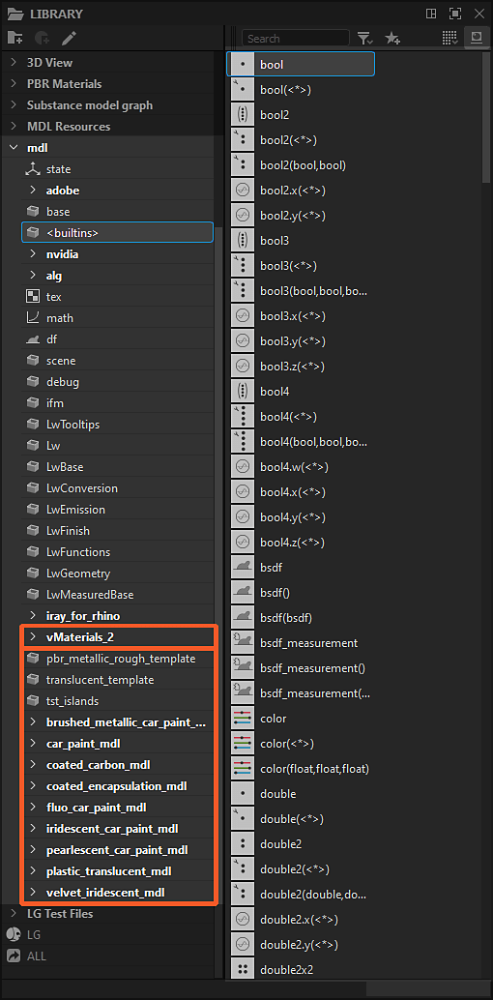

# MDL 圖書館

本頁呈現與 [Substance 3D Designer 所包含的 MDL 圖表](../../mdl-graphs/mdl-graphs.md) 及材料相關的內容庫。 同時也說明如何在函式庫[&#128279;](../../interface/the-library/the-library.md)中安裝和管理自訂內容。

## 圖書館中的 MDL 內容

可用於 MDL 圖的節點可在函式庫的 [mdl</b> 區段取得<b>](../../interface/the-library/the-library.md)。節點依據其定義的 MDL 模組排列成濾波器。\
若模組被儲存在子資料夾中，這個階層結構會在函式庫&#x200B;*中以*&#x200B;類別&#x200B;*形式鏡*&#x200B;像。

本節內容來自以下來源：

<table>
<tr style="border: 0;">
<td style="border: 0;" valign="top">

### 內建內容

Designer 包含 MDL 模組，包含撰寫 MDL 圖的基本建構模組，以及完整的材質定義，供使用者使用。

這些內容儲存在安裝目錄下方： `./resources/view3d/iray/`

### 自訂內容

除了內建內容外，你還可以將 *自己的* MDL 模組加入函式庫。

事實上，專案設定[&#128279;](../../interface/preferences-window/project-settings/project-settings.md)中 MDL</b> 區塊中目錄<b>中列出的任何 MDL 模組，會累積至該區&#x200B;**&#x200B;塊，跨專案檔案。

### NVIDIA vMaterials

如果安裝了 NVIDIA [的 vMaterials](https://developer.nvidia.com/vmaterials) 函式庫，它會&#x200B;*自動以獨立*&#x200B;類別&#x200B;*加入*&#x200B;函式庫。

</td>
<td style="border: 0;" valign="top">

*函式庫中的「mdl」區塊、vMaterials 函式庫及自訂內容皆有框架*

</td>
</tr>
</table>

## 3D 視圖中的 MDL 內容

當使用 Iray 渲染器時，函式庫中所有可用的 MDL 模組皆可在 3D 視圖[&#128279;](../../interface/3d-view/3d-view.md)中使用。

打開 <b>材質</b> 選單，並開啟 *場景材質的子選單* ，瀏覽可用的 MDL 模組。 這些名單包括：

* 內建內容
* 自訂內容
* NVIDIA [vMaterials](https://developer.nvidia.com/vmaterials)
* 載入的 [MDL 圖](../../mdl-graphs/mdl-graphs.md)

*3D 視圖中的 MDL 材質*
