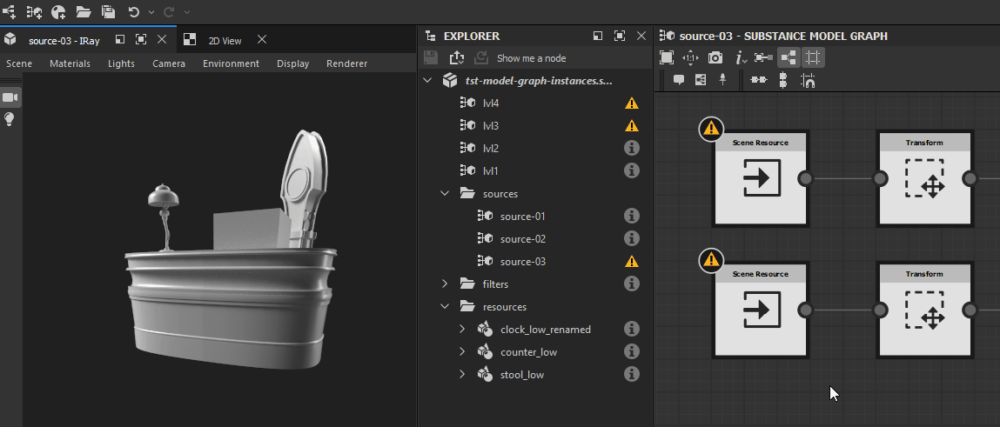
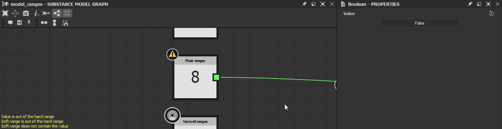

# MDL 圖表中的警告

本頁列出 Substance 3D Designer[&#128279;](https://www.adobe.com/tw/products/substance3d-designer.html) 中 MDL 圖表可能觸發的警告與錯誤訊息，並提供每種常見的故障排除步驟。

警告會顯示在總管[&#128279;](../../interface/the-explorer-window/the-explorer-window.md)面板中圖表資源[的警告圖示工具提示中，若圖已載入，則會在圖表視圖的](../../interface/the-graph-view/the-graph-view.md)左下角顯示。

>[!NOTE]
>
> 本節的插圖記錄於 <b>Substance 模型圖中</b>，該圖於 *Substance 3D Designer 13.0.0</b> 版本<b>中退役*。然而，它們同樣適用於 MDL 圖。

##  未定義輸出節點

圖中沒有定義輸出節點。

<b>!&lbrack;（勾選）（warnings-in-mdl-graphs.resources/check.svg）解決方案</b>

在圖表中選擇任何輸出與此函式預期類型相符的節點（如果有），然後點選 RMB，在情境選單中選擇 <b>「Set as root</b> 」選項，或雙擊該節點的 LMB。\
Substance 模型圖的輸出節點以 *橘色*&#x200B;呈現。

###  至少有一個輸入值被拒絕

參數所提供的值不會導致該節點的有效計算。

<b>!&lbrack;（勾選）（warnings-in-mdl-graphs.resources/check.svg）解決方案</b>

調整數值，使其符合目標參數。

###  無輸入值

節點未提供預期執行計算的輸入值。

<b>!&lbrack;（勾選）（warnings-in-mdl-graphs.resources/check.svg）解決方案</b>

當輸入連接器沒有提供資料時，某些節點參數無法退回到預設值。 這種情況在場景輸入中很常見。

將節點輸入連接到另一個節點的輸出連接器，且該連接器類型相同。

###  節點未被計算

提供給節點的資訊不完整或無效，因此節點無法執行計算。

<b>!&lbrack;（勾選）（warnings-in-mdl-graphs.resources/check.svg）解決方案</b>

往上游的圖中檢查是否有因問題觸發的警告，導致節點無法提供有效輸出。

###  參考資料中有一些警告

節點所參考的資源會有一個或多個警告。 以下是一些引用資源的節點：

* 圖實例節點參考一個圖
* 場景資源節點參考點陣圖 3D 場景資源

<b>!&lbrack;（勾選）（warnings-in-mdl-graphs.resources/check.svg）解決方案</b>

在 Explorer 面板中，找到該資源所提及的資源並排除該資源所引發的所有警告：

* 關於圖表，請參考本頁其他項目
* 其他資源請參考「依賴警告」頁面

###  未找到參考資源

節點所參考的資源並未在 Substance 3D 檔案（SBS）中儲存的路徑中找到。 以下是一些引用資源的節點：

* 圖實例節點參考一個圖
* 場景資源節點參考點陣圖 3D 場景資源

<b>!&lbrack;（勾選）（warnings-in-mdl-graphs.resources/check.svg）解決方案</b>

對於圖實例節點

檢查來源圖是否存在於套件 <b>中，該套件位於其 Package</b> 屬性所儲存路徑的位置。\
如果沒有，則刪除該實例節點，並以引用有效套件的實例節點取代。 或者，你也可以重新建立實例節點參考的套件和圖表，然後在檔案總管面板點擊&#x200B;*右鍵[*，並在情境選單中選擇<b>重新載入</b>主機](https://substance3d.adobe.com/documentation/display/DRAFTDESIGNER/.The+Explorer+window+vDraftVersion)套件。

場景資源節點

在總管[&#128279;](https://substance3d.adobe.com/documentation/display/DRAFTDESIGNER/.The+Explorer+window+vDraftVersion)面板中找到參考資源，並確認它們是否存在於檔案<b>路徑</b>屬性中儲存的位置。\
如果沒有，請在檔案總管中點擊 *資源項目的右鍵* ，並在情境選單中選擇 <b>「重新定位...」</b> 選項，為該資源設定新的有效目標檔案。

###  軟範圍不包含

暴露參數的預設值不會包含在該參數定義的軟範圍中。

<b>!&lbrack;（勾選）（warnings-in-mdl-graphs.resources/check.svg）解決方案</b>

調整預設值或軟範圍，讓前者包含在後者中。

>[!NOTE]
>
> 此警告無法透過使用者介面觸發，因為它 *會* 自動調整軟範圍以包含預設值。 只有直接&#x200B;*修改 Substance 3D 檔案（SBS*）中的資料才會觸發此警告。

###  軟範圍超出硬範圍

軟範圍與暴露參數並未完全包含在該參數定義的硬範圍中。

<b>!&lbrack;（勾選）（warnings-in-mdl-graphs.resources/check.svg）解決方案</b>

調整軟音域或硬音域，讓前者完全包含在後者中。

>[!NOTE]
>
> 此警告無法透過使用者介面觸發，因為它 *會* 自動調整軟範圍，使其完全包含在硬範圍中。 只有直接&#x200B;*修改 Substance 3D 檔案（SBS*）中的資料才會觸發此警告。

###  價值超出硬性範圍

暴露參數的預設值不包含在該參數定義的硬範圍中。

<b>!&lbrack;（勾選）（warnings-in-mdl-graphs.resources/check.svg）解決方案</b>

調整預設值或硬範圍，讓前者包含在後者中。

>[!NOTE]
>
> 此警告無法透過使用者介面觸發，因為它 *會* 自動調整預設值，使其納入硬範圍。 只有直接&#x200B;*修改 Substance 3D 檔案（SBS*）中的資料才會觸發此警告。

