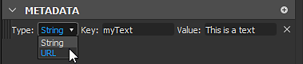

# 套件元資料

套件元資料是套件層級定義的文字（字串）值字典。 它在發佈時包含在 SBSAR 中，是一種通用的儲存裝置，旨在用於 Python 腳本。

## 透過 Designer 介面顯示與編輯元資料

如果你正在開發 Python 外掛，建議手動編輯元資料以供測試和除錯。 以下是你可以做到的方法：

1. 如果你在檔案總管中雙擊一個套件，它會打開該套件的屬性面板。

   
1. 這裡有一個專門的「元資料」區塊。 在你的案例中，它很可能是空的，就像上面那張捕捉圖一樣。

   你可以透過「加號」按鈕新增元資料。

   
1. 以下部分新增一項：

   
1. 有「Key」欄位和「Value」欄位。 兩者都可以設定成任何符合你需求的設定。 「Key」欄位必須在整個清單中擁有唯一的值。

   
1. 你也可以選擇物品的「類型」。 目前可以是「字串」或「URL」：

   
1. 這裡的「URL」指的是套件中包含的資源參考。 操作方法是選擇硬碟上的一個檔案，然後在檔案總管中拖放到該套件中。 它可以是一般資源，比如圖片，或任何其他檔案，比如文字檔。

   
1. 該檔案會作為新資源出現在套件中。

   現在回到套件屬性面板，建立新的元資料，給它一個正確的鍵，然後選擇「URL」作為類型。 然後選擇「...」 在「價值」欄位中按下按鈕，並選擇「來自資源」。 最後，選擇你剛才附上的檔案，並驗證：

   
1. 現在你可以看到資源的「URL」被儲存在「Value」欄位。

   你也可以使用項目右側的「X」按鈕刪除元資料：

   

>[!NOTE]
>
> 移除或重新排序元資料條目被禁用：該排序無意義，且在發佈套件時不會被維持。

## 已發佈 SBSAR 檔案中的元資料

在某些情況下，你可能想在匹配已發佈的 SBSAR 中取得你在套件中定義的元資料。 以下你可以閱讀元資料如何在檔案庫中轉換與儲存，以及如何正確利用這些資料。

中繼資料依照 JSON 格式儲存在名為 /assemblies/content/0000/metadata.json 的檔案中（路徑相對於 .sbsar 壓縮檔的根節點）。

一般（字串）元資料會以原樣儲存，例如「key」：「stringValue」，每行一個。 同樣地，各鍵的原始順序不會被保留，而是由實作定義。 千萬不要像一般 Python 口述那樣依賴流程的順序！

由於 URL 中繼資料的目標是讓使用者與外掛能在 .sbsar 壓縮檔中包含外部檔案，因此需進行特定的轉換：首先，與儲存 URL 匹配的資源檔案會被複製到壓縮檔中，並置於實作定義的位置（通常在編號子資料夾中，該子資料夾僅包含此檔案）。 重點是避免名稱衝突。） 檔案會保留原始名稱（此時資源名稱會被丟棄）。 接著，metadata.json中不再是原始網址，而是寫入檔案檔案相對於metadata.json的路徑。

如果我們匯出前一節建立的範例套件（至少建立一個帶有輸出的圖），我們會得到以下檔案內容：

```
myPackage.sbsar

|-- assemblies

        |-- content

            |-- 0000

                |-- New_Graph.sbsasm

                |-- New_Graph.xml

                |-- metadata.json

                |-- resources

                    |-- 0

                        |-- TEXT.txt
```


metadata.json內容如下：

```
{

    "myResource": "resources/0/TEXT.txt",

    "myText": "This is a text"

}
```


目前尚無專門工具可用來存取檔案中儲存的元資料與資源。 建議的方法是用你選擇的 LZMA 解碼器開啟壓縮檔，並用一般的 JSON 解析器解析metadata.json（如果鍵或值字串包含特殊字元，則會用 JSON 方式逃脫）。

>[!NOTE]
>
> 目前沒有資訊顯示每個元資料是單純字串還是網址，所以你必須知道每個你想讀取的金鑰代表什麼。
