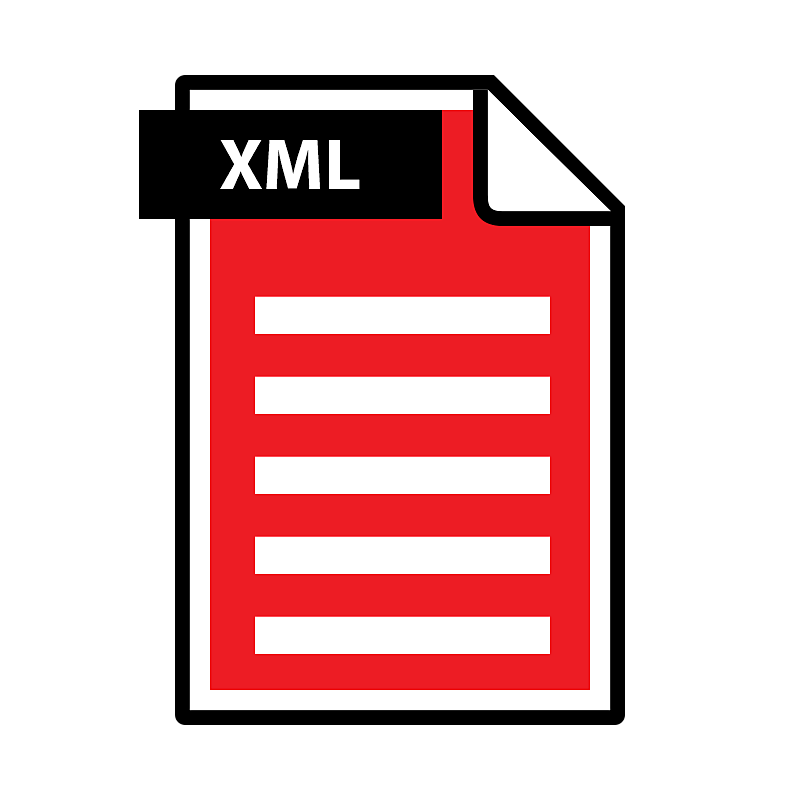

# 使用者偏好設定 - 自動化設定

<table>
<tr style="border: 0;">
<td width="100.00%" style="border: 0;" valign="top">

使用者_preferences.xml檔案包含專案設定[&#128279;](../../pipeline-and-project-con/project-configuration-fil/project-configuration-files-sbsprj.md)中定義外的所有使用者專屬設定。這些主要是針對特定的使用者介面和效能設定。

唯一需要更改的相關設定是包含專案清單的 [設定檔](../../pipeline-and-project-con/configuration-list-sbscfg/configuration-list-sbscfg.md) 。 這可以透過以下幾種方式來完成。

或者，你也可以完全跳過修改使用者偏好設定，透過 Designer 捷徑上的命令列參數，對 SBSCFG 檔案進行基於會話的覆寫，詳見下文。

</td>
<td width="25.00%" style="border: 0;" valign="top">



</td>
</tr>
</table>

## 永久或會話制

有兩種不同的方式可以設定 Designer 使用非 [預設的另一個設定檔](../../pipeline-and-project-con/configuration-list-sbscfg/configuration-list-sbscfg.md) ，各有優缺點：

* <b>永久修改使用者_preferences.xml\
  </b>此檔案位於 *~User\AppData\Local\Adobe\Adobe Substance 3D Designer* for Windows。 如果你修改它，Designer 會一直使用那裡定義的內容，不管你怎麼開始、什麼時候、在哪裡開始。 進行變更需要再次修改 XML，這兩者如下所述，且通常較為複雜。
* <b>暫時透過命令列參數設定會話\
  </b>Designer 可以在啟動時用命令列參數覆蓋該會話的 SBSCFG 檔案（詳情見下文）。 這是一個簡單且優雅的解決方案，讓切換專案的速度遠比修改 XML 快得多。 危險在於，如果你透過多個捷徑開啟（例如 Windows 的開始功能表和桌面），可能會有不同的結果，但並不完全明顯。 此外，它不像使用者那樣防篡改，因為使用者比使用者_preferences.xml更容易刪除、移動或修改捷徑。

## XML 修改

### 手動修改偏好設定

如果沒有自動設定，或是為了測試，可以手動到 <b>「編輯>偏好設定」......</b> 然後點擊左側的「<b>專案</b>」區塊。


紅色按鈕允許使用者選擇不同的[SBSCFG 檔案](../../pipeline-and-project-con/configuration-list-sbscfg/configuration-list-sbscfg.md)。

### 透過腳本修改

與專案與組態檔案相同，使用者偏好設定為結構化 XML，相關設定可明確辨識。 它不像 Notepad++ 或 Sublime Text 這類文字編輯器進行修改，而是非常適合透過外部腳本化設定進行修改。

腳本的優點是使用者只需點擊按鈕，且如果系統足夠複雜，可以輕鬆管理和更換專案，無需手動管理檔案和設定。

相關行如下：

```
  <configuration> 

   <configurationfile>file:///C:/Users/John/AppData/Local/Adobe/Adobe Substance 3D Designer/default_configuration.sbscfg</configurationfile> 

  </configuration>
```


#### Python 範例

以下是 Windows 上一個簡單的 Python 2.7 範例函式，可修改使用者_preferences.xml以取得另一個設定檔。 這會永久改變該數值，直到恢復原狀。 接著可以呼叫函式 SetConfigurationFile，並以自訂 sbscfg 檔案的路徑作為參數。

Python 腳本能提供強大且乾淨的程式碼，且能輕鬆整合到其他地方，但缺點是使用者要執行，必須編譯成可執行檔，或使用者需要部署 Python 版本。

```
import xml.etree.ElementTree as ElementTree 

import os 

 

##Example Python script for changing Substance 3D Designer user preference file## 

 

def SetConfigurationFile(p_ConfigPath): 

## Check is the path passed as parameter exists.

    if(os.path.isfile(p_ConfigPath)): 

## replace backslashes by forwardslahes to ensure consistency

        p_ConfigPath = p_ConfigPath.replace("\", "/") 

## get Local Appadata path from Environment variables, construct full path to user_preferences.xml and check if it exists.

        m_AppDataPath = os.environ.get('LOCALAPPDATA') 

        if m_AppDataPath != None: 

            m_UserPrefsPath = os.path.join(m_AppDataPath, str("Adobe/Adobe Substance 3D Designer/user_preferences.xml")) 

            if(os.path.isfile(m_UserPrefsPath)): 

## read XML elementtree from file, find correct element until we get to the actual line that defines the configurationfile path

                m_PrefsTree = ElementTree.parse(m_UserPrefsPath) 

                m_PrefsRoot = m_PrefsTree.getroot() 

                m_PrefsElement = m_PrefsRoot.find("preferences") 

                m_XMLError = True 

                if(m_PrefsElement != None): 

                    m_ConfigElement = m_PrefsElement.find("configuration") 

                    if(m_ConfigElement != None): 

                        m_ConfigFileElement = m_ConfigElement.find("configurationfile") 

                        if(m_ConfigFileElement != None): 

                            m_XMLError = False 

## Check if path is already set, to avoid double work

                            if m_ConfigFileElement.text.replace("file:///","") == p_ConfigPath: 

                                print "configurationfile is already set to desired path. Aborting." 

                                return True 

                            else: 

## construct correctly formatted path, insert into elementtree

                                m_ConfigPath = str("file:///" + p_ConfigPath) 

                                m_ConfigFileElement.text = m_ConfigPath 

 

## Write to file

                                m_XMLString = str("<?xml version="1.0" encoding="UTF-8"?>n") + ElementTree.tostring(m_PrefsRoot, 'utf-8') 

                                m_File = open(m_UserPrefsPath,'w') 

                                m_File.write(m_XMLString) 

                                m_File.close() 

                                print "configuration file path succesfully changed!" 

                                return True 

                if m_XMLError: 

## if this flag was not set to false, we can assume something was missing or went wrong when walking through the XML

                    print("Error: malformed content in user_preferences.xml!") 

                    return False 

            else: 

                print "Error: user_preferences.xml does not exist, try starting Substance 3D Designer first!" 

                return False 

        else: 

            print "Error: LocalAppData path returned None" 

            return False 

    else: 

        print "Error: Invalid Configuration File path!" 

        return False
```


## 命令列參數捷徑

用更簡單的方式，可以透過「--config-file」（可選）參數告訴 Designer 在啟動時使用特定的 SBSCFG。

### 手動設定

雖然不建議在生產環境中使用手動方法，但若已設定 SBSCFG 檔案，測試時可相當快速完成。

1. 新增空格
1. 在 Target 區塊的 designer 路徑後面加上 --config-file。
1. 再加一個空格
1. 請用引號&#x200B;*包裹你的路徑*，以避免路徑出現空格問題
1. 結果應該是這樣：

   *「C：\Program Files\Adobe\Adobe Substance 3D Designer\Adobe Substance 3D Designer.exe」 --config-file 「C：\Dev\Substance\custom\_configuration.sbscfg」*


