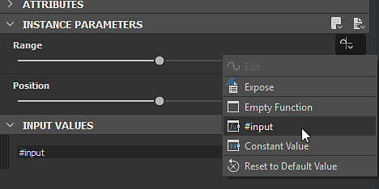

# 版本 2019.1 （9.1）

**Substance Designer 2019.1** 為 Substance Engine 帶來全新更新，進一步擴展功能及新增篩選器。

## 主要特色

### 新價值處理器節點

Substance Engine 現已進入第 7 版，並引入了合成圖中「Values」的新概念。 數值是數字而非紋理，因此可用於執行各種計算，這些運算可透過函數圖與合成圖在節點間共享。 值處理器節點可讀取輸入影像並計算單一輸出值。

價值處理器節點並非孤立，為了能夠跨圖傳輸資訊，已做出一些變更與新增：

* 輸出節點可以直接輸入一個值，而不一定是影像。

  
* 新增了一個 **名為「Input Value」的輸入節點** ，讓圖形可以查詢 Values。

  
* 節點現在在參數下方有一個新的類別，稱為「輸入值」，可用來為節點本身建立輸入值。\
  輸入值可透過「Get」節點在函式圖中被參考。

  

>[!NOTE]
>
> 與所有重大 Substance Engine 變更一樣，相容模式設定為先前版本（預設為新版本 6）。 這表示不相容的節點會在圖中顯示黃色邊框。 要關閉或隱藏黃色邊框，只需在主設定中將引擎版本改為最新版本（透過專案設定）：
> 
> 

### Optix 在 Baker 中的支援

Substance Designer 的最新更新引入了 DXR，允許在相容的 RTX 相容硬體上執行 GPU 光線追蹤。 我們現在新增了對 [Optix](https://developer.nvidia.com/optix) 的支援，讓它能在其他 Nvidia GPU 上進行光線追蹤，即使在 Linux 下也是如此。 使用 Optix 烘焙速度至少 **是一般 CPU 光線追蹤的** 5 倍。

以下是受此變動影響的烘焙師名單：

* 網格環境遮蔽
* 網格彎曲法線
* 網格厚度

如果你想停用其中一個後端，請前往主偏好設定（**編輯>偏好設定**）以及 Bakers 設定：

>[!NOTE]
>
> 要使用此功能，請務必 **更新到以下驅動程式** ：
> 
> * Nvidia 10XX 與 20XX 顯示卡： **驅動程式 430.39** （兼容 DXR 與 Optix）
> * Nvidia 9XX 及更舊版本： **d** **rivers 419.67 或 430.39** （驅動 425.31 在 Optix 上有問題）
> 
> 請注意，DXR 也 [支援 GeForce GTX 10xx GPU](https://www.nvidia.com/en-us/geforce/news/geforce-gtx-dxr-ray-tracing-available-now/) （驅動程式更新）。 DXR 也要求 Windows 必須是最新版本才能運作，詳情請參見 [此頁面](../../../best-practices/performance-optimization/performance-optimization-guidelines.md) 。

### 改善 OBJ 網格載入時間

在此版本中，我們改進 **了目標** 檔案讀取器，以縮短 3D 網格的載入時間。 載入時間最高可達三倍，尤其是對於沒有定義 UV 和法線的網格。

這項效能提升將同時影響 Baker 系列及 3D 視角。

### 改良版 Python 外掛系統

這次更新我們為腳本系統新增了許多新功能：

* **支援 Qt** ：允許建立符合應用程式其他部分風格的自訂使用者介面。 自訂介面也能更輕鬆地整合進這個新系統。 （Tkinter 現已停用。）
* **回調函數** ：現在可以註冊回調函數。 目前它只包含開啟和儲存檔案，以及建立 UI 元素。 未來還會加入更多回訪。
* **執行緒** ：外掛現在可以建立執行緒來進行背景處理或等待作業系統事件（例如網路連線）。

欲了解更多細節，請參閱 API 的變更日誌，該日誌可透過 **Substance Designer 中的 Python API 文件** 說明>選單存取。

### 新內容

我們也在預設函式庫中新增了幾個節點，其中部分現在已搭載新的 Value 處理器節點：

* **洪水填埋至索引**\
  為 Flood Fill 節點的形狀指派唯一的索引。\
  在下方範例中，像素處理器節點將值輸入與形狀匹配，並輸出遮罩。

  
* **非均勻方向曲速**\
  套用方向扭曲，從影像輸入取樣強度與角度。

  
* **多向曲速**\
  輸入影像會多次扭曲到不同方向。

  
* **高度突出**\
  產生給定高度的正交3D渲染圖。 攝影機視角可透過位置裝置控制。

  
* **最小值/最大值**\
  回傳輸入影像的最小與最大像素值。

  

>[!WARNING]
>
> 此版本不再支援 CentOS 6.x。 欲使用最新版本的Substance Designer，請升級至CentOS 7.x。

## 發行說明

### 2019.1.3

*（2019年8月19日發行）*

**修正：**

* [烘焙者]當烘焙輸出與偏斜貼圖的長寬比不匹配時，DXR 會當機
* [烘焙器]「Ambient Occlusion From Mesh」烘焙器在使用法線貼圖時，使用 Optix 或 DXR 輸出錯誤結果
* [烘焙者]「曲率」烘焙器在使用「每個頂點」設定時會輸出錯誤結果
* [Bakers]錯誤訊息會說明失敗的後端，而非錯誤原因
* [烘焙者]處理沒有高多邊形網格的細節貼圖烘焙器時會當機
* [Bakers]在啟用 DXR 時，偏斜圖似乎不會影響所有輸出
* [內容] mg\_leaks：參數名稱中有錯字
* [內容]「Shape」回傳烹飪警告
* [內容]Polygon 1 和 2 不支援隨機函數
* [內容]多邊形 1 和 2 的邊數可以少於三邊
* [內容]法線至高度 HQ 在非正方形中無法正常運作
* [參數]整數輸入參數：下拉選單不會顯示這些值

### 2019.1.2

*（2019年7月2日發行）*

**修正：**

* [3D 視圖] 啟用景深的 3D 視圖匯出看起來不正確
* [3D 視圖]使用 save render 時，PSD 影像的 Alpha 通道是錯誤的
* [3D 視圖]使用 Iray 的儲存渲染選項時，PNG 和 PSD 都壞了
* [3D 視圖] DDS 格式在儲存渲染時無法使用。
* [圖表]節點在特定方式結合右鍵與左鍵拖曳時會偏移
* [圖]修改函式實例不再更新節點結果
* [圖表]顯示空白鍵選單時當機
* [內容]形狀擠出：形狀沒有旋轉時的品質問題
* [內容]形狀投影（以及灰階）在沒有 H 和 V 平鋪時不會產生陰影
* [內容]材料作物普通發行
* [烘焙機]JSON 烘焙者的預設設定未正確載入
* [烘焙者]用 Optix 或 DXR 烘焙重度網格時會當機（現在可能會因為 VRAM 不足而失敗，但不會當機）
* [點陣圖編輯器]點陣繪製工具會在筆劃邊框中偏移筆劃並重新繪製
* [點陣圖編輯器]OSX 中點陣圖繪製工具失效
* [使用者介面]有些按鈕的選單幾乎無法觸及
* [使用者介面]拖放 Baker 實例時當機
* [SVG]嵌入的 SVG 編輯工具不可靠
* [參數]在 SBSAR 實例中套用布林參數的預設時會當機
* [網路]有時在 SSL 加密連線中發生錯誤時會當機

### 2019.1.1

*（2019年5月28日發行）*

**補充：**

* [Python整合]儲存並還原外掛管理器狀態
* [偏好設定][依賴關係]新增一個選項來決定依賴檔案路徑的儲存方式
* [內容]泛洪填充映射器：新增「Fit Shape BBox」選項

**修正：**

* [內容]泛洪填充映射器：「旋轉自動縮放」則產生相反效果
* [內容]「亮度\_offset\_map」輸入不被「泛光填充映射器顏色」使用。
* [內容]「洪水填充映射器灰階」節點產生階梯性雜訊
* [內容]無法刊登《Height Extrude》
* [參數]SBSAR 中嵌入的預設不會載入 Designer
* [烘焙師]烘焙師名字在烘焙師名單中未正確顯示
* [3D 視圖]「在 3D 視圖中檢視輸出」無法用於數值
* [爐子]修正錯誤參數類型時會當機
* [API]SDResource.setInputPropertyFromId 函式無法在 SDSBSCompGraph 輸入參數上運作
* [更新者] 有些 SB 在 2019 年無法更新
* [檔案總管]匯入特定.obj檔案時當機
* [PythonIntegration]在初始化 PYTHONPATH 時，Windows 上沒有正確跳脫的反斜線
* [UI] 麵包師中某些滑桿的值問題
* [Linux]Designer 無法在 CentOS 上執行 &lt; 7.6

### 2019.1

*（2019年5月9日發行）*

**補充：**

* [API]在 SDPackageMGR.loadUserPackage（） 方法中加入 &#39;updatePackages&#39; 參數，以控制載入時是否應套用更新器
* [API]新增斷開 SDConnection 的功能
* [API]新增 SDSBSARExporter 類別以發佈 SDPackage
* [API]新增 SDHistoryUtils 類別以管理不可執行的指令
* [API]在 Substance Compositing Graph（sbs：:compositing:：input\_grayscale）中新增灰階輸入節點定義
* [API]在 Substance Compositing Graph （sbs：:compositing:：input\_value） 中新增值輸入節點定義
* [API]Add SDProperty.isFunctionOnly（） 方法。
* [API]在 SDSBSCompNode 上新增自訂輸入參數的支援
* [API]在 SDPackageMGR.loadUserPackage（） 方法中加入 &#39;reloadIfModified&#39; 參數，以控制若修改套件是否被重新載入
* [API]Add SDPackageMgr.getPackages（） 方法。
* [API]新增從 SDModuleMgr 取得/新增/移除根路徑的功能
* [API]允許取得像素緩衝區的指標及 SDTexture 的音高
* [API]允許取得主視窗的指標
* [API]允許在主選單中建立自訂選單
* [API]允許在主視窗中建立自訂 DockWidgets
* [API]使用物件名稱在工具列中尋找選單
* [API]提供管理應用程式通知的系統
* [PythonIntegration]新增預設環境變數以尋找 Python 插件
* [PythonIntegration]將文字搜尋與替換加入 Python 編輯器
* [PythonIntegration]啟動時 Instanciate Python 外掛
* [PythonIntegration]請考慮 PYTHONPATH 環境變數
* [PythonIntegration]允許在圖形元件中建立工具列
* [Python整合]支援 Python 執行緒
* [PythonIntegration]新增外掛管理器（在「工具」選單中）
* [內容]法向量旋轉：新增可選影像輸入以驅動角度
* [內容]新最小/最大濾波器
* [內容]新的「Flood Fill to Index」篩選器
* [內容]全新「洪水填充映射器」濾波器
* [內容]全新 Atlas Splitter 濾波器
* [內容]改進三平面濾波器
* [內容]新型非均勻方向曲速濾鏡
* [內容]新多方向曲速
* [內容]新高度擠壓過濾器
* [引擎]Fxmap：全新「帶偏移的漸層」圖案
* [引擎]支援統一值處理（新值處理器節點）
* [3D 視角][Bakers]提升 OBJ 裝載機的性能
* [3D 視角]增加相機剪輯平面距離
* [偏好設定]新增烘焙師設定
* [圖]避免字串比較，加快失效速度
* [MDL] 支援 MDL 陣列
* [使用者介面]引擎選擇介面改進
* [IRay]升級至 IRay SDK 2018.1.4
* [相依性管理器]在重新定位資源時，請使用「最後路徑」
* [烹飪聲]在 SBSAR 中加入布林標籤的支援
* Integrate Qt 5.12.2

**修正：**

* [圖]當更改輸入名稱時，連接會斷裂
* [圖表]調整參數時會觸發過多的失效
* [圖表]「複製到剪貼簿」的動作如果我們對徽章點擊右鍵就無法執行
* [圖]使用 Alt 移動影格不會儲存在 .sbs 中
* [MDL] 色彩設定檔不會在 MDL 編輯器中自動更新
* [MDL] 匯出包含特定設定的模組時當機
* [MDL] 無法匯出包含 LightProfile 或 MBSDF 資源的 MDL 圖
* [使用者介面]捷徑不再顯示在右鍵選單中
* [使用者介面]重啟後浮動視窗可停靠
* [腳本操作]取消選項在 Python 編輯器中無法運作
* [腳本播放]存檔選單中的「全部是」選項無法運作
* [參數] 下拉選單在複製後無法正確顯示
* [探索器]資源重新定位應該預設會開啟最後一個重新定位的路徑
* [圖書館]當從一個版本切換到另一個版本時，圖書館的內容總是會被重建
* [函式庫]匯入的點陣圖在儲存時會失效
* [IRay]切空間計算不正確/法線映射錯誤
* [功能]從選取建立新圖時會當機或失敗
* [API] 屬性的預設值未定義
