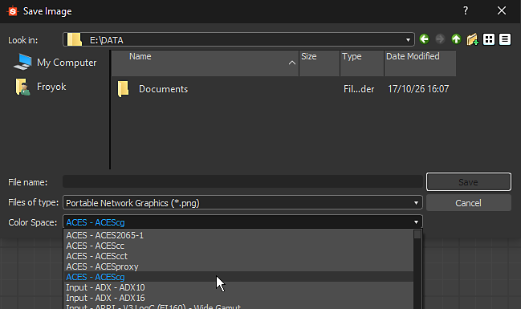

# 版本 2019.3 （9.3）

**Substance Designer 2019.3** 引入了色彩管理，支援 OpenColorIO，並改進了 baker 更新和新的 atlas 散佈節點。

發行日期： *2019年12月19日*

## 主要特色

### 色彩管理與 OpenColorIO 支援

Substance Designer 現在支援色彩管理，允許控制顏色的解讀與轉換方式。 此功能支援 [OpenColorIO，](https://opencolorio.org/)這是娛樂與視覺特效產業廣泛使用的色彩管理系統。

* **在主設定中設定色彩管理**\
  預設情況下，Substance Designer 會設為「舊版」模式，也就是不會載入任何特定設定，會繼續像以前一樣運作。 例如要切換到 OpenColorIO，只要先進入主要設定，然後在專案設定中設定並啟用即可。

  {width="600px"}
* **色彩管理有三種不同的應用方式**\
  應用程式的不同部分會獲得色彩管理，這些管理具有不同的意涵：

  * **2D 與 3D 視圖**\
    Real-time OpenGL 視窗和 Iray 都可以進行色彩管理。 這讓人們能在情境中預覽素材與材質。 色彩設定可透過專用下拉選單輕鬆切換。 也可以以線性伽瑪格式顯示視圖，無需色彩校正即可預覽。

    {width="400px"}

    {width="400px"}
  * **圖形輸入與輸出及點陣圖匯出**\
    在圖的入口與出口處讀寫點陣圖影像時，色彩管理可以調整影像並在適當條件下轉換成可行。 這可以在圖中對點陣圖的主要偏好設定中控制，並在匯出過程中的導出對話框中進行修改。 從 2D 檢視儲存影像也能提供選擇色彩空間的方式。

    {width="400px"}

    {width="505px"}

### Mesh Baker 的新曲率

Mesh Baker 的 Curvature 是從頭重新製作的。 現在它利用光線追蹤，允許 GPU 加速，同時也支援網格交叉。

更多資訊請參閱 [Grid](https://experienceleague.adobe.com/en/docs/substance-3d/bakers/bakers-settings/curvature-from-mesh) 曲率文件。

>[!NOTE]
>
> 先前 mesh baker 的 Curvature 現已被淘汰。 我們建議你切換到新版本。

### Mesh Baker 改良的環境遮蔽

Mesh 的環境遮蔽烘焙器現在新增了一個名為「Ground Plane」的新設定，模擬網格下方的平面以產生地面遮蔽。 這有助於產生靜態幾何或非有機物件更有趣的結果。 Ground Plane 預設位於網格邊界框的底部，但可以透過專用設定進一步推進。

更多資訊請參閱 [Mesh](https://experienceleague.adobe.com/en/docs/substance-3d/bakers/bakers-settings/ambient-occlusion-from-mesh) 環境遮蔽文件。

### 改良屬性與預設編輯器

屬性編輯器以及預設編輯器都有改進：

* **更快的預覽模式**\
  現在在編輯圖參數時切換到預覽模式的速度快很多，尤其是在有大量參數的圖上。 預覽模式現在是一個專用分頁，方便在參數編輯器與預覽間來回切換。
* **重新設計的預設編輯器**\
  Substance Designer 的預設管理方式現在更簡單快速：預設編輯器現在有專屬分頁，每個預設會列出它們影響的參數。
* **可見 If 現在考慮了 2D 轉換裝置**\
  當一個轉換 2D 裝置有 Visible If 條件時，它現在可以在 2D 視圖中隱藏，使其與參數相關。

### 新內容

在這個版本中，我們引入了新的 **Atlas Scatter** 節點。 此節點允許讀取圖譜影像（包含子影像的影像），並自動將其內容分離成個別組件，然後可隨機散布。 此節點可用於將樹枝和葉子放置在土壤地面材料上。 [Substance Source](https://source.substance3d.com/allassets?q=atlas) 現在包含許多 Atlas 材料，這些材料可以透過這個新節點分散。

>[!WARNING]
>
> 此版本不再支援 CentOS 6.x。\
> 在 CentOS 7.x 上，應用程式可能因某些相依性問題無法啟動，若要解決問題，請更新系統或複製 [安裝資料夾中的以下函式庫](https://centos.pkgs.org/7/centos-x86_64/freetype-2.8-12.el7.x86_64.rpm.html) 。

## 發行說明

### 2019.3.3

*（2020年2月14日發行）*

**補充：**

* [批次工具]用批次工具運送預設的 OCIO 設定檔

**修正：**

* [內容]Atlas 散布：在某些情況下使用隨機顏色/法線時會出現問題

### 2019.3.2

*（2020年2月4日發行）*

**補充：**

* [SBSRender]新增色彩管理支援

**修正：**

* [內容]線性 sRGB 對 ACEScg 節點：I/O 標籤錯誤
* [內容]ACEScg 對 sRGB 節點：輸出標籤錯誤
* [內容]全景燈節點：調整溫度範圍
* [圖表]在啟用「情境編輯」後調整巢狀圖時，效能會嚴重下降並凍結
* [圖表]在 FX-Map 中刪除多個節點時會當機
* [表演]設計師的創作過程在辭職後仍可能延續

### 2019.3.1

*（2020年1月27日發行）*

**修正：**

* [圖]在啟用「上下文編輯」時調整巢狀圖時，效能會嚴重下降並凍結
* [圖]無法在整數1調整中輸入 [0， 99] 的列舉值
* [圖表]當對應的影格被移位時，註解不會被移動
* [圖]自訂實例節點缺少輸入名稱
* [圖表]即使偏好設定中關閉對應選項，載入圖表時仍可渲染縮圖
* [2D 視圖]負 alpha 顯示檢查器，無論顯示選項如何
* [2D 視圖]從 32f 轉換到 8 位元的表面在高值時會失敗
* [2D 視角]上/左斜置與「Make Square」會在前向轉換矩陣中將某些座標設定為巨大的值
* [2D 視圖]所有網格物件的 UV 不會顯示在 UV 集合上，除了「0」之外
* [內容]斜角：斜角模式在平鋪遮罩上無法正常運作
* [內容]從泛光填充到漸層：斜率影像值未在形狀中間取樣
* [內容]功能;「Equality Boolean」被破壞
* [Bakers]在特定情況下，使用「Curvature From Mesh」baker 的自動色調映射時會出現瑕疵
* [烘焙師]在 DXR 烘焙時當機，且沒有選擇任何材料
* [烘焙師]啟用「資訊」時，2D 檢視中出現效能問題
* [引擎]在 SSE2 引擎上，當輸入值非常低且指數高時，「Pow」函數會輸出巨大值
* [引擎]使用高 jpg 壓縮點陣圖資源時會當機
* [引擎]值處理器在子圖中回傳錯誤$size值
* [參數]當選擇參數數量過多的實例節點時，會出現空彈出視窗
* [參數]整數值不會顯示在下拉選單的參數項目中
* [參數]轉換矩陣「編輯」按鈕在預覽模式下不可用
* [Cooker] ValueProcessor 中的 $size 在圖形實例中是錯誤的
* [Cooker]當值連結通過點節點到原子節點時，輸出大小是錯誤的
* [使用者介面]顯示所有項目的按鈕在 2D 檢視底部列中不可見
* [使用者介面]預覽選取的 RGB 值時，使用色彩管理時顯示錯誤數字
* [匯出] 16f RGBA 影像匯出為灰階
* [3D 視角]無法匯入多格的 OBJ
* [色彩管理]發布 SBSAR 時不考慮 OCIO 設定
* [色彩小工具]顏色滑桿範圍在特定情況下可以指數成長
* [文件]「paramValue」區段在 Sbs 格式參考中不完整
* [MDL] sbsar 實例中的 Color Widget 不正確
* [預設]在特定情況下更新預設時會當機
* [PSD]從近期版本的 Photoshop 載入 PSD 檔案時，FreeImage 錯誤
* [資源]當取消直接連結到圖形的位圖時會當機
* [SVG]使用向量工具時，SVG 節點不會自動更新

### 2019.3.0

*（2019年12月19日發行）*

**補充：**

* [一般]支援使用 OpenColorIO 設定檔進行色彩管理
* [預設]改善預設管理
* [預設]同步 2D 視圖小工具與預覽滑桿
* [預設]切換回預覽模式時還原預覽值
* [預設]編輯其他節點、資源或圖表時，請保持預覽模式開啟
* [預設]在三個預設分頁間切換時，復原操作順暢
* [預設]允許在預覽模式下將參數重設為 Graph 的預設值或預設值
* [預設]改善參數固定
* [預設]將圖表的所有預設匯入/匯出到檔案
* [烘焙師們]基於光線追蹤的新「網狀曲率」烘焙師
* [烘焙者]在「從網格 AO」烘焙器中新增地面平面選項
* [烘焙師]新增「依名稱匹配」選項，以忽略「AO from Mesh」烘焙器中的背面
* [內容]新阿特拉斯散佈節點
* [內容]新色彩空間轉換節點與函式（ACEScg）
* [內容]提升色彩/灰階版本節點的命名一致性
* [圖表]提升預設預覽模式中的效能
* [圖形]新增 $（色彩空間）巨集以匯出圖輸出選項
* [參數]當參數被設為隱形時，請在2D視圖中隱藏對應的裝置
* [參數]在暴露參數時，請勿將「圖輸入群組」作為前綴
* [參數]在圖參數中新增 VisibleIf 工具提示
* [AXF]將AXF SDK更新至v1.6

**修正：**

* [Linux]由於 Qt 平台載入失敗，Designer 無法在 CentOS 8 上啟動。
* [Linux]警告：Freetype 函式庫已從 SD 應用程式中移除：使用 CentOS 版本的使用者 &lt;= 7.5 has to install it manually.
* [AxF]匯入使用較新版本 AxF 建立的檔案時會當機
* [2DView] 由資源提供的刷子貼圖不會被套用
* [2DView] 修改實例圖輸入並調整位置時會當機
* [3DView] 取消「載入...」時當機 行動
* [3DView] 在 GLSLFX 著色器中為發射材質新增色彩空間選項
* [烘焙師]透過資源餵養的地圖在烘焙時被忽略
* [麵包師]「世界太空方向」選項被錯誤鎖定
* [位圖]帶有浮點數值的 EXR 點陣圖會以黑色影像呈現
* [內容]洪水填充至索引：特定情況下形狀偵測失敗
* [內容]裁切：當裁切節點解析度低於輸入時，取樣問題
* [一般]在產生函式庫時關閉 Designer 時會當機
* [圖]點陣節點不會反映對應位圖的壓縮
* [圖]在首次渲染後清除節點縮圖時，快取不會被清除
* [圖表]節點大小錯誤無效
* [圖表]在某些情況下，當我在更換像素處理器節點的輸入連線時會當機
* [MDL 圖]還原函式時呼叫預設值時的失敗
* [屬性]轉換矩陣參數中的「編輯」與「矩陣」按鈕令人困惑
