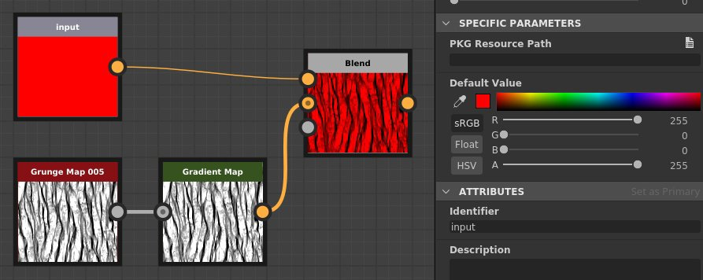
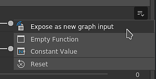

# 版本 2020.2（10.2）

**Substance Designer 2020.2** 帶來了新的 Substance Engine 更新、更優化的參數揭露工作流程、一些效能提升以及新增內容。

發行日期： *2020年10月12日*

## 主要特色

### 新引擎更新（版本 8）

在這個新版本中，Substance Engine 已進入第 8 版，帶來新功能與多項改進：

* **輸入影像的預設值**\
  圖中的影像輸入現在可以定義預設顏色，當沒有載入或連接該輸入時，便於回退到適當的值。

  {width="600px"}

* **新距離模式**\
  [距離節點](../../../compositing-graphs/nodes-reference-for-com/atomic-nodes/distance/distance.md) 現在有兩個新模式，改變了計算方式：

  * **歐幾里得** 模式（原始模式）：歐幾里得幾何中點間的直線距離。
  * **曼哈頓**：點與點之間的距離，但受限於格子上，類似於城市街區。
  * **切比雪夫**：在均勻大小的網格上，兩點差的最大距離。

  {width="600px"}

* **新的漸變插值**[&#x200B;漸變節點](../../../compositing-graphs/nodes-reference-for-com/atomic-nodes/gradient-map/gradient-map.md) 新增了 **平滑** 模式來插值鍵，能產生更自然的色彩過渡。 它是透過查看鄰居的鑰匙來運作的。 先前的插值模式&#x200B;**已改名為**&#x200B;平面切線&#x200B;**。**

  {width="600px"}

  

  還有一個額外的平 **滑** 模式參數，控制用於計算顏色混合曲線的切線長度。 值為 0 表示切線長度為 0，而值為 1 則表示切線長度為兩個鍵之間長度的一半。

  

* **改良曲線節點**[&#x200B;曲線節點](../../../compositing-graphs/nodes-reference-for-com/atomic-nodes/curve/curve.md) 現在可以直接輸出灰階影像。 這項改變讓可以定義曲線並直接輸出，而不必先輸入漸層貼圖。

  

### 改良曝光參數

曝光與編輯參數的工作流程也已改進，變得更為直接明瞭：

* **改進的選單動作**&#x200B;揭露與編輯暴露參數的動作被分離，以更明確。 新增的捷徑也被引入，讓它更輕鬆且快速地編輯暴露的參數。 例如，現在有一個專用按鈕用來編輯參數的功能，以及一個專用動作用來跳轉到暴露的圖參數。

  

  

* **直接從對話框**&#x200B;設定新參數 當暴露參數時，所有常規控制項如描述和預設值現在都可以從 **Expose Parameter** 對話框存取。 這使得設定與建立新的圖參數變得更簡單且快速，避免了在建立參數後立即進入圖參數檢視的麻煩。

  {width="600px"}

### Substance 圖表的圖示配置改良

在 Substance 圖表中設定縮圖現在有了改良的介面，變得簡單許多：

* **自動圖縮圖產生**\
  現在只需點擊圖示旁的「生成」按鈕，即可自動生成 Substance 圖表的預覽。 目前只支援使用 Metallic/Roughness PBR 工作流程作為輸出節點的圖形。 產生縮圖時，位移強度會根據定義的 Physical Size 值計算，否則預設為 0.1。

  {width="600px"}

* **新增按鈕後新增自訂縮圖**\
  我們新增了幾個按鈕，簡化自訂縮圖的設置：

  * **瀏覽**：開啟檔案對話框以載入圖片。 也可以點擊按鈕旁的資料夾圖示來操作。
  * **生成**：請參考上方的示範。
  * **貼上**：從剪貼簿載入一張圖片。
  * **移除**：移除目前分配給圖示的圖片。

  

### 性能提升

這次新版本中做了兩項新優化，以縮短迭代間隔：

* **圖計算效能提升**\
  輸出節點現在在請求時直接計算，而不必在過程中先計算中間節點（現在是第二步）。 這項改變讓即使在調整根節點時，也能更快預覽圖表的結果。 在下方的比較中，這種優化讓圖形在同一時間內能看到更多迭代（此處為4K解析度的材料）：

  

* **改良的 Bakers 膨脹與擴散產生**\
  產生烘焙材質的膨脹與擴散速度現在比先前版本快了四倍。 這樣可以縮短烘烤之間的等待時間。

  

### 新內容

這次版本新增了幾個節點，以及對現有節點的額外可能性：

* **[新的閾值濾鏡](../../../compositing-graphs/nodes-reference-for-com/node-library/filters/adjustments/threshold/threshold.md)**此節點允許根據灰階輸入快速隔離為影像的黑白遮罩。 這在實務上類似於現有的直方圖掃描濾波器，但日常使用更為方便。 想了解更多，請參考 [專門的文件頁面](../../../compositing-graphs/nodes-reference-for-com/node-library/filters/adjustments/threshold/threshold.md)。

  {width="650px"}

* **[新的截面濾鏡](../../../compositing-graphs/nodes-reference-for-com/node-library/filters/effects/cross-section/cross-section.md)**此節點允許將灰階輸入的形狀視覺化為剖面，使得使用此濾鏡作為除錯工具製作高度圖與形狀變得更簡單。 欲了解更多資訊，請參閱 [專門的文件頁面](../../../compositing-graphs/nodes-reference-for-com/node-library/filters/effects/cross-section/cross-section.md) 。

  {width="600px"}

  {width="600px"}

* **改良[版磁磚產生器](../../../compositing-graphs/nodes-reference-for-com/node-library/texture-generators/patterns/tile-generator/tile-generator.md)與**[**磁磚取樣器**](../../../compositing-graphs/nodes-reference-for-com/node-library/texture-generators/patterns/tile-sampler/tile-sampler.md)\
  這兩個節點現在擁有新參數，以擴展更多功能與使用：

  * **保持比例**：保留方塊的比例，當 X 軸和 Y 軸的數量不均時，不需要手動補償尺寸。
  * **絕對：**&#x200B;保持圖塊的寬度比例為最終圖片的預設百分比。
  * **像素**：定義以像素為單位的圖塊大小。

  更多細節請參閱 [專門的文件頁面](../../../compositing-graphs/nodes-reference-for-com/node-library/texture-generators/patterns/tile-generator/tile-generator.md)。

  

### 其他

**Iray** 已更新至 2020.1.0 版本，新增對 Nvidia 新 Ampere GPU 的支援（如 RTX 3080 與 RTX 3090）。

## 發行說明

### 2020.2.0

*（2020年10月12日發行）*

**補充：**

* [內容]新增「截面」節點
* [內容]在 functions.sbs 中新增「Cross product vec2」函式
* [內容]新增「Get Size」值節點
* [內容]在 functions.sbs 中新增「正交 vec2」函數
* [內容]向 functions.sbs 新增平均函數
* [內容]新增閾值過濾器
* [內容]色彩匹配：新增遮罩輸入以指定濾鏡的應用位置
* [內容]圖塊產生器/取樣器：新增控制圖案大小的選項
* [內容]更新 PBR 渲染節點，設定為影像輸入的預設值
* [參數]新增警告圖示以突出實例參數中的問題
* [參數]忽略包含函式參數的輸入/輸出的可見 If 語句
* [參數]改善群組關聯的使用者體驗
* [參數]重新設計以暴露單一參數的方式
* [參數]標示暴露的參數
* [參數]改進未使用參數的清理
* [引擎]曲線節點：新增輸出曲線貼圖的選項
* [引擎]輸入影像的預設值
* [引擎聲]距離節點：新增距離模式（曼哈頓與切比雪夫距離）
* [引擎]漸變節點：新增插值模式，讓顏色間的混合更自然
* [引擎]部分參數現在會因其他參數而變灰
* [UX]在 Color Picker 的十六進位欄位中接受 6 位數的 RGB 顏色
* [用戶體驗]避免在評論屬性被選中後立即顯示
* [UX]開始撰寫群組名稱時，請顯示相關群組
* [UX]重匯出圖輸出的捷徑
* [UX]讓所有下拉選單的文字欄位組合框看起來與一般組合框不同
* [圖形渲染]顯示節點的縮圖一個一個，而且不只是在所有節點都計算完之後
* [圖渲染]改善圖渲染時的抵消延遲
* [圖形渲染]提升渲染進度條的準確度
* [縮圖]自動縮圖（圖示）計算
* [縮圖]重新設計使用者體驗，為套件新增縮圖（圖示）
* [偏好設定]新用戶預設啟用 GPU 光線追蹤
* [偏好設定] 3DView / OpenGL / 品質：將樣本計數的滑桿換成更直覺的選項列表
* [烘焙師]提升後製效能
* [色彩管理]在偏好設定對話框中顯示目前的色彩空間。
* [Iray]當沒有相容的 GPU 時，會自動切換到 CPU 模式
* [效能]提升計算我們感興趣節點（現在先計算）的反應時間
* [Python API]新增方法addActionToExplorerToolbar 以新增圖示至檔案總管工具列
* [資源]升級至 FBX 2020.0.1
* [iRay]Iray 2020.1.0 更新
* [API]新增 Python 對色彩管理設定與屬性的存取權限

**修正：**

* [圖表]改變父圖塊大小或 UV 圖塊不會取消當前渲染
* [圖表]移動輸出連接後按 Alt+LMB 時會當機
* [圖表]在材料模式或緊湊材料模式下移動連接時會當機
* [圖形]輸入節點無法預覽點陣資源
* [圖表]節點相容性在實例中被破壞
* [圖]改變圖參數時，節點過多會失效
* [內容]「形狀擠出」輸出形狀在特定情況下會被翻轉：需要新版本，舊版本已棄用
* [內容]使用自訂色彩變化於色彩匹配節點時出現錯誤結果
* [內容]Atlas Scatter 中的 X/y 體積比值則相反
* [內容]形狀濺射中的X/Y比例比例，效果相反
* [3D 視圖]從套件載入場景資源後，復原操作當機
* [3D 視圖]若路徑有特殊字元的別名，則 SBSSCN 中不會儲存自訂環境
* [3D 視角]在材質設定中切換 Normal Format 會導致狀態翻轉
* [使用者介面]「設定為主」按鈕文字從顯示區溢出
* [使用者介面]在視窗模式下，主視窗位置無法正確還原
* [使用者介面]當視窗全螢幕或拖曳靠近螢幕邊緣時，狀態列文字會偏移
* [Iray]在切換渲染器時會閃退並顯示「無效標籤」訊息
* [Iray]非不透明表面上的可見面
* [預設]在某些 Substance Source 圖中套用預設時會當機
* [預設] 在 SBS 實例復原後顯示錯誤名稱
* [渲染]在預覽模式調整參數時呈現錯誤
* [烘焙師]刷新多個烘焙地圖會導致警告阻擋部分烘焙
* [Cooker]在 SBS 實例中調整 SBSAR 節點時，實例輸出為 0
* [Explorer]使用「在 Substance Player 儲存並開啟」時，自訂別名不會被傳遞
* [漸層編輯器]絕對色彩選擇不會影響所有選定的鍵
