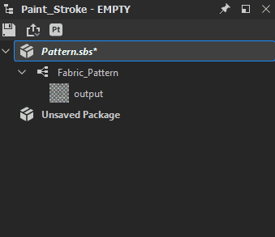

# 版本 11.2

**Substance 3D Designer 11.2** 名稱略有變更，並已連接至 Adobe Creative Cloud。 它帶來了 Substance Model Graphs、Send To 功能、多個基於光線追蹤的節點以及一些介面變更。

上映日期： *2021年6月23日*

## 主要特色

### 新物質模型圖

全新圖形類型 Substance 模型圖可使用，讓你能利用熟悉的節點介面建立程序式 3D 模型。

<table>
<tr style="border: 0;">
<td style="border: 0;" valign="top">

{width="300px"}

</td>
<td style="border: 0;" valign="top">

{width="300px"}

</td>
</tr>
</table>

務必深入探索全新專屬的文件區，了解更多資訊。

這是首次發行，請預期會有一些限制。

### 傳送功能

Adobe 版本的 Substance 3D Designer 新增了「送出」功能，讓你能快速將資產傳送到其他 Substance 3D 應用程式。 不再需要以 SBSAR 發佈並載入單一檔案，「送出」只需一鍵解決這個問題。

>[!NOTE]
>
> Steam 版本的 Substance 3D Designer 不具備「送出」功能。

### 新的光線追蹤節點

沒有新節點，任何 Designer 版本都不完整。 在 PBR Render 驚人的優勢基礎上，這次釋出新增了 5 個基於光線追蹤的節點。

<table>
<tr style="border: 0;">
<td style="border: 0;" valign="top">

{width="300px"}

</td>
<td style="border: 0;" valign="top">

{width="300px"}

</td>
</tr>
</table>

RTAO 在 AO 的清晰且正確的 AO 表現上，比之前的 HBAO 節點還要好。

{width="300px"}

焦散會根據高度圖產生物理正確的光線追蹤焦散，例如簡單的 Perlin 雜訊。 非常適合為即時焦散製作逼真的動畫翻頁書貼圖。

{width="300px"}

RT Shadow 能精確地標示光線追蹤陰影，操作簡單。

<table>
<tr style="border: 0;">
<td style="border: 0;" valign="top">

{width="200px"}

</td>
<td style="border: 0;" valign="top">

{width="200px"}

</td>
<td style="border: 0;" valign="top">

{width="200px"}

</td>
</tr>
</table>

RT Irradiance 是新節點中最先進的。 它會根據材質、高度貼圖、環境貼圖和/或發射貼圖來做光線追蹤照度。

{width="600px"}

這表示你可以用預先烘焙的光照來做貼圖，比如風格化專案，或者用光線追蹤光線反射在高度圖上。

{width="300px"}

最後是彎曲的正常節點。 與一般法線轉換相比，這個節點使用 AO 來修改你的法線貼圖，使其使用該 AO 資訊。 在你需要用 mesh baker 來製作效果之前，這個節點會在貼圖空間裡幫你完成。

### Adobe 標準材質著色器

為了統一應用程式間的材質與渲染，3D 視圖中新的預設著色器是 Adobe Standard 材質著色器。 乍看之下，它和舊版的 PBR Metallic Roughness 著色器沒什麼不同（反正它就是基於它），但它支援更多奇異的通道，讓你可以預覽這些通道，而不需要外部渲染器。

### 使用者介面變更

介面做了些小修改，但最明顯的是改進>新套件選單，讓你選擇圖形類型，以及主工具列上的按鈕，提供新圖形類型的捷徑，並傳送到其他應用程式。

## 教學課程

以下是我們介紹新功能的影片教學：

## 發行說明

### 11.2.0

*（2021年6月23日發行）*

**補充：**

* [品牌形象]Substance Designer 變成 Adobe Substance 3D Designer
* [Substance Models]新的 Substance 模型圖形以建立程序化 3D 模型
* [內容]新增 HDR 環境貼圖
* [內容]新彎曲正常節點
* [內容]全新 RT 環境遮蔽節點
* [內容]新 RT Caustics 節點
* [內容]新 RT Caustics 節點
* [內容]新RT輻射節點
* [內容]新 RT Shadows 節點
* [互通性]將資產傳送給 Painter，啟動 Painter 並在函式庫中新增或更新你的資產（需要 Adobe Substance 3D 計畫）
* [互通性]將資產傳送到 Sampler，啟動 Sampler 並在函式庫中新增或更新你的資產（需要 Adobe Substance 3D 計畫）
* [互通性]在 Adobe Bridge 瀏覽你的資產，會在資產所在位置啟動 Bridge（需要 Adobe Substance 3D 計畫）
* [ASM]Substance Graph 與 MDL Graph 中支援新的 Adobe 標準材質（ASM）
* [ASM]新增 ASM 範本
* [ASM]新增 OpenGL 著色器以支援 ASM
* [ASM]將 ASM 著色器設為預設著色器
* [一般]將所有暫存檔案彙整到使用者設定的暫存目錄
* [一般]新增「另存副本為新」指令
* [一般]更新檔案選單
* [一般]更新說明選單
* [發佈]新的發佈視窗
* [發佈]在偏好設定中新增選項，避免在發布 SBSAR 檔案時儲存 SBS 檔案
* [屬性]在圖屬性中新增圖型欄位
* [性質]以更相關的方式重新排序圖的性質
* [品牌標示]新關於窗戶
* [品牌形象]更新應用程式風格
* [GLSLFX]給技巧加上標籤
* [GLSLFX]新增設定 GLSLFX 著色器標籤的功能
* [元資料]新增套件資源中的元資料
* [元資料]允許圖形、輸入、輸出及資源的元資料編輯
* [本地化]德文、法文及簡體中文的新翻譯
* [用戶體驗]在滑鼠拖曳時，3D 視角的反向放大
* [AXF]更新至版本 1.8.0
* [日誌]將已安裝的外掛加入日誌
* [視覺特效]新增 ACES 1.2 OpenColorIO 設定
* [Python API]新增查詢設定中指定的 tmp dir 的方法
* [Python API]在 SDPackage 中新增 isModified 方法以檢查 pkg 是否被儲存
* [Python API]為 SDColorManagementEngine 新增一些顏色轉換方法
* [Python API]刪除圖形物件（註解、釘腳、框架等）
* [Python API]圖形實例節點的物理大小揭露特性
* [Python API]公開儲存為
* [Python API]修正 SDPackageMgr.savePackage 方法。
* [Python API]取得選取圖物件的清單
* [Python API]引入新的方法名稱以配合圖的選取
* [Python API]外掛無法在第一個建立的檔案總管面板中新增動作

**修正：**

* [參數]下拉整數1參數的負值會導致實例中行為不協調
* [參數]在角度小工具上增加值時的問題
* [圖表]輸出在2D或3D視圖中顯示時序問題。
* [國際化]檔案識別碼中某些特定字元被改成空格
* [偏好設定]「使用者專案」檔案標籤未從日文翻譯回來
* [Python API]執行 SDUIMgr.getCurrentGraphSelectedNodes（） 方法時的 RecursionError
* [Python API]SDApplication.getPath（SDApplicationPath.InstallationDir）不會回傳任何東西
* [Python API]SDSBSARExporter 不會發送檔案存檔通知
