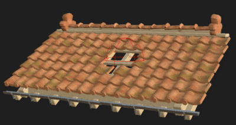

# 版本 11.3

**Substance 3D 設計師**

上映日期： *2021年11月24日*

## 主要特色

### 新的模型圖功能

模型圖中加入了許多改進，以擴展建模能力：

* <b>新的粒子工作流程</b>\
  新的粒子建模工作流程允許建立點狀雲以操作幾何體。 它們可以用來創造許多新的複雜和/或重複形狀，例如上方圖片中的屋頂瓦片。\
  欲了解更多關於新粒子工作流程的資訊，請參閱以下文件頁面：

  * 場景中的物品類型
  * 粒子
  * 顆粒修剪
  * 來自實例的粒子

  

* <b>新的建模與變形節點</b>\
  新增了更多節點以創造更複雜的形狀，點擊每個節點以了解更多：
  * 生成轉換
  * 有機模式
  * 車床
  * 曲線裝飾

* <b>一般改良\
  </b>建模圖的工作流程已透過以下方式改進：
  * 新增節點參數提示，讓它們更容易學習。
  * 3D 模型階層在匯出 FBX 時會被保留
  * 物料指派可匯出 OBJ 與 FBX 檔案格式。
  * 在 viewport 的覆蓋模式下預覽中間節點。

### 提升互通性

send-o 動作已擴充，新增兩種可能性：

* **將 SBSM（物質模型檔案）傳送給 Stager**\
  程序化 3D 模型現在可以送至 Stager，並根據公開參數進行修改。

* **從 Sampler 接收 SBS/SBSAR**\
  現在可以直接將 Sampler 產生的 Substance 檔案接收到 Designer。

### 其他

已完成多項生活品質改善：

* **輸入相對於輸入的差異**\
  在 Relative to inputs 中設定的圖輸入，現在會繼承連接節點的大小，而不是預設的父圖大小。 這使得透過不同大小的輸入管理不同解析度變得容易許多。

  {width="400px"}

* **新圖形視窗**\
  新的圖形視窗經過重新設計，現在允許更清楚地看到特定範本的細節，並能直接在現有套件中建立新的圖形。

  {width="400px"}

* **關閉所有包裹**\
  這是一個小動作，讓管理多個套件變得不那麼繁瑣。 使用 **File** > **關閉所有** Close All 來關閉目前已開啟的所有套件。

  

* **最大化當前視圖**\
  使用新的標題列 **圖示** 或快捷鍵 **SHIFT+Space** 將視窗展開到全螢幕。 這也可以用於浮動窗。

* **3D 視角改進**\
  3D 視圖新增了顯示設定，可切換 3D 模型背面的顯示，以及頂點、切線和雙切線的顯示。

### 內容

此版本新增了擴散節點，並改進了 PBR 渲染節點：

* <b>擴散節點</b>\
  新的擴散色彩、擴散灰階和擴散 UV 節點允許根據輸入遮罩產生柔和的出血模糊效果。

  {width="230px"}

   

* **改良版 PBR 渲染節點**\
  此節點有以下變更：
  * 球體形狀新增了立方體 UV 模式。
  * 新支援次表面散射。
  * 各向異性現遵循 Adobe Strand 材料 5ASM 模型。
  * 基於影像的照明已透過重要性取樣技術得到改進。
  * 在重要性取樣的支持下，發射照明得到了改進。

## 發行說明

### 11.3.0

*（2021年11月24日發行）*

**補充：**

* [物質模型]新增節點參數工具提示
* [物質模型]允許在3D視口中疊加顯示中間節點的結果
* [物質模型]改進基礎的顯示方式
* [實體模型]在將實體模型圖匯出為 .fbx 時，請保留物件的階層結構
* [物質模型]支援多材質的 FBX/OBJ 從物質模型圖匯出
* [物質模型][內容]粒子節點
* [物質模型][內容]生成轉換節點
* [物質模型][內容]有機模式節點
* [物質模型][內容]來自實例節點的粒子
* [物質模型][內容]粒子修剪節點
* [物質模型][內容]車床節點
* [物質模型][內容]殼節點
* [物質模型][內容]投影節點
* [物質模型][內容]曲線修剪節點
* [物質模型][內容]更新曲線取樣節點
* [物質模型][內容]更新網格取樣節點
* [物質模型][內容]更新抖動節點
* [使用者體驗]按鈕以最大化當前視角
* [用戶體驗]更新新的圖形視窗
* [用戶體驗]在工具選單中新增「下載播放器」選項，並以「尋找播放器」進行整合
* [UX]在檔案選單中新增「全部關閉」項目
* [使用者體驗]在主選單中套用一致的外殼
* [UX]自動顯示重複圖形項目的屬性
* [使用者體驗]在圖表工具列中新增按鈕，以關閉幀標題/留言/釘選的恆定螢幕大小
* [用戶體驗]在「關於」對話框中，將版本資訊複製到剪貼簿的按鈕
* [材料]輸入相對於投入的關係
* [內容]在 3D Perlin 噪音中新增「平鋪」選項
* [內容]新擴散過程節點
* [內容]新 PBR 渲染節點版本
* [互通性]從 Sampler 接收 SBS 與 SBSAR
* [互通性]將SBSM傳送給Stager
* [3D 視角]新增一個選項來停用背面剔除
* [3D 視圖]新增顯示頂點切空間的選項
* [檔案總管]雙擊圖景背景時，在總管中選取圖表
* [檔案總管]在情境選單中移除「探索」選項
* [麵包師]隱藏被淘汰的烘焙師
* [色彩管理]新增對 OCIO v2 設定檔規則的支援
* [函式庫]依圖類型重新命名類別
* [偏好設定]若偵測到 支援 CUDA GPU 的 Iray 硬體偏好設定，請自動停用 CPU。

**修正：**

* [Substance 模型]在 Mac 上使用 .fbx 上的「as sudb」選項時會當機
* [物質模型]在特定情況下匯出為 SBSM 時會當機
* [物質模型]匯出未曾建構的外部參數時匯出失敗
* [物質模型]開啟指向多個 .fbx 檔案的圖表時隨機當機
* [物質模型]範圍不會在暴露參數的小工具中動態套用
* [Substance 模型]重新載入網格選項無法用於 Substance 模型圖中所使用的資源
* [物質模型]場景在特定情況下不會以可用的3D視圖顯示
* [使用者介面]障礙區域的材質選項太大了
* [使用者介面]「套件檔案未儲存」對話框中的樣式問題
* [使用者介面]Tab 鍵必須按兩次才能在數值間切換
* [使用者介面]滑鼠拖曳縮放在 3D View 與其他視窗之間是反向的
* [使用者介面]使用「最近檔案」清單載入已開啟的 SBS 時，錯誤地觸發「套件未找到」提示
* [使用者介面][macOS]啟動應用程式後預設介面配置錯誤
* [使用者介面]套件無法儲存到磁碟的根目錄（僅限 Windows）
* [圖表]「自動顯示在2D視圖」選項在特定情況下不一致
* [圖表]SBSAR 實例節點提供「開放參考」選項
* [圖表]針腳屬性僅在建立項目時顯示
* [圖表]針腳串規則的執行不一致
* [圖表]儲存空白圖表時會崩潰
* [3D 視圖]ASM 著色器中各向異性角度是反轉的
* [3D 視圖]ASM 著色器：SSS 相關地圖的線性化問題
* [3D 視圖]在特定情況下關閉額外 3D 視圖後，OpenGL 渲染出故障
* [3D 視圖]預設攝影機位置在 3D 視圖中與部分 .fbx 檔案中並不正確
* [MDL] 從上下文選單中的「新增節點」對 MDL 圖形無法使用
* [MDL] 錯誤：當使用 float2.x 元件及類似元件時，節點連線失敗（SD 11.1.2）
* [MDL] 開啟 specific.sbs 檔案時當機
* [MDL] Iray 中每公尺場景單位在渲染工作階段開始時未設定
* [MDL] 在調整 MDL 圖中的 lerp 節點時會凍結
* [MDL] 匯出 MDL 程式碼中的參數順序
* [Explorer] 在取消資源建立後會產生空資源資料夾
* [Explorer]只有套件的第一個元素可以移到清單底部
* [內容]RT Bent Normal 與 RT AO 在巢狀圖中觸發節點計算
* [輸入節點]輸入節點中的點陣圖在 UDIM 變更時不會更新
* [Iray]在嘗試展示一個包含大量實例的Substance模型場景時，會花很長時間
* [偏好設定]取消新增專案檔案時空行
* [Python 編輯器]關閉最後一個腳本後，「關閉」選項仍保持啟用，且仍包含其名稱 æ
