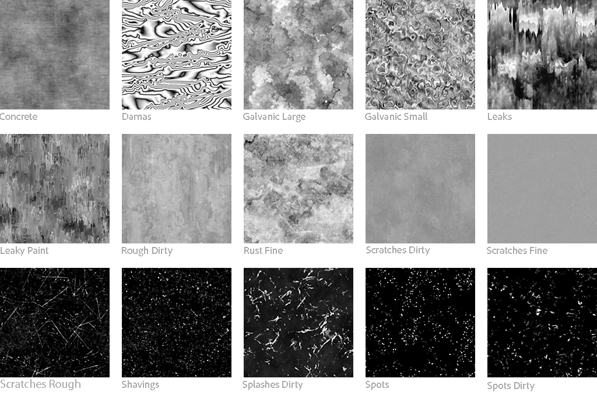

# 版本 12.1

**Substance 3D Designer 12.1** 帶來了許多新的節點，用於 Substance 材質圖、支援 USD 檔案格式，並增加了與 Stager 的更多互通性。

發行日期： *2022年4月26日*

## 主要特色

### Substance 材料圖表的新內容

這個版本新增了許多節點，你會發現一些新的模式、新的噪音、新的濾波器......

請參考下方連結的節點頁面，看看這些強大新節點所帶來的廣泛輸出範例！

* **新圖案**

  * 我們新增了一個 <b>Tile Random 2</b> 節點，用來生成大小與比例隨機的相鄰圖塊，這對於快速建立完全不規則、帶有傾斜、圓角和斜角的格子非常實用。

    {width="640px"}
  * 新增 <b>三角形格子</b> 圖案，生成由三角形組成的網格。 我們在下面的材料中使用它，輕鬆且完美地模擬皮革紋理。 此產生器代表三維空間中的頂點曲面，並可用來創造各種多邊形樣式。

    {width="640px"}
* **新聲響**

  * 為了讓你有更多變化，新增 <b>了15張Grunge地圖</b> （Concrete、Leaks、Splashes Dirty等） 已新增至圖書館。

    {width="640px"}
  * 你還會發現許多 <b>新的 2D 和 3D 噪音</b>，例如 Voronoi（2D 和 3D）、Voronoi 分形（2D 和 3D）、3D Ridged Fractal，以及目前 3D Perlin Noise（新增平鋪和絕對選項）的更新。\
    這些聲音都以 3D 空間映射，並提供多種風格，增加多樣性與控制，讓你有更多選擇來打造適合你素材的完美地圖，例如海洋和下方的科幻材質。

    {width="640px"}

    {width="640px"}
  * 一組 <b>3D 貼圖節點</b> （位置、SDF、偏移）和 <b>3D 渲染節點 </b>（表面或體積）用來建立和渲染 3D 貼圖，這些貼圖是 3D 模型切片的圖集。

    {width="640px"}

* **新濾鏡**

  * 透過<b>自動裁切</b>節點，你可以在圖片中心&#x200B;*放置一個形狀*&#x200B;而不調整大小，或調整大小以符合空間。舉例來說，你的形狀可以自由調整，同時保持均勻的位置和大小。

    {width="640px"}
  * 透過<b> Extend Shape</b> 節點，你可以將形狀的一段拉伸到自訂的方向和距離。

    {width="640px"}
  * 而使用 <b>Non-Uniform Rotation</b> 節點，你可以根據給定的映射旋轉輸入。

    {width="640px"}
* **還有......**

  * 易度函數（函數圖）非常有用，能以非線性方式驅動一個數值。
  * 最後，這個版本還帶來了全新、更精確的 <b>量化</b> 節點，以及全新的 <b>Summed Area Table</b> 工具過濾器。

### 提升互通性

* **美元支持**，除了

  以及

  檔案格式，你現在可以匯入和匯出美元檔案（

  ,

  ,

  ）以便將它們用作 Substance 模型圖的資源、烘焙或在 3D 視圖中展示你的 Substance 素材。 你也可以用這個格式匯出你的 Substance 模型圖表或 3D 視圖的內容。
* <b>傳送給Stager\
  </b>你現在可以一鍵將 Substance 素材傳送到 Stager，就像 Sampler 和 Painter 一樣。 多虧了這個功能，不再需要以 SBSAR 發佈並載入個別檔案（需要 Stager 1.2.0 版本搭配新的材質管理器）

  

### 其他

* 如果你正在製作布料，現在可以在 3D 視圖中顯示專用網格，讓你更清楚看到材質在垂墜形狀上的呈現方式。 在 3D 視圖面板中開啟 <b>場景</b> 選單，選擇 <b>布料</b> 選項來顯示此模型。

  {width="640px"}

* 我們也新增了一些 Substance 模型圖的場景管理節點。 這些節點允許你重新命名、重父、融合或展開場景元素，以組織場景階層。 還有一個新節點用來設定場景中一個或多個元素的樞軸。

* 在 Designer 中處理專案時，你可能會遇到警告和錯誤訊息，這些訊息會通知你專案中出現問題。 在這個版本中，我們 <b>改進了錯誤管理系統</b> ，讓所有錯誤和警告都能在檔案總管中顯示：所有資料都集中在一處，讓你更容易檢查專案是否有問題。

  {width="640px"}

## 發行說明

### 12.1.0

*（2022年4月19日發行）*

<b>補充：</b>

* [主線]材料圖的新內容
* [主線]將材料送給斯塔格
* [主線]支援 USD 檔案
* [主頁]改進使用者介面中的錯誤回報功能
* [主線]模型圖的場景管理節點
* [內容]為 3D Perlin 噪音新增更多選項（平鋪、絕對音等）
* [內容]全新 3D 有脊狀噪音分形節點
* [內容]全新 3D 貼圖偏移節點
* [內容]新的 3D 貼圖位置節點
* [內容]新的 3D 貼圖渲染表面節點
* [內容]新的 3D 貼圖渲染體積節點
* [內容]新的 3D 貼圖有符號距離場節點
* [內容]新的自動裁切節點
* [內容]新的緩和函數
* [內容]新的延伸形狀節點
* [內容]新垃圾搖滾地圖
* [內容]新的非均勻旋轉節點
* [內容]新的加總面積表過濾器
* [內容]新牌隨機2產生器
* [內容]新三角格狀圖案產生器
* [內容]量化灰階節點的新版本
* [內容]新 Voronoi 與 Voronoi 分形聲（2D/3D）
* [內容]閾值：加入「降低」與「降低且相等」的比較模式
* [內容]&#x200B;[3D 視圖]新增一個網格配合，用於展示布料到已運送的資源中
* [實體模型]新擴展群組實例節點
* [物質模型]新熔斷節點
* [物質模型]新命名節點
* [物質模型]新 Reparent 節點
* [物質模型]新集合樞軸節點
* [物質模型]更新至 SDK 1.6.0
* [第三方]將 Qt（及 QtForPython）升級至 5.15.8
* [第三方]將 Python 升級到 3.9.9
* [第三方]將 OpenSSL 升級至 1.1.1m
* [使用者介面]改善節點選單誤點擊時的行為
* [使用者介面]即使置頂，也在同一分頁開啟子圖
* [使用者介面]從總管面板標題列移除釘選按鈕
* [使用者介面]在歡迎畫面中儲存「不再顯示」選項，跨版本
* [3D 視圖]啟用「軸」輔助工具時，在視窗中顯示格網單元
* [自動化]提供 sbsbaker 命令列工具與 Designer 一起使用
* [色彩管理]為 Adobe ACE 實作新的 GPU 後端
* [爐子]新增一個選項，可以無時間戳記地烹調包裹
* [圖表]在 FxMap 圖中新增徽章
* [函式庫]新增 Easings 函式的篩選器
* [球員]USD 支持
* [屬性]當找不到資源時，會在位圖節點的「PKG 資源路徑」參數上新增警告錯誤
* [物質引擎]升級到8.4.1
* [Yebis]提醒使用者，下一版本將移除 Yebis 的後製效果
* [文件說明]新的「警告與錯誤」頁面
* [文件]新頁面描述 Substance 圖中的繼承
* [文件]更新「Iray」部分
* [文件]更新「MDL 圖表」部分

<b>修正：</b>

* [使用者介面]新圖形視窗中模板工具提示的裁剪問題
* [使用者介面]在 macOS 使用暗黑模式時，節點中的白色文字難以辨識
* [使用者介面]部分對話框的版面配置問題
* [使用者介面]在檔案總管中建立 Substance 函數圖時，警告訊息顯示為截斷。
* [UX]每個新開口的顏色選擇器都在往下移動
* [UX]漸層編輯器視窗每次生成時都會往上移動
* [UX]已載入的套件不會自動顯示圖屬性
* [內容]洪水填充映射器：特定情況下輸入選擇錯誤
* [內容]洪水填充：布林參數的文字滲透按鈕
* [內容]多角度到法線節點第一個取樣光角參數的範圍錯誤
* [物質模型]節點的屬性顯示識別碼而非標籤
* [物質模型]&#x200B;[3D 視角]重新開啟專案時的刷新問題
* [物質模型]&#x200B;[3Dview] 使用線框預覽時的刷新問題
* [參數]在特定情況下快速連續刪除圖輸入時會當機
* [參數]在編輯參考描述時，重設實例參數時會當機
* [位圖]對於在圖中丟棄的點陣圖檔案，UDIM 偵測不會被觸發
* [圖]當磁碟載入套件後，資源被修改時，位圖/SVG 節點不會被取消
* [圖渲染]當 Substance 圖評估被取消時，記憶體洩漏
* [在地化]字串「Rebake all map for this resource」顯示為未在地化
* [MDL] 若輸入連接於未連接的點節點，則暴露參數初始化為 0
* [偏好設定]即使游標位於空格，工具提示仍會顯示
* [屬性]在特定情況下，撤銷色彩空間值變更時會設定預設值
* [正文]無法還原字型切換到缺少的字型資源
