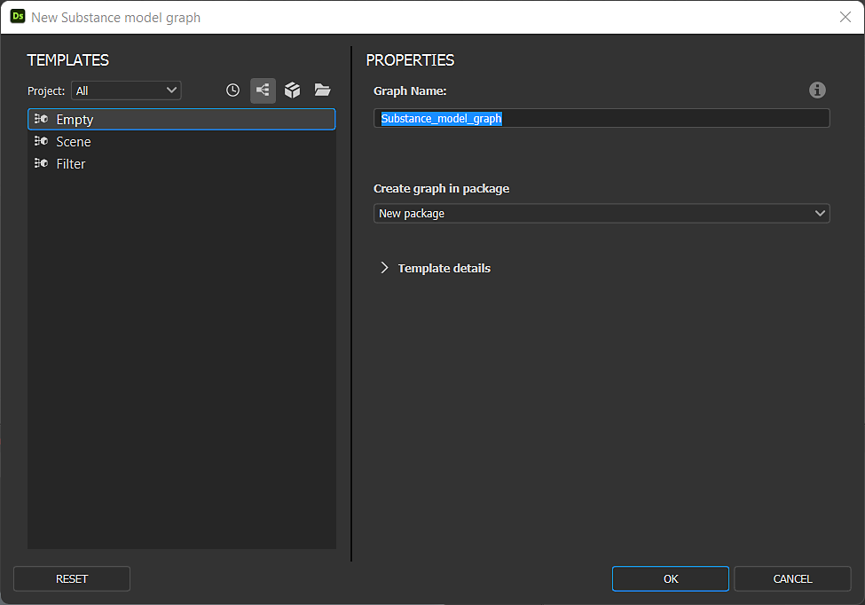

# 版本 12.3

<b>Substance 3D Designer 12.3</b> 透過子圖</b>（或圖形實例）支援，將 Substance 模型圖提升到新層次<b>，並具備<b> 「可見如果」 </b>控制，用於公開參數，並<b> 新增</b> 一些專門用於曲線編輯的節點。 此版本還新增兩個面板（歡迎</b>面板與<b><b>新功能</b>），以改善使用者新手操作，並加入以下說明的其他小功能或錯誤修正。

發行日期： *2022年10月6日*

{width="1111px"}

## 主要特色

### 在實體模型圖中支援圖實例

如果你習慣製作圖表，你會希望能夠製作子圖（或圖形實例），以便重複使用你的作品，讓圖表更簡潔且更有效率。\
現在 Substance 模型圖也可以這樣做：只要把子圖從 Explorer 拖放到主圖，當作實例節點使用即可。

{width="600px"}

我們也引入了 Substance 模型圖（如 Output scene）的輸出節點概念。 你現在可以在圖中加入一個或多個輸出。\
當你的圖被實例化到另一個圖時，每個輸出都會對應一個輸出腳位。

{width="600px"}

當你右鍵點擊實例節點時，當然可以存取其參考的子圖來檢視或編輯它。

{width="600px"}

多虧了子圖和暴露的參數，你可以創造複雜的資產並套用無限變化，如下方插圖所示。

{width="600px"}

### Substance 模型圖的其他改進

* <b>若是暴露參數，則可見</b>\
  在揭露參數時，你可能想根據其他參數的狀態隱藏或顯示參數。 例如，只有按鈕開啟時才顯示滑桿。\
  使用 <b>Visible If</b>，你可以為參數可視性加入條件，保持介面乾淨且實用。 此機制已適用於 Substance 圖，現在也擴展至實體模型圖，當然，語法相同。 <b>\
  </b>

  {width="600px"}

* <b>新節點專屬曲線編輯\
  </b>此版本新增了專門用於曲線編輯的新節點： <b>反向曲線</b> 交換曲線的兩端， <b>曲線細分</b> 依兩種方法在線段上增加頂點， <b>平滑曲線 </b>平滑二維曲線上的所有角度，最後 <b>偏移曲線</b> 使二維曲線膨脹或放氣，如下所示。<b>

  </b>

  {width="600px"}
* <b>新圖形視窗 </b>\
  <b>新 Substance 模型圖</b>視窗現在也可用於 Substance 模型圖。你可以新增自己的範本，或選擇預設範本，然後直接輸入圖表名稱，選擇該圖表要加入的套件。

  {width="600px"}

### 歡迎與新消息座談會

我們推出了兩個全新面板，幫助你開始使用 Designer：

首先， <b>歡迎 </b>面板——在你 *首次啟動* Designer 時會顯示——提供軟體及其在 Substance 3D 生態系統中角色的全球概覽。 接著，<b>首次執行&#x200B;*新版* Designer 時會顯示的「What&#39;s new</b>」面板，快速介紹本版本引入的主要功能。

這兩個面板也可從說明選單中存取。

### 其他

* <b>兩個按鈕小工具用於暴露的布林參數</b>\
  你現在有一種新方法可以暴露 Substance 圖中的布林參數。 除了切換按鈕外，你還可以使用 <b>帶有自訂文字的並排按鈕</b> ，讓布林參數驅動的兩種不同模式更明顯。
* <b>解決高 DPI 螢幕的縮放問題 </b>\
  在先前版本中，Designer 無法正確處理作業系統中設定的縮放因子。 如你在下方插圖中所見，所有內容在 4K 螢幕上完美管理，並以 125% 縮放，所有字型和按鈕都以一致大小顯示。\
  請注意，偏好設定中的「停用高 DPI」選項在這個新版本中已重設為 *False* ，因為這個選項不再需要這個選項才能使用介面。

  {width="600px"}

* **Steam 版本的 Apple Silicon 原生支援（M1 / M2）**\
  12.2 版的 Designer 是首個全面支援基於 M1 或 M2 晶片的新蘋果機種，但 Steam 版本卻沒有這項支援。 從現在起，所有 Designer 用戶都能在這些機器上享受更快且更有效率的體驗。

## 發行說明

### 12.3.0

*（2022年10月6日發行）*

**補充：**

* [一般]歡迎新用戶的入職小組
* [一般]新增面板以提升新功能的可發現性
* [實體模型]子圖與實例的支援
* [物質模型]對於暴露參數，支撐可見
* [物質模型]新增輸出節點支援
* [物質模型]曲線偏移節點
* [物質模型]曲線還原節點
* [物質模型]曲線平滑節點
* [物質模型]曲線細分節點
* [物質模型]移植物節點
* [物質模型]更新「濾鏡場景」節點
* [物質模型]讓非原子節點在節點選單中可被發現
* [實體模型]在實例節點的情境選單中新增「開啟參考」動作
* [物質模型]在可傳送至 3DView 的節點情境選單中新增「在 3DViiw 中檢視」的操作
* [物質模型]在節點暴露後自動顯示其屬性
* [物質模型]建立「新物質模型圖」視窗及範本列表
* [使用者介面]提升 2D 檢視與 3D 檢視中影像儲存選項的一致性
* [使用者介面]在檔案總管的情境選單中，將「連結> 3D 網格」改名為「連結 3D 場景」>
* [使用者介面]重置版面現在套用到所有浮動視窗
* [使用者介面]在情境選單中使用「在 3D View 中檢視輸出」標籤來顯示圖表
* [函式庫]支援非原子物質模型圖
* [SBSAR]SBSAR 中支援圖輸出的描述
* [著色器]將所有著色器的預設 Tessellation Factor 值設為 1
* [UI]為布林參數揭露雙鍵小工具
* [引擎]更新至版本 8.6.4
* [Steam]為 Apple Silicon 晶片組（Apple M1 / M2）優化組裝

**修正：**

* [使用者介面]解決高 DPI 螢幕的縮放問題
* [使用者介面]「$（udim）」模板在烘焙視窗的列表中缺少
* [使用者介面]當節點選單顯示在螢幕右側邊框時會當機（僅限 macOS）
* [使用者介面]3D 檢視選單中的擴充按鈕不見
* [使用者介面]圖表工具列的擴充選單不完整
* [使用者介面]取消硬範圍啟動後參數小工具值錯誤
* [3D 視角]非預設著色器設定在 Iray 上會從一個工作階段切換到另一個工作階段遺失
* [烘焙者]載入烘焙視窗時，場景沒有網格，當機
* [功能]當將實例複製到其參考的圖時會當機
* [功能]修正操作節點時可能的當機問題
* [全球化]斜體在日文、韓文、中文中並不總是正確被禁用
* [圖表]新 MDL 與 Substance 模型圖的備用識別碼錯誤
* [圖]由數值驅動的繼承參數有時會被錯誤計算
* [圖形渲染]在計算高解析度圖形時切換引擎時（僅限 macOS）會當機
