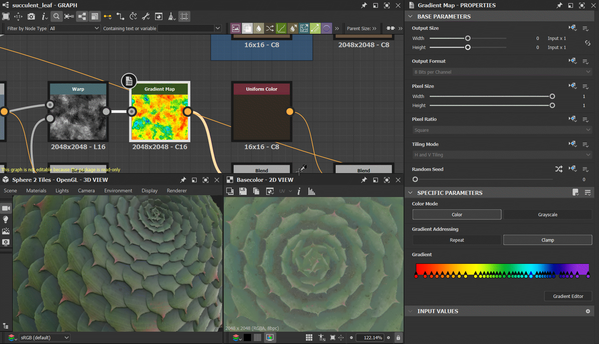

# 版本 12.4

**Substance 3D Designer 12.4** 帶來了多項生活品質提升（包括清理圖表的工具、使用基本公式設定參數、產生隨機種子的按鈕、大小鎖定等）。 以及在 Python API 中支援 Substance 模型圖。 以下有更多關於這些變動的細節。

發行日期： *2023年1月31日*

## 生活品質提升

### 乾淨的圖表工具

當你編輯圖表時，有時必須嘗試多種可能性，並反覆切換不同節點直到得到你想要的結果。 最後，圖中有些節點沒有連接到輸出，因此對最終結果沒有影響。 這個新工具能讓你自動偵測並刪除這些節點，以便在完成圖表前先清理它們。 清潔工具也可選擇性地查看參數函式，並可透過圖視圖工具列中的專用按鈕啟動當前圖表，或在檔案總管檢視中選取的圖表啟動。

{width="640px"}

### 參數欄位中的型別公式

當你想輸入特定參數值時，不再需要用計算機或在腦中計算。 你現在可以在 Properties[&#128279;](https://helpx.adobe.com/substance-3d/unlisted/documentation/sddoc/parameters-ui-129368153.html) 及應用程式其他地方設定參數數值時，直接輸入加法、除法、多數或減法等基本公式。

{width="640px"}

### 3D 視圖中的快速存取按鈕

我們在 3D 視圖[&#128279;](../../interface/3d-view/3d-view.md)中新增了一個工具列，對應顯示選單中[&#128279;](../../interface/3d-view/3d-view.md)所有可用的選項，方便快速存取所有選項（例如線框、格線、邊界框等）。就像按鈕切換一樣。 我們也新增了顯示/隱藏環境地圖的開關。

{width="640px"}

### 產生隨機種子的按鈕

你現在可以用新按鈕快速產生圖表的隨機種子，而不是移動滑桿。

{width="640px"}

### 輸出大小元件鎖定

你現在可以鎖定輸出大小的寬度和高度，以確保保持正方形大小，避免每次更新時都手動操作這兩個值。

{width="640px"}

### 將影像輸入轉換成色彩/灰階

透過節點的情境選單快速切換 [輸入顏色](../../compositing-graphs/nodes-reference-for-com/atomic-nodes/input/input.md) 和 [輸入灰階](../../compositing-graphs/nodes-reference-for-com/atomic-nodes/input/input.md) 。

{width="640px"}

### 顯示漸層編輯器時，選擇點擊的針腳

在屬性面板中，如果你點擊一個針腳來編輯漸層，現在你會自動在顯示 [的漸層編輯器](../../compositing-graphs/nodes-reference-for-com/atomic-nodes/gradient-map/gradient-map.md)中選擇對應的針腳。

{width="640px"}

### 選擇下游節點

節點情境選單[&#128279;](../../interface/the-graph-view/the-graph-view.md)新增條目，直接或間接選擇所有連接至所選節點輸出的節點。所以你選擇所有受你節點影響的節點。 刪除部分圖表或重新設計圖表佈局很有用。

{width="640px"}

## Python API 更新

此 12.4 版本同時透過 Python API 完整支援 Substance 模型圖。 這表示你現在擁有所有建立、編輯或評估 Substance 模型圖表所需的工具。 欲了解更多詳情，請參閱軟體說明選單中的文件。

## 發行說明

### 12.4.0

*（2023年1月24日發行）*

<b>補充：</b>

* [3D 視圖]新增快速按鈕以設定顯示選項（線框圖、環境地圖、場景統計等）
* [色彩管理]提升 ACE 模式下烘焙 3D LUT 的品質
* [文件說明]Substance 圖表範例專案
* [文件]函數圖範例專案
* [檔案管理器]允許將圖與資源從一個父節點移動到另一個父節點，而無需關閉或使元件失效
* [漸層編輯器]顯示漸層編輯器時，選擇點擊的針腳
* [圖形]在節點的情境選單中新增選項，以選擇所有子節點
* [圖]乾淨的圖形工具，用於偵測並移除所有圖類型與屬性圖中未使用的節點
* [圖]將影像輸入轉換為彩色/灰階
* [參數]對整數2小工具加鎖
* [參數]允許將基本公式輸入為參數
* [物質模型]切換以切換值節點的值與圖示
* [使用者介面]當需要隨機種子時產生隨機值的按鈕
* [使用者介面]在 3D 檢視中選取場景瀏覽器中目前選取的項目
* [UX]當值重置時，重設滑桿範圍
* [API]允許在圖表檢視工具列中新增動作
* [API]允許從 API 建立/編輯/評估 Substance 模型圖

<b>修正：</b>

* [3D 視圖]「DirectX Normal」屬性值不會在渲染器間共享
* [3D 視圖]當視窗較小時，場景統計顯示會被拉伸
* [3D 視圖]線框顯示屬性未被儲存
* [內容]徑向模糊色彩參數不影響 alpha 通道
* [本地化]額外的滑桿和按鈕會顯示在環境的 OpenGL 屬性中。
* [MDL][物質模型]刪除暴露節點時當機
* [偏好設定]刪除後 Default\_config 檔案永遠不會被重建
* [物質模型]當機重排序參數在實例層級不會出現
* [API]SDProperty.getDefaultValue（） 幾乎總是回傳 None
