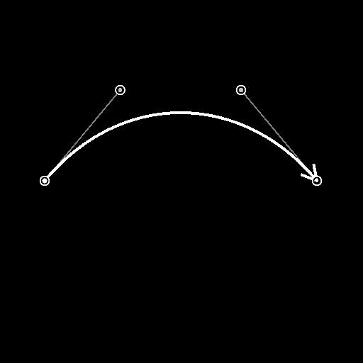
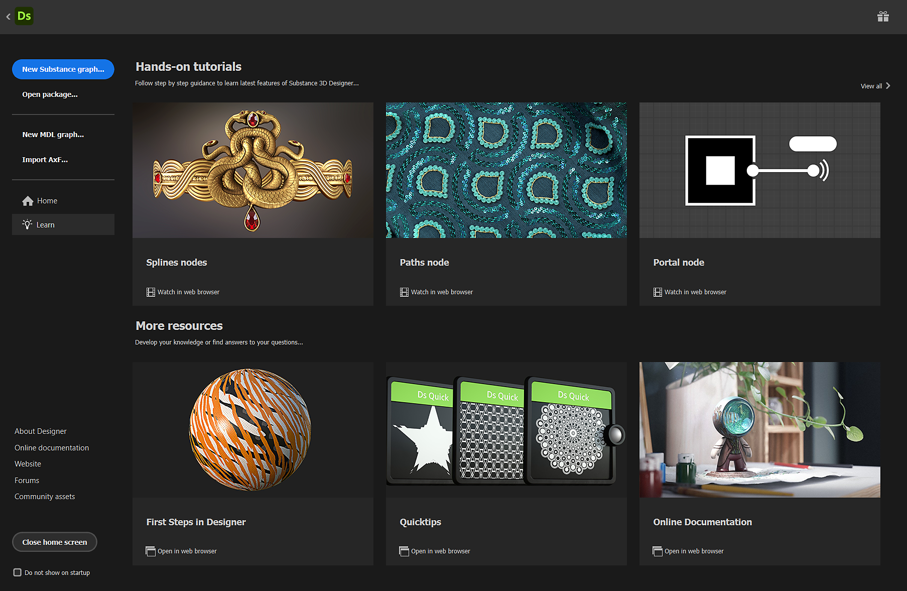

# 版本 13.0

這次 Substance 3D Designer 的 13.0.0 版本為材質美術帶來了大量愛，新增了大量節點，Substance Engine 9.0 首次引入了迴圈，並且在圖表上新增了一個很棒的元素：傳送節點。 為了讓更多用戶滿意，我們推出了全新的主畫面並提供更多語言支援。

如前版本所述，此版本不再支援 Substance 模型圖：這表示你無法在 Designer 中開啟、編輯或匯出這類圖表。 你可以在我們的社群論壇找到我們做出這個決定的所有理由。

*發行日期：2023年6月6日*

*插畫： [席琳·達梅隆](https://www.artstation.com/cline)*

## 新內容

這個 13.0 版本帶來了許多新內容。 你主要會找到兩個新的節點集合：樣條工具和路徑工具。

* [樣條鍵工具](../../compositing-graphs/nodes-reference-for-com/node-library/spline-paths-tools/spline-tools/spline-tools.md)是一組用於產生和調整樣條的節點，也用於映射、散射或扭曲影像。
* [路徑工具](../../compositing-graphs/nodes-reference-for-com/node-library/spline-paths-tools/path-tools/path-tools.md)是另一組節點，以一段段、輪廓清單的形式從遮罩中提取，然後編輯與改進它們。

這些節點將提供許多可能性，且肯定有許多創意應用。 請參考使用 [路徑與樣條工具](../../compositing-graphs/nodes-reference-for-com/node-library/spline-paths-tools/working-with-path-and-spl/working-with-path-and-spline-tools.md) 的章節，了解重要概念，幫助你熟悉這套工具組。

*插畫作者： [Louise Melin](https://www.artstation.com/troglodette)*

### 花鍵工具

專門用於樣條的新節點可分為四類：

#### 建立

第一類當然是產生樣條曲線的類別：

* [樣條三次曲線](../../compositing-graphs/nodes-reference-for-com/node-library/spline-paths-tools/spline-tools/spline-cubic/spline-cubic.md)：從兩點與兩個切線組成;
* [樣條多重二次方程](../../compositing-graphs/nodes-reference-for-com/node-library/spline-paths-tools/spline-tools/spline-poly-quadratic/spline-poly-quadratic.md)：由一組點組成;
* [花鍵圓](../../compositing-graphs/nodes-reference-for-com/node-library/spline-paths-tools/spline-tools/spline-circle/spline-circle.md)：沿著圓形設計。

你也可以在樣條線之間建立<b>橋接</b>，讓樣條線數量在 2 個或 N 個樣條](../../compositing-graphs/nodes-reference-for-com/node-library/spline-paths-tools/spline-tools/spline-bridge-list/spline-bridge-list.md)線之間[有完整的組合。

<table>
<tr style="border: 0;">
<td style="border: 0;" valign="top">

</td>
<td style="border: 0;" valign="top">

</td>
<td style="border: 0;" valign="top">

</td>
<td style="border: 0;" valign="top">

</td>
</tr>
</table>

#### 組裝

在某些情況下，你必須將多個樣條線視為一個實體，因此你需要工具來管理一組樣條曲線。 [樣條合併清單](../../compositing-graphs/nodes-reference-for-com/node-library/spline-paths-tools/spline-tools/spline-merge-list/spline-merge-list.md)允許你將所有樣條線依序連接，將所有樣條線合併成一個清單;[樣條](../../compositing-graphs/nodes-reference-for-com/node-library/spline-paths-tools/spline-tools/spline-append/spline-append.md)附加節點允許你將一個樣條線清單附加到另一個清單上，並且透過[樣條選擇](../../compositing-graphs/nodes-reference-for-com/node-library/spline-paths-tools/spline-tools/spline-select/spline-select.md)節點，你可以從指定清單中篩選並選擇特定的樣條線。

#### 修改

我們也提供工具，讓你能重新調整和調整花鍵。 你會找到一個節點來套用[二維變換](../../compositing-graphs/nodes-reference-for-com/node-library/spline-paths-tools/spline-tools/spline-2d-transform/spline-2d-transform.md)，比如旋轉、平移、縮放，還有另一個節點來[扭曲</b>](../../compositing-graphs/nodes-reference-for-com/node-library/spline-paths-tools/spline-tools/spline-warp/spline-warp.md)<b>形狀，另外兩個節點則是修改[樣條曲線的厚度](../../compositing-graphs/nodes-reference-for-com/node-library/spline-paths-tools/spline-tools/spline-sample-thickness/spline-sample-thickness.md)<b></b>或[高度](../../compositing-graphs/nodes-reference-for-com/node-library/spline-paths-tools/spline-tools/spline-sample-height/spline-sample-height.md)。  

<table>
<tr style="border: 0;">
<td style="border: 0;" valign="top">

</td>
<td style="border: 0;" valign="top">

</td>
<td style="border: 0;" valign="top">

</td>
<td style="border: 0;" valign="top">

</td>
</tr>
</table>

#### 渲染

最後一類是根據樣條曲線創造最終形狀或圖案的類別。 你腦中第一個想到的點子是沿著樣條線重複一個形狀：[Scatter on Spline](../../compositing-graphs/nodes-reference-for-com/node-library/spline-paths-tools/spline-tools/scatter-on-spline-color/scatter-on-spline-color.md) 節點允許你這麼做，並有許多參數完美控制分布（旋轉、縮放、偏移、顏色、遮罩等）。

多虧了[樣條填充](../../compositing-graphs/nodes-reference-for-com/node-library/spline-paths-tools/spline-tools/spline-fill/spline-fill.md)<b> </b>節點，你可以輕鬆從封閉的樣條線建立圖案。 如果你想以高度的控制和精準度將任何貼圖映射到樣條曲線上，[樣條映射器](../../compositing-graphs/nodes-reference-for-com/node-library/spline-paths-tools/spline-tools/spline-mapper-color/spline-mapper-color.md)節點就是為你量身打造的！

<table>
<tr style="border: 0;">
<td style="border: 0;" valign="top">

</td>
<td style="border: 0;" valign="top">

</td>
<td style="border: 0;" valign="top">

</td>
<td style="border: 0;" valign="top">

</td>
</tr>
</table>

### 路徑工具

[遮罩到路徑](../../compositing-graphs/nodes-reference-for-com/node-library/spline-paths-tools/path-tools/mask-to-paths/mask-to-paths.md)節點讓你能以一段段的形式提取灰階圖案的邊界。

接著你可以用 [Path 2D Transform](../../compositing-graphs/nodes-reference-for-com/node-library/spline-paths-tools/path-tools/path-2d-transform/path-2d-transform.md) 或 [Paths Warp](../../compositing-graphs/nodes-reference-for-com/node-library/spline-paths-tools/path-tools/paths-warp/paths-warp.md) 節點處理這些路徑，根據需求調整。而且多虧[了 Paths to Spline](../../compositing-graphs/nodes-reference-for-com/node-library/spline-paths-tools/path-tools/paths-to-spline/paths-to-spline.md) 節點，你可以把 Path 轉換成 Spline，這樣就能利用前面提到的所有專門針對樣條的節點，比如散射。

<table>
<tr style="border: 0;">
<td style="border: 0;" valign="top">

</td>
<td style="border: 0;" valign="top">

</td>
<td style="border: 0;" valign="top">

</td>
<td style="border: 0;" valign="top">

</td>
</tr>
</table>

為了幫助你學習這些新節點，我們發布了兩個新教學：

* [樣條節點介紹](https://www.adobe.com/go/designer-tutorial-splines)
* [路徑節點介紹](https://www.adobe.com/go/designer-tutorial-paths)

## 新物質引擎 v9

上述所有新節點皆基於新的Substance Engine版本，並充分利用其主要新功能： <b>迴圈</b>。

迴圈只設計來[用於 Substance 函數圖](../../function-graphs/function-graphs.md)，你很可能會在[像素處理器](../../compositing-graphs/nodes-reference-for-com/atomic-nodes/pixel-processor/pixel-processor.md)、[效果映射](../../compositing-graphs/nodes-reference-for-com/atomic-nodes/fx-map/fx-map.md)或[值處理器](../../compositing-graphs/nodes-reference-for-com/atomic-nodes/value-processor/value-processor.md)中實作它們。 迴圈當然會讓你輕鬆重複一個函式很多次，直到某個條件被尊重為止。 這會幫助你大幅減輕圖表的重量，並提升準確度。

這個專門[的教學](https://www.youtube.com/watch?v=Ggoy8G90oDI)會幫助你開始使用迴圈。

Substance Engine v9 也帶來了以下改進：

* 在漸層地圖](../../compositing-graphs/nodes-reference-for-com/atomic-nodes/gradient-map/gradient-map.md)節點的漸層編輯器中新增實體模式[（即完全沒有插值）
* Substance 函數圖中的原子 pow（） 節點
* 在取樣器節點中新增邊框包裹選項（夾到邊緣，重複）
* 曲速](../../compositing-graphs/nodes-reference-for-com/atomic-nodes/warp/warp.md)[與定向曲速](../../compositing-graphs/nodes-reference-for-com/atomic-nodes/directional-warp/directional-warp.md)節點的[最近取樣

## 入口節點

[Portal](../../interface/the-graph-view/graph-items/graph-items.md) 節點是 Dot](../../interface/the-graph-view/graph-items/graph-items.md) 節點的新擴充[，可以隱藏圖形中的連結。

多虧了這個功能，你可以透過隱藏非常長的連線來提升圖的可讀性，並且能從圖中任何地方快速存取關鍵節點。

這個新功能在這篇專門[的教學](https://www.adobe.com/go/designer-tutorial-portals)中有完整說明。

## 主畫面

當你啟動 Designer 時，你知道可以使用像其他 Adobe 產品一樣全新的 [主畫面](../../interface/home-screen/home-screen.md) 。 從這個畫面，你可以：

* 快速建立一個新的圖表;
* 請參閱最近在 Designer 中開啟的所有檔案清單，附有大小、最後修改日期或完整檔案路徑等細節;
* 一個學習頁面，你可以找到學習資源的連結，例如介紹新功能或快速發現技巧的教學;
* 直接連結到「最新資訊」畫面、關於頁面、Substance 3D網站、支援社群論壇等。

## 新語言

此版本新增三種語言：

* 西班牙語（西班牙）;
* 義大利語（義大利）;
* 葡萄牙（巴西）。

提醒一下，如果你想在 Designer 裡更改語言，只要到 [偏好設定](../../interface/preferences-window/preferences-window.md)，你會在一般區塊找到所有可用語言的清單。

## 發行說明

### 13.0.0

*（2023年6月6日發行）*

### 新增內容

* [圖]門戶節點
* [入職中]新主畫面
* [內容]樣條（立方）節點
* [內容]樣條（多方二次）節點
* [內容]樣條圈節點
* [內容]點列表節點
* [內容]樣條橋（2個樣條）節點
* [內容]樣條橋（列表）節點
* [內容]樣條附錄節點
* [內容]樣條選擇節點
* [內容]樣條合併清單節點
* [內容]樣條 2D 轉換節點
* [內容]花鍵曲速節點
* [內容]樣條取樣高度節點
* [內容]樣條樣本厚度節點
* [內容]樣條線渲染節點
* [內容]樣條色彩節點上的散射
* [內容]散佈在樣條灰階節點上
* [內容]樣條映射器色彩節點
* [內容]樣條映射器灰階節點
* [內容]樣條橋接映射器色彩節點
* [內容]樣條橋映射器灰階節點
* [內容]樣條流程映射器節點
* [內容]UV 映射器色彩節點
* [內容]UV 映射機灰階節點
* [內容]通往樣條節點的路徑
* [內容]遮罩到路徑節點
* [內容]路徑 2D 轉換節點節點
* [內容]路徑多邊形節點
* [內容]預覽路徑節點
* [內容]路徑扭曲節點
* [內容]路徑選擇節點
* [內容]路徑頂點處理器節點
* [內容]路徑頂點處理器簡單節點
* [內容]路徑上的四重轉換節點
* [內容]光線追蹤環境遮蔽 v2
* [內容]光線追蹤彎曲法態 v2
* [內容]光線追蹤陰影 v2
* [引擎]更新至版本 9
* [引擎]函數圖中的迴圈節點
* [引擎]將固態模式加入漸層
* [引擎]函式圖中的原子 pow（） 節點
* [引擎]在取樣器節點中新增邊框包裹選項（夾到邊緣/重複）
* [引擎聲]最近取樣地點為曲速與定向曲速節點
* [引擎]在銳化濾鏡中加入「穿孔阿爾法」模式以用於色彩輸入
* [引擎]FxMap：半球形態子
* [引擎]函數圖中的原子 Get/Set 操作
* [引擎]功能：使用精確的log/log2/exp，2pow-統一爐與引擎間的功能
* [引擎]在方向扭曲濾波器中加入「強度偏移」參數
* [API]支援圖合成的預設管理
* [函式]更改函式原子節點的輸入名稱
* [本地化]新增葡萄牙語（巴西）、義大利語（義大利）和西班牙語（西班牙語）
* [在地化]尊重規則「語言（國家）」在語言列表中
* [預設]在使用上下文編輯時，請在圖形屬性中停用「預覽」和「預設」面板
* [實體模型圖表]停止支援實體模型圖表

### 修正方法

* [3D 視角]場景統計中長字串的顯示被切斷（僅限 macOS）
* [API]&#39;structure：：Structure&#39; 模組仍包含在 API 參考中
* [API]MDL 圖中的點節點沒有定義或屬性
* [API]設定函式節點參數時的錯誤行為
* [內容] 3D Voronoi 與 3D Voronoi 分形節點會產生烹飪警告
* [引擎]「強度地圖偏移」參數對 SSE2 引擎的灰階資料沒有影響
* [Explorer]圖 I/O 可以被刪除
* [圖]在實例中使用位圖時會被忽略
* [圖]從節點建立節點時，點點位置錯誤
* [圖表]使用「Enter」鍵時，「顯示參數」對話框焦點錯誤
* [圖表]在上下文編輯中，使用點陣圖掃描時出現錯誤結果
* [本地化]修正各種穿模問題
* [參數]刪除輸入參數時會當機
* [發佈]資料夾中的圖會移到 Published 套件的根目錄
* [資源]更新磁碟上已載入的資源時會當機
* [可見如果]修正條件可視性評估中的迴歸
