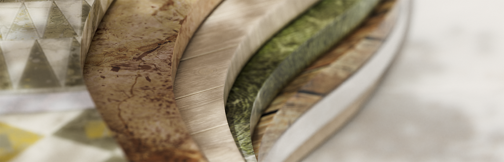

# 版本 13.1

<b>Substance 3D Designer 13.1</b> 在節點圖上加入了許多生活品質改進，主要是關於影格，以提升材質製作體驗。 此外，還新增了 AxF 匯出功能，讓使用 AxF 格式的使用者能建立互通性的工作流程。

*發行日期：2023年12月12日*

## 框架改進

框架是保持圖表組織良好且易讀的必備工具。 這也是我們決定在這個新版本中打磨它們的原因。

### 自動展開

隨著圖的成長，影格內容可能需要重新排列。 節點可能會移動以騰出空間給新增內容，或是內容需要更拉開以促進可讀性。 為了方便調整，現在可以在移動包含物件時自動展開畫面：在移動物件時按住 <b>Shift</b> 鍵，畫面邊界會自動調整，保持該物件在範圍內。

### 尺寸與內容的配合

當你在圖表中做調整時，畫面可能不再優雅地調整到內容上。 這個新指令允許你自動調整畫面的位置和大小，使其能根據內容的跨度調整，並以一個中等格子作為填充。 如果框架有描述，會調整以利用描述旁邊的空白空間（如果可能的話）。

### 強化描述

多虧了 HTML 程式碼，你現在可以在框架描述中加入格式化文字。 這同樣適用於留言。

### <b>...還有更多精彩內容！</b>

很多東西都重新設計了，比如歸屬規則讓它更寬容、互動區域能輕鬆調整幀大小、吸附規則避免節點在格子上錯位，以及視覺設計帶來新鮮感。 歡迎隨時造訪框架 [說明](../../interface/the-graph-view/graph-items/frame/frame.md) 以了解更多資訊。

## 生活品質提升

* <b>節點選單改進： </b>為了節省尋找所需節點的時間，我們稍微改進了節點選單。 搜尋變得更寬容，即使沒有完美匹配也能給你結果。 此外，你現在可以用上箭頭直接進入清單中的最後一個元素。
* <b>節點擺放： </b>如果你喜歡圖表的完美版面配置，這兩個小改動會讓你滿意！ 當你將節點從一個圖複製/貼上到另一個圖時，貼上的節點現在會對齊到主格子。 當你在長連結上新增節點時，這個節點會放在連結可見部分的中間，讓它在各種情況下都能看見。
* <b>2D 檢視選項：</b>如果你是 2D 視圖[&#128279;](../../interface/2d-view/2d-view.md)的密集使用者，會節省時間，因為像是「顯示棋盤格」、「保留視圖大小」、「使用實體大小」和「顯示平鋪」等選項現在都被保存了，這樣你建立新 2D 視圖或重新啟動 Designer 時就不用再重新設定。

## AxF 匯出

<table>
<tr style="border: 0;">
<td width="25.00%" style="border: 0;" valign="top">

</td>
<td width="100.00%" style="border: 0;" valign="top">

AxF 是 X-Rite[&#128279;](https://www.xrite.com/axf) 的一種格式。它提供一種在數位設計流程中，利用數值資料捕捉、儲存、編輯及傳達複雜材料特性的方法。 在之前的 Designer 版本中，你可以匯 [入 AxF 檔案](../../resources/axf-appearance-exchange/axf-appearance-exchange-format.md) ，然後改善平鋪或加入程序化效果，但之後你只能以新的 .sbsar 檔案匯出變更。

在這個新版本中，我們引入了可以原地編輯 AxF 材質， [然後將變更](../../resources/axf-appearance-exchange/axf-appearance-exchange-format.md) 匯出為匯入後的 AxF 檔案的新圖層的功能。

</td>
</tr>
</table>

## API

最後，這個 13.1 版本持續改進 Python API，新增兩種可能性：

* <b>「可見 if」屬性： </b>你現在可以為圖形參數、輸入和輸出設定這個屬性。
* <b>圖的順序輸入/輸出：</b> 使用 sdsbscompgraph：：reorderGraphInput 和 sdsbscompgraph：：reorderGraphOutput，來依照需要組織參數。

>[!NOTE]
>
> Designer 13.1 是基於 Qt5 的最後一個主要版本，接下來的主要版本將升級到 Qt6。 這可能會影響你的自訂插件。

## 發行說明

### 13.1.0

*（2023年12月12日發行）*

### 新增內容

* [幀數]自動擴展
* [框架]更改規則以定義物件何時屬於框架
* [幀數]關閉幀描述的文字縮放功能
* [幀數]尺寸與內容相符
* [幀數]新的預設值、懸停與選擇狀態
* [幀聲]吸附到大格子
* [框架]支援框架描述的 HTML 程式碼
* [幀聲]更新互動區域
* [畫面]更新視覺面向
* [圖]將節點建立在可見連結的中間，而非連結的中間
* [圖表]如果該項目是唯一在選取中擁有屬性的項目，則顯示該項目的屬性
* [圖表]移除圖表中評論的「縮放」選項
* [圖表]在複製/貼上時，將節點吸附在主網格上
* [UX]在節點選單與函式庫搜尋中允許模糊搜尋
* [UX]讓節點選單列表 loopN
* [AxF]支援AxF匯出
* [AxF]在 Linux 上停用 AxF
* [API]使用 Python API 設定圖參數、輸入與輸出的「可見 if」屬性
* [API]使用 Python API 設定圖的輸入輸出順序
* [相依性]更新至 1.80.0
* [依賴性]更新 OpenSubdiv 至 3.5.x
* [相依性]更新 FBX SDK 至 2020.3
* [相依關係]NGL 更新為 1.35.0.20
* [色彩管理]新增對 OCIO ICC 顯示器的支援
* [關卡]新增重置直方圖的方法
* [Python]如果無法匯入 QtForPython 請提醒使用者
* [2D 視圖]儲存檢視選項的狀態
* [3D 視角]在網格資訊著色器中新增位置技術
* [匯出]新增一個「儲存設定」按鈕，用來儲存匯出選項的變更

### 修正方法

* [3D 視圖]無法將紋理指派給 MDL 材質的輸入 texture\_2d
* [AxF]模板列表中的圖識別碼可以是空白
* [AxF]Substance 圖模板欄位預設為空白
* [內容]地圖散布：特定情況下的錯誤行為
* [內容]洪水填充映射器：當所有形狀的 Bbox 大小相同時，輸出為空白
* [內容]FloodFill 到位置：某些情況下出現不精確的瑕疵
* [內容]在「BaseColor/Metallic/Roughness Converter」節點中出現錯誤的「Specular」輸出
* [內容]遮罩到路徑在非正方形垂直方向下無法運作
* [內容]缺少輸入值、輸入灰階、輸入色彩與輸出節點的描述
* [內容]缺少集合節點與序列節點的描述
* [內容]形狀濺射：『濺射資料2』輸出中的不精確偽影
* [引擎]價值處理器中的布林值計算總是為「假」（僅限蘋果矽片）
* [資源管理器]不同作業系統工具列按鈕的順序不一致
* [幀數]使用 CTRL 修改鍵移動幀時，請勿抓取節點
* [Gradient Map] 重置所有選項也應該重置漸層小工具
* [圖形渲染]在預覽模式下調整時，部分節點會呈現黑色
* [圖表]「輸入值」預覽在調整預設布林值時會卡在「False」狀態（僅限 Apple Silicon）
* [圖]靠近框架邊緣的點節點不會被框架移動
* [互通性]送出 Substance 3D Stager 後，重送圖示未更新
* [MDL] 在節點中，若有此參數，則無法更改粗糙度
* [MDL] 「AxF 與金屬粗糙度」模板中的無效連接
* [使用者介面]「匯出輸出」視窗可最小化（僅限 Windows ）
* [使用者介面]使用顯示縮放時，關於畫面中的圖片會呈現像素化
* [使用者介面]節點對齊工具在圖工具列中建立多個復原步驟

### 已知問題

* [AxF OpenGL 著色器]各向異性分布的錯誤 Ward
* [AxF OpenGL 著色器]預設粗糙度錯誤
* [AxF OpenGL 著色器]著色基底旋轉錯誤
* [AxF OpenGL 著色器]半球偵測下錯誤光線
* [AxF OpenGL 著色器]錯誤貢獻檢測
* [AxF]匯出時「鏡面色彩」貼圖值不正確
* [AxF]預覽與材質在「匯入 AxF」對話框中顯示不正確
* [AxF]屬性「cc no refraction」未正確注入 AxF 到 AxF 模板
