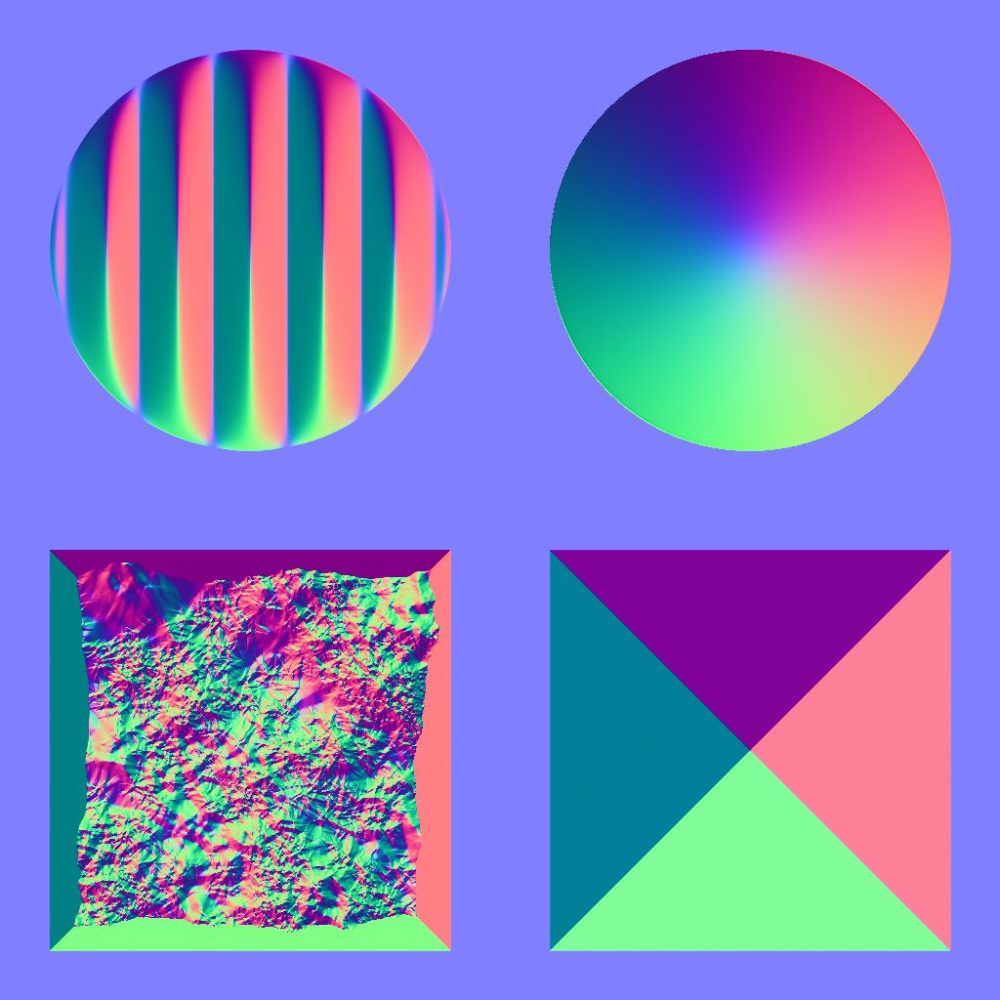
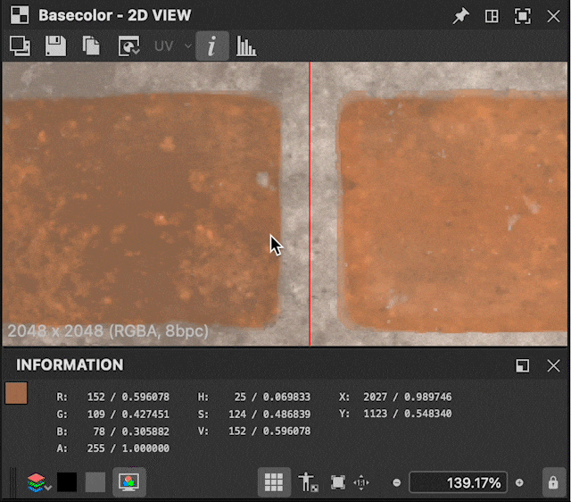

# 版本 14.0

<b>Substance 3D Designer 14.0 </b>帶來了多項生活品質提升（圖形導航、效能等） 但最重要的是，它包含了許多新節點（色彩操作、桑原濾鏡、直方圖工具、斜角平滑、方向距離等）。 以下有更多關於這些變動的細節。

*發行日期：2024年7月30日*

## 新內容

這個 14.0 版本帶來了許多新內容，並包含以下列出的新節點：

* <b>專用於色彩操作的節點：</b>一個節點<b>（</b>[量化顏色](../../compositing-graphs/nodes-reference-for-com/node-library/filters/adjustments/quantize-color/quantize-color.md)<b>） </b><b> </b>減少圖片中的顏色數量，並從中提取調色盤，這是一系列工具節點，用來建立你自己的調色盤（[檢視](../../compositing-graphs/nodes-reference-for-com/node-library/filters/adjustments/view-color-palette/view-color-palette.md) / [建立](../../compositing-graphs/nodes-reference-for-com/node-library/filters/adjustments/create-color-palette-16/create-color-palette-16.md) / [修改](../../compositing-graphs/nodes-reference-for-com/node-library/filters/adjustments/modify-color-palette/modify-color-palette.md)<b> </b>另一個用來使用 ID 映射[（套用色彩調色盤](../../compositing-graphs/nodes-reference-for-com/node-library/filters/adjustments/apply-color-palette/apply-color-palette.md)）套用到另一張影像。 你也會找到 [ID to mask 灰階](../../compositing-graphs/nodes-reference-for-com/node-library/filters/adjustments/id-to-mask/id-to-mask.md) 節點，將 ID 映射（由 Quantize color 計算）轉換成灰階遮罩。 有了這整套節點，你就擁有用顏色創造風格化效果所需的一切。

{zoomable="yes"}

{zoomable="yes"}

* <b>桑原濾鏡</b>：如果你想更進一步的風格化，可以透過各向異性桑原色彩](../../compositing-graphs/nodes-reference-for-com/node-library/filters/effects/anisotropic-kuwahara/anisotropic-kuwahara.md)/[灰階](../../compositing-graphs/nodes-reference-for-com/node-library/filters/effects/anisotropic-kuwahara-gra/anisotropic-kuwahara-grayscale.md)濾鏡產生一些繪畫般的效果[。在細節上，它會套用各向異性方向模糊，以符合影像細節。 結果是影像似乎沿著內部形狀的方向流動。

這些節點（量化色彩與各向異性桑原）在本教學](https://www.adobe.com/go/designer-tutorial-quantize)中有[詳細說明。它展示了如何用它們來風格化材質，以及更有效率且直覺地處理顏色！

其他強大的節點加入隊伍：

* [<b>曲率平滑</b>](../../compositing-graphs/nodes-reference-for-com/node-library/filters/effects/curvature-smooth/curvature-smooth.md)：這個新版本現在正確支援所有平鋪模式，新增兩個輸出（凸性和凹度），並且在準確度和效能上都有所提升。
* <b>[直方圖平衡](../../compositing-graphs/nodes-reference-for-com/node-library/filters/adjustments/histogram-equalize/histogram-equalize.md）：</b> 此節點透過調整數值以取得均勻分布，使灰階影像的直方圖得到均衡。 此節點配有兩個伴隨節點： [直方圖渲染](../../compositing-graphs/nodes-reference-for-com/node-library/filters/adjustments/histogram-render/histogram-render.md) 以輸出影像直方圖，以及 [直方圖計算](../../compositing-graphs/nodes-reference-for-com/node-library/filters/adjustments/histogram-compute/histogram-compute.md)<b> </b>將直方圖編碼為一列像素。
* <b>[斜角平滑](../../compositing-graphs/nodes-reference-for-com/node-library/filters/effects/bevel-smooth/bevel-smooth.md）：</b> 多虧了他的一個，你可以從遮罩的邊界（向外、向內或兩者）繪製漸層或平面色。 節點 [方向距離](../../compositing-graphs/nodes-reference-for-com/node-library/filters/effects/directional-distance/directional-distance.md)<b> </b>也會畫漸層，但方向是特定的。
* <b>[正常解體](../../compositing-graphs/nodes-reference-for-com/node-library/filters/normal-map/normal-uncombine/normal-uncombine.md）：</b>此節點與法線結合](../../compositing-graphs/nodes-reference-for-com/node-library/filters/normal-map/normal-combine/normal-combine.md)節點相反[，它從法線貼圖中移除高度圖描述的表面細節。

<table>
<tr style="border: 0;">
<td style="border: 0;" valign="top">

曲率平滑

<table>
  <tr>
    <td>
      
       <i>之前</i>
    </td>
    <td>
      
       <i>之後</i>
    </td>
  </tr>
</table>

</td>
<td style="border: 0;" valign="top">

直方圖等化

<table>
  <tr>
    <td>
      
       <i>之前</i>
    </td>
    <td>
      
       <i>之後</i>
    </td>
  </tr>
</table>

</td>
</tr>
</table>

<table>
<tr style="border: 0;">
<td style="border: 0;" valign="top">

斜角光滑

<table>
  <tr>
    <td>
      
       <i>之前</i>
    </td>
    <td>
      
       <i>之後</i>
    </td>
  </tr>
</table>

</td>
<td style="border: 0;" valign="top">

普通非結合

<table>
  <tr>
    <td>
      
       <i>之前</i>
    </td>
    <td>
      
       <i>之後</i>
    </td>
  </tr>
</table>

</td>
</tr>
</table>

## 生活品質提升

* <b>在大型專案中，效能 </b>與 <b>反應</b> 速度都有所提升。 例如，移除節點的速度可以快 75 倍。 [同時，參考多次相同點陣圖的圖形也縮短了烹調](../../glossary/glossary.md) 時間。
* <b>繼承參數</b>：當參數被 [繼承](../../glossary/glossary.md)時，我們不再顯示預設值，而是顯示繼承的參數，讓你知道目前使用的值。 想了解更多關於繼承的資訊，請參閱 [我們文件](../../compositing-graphs/inheritance-compositing/inheritance-in-substance-compositing-graphs.md)的專頁。
* <b>MacOS 上的觸控板支援</b> 已經完全重新設計，使其更自然且與其他軟體保持一致。 將節點移出圖視](../../interface/the-graph-view/the-graph-view.md)圖邊界[也被重新思考，以使節點在所有作業系統間更流暢且一致。

* <b>2D 視圖：</b>當 2D 視圖](../../interface/2d-view/2d-view.md)啟用[平板顯示時，你現在甚至可以取得原本圖塊上不存在的像素值：檢查[取樣](../../glossary/glossary.md)和跨圖塊的值轉換非常有幫助。

{width="320px" zoomable="yes"}

* <b>漸層地圖</b>：用滑鼠中鍵點擊將所有 [漸層鍵](../../compositing-graphs/nodes-reference-for-com/atomic-nodes/gradient-map/gradient-map.md) 向左或向右移動（這樣就能保留所有鍵之間的空隙）。
* <b>參數</b>：為了透過參數注入自訂函式，現在可以使用編輯函數小工具。 這是一個強大的解決方案，可以用來建立自訂工具，讓你想用 [Substance 函數圖](../../function-graphs/the-function-graph/the-function-graph.md)來驅動參數。

<table>
<tr style="border: 0;">
<td style="border: 0;" valign="top">

{zoomable="yes"}

</td>
<td style="border: 0;" valign="top">

{zoomable="yes"}

</td>
</tr>
</table>

## API 改進

腳本 API 包含四種新方法：

* 取得並設定 Substance 合成圖圖類型的方法：myGraph.setGraphType（“newType”）;myGraph.getGraphType（）
* 在編輯器中開啟套件資源的方法（例如，圖視圖中的 Substance 圖）：myUIManager.openResourceInEditor（myResource）
* 在 Explorer 中選擇套件資源的方法（例如，Substance 圖）：myUIManager.setExplorerSelection（myResource）
* 在圖視圖中框定特定節點的方法：myUIManager.focusGraphNode（myGraphViewID， myNode）

## 視覺特效平台需求

每年， [VFX 參考平台](https://vfxplatform.com/) 都會公布一份工具與函式庫版本清單，適用於所有 VFX 產業軟體，以減少軟體間的不相容性。 一如往常，我們 *會* 更新所有相依系統，以尊重所有這些建議。

請注意，這些更新帶來兩大主要後果：

* <b>Linux 需求</b> 已改變，Designer 現在要求 RHEL 版本 8 或 9（CentOS 已不再支援）。 所有細節皆可於 [系統需求](../../getting-started/system-requirements/system-requirements.md) 頁面找到。
* <b>Designer 的外掛必須更新 </b>，因為 Qt6 中有些函式已被棄用。 你可以在社群論壇](https://community.adobe.com/t5/substance-3d-designer-discussions/plugins-required-updates-in-designer-14-0/td-p/14768559)找到所有更新插件[所需的資訊。

## 發行說明

### 14.0.0

*（2024年7月30日發行）*

### 新增內容

* [內容]新各向異性桑原濾波器
* [內容]新斜面平滑節點
* [內容]新曲率平滑 v2 節點
* [內容]新的方向距離節點
* [內容]新直方圖工具：計算、均衡、渲染
* [內容]Mask 節點的新 ID
* [內容]新常態拆合節點
* [內容]新調色盤節點：建立、套用、修改、檢視
* [內容]新的量化色彩節點
* [內容]非均勻方向扭曲：將預設強度映射值設為1
* [內容]在所有擁有這些版本的節點標籤上，請加上「Color」或「Grayscale」後綴
* [內容]貶低「白噪音」，只讓「白噪音快一點」
* [內容]廢棄 Substance 函式圖中的「Negate Float1」節點
* [內容]將「量化色彩」改名為「量化色彩（簡單）」
* [2D 視圖]資訊面板中 0-1 範圍外像素的顯示值
* [引擎][文字]部分字型的新字間調整
* [圖]在使用上下文編輯時，改善編輯深度子圖時的失效時間
* [連結器]請勿在 SBSASM 中重複點陣圖
* [參數]新增一個新的「函數」小工具，適用於所有輸入參數類型
* [特性]改善繼承參數的顯示
* [使用者體驗]提升觸控板支援（僅限 Mac）
* [UX]選擇圖時，當畫面接近邊界時，現代化聲像
* [使用者體驗]移除「停用高DPI」功能
* [品牌形象]Splash Screen 和 About window 的新品牌形象
* [漸層地圖]新增一個移動所有鍵和循環的方法
* [圖書館]將所有預設過濾器切換為句子格
* [API]新增方法以在圖視圖視窗中框定特定節點
* [API]新增方法在編輯器中開啟套件資源（例如，圖視圖中的 Substance 圖）
* [API]新增選擇套件資源的方法（例如，Substance 圖）
* [API]新增方法以取得並設定 Substance 合成圖的圖型別
* [第三方]遵循 2023 年 VFX 平台的推薦
* [第三方]遵循 2024 年 VFX 平台推薦
* 【第三方】更新推升至1.82.0 + 美元至23.08
* [第三方]NGL 更新至 1.38
* [第三方]將 OpenColorIO 更新至 2.3.x
* [第三方]更新 OpenExr 至 3.2.x
* [第三方]更新 OpenSubdiv 至 3.6.x
* [第三方]將 Python 更新至 3.11.x
* [第三方]更新 Qt 至 6.5.x
* [第三方]更新 gcc 至 11.2.1
* [第三方]更新 glibc 至 2.28
* [第三方]將 libstdc++ ABI 更新為 C++11
* [文件說明]全新「詞彙表」頁面

### 修正方法

* [Bakers]在重新烘焙一個檔案名稱被更改的場景時會當機
* [烘焙機]儲存烘焙者預設為 JSON 檔案時會當機
* [內容]「樣條上的散射」：暴露輸入影像 alpha 參數
* [內容]「圖塊取樣顏色」：缺少可見表達式
* [內容]各向異性雜訊：X/Y值為負值會產生錯誤結果
* [內容]各向異性雜訊：當奇數值為 X 值且無平滑性時，產生平鋪問題
* [內容]正常分配函數：錯誤放置 max（） 可能導致 NaN
* [內容]RTAO、彎曲普通和RT陰影在某些平台上無法正常運作
* [內容]形狀濺射混合顏色：OpenGL 法線貼圖未正確混合
* [內容]節點標籤中「Multi」前綴後的不必要空間
* [相依關係]在套件內或跨套件移動圖形時會當機
* [引擎]曲速節點的精確誤差影響斜坡模糊節點
* [引擎]SD 中的 SBSAR 層無法讀取 2GB > SBSASM 內容的 SBSAR
* [函數圖]0^n 的錯誤結果
* [圖表]「顯示節點大小」選項標示錯誤
* [圖]將父級註解複製到另一個圖時會當機
* [圖表]當 alt-drag Dot 節點時會凍結
* [圖表]節點搜尋在某些情況下可能會遺漏明顯的匹配
* [圖]在多次實例化且開啟超圖時編輯函數圖時的效能問題
* [圖]建立輸出時失效次數太多
* [安全性]ICO 解析越界寫入漏洞
* [安全性]棄用某些未使用的影像格式
* [參數]點陣圖 PKG 資源路徑不應可編輯
* [參數]修正與揭露/批次揭露值處理器參數相關的問題
* [參數]批次暴露時忽略字串參數
* [屬性]編輯一個已多次實例化且開啟屬性的函式圖時，效能問題
* [SVG]形狀的編輯不會套用在點陣化影像中
* [使用者介面]修正可捲動小工具的部分錯誤/不一致（僅限 Windows）
* [使用者介面]匯入/匯出清單中 3D 場景檔案格式的順序不一致
* [使用者介面]視窗的動作會被複製在使用者介面中
* [版本控制]「perforce.py」腳本在 Python 3 上無法運作
