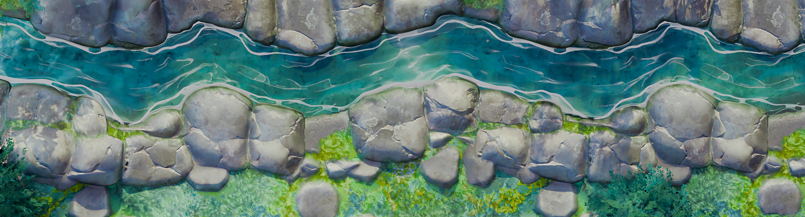
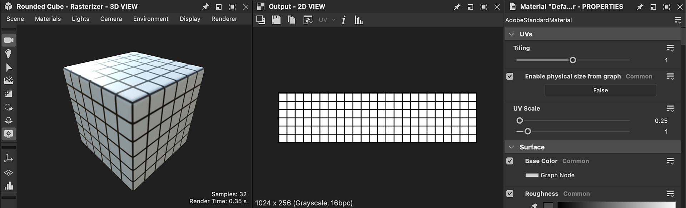

# 版本 15.0

這次更新帶來了全新的 3D 渲染器，具備光柵化和路徑追蹤模式，並原生支援 [USD](https://openusd.org/release/index.html) ，讓你能在不損失資料的情況下編輯和匯出場景。

*發行日期：2025年7月15日*

## 全新 3D 渲染器

### 新光柵化器與路徑追蹤器

這次新版本讓你可以使用進階 [的 3D 渲染器](../../interface/3d-view/3d-renderers/3d-renderers.md)，包含光柵化模式（可在處理材質時即時預覽）和路徑追蹤模式（光線追蹤模式，以獲得完美且精確的渲染效果）。 這款新渲染器透過光柵化模式的陰影等功能增強功能，提升畫質與效能，並設計以支援未來如 MaterialX[&#128279;](https://materialx.org/) 等技術。它補充了 Designer 中現有的 OpenGL 與 Iray 渲染器，並與 Substance 3D Viewer 及 Substance 3D Sampler 中的渲染器相符，確保整個生態系統的統一體驗。

[3D 視圖工具列](../../interface/3d-view/3d-view.md)已更新，能快速存取此渲染器中部分新功能：

* <b>選擇工具：</b> 用來選擇場景中的子網格。 選擇子網格後，你可以專注於它（F）或進入其材質屬性（右鍵點擊）。
* <b>啟用路徑追蹤器：</b> 快速切換路徑追蹤器與光柵化器模式。
* <b>啟用陰影：</b> 在場景中啟用陰影，有助於觀察材質在光線下的表現。
* <b>啟用地面平面：</b> 用來啟用或關閉場景中的地面平面。

此外，旋轉環境燈的快捷鍵也改成了其他 Substance 應用程式的模式，現在是 *<b>Shift-Right Click</b>*，而不是 *<b>ctrl-shift-right click</b>*。

### 後續影響

[後期效果回來](../../interface/3d-view/camera/post-effects/post-effects.md)了！ 這些作品現在可以透過相機選單取得，且已由內部開發。

* <b>Bloom：</b> 模擬亮點周圍的眩光，如燈光和反射，讓你能更清楚地看到發射表面。
* <b>色調映射：</b>透過設定檔呈現色彩範圍，以產生高動態範圍（HDR）效果。
* <b>景深：</b> 模擬相機鏡頭（僅光柵器）的對焦特性。

## 資產版在背景下的說明

當你在製作材質時，可能會想 [在特定的 3D 場景](../../working-with-3d-scenes/working-with-3d-scenes.md)中預覽。 這也是為什麼我們加入了匯入並渲染完整場景的功能，包含所有材質、攝影機和燈光。 更棒的是，如果這個場景參考了 MaterialX 著色器，光柵器會正確渲染出來！

匯入後，你可以選擇網格（用 SHIFT + 點擊或多虧場景瀏覽器）並 [覆蓋其](../../working-with-3d-scenes/overriding-scene-mat/overriding-scene-materials.md)材質來處理場景。 你可以：

* 建立或載入一張圖表，然後套用到場景材質上。
* 透過將現有材質 [的貼圖](../../working-with-3d-scenes/extracting-materials-val/extracting-materials-values-and-textures.md) 提取成新圖形來調整。

最後，當你的 3D 場景編輯完成後，你可以 [匯出](../../working-with-3d-scenes/exporting-scenes/exporting-scenes.md) 成新檔案，或是原始檔案的新圖層，避免資料遺失（僅限 USD 格式）。

最後但同樣重要的是，現在支援更多3D格式，適用於進口和出口：USD（+ USDA、USDC、USDZ）、STL、PLY和GLTF，以及現有的FBX和OBJ。

## 豐富的工具提示

引入了豐富的工具提示，以更好地展示每個節點的用途。 這些工具提示目前僅適用於 [原子節點](../../compositing-graphs/nodes-reference-for-com/atomic-nodes/atomic-nodes.md)，包含視覺化工具以展示節點的效果，並提供文件的直接連結，提供詳細資訊，包括參數、技巧與技巧。

<table>
<tr style="border: 0;">
<td style="border: 0;" valign="top">

</td>
<td style="border: 0;" valign="top">

</td>
<td style="border: 0;" valign="top">

</td>
</tr>
</table>

## 改善非正方支撐

如果你需要處理非方形材質，這個新選項就是為你量身打造的。 在 [3D 視圖的材質屬性](../../interface/3d-view/material-properties/material-properties.md) 中，UV 控制平鋪的選項中，你現在可以為兩個軸設定不同的數值。

{zoomable="yes"}

## 烘焙師

雖然烘焙介面僅有小幅更新（詳情請參見下方詳細清單），但烘焙函式庫已完全重建，採用基於 GPU 的烘焙器，帶來更佳的效能。 加上上述新支援的檔案格式，這次更新對從事烘焙工作流程的使用者來說是一大進步。

注意：如果你用 sbsbaker.exe 自動化流程，該工具已改名為 substance3d\_baker.exe（請使用 substance3d-baker -- 說明更多資訊）。

## 視覺特效平台需求更新

每年，[VFX 參考平台](https://vfxplatform.com/)都會公布一份工具與函式庫版本清單，適用於所有 VFX 產業軟體，以減少軟體間的不相容性。 一如往常，我們&#x200B;*會*&#x200B;更新所有相依系統，以尊重所有這些建議。

## 影片

## 發行說明

### 15.0.0

*（2025年7月15日發布）*

### 新增內容

* [3D 視圖]全新渲染器，具備光柵化與路徑追蹤模式
* [3D 視圖]新增選取工具以在 3D 場景中選取物件
* [3D 視圖]新增「帶圖層匯出場景......」 「場景」選單中的動作
* [3D 視角]新增工具列按鈕
* [3D 視角]新增可在 USD 場景中切換多個攝影機的功能
* [3D 視角]允許在視窗中按下「F」鍵時聚焦於所選物件
* [3D 視圖]允許從現有材料產生物質合成圖
* [3D 視圖]允許在 3D 視圖中傳送 SBS 合成圖，並將其獨特輸出指派給環境/全景使用量
* [3D 視圖]按下 Esc 鍵清除目前的選擇
* [3D 視圖]顯示匯入的 3D 場景及貼圖
* [3D 視角]區分 X 與 Y 材質重複控制
* [3D 視角]啟用/停用陰影
* [3D 視圖]啟用/停用地面平面
* [3D 視角]在「材質」選單中，僅對手動新增且未使用的材質新增「移除」
* [3D 視圖]在「材料」選單中，移除「全部移除」這個動作
* [3D 視圖]讓匯出的 USDZ 檔案成為自成一體
* [3D 視圖]切換渲染模式時，讓渲染器屬性保持持久
* [3D 視角]在覆寫材料時保留現有的材質輸入
* [3D 視角]重新排列相機屬性
* [3D 視角]移除動作「相機/儲存截圖...」 以及「相機/複製截圖到剪貼簿」
* [3D 視圖]移除選單操作「材質/全部重建」
* [3D 視圖]移除預設相機標籤中的「Default」前綴
* [3D 視圖]在材質輸入漢堡選單中，將選單動作「重設為預設值」作為最後一個
* [3D 視角]快捷鍵調整
* [3D 視圖]即時模式下支援陰影與半透明
* [3D 視圖]從匯入的 USD 場景支援 MaterialX 著色器
* [3D 檢視 / OpenGL]將「UV 縮放啟用」參數重新命名為「從圖中啟用實體尺寸」
* [3D 視角/後期特效]布魯姆
* [3D 視圖/後效]景深
* [3D 視圖/後期效果]音調映射
* [3D 檢視 / 場景瀏覽器]允許在場景瀏覽器中選取材質屬性時顯示該屬性
* [3D 檢視 / 場景瀏覽器]隱藏欄位「材質」
* [3D 視圖 / 場景瀏覽器]請以粗體標示由預定義實體控制的 USD 原語
* [烘焙師]在樹狀檢視中新增一個情境選單，並有「全部選擇」/「全部取消」操作
* [Bakers]新增控制雙切插值的選項
* [烘焙師]在圖形介面中新增水平分配器
* [Bakers]當場景是 UDIM 時，預設在輸出名稱中加入 UDIM 巨集
* [Bakers]允許重新計算切線
* [烘焙師]允許在不破壞連結的情況下重新命名烘焙師
* [烘焙師們]改變中間面板的預設尺寸
* [Bakers]UDIM 工作流程的輸入貼圖
* [Bakers]製作 2D 地圖 查看列表順序 與 Baker 渲染列表順序相符
* [烘焙師]把烘焙窗口做成模態
* [烘焙師]管理音色映射參數
* [Bakers]移除切線空間插件選擇
* [烘焙師]儲存預設時，烘焙師的儲存狀態為「啟用」或「停用」
* [烘焙師]預設選擇材料於選擇小工具中
* [烘焙師]設定 Normal 輸出貼圖的預設方向，相對於偏好設定
* [烘焙師]預設將 UV 圖塊設為全部
* [烘焙師]WordSpaceDirection 新增選項 FromTexture/FromValue
* [烘焙師]世界到切線：將預設輸入設為「來自貼圖」
* [SBS貝克]建立一個控制後端訂單的選項
* [SBSBaker]改進 StringList 參數的使用
* [SBS_instance]把「match\_source\」改成「match\_mesh\_name」
* [SBS貝克]將「Submesh」改名為「GeomSubset」
* [SBS拍板]改名為substance3d_baker
* [內容]在產生器節點中加入「半球」形狀，以暴露象限形狀
* [互通性]支援 GLTF 檔案格式
* [互通性]支援 PLY 檔案格式
* [互通性]支援 STL 檔案格式
* [函式庫]原子節點的統一化工具提示
* [Mac]停止支援 MacIntel 平台
* [節點]新增原子節點的豐富工具提示
* [參數]預設關閉「屬性」區塊
* [參數]讓使用者為新實例指定基礎參數預設值
* [偏好設定]Bakers：新增布林值選項以計算每個片段的切空間
* [偏好設定]移除切線空間插件
* [偏好設定]儲存每個次要版本 SD （XX.X） 的偏好設定
* [視覺特效]更新至1.85.0
* [視覺特效]將 MacOS 最小版更新至 12.0
* [視覺特效]將 OpenColorIO 更新至 2.4.2
* [視覺特效]將 OpenColorIO 更新至 2.4.x
* [視覺特效]更新 OpenExr 至 3.3.x
* [視覺特效]更新Qt至6.5.8

### 修正方法

* [3D 視圖]匯出的 USD 場景中的貼圖未正確套用
* [3D 視圖][UDIM]當圖偏好設定中關閉自動開啟圖時，無法在 3D 視圖中查看 UDIM 圖形輸出
* [麵包師們]「反外名。」和「平均。 非適用烘焙者的法線格為空白且可編輯
* [烘焙者]「刷新」動作在偏好設定中關閉光線追蹤後端時會使用該功能
* [烘焙師]在「刷新所有烘焙地圖」過程中失敗後，烘焙師被封鎖為忙碌
* [烘焙者]在特定網格上烘焙 OpenGL 位置圖時，會在 180+ UDIM 時崩潰
* [烘焙師]連續多次開啟「烘焙模型資訊」對話框時（僅限 macOS）會當機
* [烘焙師]在 JSON 預設匯出中，原本設定為「All」的 &#39;udim&#39; 值會被替換成 &#39;1001&#39;
* [Bakers]Linux 上的記憶體無法正確偵測
* [Bakers]缺少地圖輸入依賴不會觸發警告和/或區塊渲染
* [Bakers]當輸出名稱為空時，沒有錯誤標籤
* [Bakers]從檔案切換高多邊形網格不會有影響
* [烘焙師]使用「重新烘焙」動作時，目標烘焙者預設不會被選取
* [引擎聲]距離：在某些情況下可見的「切斷」
* [引擎]Fx-Map：當位元深度為 8-bit（僅限 GPU 引擎）時不支援負色
* [本地化]節點選單中，字元輸入會從日文切換回拉丁文
* [安全性]USDC 檔案解析超出界外寫入漏洞
* [安全性]解析 NEF 檔案時的界外寫入漏洞 II。
* [安全性]DNG 檔案解析時的界外讀取漏洞 III
* [偏好設定]唯讀專案設定中的使用者體驗問題
* [資源]開啟 FBX 檔案時不會顯示多個 UV 集合
* [使用者介面]狀態列中重疊的標籤
* [使用者介面]「連結建立模式」下拉選單的工具提示未顯示

### 已知問題

* [烘焙師]使用某些特定的 NVidia 驅動程式烘焙時當機
* [3D 視圖]OpenGL：部分匯入場景可能無法渲染
* [3D 視角]光柵器：在平面場景中使用位移時的陰影瑕疵
* [3D 視圖]Pathtracer：啟用 tesselation/displacement 更新貼圖時效能變慢
* [3D 視角]某些色彩材質屬性在覆寫時無法正確管理色彩
* [3D 視圖]帶有動畫圖元的場景未獲得適當支援
* [3D 視圖]多重 UDim 網格尚未支援
* [3D 視角]多個 UV 的網格不被支援，可能導致材質渲染無效
* [3D 視圖]AMD 顯示卡不支援 Pathtracer
