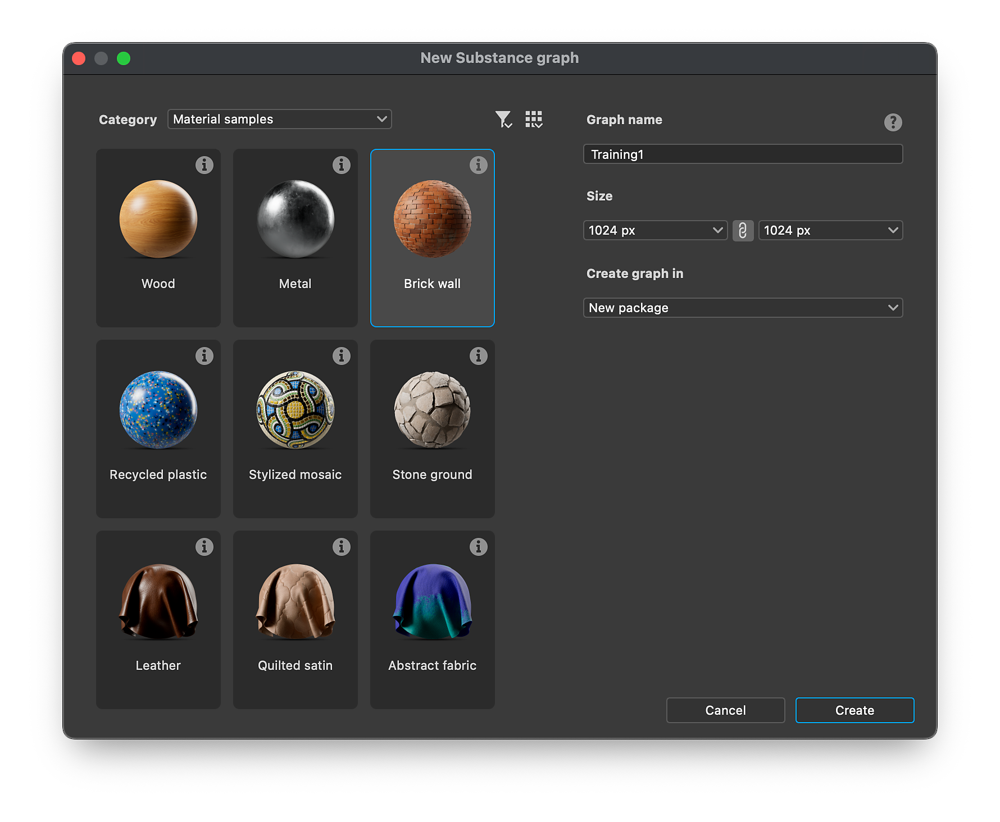
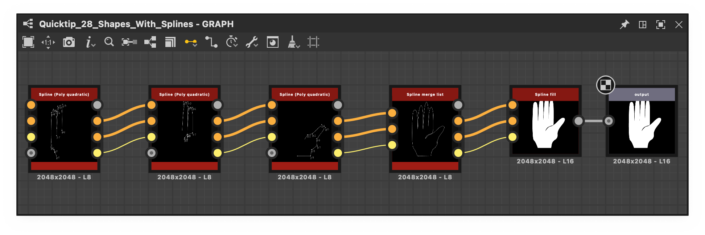

# 版本 15.1

Substance Designer 15.1 帶來了全新設計的圖表創建視窗，提供直接取樣存取、改良的噪音節點以增加創意空間、節點選單中分類整理，以及更多功能。

*發行日期：2025年12月11日*

## 改進圖的建立

在此版本中， [圖形建立視窗](../../compositing-graphs/creating-compositing-gra/creating-a-substance-compositing-graph.md) 被 <b>全面重新設計</b> ，以提升 Substance 3D Designer 的初始使用者體驗。 此更新的主要目標是簡化範本選擇流程，讓使用者能有效辨識最適合需求的範本。

縮圖提供即時 <b>視覺參考</b> ，說明所擬材質類型，而詳細工具提示則提供所有相關資訊。 為了改善組織，模板現在被分類為材料、濾鏡和掃描處理等特定 <b>類別</b> 。

雖然主介面已升級，使用者仍可存取先前的檢視，包括清單、套件和目錄選項。

[了解更多](../../compositing-graphs/creating-compositing-gra/creating-a-substance-compositing-graph.md)

{zoomable="yes"}

## 嵌入取樣

隨著重新設計的圖表建立視窗推出，我們在軟體中直接加入了各種 [<b>範例材料</b>](../../compositing-graphs/creating-compositing-gra/material-samples/material-samples.md) 。 此項改進是回應您對學習資源取得更佳存取需求的要求。

{zoomable="yes"}

為了滿足這個需求，我們納入了布料（包括皮革和緞面）、木材、金屬、塑膠、陶瓷等材料樣本。 這些範例旨在幫助你輕鬆開始專案，並熟悉 Substance 3D Designer 中主要的家族節點

每個圖都有 <b>註解</b>、精心組織，且節點數量極少，以盡量簡化理解。

你可以在建立新的物質圖表時，在「材料樣本」類別中存取樣本，或直接從主畫面使用方便的「前往樣本」按鈕存取。

除了這些基礎教材外，我們還提供了 <b>進階範例</b> ，示範如何更有效運用 <b>FX-map 和 Pixel 處理器</b> 的功能。

[了解更多](../../compositing-graphs/creating-compositing-gra/material-samples/material-samples.md)

{zoomable="yes"}

## 新聲音

噪音在大多數圖表中扮演關鍵角色，因此我們在這個版本中著重於多項關鍵增強，以提升其功能與可用性。

這次更新讓我們更強化 <b>非平鋪情境</b>的支援，確保噪音模式在不強制平鋪的情況下也能正常運作。 過去，當停用平鋪時，噪音節點要麼被迫鋪磚，要麼產生錯誤結果。

大多數噪音現在都包含 <b>新的參數</b>，讓使用者能有更大的創作控制權。 這些額外選項讓圖繪者能微調其工作流程中雜訊的外觀與行為。

最後，位元深度不再被 <b>硬鎖在 16 位元</b>。 你現在可以覆寫單一節點實例的位元深度設定，讓你需要時能達到更高的細節和動態範圍，或是優化圖表的效能。

完整更新的音效清單請參見下方發行 [說明](#release-notes) 。

範例：[&#128279;](../../compositing-graphs/nodes-reference-for-com/node-library/texture-generators/noises/clouds-2/clouds-2.md)單元 1[&#128279;](../../compositing-graphs/nodes-reference-for-com/node-library/texture-generators/noises/cells-1/cells-1.md)雲 2 [方向刮痕](../../compositing-graphs/nodes-reference-for-com/node-library/texture-generators/noises/directional-scratches/directional-scratches.md) [濕氣噪音 1   &#x200B;](../../compositing-graphs/nodes-reference-for-com/node-library/texture-generators/noises/moisture-noise/moisture-noise.md)

{zoomable="yes"}

## 節點選單中的階層

為了解決在龐大函式庫中尋找特定節點的挑戰，我們在節點選單中引入了分類。

龐大的可用節點數量會讓你難以快速找到理想的節點。 為了簡化此流程，圖層級實作了一個新的 [<b>群組</b> 屬性](../../compositing-graphs/graph-parameters/graph-parameters.md) 。 當此屬性被定義後，便用於組織與排序搜尋結果。

<table>
<tr style="border: 0;">
<td style="border: 0;" valign="top">

{zoomable="yes"}

</td>
<td style="border: 0;" valign="top">

{zoomable="yes"}

</td>
</tr>
</table>

## 預設輸出

當節點有多個 [輸出](../../compositing-graphs/nodes-reference-for-com/atomic-nodes/output/output.md)時，無法同時在 2D 視圖或以節點縮圖形式顯示所有輸出。 在這種情況下，主流做法是使用第一個連接的腳位，若未連接，則預設使用第一個輸出。

然而，這種方法未必總是能帶來最佳效果。 例如，在某些樣條線節點中，第一個連接的腳位通常代表樣條座標資料，這不適合用於預覽。

為了解決這個問題，已引入預設輸出屬性。 此功能允許圖作者 <b>預設顯示哪些輸出</b>，提升節點使用直覺性，並促進對已撰寫圖的更清晰理解。

請參考下方圖片，看看預設輸出定義前後的差異。

[了解更多](../../compositing-graphs/nodes-reference-for-com/atomic-nodes/output/output.md)

<table>
  <tr>
    <td>
      
       <i>之前</i>
    </td>
    <td>
      
       <i>之後</i>
    </td>
  </tr>
</table>

## 「定義」節點

在處理函數圖時，你可能需要判斷圖中是否存在變 [數](../../function-graphs/nodes-reference-for-fun/atomic-function-nodes/get-nodes/get-nodes.md) 。

例如，偵測變數缺失時，可以提供備援值，確保函式如預期運作，而不必每個輸入都被明確設定。 這就是為什麼我們加入 [了「已定義」這個節點](../../function-graphs/nodes-reference-for-fun/atomic-function-nodes/get-nodes/get-nodes.md)。

[了解更多](../../function-graphs/nodes-reference-for-fun/atomic-function-nodes/get-nodes/get-nodes.md)

{zoomable="yes"}

## 發行說明

### 15.1.0

*（2025年12月11日釋出）*

### 新增內容

* [NewGraph]新圖形視窗的重製
* [NewGraph]新增材料樣本與進階樣本
* [NewGraph]為模板資料新增一個屬性（分類與副標題）
* [NewGraph]移除輸出格式選項
* [內容]新增雜湊函數
* [內容]將調色映射器加入 functions.sbs
* [內容]各向異性雜訊 v2：新增預設輸出格式，增加無序
* [內容]將句子格應用於節點與參數標籤
* [內容]BnW 發現 1 v2：新增預設輸出格式，不支援平鋪
* [內容]BnW 發現 2 v2：新增預設輸出格式，不支援平鋪
* [內容]BnW 發現 3 v2：新增預設輸出格式，不支援平鋪
* [內容]儲存格 1、2、3、4 v2：新增預設輸出格式、不支援平鋪、無序選項
* [內容]Clouds 1 v2：新增預設輸出格式，不支援平鋪
* [內容]Clouds 2 v2：新增預設輸出格式，不支援平鋪
* [內容]Clouds 3 v2：新增預設輸出格式，不支援平鋪
* [內容]色彩到遮罩 v2
* [內容]方向噪音 1 v2：新增預設輸出格式，不支援平鋪
* [內容]方向噪音 2 v2：新增預設輸出格式，不支援平鋪
* [內容]方向性噪音 3 v2：新增預設輸出格式，不支援平鋪
* [內容]方向噪音 4 v2：新增預設輸出格式，不支援平鋪
* [內容]方向刮盤 v2：新增預設輸出格式，不支援平鋪
* [內容]Dirt 1 v2：新增預設輸出格式，不支援平鋪
* [內容]Dirt 2 v2：新增預設輸出格式，不支援平鋪
* [內容]Dirt 3 v2：新增預設輸出格式，不支援平鋪
* [內容]Dirt 4 v2：新增預設輸出格式，不支援平鋪
* [內容]Dirt 5 v2：新增預設輸出格式，不支援平鋪
* [內容]Dirt gradient v2：新增預設輸出格式、新的無序選項
* [內容]分形和基礎 v2：新增預設輸出格式、無序、不支援平鋪
* [內容]分形和 1,2,3,4 v2：新增預設輸出格式
* [內容]高斯雜訊 v2：新增預設輸出格式，不支援平鋪
* [內容]高斯點 1 與 2 v2：新增預設輸出格式，不支援平鋪
* [內容]Messy Fibers 1、2、3 v2：新增預設輸出格式、無平鋪支援、無序選項
* [內容]濕度噪音 v2：新增預設輸出格式，不支援平鋪
* [內容]新的「濕氣噪音2」節點
* [內容]雜訊：更新以新增預設輸出格式
* [內容]Perlin noise v2：新增預設輸出格式，不支援平鋪
* [內容]形狀映射器：新增過濾模式
* [內容]UV 映射器：新增過濾模式
* [內容]波形 1 v2：使用預設輸出格式 + 新增選項
* [內容]白噪音 v2：使用預設輸出格式，新增分配選項
* [烘焙者]只顯示選取網格的 UV
* [烘焙師]新增一個選項，可以選擇以名稱匹配幾何形狀的方法
* [烘焙師]當烘焙師被刪除時，選擇最近的烘焙師
* [烘焙者]UDIM：定義一份烘焙的 UV 圖塊清單
* [烘焙師]將 bake SDK 更新至 3.15.4
* [3D 視圖/場景瀏覽器]右鍵點擊 UsdPrimitive 時，請避免選擇
* [色彩管理]支援ACES 2.0
* [合成圖]允許將輸出節點設為「預設輸出」
* [Cooker]移除未連接的函式實例輸入警告¬†
* [函式]Add isDefined 運算子
* [圖表]在節點選單中依照「群組」屬性將項目分組
* [圖表]改進縮圖渲染

### 修正方法

* [3D 視圖]L16 灰階貼圖在連接環境或 baseColor 時會顯示紅色調
* [3D 視角]改變沒有材質的場景材質綁定會產生新的「預設」材質
* [3D 視圖]計算出的法線對特定 OBJ 網格並不正確
* [3D 視圖]SBSSCN 的自訂環境在 Pathtracer 載入時無法顯示
* [3D 視角]旋轉停用環境時主控台的錯誤
* [3D 視角]鏡面層級未正確套用
* [3D 視角]使用 Eclair 光柵器時，鏡面邊緣顏色無法使用。
* [3D 視角]使用者新增素材不會套用在預設場景中
* [3D 視角]&#x200B;[烘焙機]材料顏色一旦覆寫或使用「彩色」烘焙器時會顯得過暗
* [3D 視角]&#x200B;[貝克斯]FBX 檔案中沒有材質顏色
* [烘焙師]FBX 檔案中的材質顏色無法正確偵測
* [Bakers]在 JSON 預設匯出中，&#39;recompute\_tangents&#39; 選項總是 &#39;false&#39;
* [烘焙師]CLI：連續執行同一烘焙機時，透過 JSON 檔案當機
* [Bakers]更新「color-generator」參數對「灰階」無效
* [內容]遮罩到路徑：非平方比率的失效
* [內容]PBR 渲染/圖示渲染器：鏡面瓣函數錯誤
* [內容]樣條路徑：預設將「輸出大小」設為「相對於父碼」
* [內容]點列表：當資料紋理非正方形時，點的順序不正確
* [內容]樣條映射器：隨機情況下的 1px 線路故障
* [內容]樣條映射器：當厚度為 0 時，UV 會被拉伸
* [圖]刪除函數子圖輸出時會崩潰
* [圖]輸入節點的顏色類型可在唯讀封包中更改
* [圖表]主輸入可在唯讀封裝中更換
* [屬性]色彩預覽小工具的顏色與 sRGB 按鈕狀態不符
* [場景]無法載入超過 2 GB 的 OBJ 檔案
* [使用者介面]主控台與相依管理的對接狀態在重新啟動後不會恢復

### 已知問題

* [烘焙師]使用某些特定的 NVIDIA 驅動程式烘焙時會當機
* [3D 視圖]OpenGL：部分匯入場景可能無法渲染
* [3D 視圖]Pathtracer：啟用 tesselation/displacement 更新貼圖時效能變慢
* [3D 視角]某些色彩材質屬性在覆寫時無法正確管理色彩
* [3D 視圖]帶有動畫圖元的場景未獲得適當支援
* [3D 視圖]多重 UDim 網格尚未支援
* [3D 視角]多個 UV 的網格不被支援，可能導致材質渲染無效
* [3D 視圖]AMD 顯示卡不支援 Pathtracer
