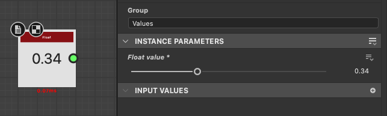

# 版本 16.0

這個 16.0 版本引入了更具創意的圖案散射與操作工作流程，這得益於新的 Shape Splatter 與 SDF 節點。 它也原生支援 OpenPBR，並改善 3D 視圖中的位移設定。

*發行日期：2026年4月14日*

## Shape splatter v2 節點

### 形狀散射的新方法

新的 [Shape splatter v2](../../compositing-graphs/nodes-reference-for-com/node-library/texture-generators/patterns/shape-splatter-v2/shape-splatter-v2.md) 節點解鎖了之前一直具挑戰性的複雜散射行為，包含&#x200B;**更多形狀分布方法**（泊松圓盤、均勻分布）*預設無*&#x200B;碰撞，並能透過密度貼&#x200B;**圖控制&#x200B;*特定區域**形狀的乾淨收集*。\
進階使用者可設定 *由函數圖定義的自訂分布* 。

<table style="margin-top: 32px; margin-bottom: 32px">
    <tr style="border: 0">
        <td style="width: 33%; border: 0">
             <i>泊松分布</i>
        </td>
        <td style="width: 33%; border: 0">
             <i>均勻分布</i>
        </td>
        <td style="width: 33%; border: 0">
             <i>形狀濺射 v2：密度地圖</i>
        </td>
    </tr>
</table>

### 三維形狀

散落的形狀現在 **是 3D 物件** ，可以在所有 XYZ 軸上移動、旋轉和縮放。

使用&#x200B;**簡單的基元**，如立方體、球體和圓柱體，或&#x200B;**是透過&#x200B;*拉伸高度圖*或撰寫 *3D SDF 形狀*所形成的複雜自訂形狀**。（下文會詳細說明）

這解鎖了更具動態、多樣性且整體可信度更高的分散。 現在可以透過翻轉3D形狀來重新利用它們來變化。 （我們看見你們了，環境藝術家們！）

<table style="margin-top: 32px; margin-bottom: 32px; border: none">
    <tr style="border: 0">
        <td style="width: 33%; border: 0">
             <i>隨機三維旋轉</i>
        </td>
        <td style="width: 33%; border: 0">
             <i>形狀擠出</i>
        </td>
        <td style="width: 33%; border: 0">
             <i>3D SDF 形狀</i>
        </td>
    </tr>
</table>

### 伴隨節點

類似於 Shape splatter v1 系列節點，Shape splatter v2 也有自己的伴侶節點群。

[Shape splatter v2 映射](../../compositing-graphs/nodes-reference-for-com/node-library/texture-generators/patterns/shape-splatter-v2-mapper-color/shape-splatter-v2-mapper-color.md) 節點能將貼圖投影到散布的 3D 形狀上，並支援 *三平面投影* 及 *材質 ID* 來映射多個貼圖。 結果可以全域調整，或針對每個形狀調整材質偏移與色彩變化。\
進階使用者同樣可以設定 *由函式圖定義的自訂貼圖貼圖* 。

[形狀濺射 v2 到遮罩](../../compositing-graphs/nodes-reference-for-com/node-library/texture-generators/patterns/shape-splatter-v2-to-mask/shape-splatter-v2-to-mask.md) 會為特定形狀和/或材質 ID 選擇建立遮罩，讓圖中下游的形狀能更細緻地使用。

<table style="margin-top: 32px; margin-bottom: 32px; border: none">
    <tr style="border: 0">
        <td style="width: 33%; border: 0">
             <i>三平面映射</i>
        </td>
        <td style="width: 33%; border: 0">
             <i>法線映射</i>
        </td>
        <td style="width: 33%; border: 0">
             <i>從 SDF 形狀中依材質 ID 映射</i>
        </td>
    </tr>
</table>

### 格網圖集

<table>
    <tr style="vertical-align: top; border: 0">
        <td style="border: 0">
            
自訂圖案可以單獨提供給 Shape splatter v2 節點，或打包在格子圖集中，以實現更精簡且更有效率的工作流程。

由於新增了網 <a href="../../compositing-graphs/nodes-reference-for-com/node-library/texture-generators/patterns/grid-atlas-color/grid-atlas-color.md">格圖集</a> 節點，打包模式變得更簡單。

        </td>
        <td style="text-align: right; width: 33%; margin-left: 32px; border: 0">
            
        </td>
    </tr>
</table>

### 材料樣本

<table style="border: none">
    <tr style="border: none">
        <td style="border: none; vertical-align: top">
            
<b>Rusty bolts</b> <a href="../../compositing-graphs/creating-compositing-gra/material-samples/material-samples.md">材質範例</a>可供跳躍 Shape splatter v2 系列節點及其功能。

圖表有組織並註解，引導你了解結構、節點設定與技巧。

它也 <i>完全可</i> 編輯，可以作為沙盒，讓你更實際地了解 Shape splatter v2 工具組。 你可以製作任意多的範例圖表，歡迎隨意嘗試！

        </td>
        <td style="border: none; width: 20%; vertical-align: top; text-align: right">
            
        </td>
    </tr>
</table>

## 3D SDF 節點（有符號距離場）

<table>
    <tr style="vertical-align: top; width: 75%; border: 0">
        <td style="border: 0">
            
Designer 16.0 新增了一種強大的方法，利用龐大的節點目錄來產生功能圖中的三維形狀，以撰寫 SDF 函數。

有符號距離場是將空間表示為數學上定義的曲面距離。 隨著這些曲面被轉換並結合各種運算符，它們可用來定義越來越複雜的形狀。

        </td>
        <td style="text-align: right; width: 25%; margin-left: 32px; border: 0">
            
        </td>
    </tr>
</table>

### 撰寫 3D SDF 函式

SDF 函數包含一 [組新的節點](../../function-graphs/nodes-reference-for-fun/function-node-library/function-node-library.md#sdf-functions) 族，分為四類：

* **基本** 元件是基本的建構，它們會產生簡單可調整的形狀，並有幾個控制點讓你依需求調整。
* **運算符根據節點不同，以** 直接或複雜的方式組合或複製形狀：從簡單的布林運算子到變形、殼層與對稱性，大幅擴展了可達成三維形狀的可能性
* **變形** 讓你能如預期般調整形狀的位置、旋轉和大小，甚至更多地調整彎曲、扭轉和伸長。
* **材質** 節點允許你設定一些基本材質屬性——例如顏色和材質 ID——這些屬性可以用來被 [Shape splatter v2](../../compositing-graphs/nodes-reference-for-com/node-library/texture-generators/patterns/shape-splatter-v2/shape-splatter-v2.md) 系列節點用來遮罩或著色形狀。

>[!INFO]
> 
> 請前往 [「與 SDF 功能](../../function-graphs/nodes-reference-for-fun/function-node-library/function-nodes-sdf-functions/working-with-sdf-functions.md) 合作」頁面，開始操作這些節點。

輕量化節點搭配清晰易讀的圖示，讓打造 3D SDF 函式比你想像中還要容易，尤其是這個工具組的新成員......

### 3D 檢視節點

當你撰寫 3D SDF 函數時，你需要在 3D 空間中視覺化產生的形狀。 [3D 檢視節點](../../compositing-graphs/nodes-reference-for-com/node-library/filters/effects/3d-viewer/3d-viewer.md)將 3D SDF 或 intersection 功能渲染為 3D 場景，具備可調整的攝影機控制、自訂環境光源及基本材質渲染支援。（色彩、粗糙與金屬感）

節點還包含詳細檢查產生形狀及除錯問題的功能：分別渲染通道（AOV）、SDF 等值線與視覺輔助工具。 (E.g. Bbox 出血色彩、網格與旋轉弧線）

<table style="margin-top: 32px; margin-bottom: 32px">
    <tr style="width: 50%; border: 0">
        <td style="text-align: center; width: 50%; border: 0; padding: 15px">
            
        </td>
        <td style="width: 50%; border: 0; padding: 0">
            <table>
                <tr style="vertical-align: top; border: 0">
                    <td style="text-align: center; border: 0">
                        
                    </td>
                    <td style="text-align: center; border: 0">
                        
                    </td>
                </tr>
                <tr style="vertical-align: top; border: 0; background: transparent">
                    <td style="text-align: center; border: 0; background: transparent">
                        
                    </td>
                    <td style="text-align: center; border: 0; background: transparent">
                        
                    </td>
                </tr>
            </table>
    </tr>
</table>

## OpenPBR 支援

[OpenPBR Surface](https://academysoftwarefoundation.github.io/OpenPBR/) 是一個表面著色模型的規範，旨在作為電腦圖形的標準，能夠準確模擬絕大多數材質。

此材質模型現已支援整個應用程式，並在我們的新渲染器（Rasterizer、GPU Pathtracer）及 OpenGL 渲染器中均 [配備專用著色器](../../interface/3d-view/material-properties/material-properties.md#openpbr) 。

開始使用這個廣泛採用的產業標準，搭配新的圖表範本，或是瀏覽基於 OpenPBR 的內建材料範例。

<table style="border: none; margin-top: 32px; margin-bottom: 32px">
    <tr style="vertical-align: top; border: 0">
        <td style="text-align: center; border: 0">
            
        </td>
        <td style="text-align: center; border: 0">
            
        </td>
    </tr>
</table>

OpenPBR 著色器現為 3D View 的預設，並原生支援先前版本的圖形，透過將舊有的 PBR 使用方式與 OpenPBR 的比對。

OpenPBR 著色器支援的效果比現有著色器更多，例如薄膜和薄牆。 所有效果皆可在光柵化（Rasterizer、OpenGL）中實現，包括折射，終於如此！

<table style="border: none;">
    <tr style="vertical-align: top; border: 0">
        <td style="border: 0">同時，透過新增 <a href="../../compositing-graphs/graph-parameters/graph-parameters.md#attributes">Substance 圖形的「Material model」屬性</a> ，確保在 3D 視圖中觀看的圖形使用適合該圖材質模型的著色器，也更容易讓特定著色器的工作流程保持同步。
        </td>
        <td style="text-align: right; margin-left: 32px; border: 0">
            
        </td>
    </tr>
</table>

>[!NOTE]
> 
>該屬性也會包含在已發佈的 SBSAR 檔案中，以便整合進你的物料工作流程中。

## 3D 視圖中的位移控制

現在在 3D 視圖中調整位移與細分變得更快且更容易，且在 3D 視圖工具列中新增的位移彈出視窗](../../interface/3d-view/displacement/displacement.md)中，直接存取[。

調整 **高度比例**、 **高度等級** 和 **細分** 值，避免在材質屬性和渲染器設定中反覆調整。

這些控制項同時適用於我們的新渲染器（Rasterizer、GPU Pathtracer）以及 OpenGL 渲染器。

如果場景包含多個材質，請按住 <code>Shift 鍵先選擇你想調整的場景物件</code> 點擊它（僅限光柵器與 GPU Pathtracer）或在場景瀏覽器中選擇。

>[!NOTE]
> 
>在 Rasterizer 和 GPU Pathtracer *中，Tessellation 是每個物件*，OpenGL 則是&#x200B;*每個材質*。

## 其他變動

### 恆定值節點

<table style="border: none; margin-top: 32px; margin-bottom: 32px">
    <tr style="vertical-align: top; border: 0">
        <td style="border: 0">
            
為了更方便存取 Substance 圖中的常數值，新增節點以產生每種類型的簡單值。

你可以在 <b>函式庫的值&gt;常數</b> 區找到所有這些資料。

        </td>
        <td style="width: 60%; border: 0">
            
        </td>
    </tr>
</table>

### MDL 圖與 Iray 終止生命週期

正如您在 15.1 版本中收到的通知，MDL 圖形功能集與 Iray 渲染器現已從 Designer 中移除。\
我們自家的 GPU Pathtracer 是 Designer 中高品質寫實渲染的首選渲染器。

Designer 正逐漸放棄 MDL，轉而使用 MaterialX 作為其可互換且廣泛支援材質定義的著色語言。\
MaterialX 在電腦圖形產業迅速獲得重視，並可透過 USD 檔案攜帶，實現跨 DCC 與渲染器的完整場景可攜性。

>[!NOTE]
> 
>MDL 圖形與 Iray 渲染器的文件可透過其 [專門的終止生命週期頁面](../../technical-issues/mdl-graph-iray-eol/mdl-graph-iray-eol.md)取得。

### 視覺特效平台升級與 macOS 簡易版

以下函式庫已升級以符合最新的 VFX 平台標準：

* C++ 20
* Python 3.13
* Qt 6.8
* 提升 1.88
* OpenColorIO 2.5
* OpenSubDiv 3.7
* OpenEXR 3.4
* 一TBB 2022

macOS 最低支援版本的要求已更新為 macOS 14 Sonoma。

## 發行說明

### 16.0.0

*（2026年4月14日發行）*

### 新增內容

* [內容]形狀濺射 v2 節點
* [內容]形狀濺射 v2 映射器色彩/灰階節點
* [內容]形狀濺射 v2 到遮罩節點
* [內容]網格圖集節點
* [內容] 3D 檢視節點
* [內容] 3D SDF 運算子節點
* [內容] 3D SDF 原始節點
* [內容] 3D SDF 轉換節點
* [內容] 3D SDF 材質節點
* [內容]角度到向量節點
* [內容]恆定值節點
* [3D 視圖]OpenGL 渲染器的 OpenPBR 著色器
* [3D 視圖]用於光柵化器與 GPU Pathtracer 渲染器的 OpenPBR 著色器
* [3D 視角]位移視窗可設定高度比例、高度層級及鑲嵌
* [3D 視角]重新組織工具列項目
* [3D 視圖]在 3D 視圖中將 OpenPBR 設為預設材質模型
* [3D 視圖]讓 3D 視圖考慮「材料模型」圖形屬性
* [3D 視圖]在切換 Rasterizer/GPU Pathtracer 與 OpenGL 渲染器時，同步材質模型
* [3D 視圖]確保材質模型在切換 3D 渲染器和材質定義變更時是持久的是同步的
* [3D 視圖]GPU 路徑追蹤器：啟用藍噪點像素循環
* [3D 視角]曝光環境遮蔽不透明度控制
* [3D 視圖]將所有著色器的「平鋪」參數範圍設為 [0， 10]
* [3D 視圖]將「焦點」動作重新命名為「框架」
* [3D 視圖]處理取代 tessellationFactor 的新 refineLevel 參數
* [3D 視角]新增 FPS 計數器
* [3D 視角]將進度條移到與底部色彩空間相同的水平工具列
* [烘焙師]在預覽中顯示所選烘焙者的 UV 效果
* [圖表]新增「物質模型」屬性至物質圖
* [NewGraph]在縮圖檢視中新增分隔符
* [參數]使用「函數」編輯器定義輸入參數的預設常數值
* [參數]將可用變數填充與節點參數的組合盒`Set` `Is defined`
* [偏好設定]移除「3D 視圖」分頁中已過時的「去縮減因子」選項
* [發佈]發佈對話框：將材質模型納入圖資訊中
* [Python]新增類別 SDMaterialModelDescription 以取得材料模型的資訊
* [Python]允許取得/設定 SDSBSCompGraph 物件的材質模型屬性
* [Python 編輯器]字型大小增至 12
* [範本]新增 OpenPBR 範本
* [模板]將素材樣本轉換為 OpenPBR
* [第三方]更新 Boost 至 1.88 版本
* [第三方]將 C++ API 更新至 C++20
* [第三方]NGL 更新至 1.42
* [第三方]更新 oneTBB 至 2022.x 版本
* [第三方]更新 OpenColorIO 至 2.5.x 版本
* [第三方]將 OpenEXR 更新至 3.4.x 版本
* [第三方]更新 Qt 與 QtForPython 至 6.8.x，Python 更新至 3.13.x
* [第三方]更新TBB為oneTBB 2021.x
* [棄用]移除 Iray 和 MDL 編輯

### 修正方法

* [2D 視圖]當小工具寬度變小時，直方圖選擇範圍不會被保留
* [3D 匯出]從 Designer 匯出的網格在 usdview 中渲染不一樣
* [3D 視圖]將非 UDIM 的設定指派到 3D 視圖會變成單格渲染模式
* [3D 視圖]使用 OCIO 時的壓縮結果
* [3D 視圖]在特定場景中，對未覆寫材質套用圖形貼圖時會崩潰
* [3D 視角]建立影格緩衝區時當機
* [3D 視圖]Eclair GPU Pathtracer：渲染特定模型時幾何結構損壞與效能低
* [3D 視角]特定場景的貼圖轉換錯誤
* [3D 視角]使用固定渲染解析度時場景/選取框不一致
* [3D 視角]渲染某些 GLTF 檔案時，漫反射色彩錯誤
* [3D 視圖]在特定情況下切換渲染器時的隱形環境
* [3D 視圖]有些 .fbx 檔案匯入時，材質無法正確偵測
* [3D 視角]覆蓋材質超過一次會將平鋪重置為 1
* [3D 視圖]「UVs」類別中的屬性不會儲存到 SBSSCN 檔案中
* [3D 視圖]「從單一輸出圖中重置並檢視 3D 視圖輸出」不會重置材料
* [3D 視圖]「儲存渲染」：編輯後的影像格式未被保留
* [3D 視圖]AMD顯示卡上的選擇無法運作
* [3D 視圖]自包含的 3D 場景在磁碟上修改時不會被重新整理
* [3D 視角]某些色彩材質屬性在覆寫時無法正確管理色彩
* [3D 視角]UDIM 材質未正確套用於特定網格
* [3D 視角]使用 MaterialX 材質的 USD 場景不再正確渲染
* [貝克]與一些網格碰撞
* [Bakers]材質傳輸：bkBufferViewCopy 當機
* [Cooker]無限迴圈在 While 迴圈節點，發生在一個可以避免的情況下
* [引擎]關閉應用程式時停止物質引擎
* [一般]避免在退出應用程式時隨機當機（僅限 Windows）
* [圖]函數圖：型別傳播在某些情況下無法正常運作
* [圖]當影像輸入節點被重新命名時，圖連結會被刪除
* [圖表]連結與釘選有時會顯示瑕疵
* [偏好設定]「視窗縮放」是反轉的
* [屬性]在修改圖輸入調整時，顯示實例參數時會當機
* [Python]無法匯入 PySide6 模組（可能與現有 PySide6 安裝衝突）
* [Python]現有的 PySide 與 Shiboken 模組與 Designer 的模組衝突
* [使用者介面]滑鼠懸浮樣式在特定情況下會消失在按鈕上（僅限 Windows）
* [使用者介面]點擊下拉按鈕時，懸浮樣式不會顯示（僅限 macOS）
* [使用者介面]「？」工具提示中的「了解更多」按鈕在提示視窗範圍外時無法使用（僅限 Windows）

### 已知問題

* [圖表]OpenPBR 圖產生的圖示並不準確
* [3D 視圖]帶有動畫圖元的場景未獲得適當支援
* [3D 視圖]並非所有 AMD 顯示卡都支援 Pathtracer

