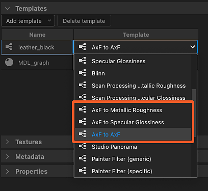

# AxF（外觀交換格式）

<table>
<tr style="border: 0;">
<td width="25.00%" style="border: 0;" valign="top">

</td>
<td width="100.00%" style="border: 0;" valign="top">

Substance 3D Designer 支援 [X-Rite 的外觀交換格式。](https://www.xrite.com/axf) 該格式的創作者如此描述：

AxF 檔案用於捕捉、儲存、編輯及傳達數位設計工作流程中複雜的材料特性。 AxF 提供標準方式，能在產品生命週期管理（PLM）、電腦輔助設計（CAD）及最先進的渲染應用程式中，儲存並共享所有相關外觀資料——色彩、紋理、光澤、折射、半透明、特殊效果（閃光）及反射特性。」

</td>
</tr>
</table>

簡單來說，AxF 檔案承載由 X-Rite 的 TAC7 掃描器硬體擷取的多種紋理，並結合描述材料額外特性的元資料。 這表示 AxF 不只是貼圖資料，它還帶有著色特性。

AxF 檔案 *不會* 匯入為套件 [資源](../../resources/resources.md)。 匯 [入過程](#import) 是從 AxF 檔案中擷取材質與元資料，然後用這些資料製作由 [專用範本](#graph-templates)建立的圖表。

可用的範本針對兩種 AxF 工作流程：

* <b>將</b> AxF 檔案中的 SVBRDF 素材轉換成 PBR 素材;
* <b>在原地編輯</b> SVBRDF 材質，並將其 [匯出](#export) 到現有的 AxF 檔案作為新圖層。

>[!NOTE]
>
> 支援材質模型
> 
> 只有使用 <b>SVBRDF</b> （空間變化 BRDF）模型的材質才能 *在 Designer 中完全* 載入並編輯。
> 
> 使用 <b>EP-SVBRDF</b> （節能 SVBRDF）模型的材料可以載入，但只能編輯並視覺化 SVBRDF 模型中存在的特徵。 EP-SVBRDF 獨有的功能不被支援。
> 
> 其他型號則不支援。

## 匯入 AxF 檔案

AxF 檔案匯入工作流程可從以下兩種方法之一開始：

+++主畫面

點擊<b>主畫面[&#128279;](../../interface/home-screen/home-screen.md)左側的「匯入 AxF...</b>」按鈕。

{width="600px"}

+++

+++總管

在檔案總管中[點選套件的 RMB，然後在套件的情境選單中選擇<b>匯入 AxF</b>](../../interface/the-explorer-window/the-explorer-window.md) >。

{width="600px"}

+++

### 匯入對話框

<b>AxF 匯入</b>對話框讓你檢視從所選 AxF 檔案載入的資料，並設定執行預定編輯或轉換所需的圖表範本。

它包含四個部分：

<b>標頭</b>顯示 AxF 檔案中偵測到的材料名稱及其表示方式（目前始終為 SVBRDF）。檔案中嵌入的預覽縮圖也會被顯示。

<b></b>模板區塊讓你可以設定 [Substance 圖表](../../compositing-graphs/substance-compositing-graphs.md)範本，開始處理這些材料。請參閱 [下方的圖表範本](#graph-templates) 章節，了解更多關於這些範本及其設定方法。

<b>Textures</b> 列出所有從 AxF 檔案中擷取、涉及偵測材質的材質貼圖。 每個材質都會顯示其名稱、原生解析度、資料格式及實體尺寸。

<b>元資料</b> 與 <b>屬性</b> 列出從 AxF 檔案中素材擷取的資料。 這些會影響某些 Substance 圖範本屬性的設定方式（詳見 [下方圖範本](#graph-templates) 章節）。

### 結果

點擊<b>確定</b>按鈕後，檔案總管[&#128279;](../../interface/the-explorer-window/the-explorer-window.md)會建立一個套件。該套件包含以下資源：

<table>
<tr style="border: 0;">
<td style="border: 0;" valign="top">

Resources <b></b> 資料夾會為從 AxF 檔案匯入的每種材料提供一個&#x200B;*子資料夾*。

每個子資料夾包含另一個子資料夾，裡面有 *從 AxF 檔案中提取的材質貼圖* 。 最後這個子資料夾以材質材質表示&#x200B;*命名*（目前僅限 <b>SVBRDF</b>）。

每個範本的圖表會在匯入對話框的範本</b>區塊中建立<b>。\
以 Substance 圖形[&#128279;](../../compositing-graphs/substance-compositing-graphs.md)為例，這些圖已預先設定，包含從 AxF 檔案擷取的材質與資料，以及您所選的範本設定（詳見下方圖範本章節）。

</td>
<td style="border: 0;" valign="top">

</td>
</tr>
</table>

## 圖範本

<table>
<tr style="border: 0;">
<td style="border: 0;" valign="top">

有專門針對 Substance 圖形[&#128279;](../../compositing-graphs/substance-compositing-graphs.md)的 AxF 工作流程的圖形範本。

點擊 <b>「新增範本</b> 」按鈕，並在下拉選單中選擇想要的圖表類型。

</td>
<td style="border: 0;" valign="top">

</td>
</tr>
</table>

### 實質圖範本

<table>
<tr style="border: 0;">
<td style="border: 0;" valign="top">

有兩種類型的 Substance 圖範本可供選擇：

<b>AxF 轉為金屬粗糙度</b>，以及 <b>AxF 轉為鏡面光澤度</b>，這些都是&#x200B;**&#x200B;轉換模板，讓你能將 AxF 材質映射到標準 PBR 模型。\
這些素材可搭配預設的 3D View 著色器使用，並與 Designer、 [Sampler](https://www.adobe.com/tw/products/substance3d-sampler.html) 製作的其他 PBR 材質或從我們的 [3D 資產](https://substance3d.adobe.com/assets/) 庫取得結合。

<b>AxF to AxF</b> 是一個 *直通* 模板，讓你能在原地編輯 AxF 材質，並將這些變更匯出成現有 AxF 檔案中的新圖層。 請參考下方「匯出 AxF 檔案」以了解更多資訊。

</td>
<td style="border: 0;" valign="top">

</td>
</tr>
</table>

<table>
<tr style="border: 0;">
<td style="border: 0;" valign="top">

對於所有加入模板</b>清單的<b>實體圖範本，會執行以下額外操作：

對於[<b>任何與&#x200B;*從 AxF 檔案擷取的紋理識別碼*&#x200B;相符&#x200B;*的輸入</b>](../../compositing-graphs/nodes-reference-for-com/atomic-nodes/input/input.md)節點*，該輸入節點會被一個引用該紋理的節點取代[位圖](../../compositing-graphs/nodes-reference-for-com/atomic-nodes/bitmap/bitmap.md);

圖的<b>解析度</b>屬性（即輸出大小）會自動設定為等於或高於最大&#x200B;*擷取紋理解析度*&#x200B;的二的冪次方;

[位圖](../../compositing-graphs/nodes-reference-for-com/atomic-nodes/bitmap/bitmap.md)節點的<b>解析度</b>屬性（即輸出大小）在前一個操作套用後會自動設定為圖的 mach;

圖的 <b>Physical size</b> 屬性設定為第一個&#x200B;*擷取的*&#x200B;貼圖的物理大小;

*圖中參數的預設值*&#x200B;會設定為與 AxF 檔案中的資料相符。

*從 AxF 檔案中素材擷取的元資料*&#x200B;會複製到圖的<b>描述</b>屬性中。

>[!IMPORTANT]
>
> 圖參數的預設值在此初始配置後不應被修改。
> 
> 它們指定了著色屬性，這些屬性對於正確解讀貼圖中的數值至關重要。
> 
> 因此，更改這些設定會導致在 3D 視圖[&#128279;](../../interface/3d-view/3d-view.md)中視覺化材質時呈現錯誤。

</td>
<td style="border: 0;" valign="top">

</td>
</tr>
</table>

## 匯出 AxF 檔案

現有的 AxF 檔案可以直接從 Designer 編輯，資源會透過 [Substance 圖](../../compositing-graphs/substance-compositing-graphs.md)的輸出[&#128279;](../../compositing-graphs/nodes-reference-for-com/atomic-nodes/output/output.md)更新。

由於能將圖形輸出匯出為 AxF 檔案，Designer 中典型的 AxF 工作流程可能如下：

1. 匯入 AxF 檔案
1. 使用「AxF to AxF」物質圖表範本
1. 利用 Substance 圖中可用的特徵與節點編輯擷取的貼圖
1. 將圖表輸出匯出成同一個 AxF 檔案

圖的 <b>Physical Size</b> 屬性用於設定 <b>編輯後 AxF 檔案中更新材質的 Physical Size</b> 屬性。

>[!NOTE]
>
> 檔案中資源的變更會被新增為 *一層*。 這表示每次從 Designer 匯出到同一個 AxF 檔案時，該檔案的大小都會增加。

<table>
<tr style="border: 0;">
<td width="33.33%" style="border: 0;" valign="top">

### 匯出對話框

<b>AxF</b> 匯出對話框作為專用分頁可在<b>匯出輸出</b>對話框中使用。

在[圖表檢視](../../interface/the-graph-view/the-graph-view.md)工具列中，開啟<b>工具</b>選單，選擇<b>「匯出輸出...</b>」選項以顯示對話框，然後選擇 <b>AxF</b> 標籤。

</td>
<td width="100.00%" style="border: 0;" valign="top">

</td>
</tr>
</table>

對話分為三個主要部分：

<b>檔案</b>輸入欄位可以讓你選擇應該編輯的目標 AxF 檔案。該檔案會被載入並檢查，若有效，則用其資料填充下方的「AxF 資源」欄位。

<b>映射輸出</b>會在輸出欄位列出圖的輸出，並與目標檔案中共享相同&#x200B;*識別碼*&#x200B;的 AxF 資源進行比對&#x200B;**。若偵測到任何問題，則會在備註欄中以警告（黃色）或錯誤（參考）顯示。

<b>未映射輸出會</b> 列出目標檔案中無法映射的圖形輸出與 AxF 資源。 這些輸出被忽略，AxF 資源則保持不變。

>[!NOTE]
>
> 圖形輸出必須將其 <b>Group</b> 屬性設為 &#39;AxF&#39;，才能在此對話框中列出。

點擊 <b>「開始匯出 </b>」以編輯目標 AxF 檔案，新增包含映射輸出變更的圖層。

結果會以訊息形式顯示在對話框的進度列旁。

>[!TIP]
>
> 每次執行匯出時，目標檔案都會建立一個新的圖層。 因此，務必謹慎且有目的地匯出檔案大小與複雜度。

### 將輸出映射到 AxF 資源

匯出至現有 AxF 檔案時，其資源會透過圖形輸出更新。 設計者會將資源識別碼匹配到[&#128279;](../../compositing-graphs/nodes-reference-for-com/atomic-nodes/output/output.md)輸出節點，輸出節點與使用量識別碼相同<b></b>。

此外，輸出的 <b>群組</b> 屬性 *必須* 設為「AxF」，才能在 AxF 匯出對話框中列出（見上文）。

資源可以是具有特定通道數量的貼圖（例如點陣圖）或統一圖（即數值）。 圖的輸出必須完全符合該頻道數量。 若非如此，匯出時該資源會產生錯誤，且該資源將保持不變。

通道數量會根據提供給輸出節點的資料類型而有所不同：

* <b>位圖（紋理）：</b>[Components](../../compositing-graphs/nodes-reference-for-com/atomic-nodes/output/output.md) 屬性用來指定通道數量，其中 R 為一個通道，RG 為兩個通道，依此類推。此屬性用來讓 Designer 知道應該編碼在該資源中，哪一個顏色點陣圖的 RGBA 通道。
* <b>值（統一）：</b> 向量值的分量數用來指定通道數量，其中 [Float](../../function-graphs/nodes-reference-for-fun/atomic-function-nodes/constant-nodes/constant-nodes.md) 為一個通道， [Float2](../../function-graphs/nodes-reference-for-fun/atomic-function-nodes/constant-nodes/constant-nodes.md) 為兩個通道，依此類推。

>[!IMPORTANT]
>
> 在 <b>AxF 到 AxF</b> 實體圖模板中，[鏡面瓣</b>貢獻的輸出](../../compositing-graphs/nodes-reference-for-com/atomic-nodes/output/output.md)節點<b>預設為&#x200B;*單一通道*（即其 Components 屬性設為 &#39;R&#39;）。\
> 如果匯入的 AxF 檔案在其鏡面瓣資源中使用多個通道，請相應地設定輸出元件<b></b>屬性。
> 
> 例如，對於使用兩個通道（紅色代表鏡面粗糙度，綠色代表鏡面各向異性）的鏡面瓣資源，將 Components 屬性設為「RG」。

## 在 3D 檢視中檢視 AxF 檔案

在 3D 視圖[&#128279;](../../interface/3d-view/3d-view.md)中渲染 AxF SVBRDF 材質的方法取決於匯入設定。[&#128279;](#import)

+++轉換為PBR

如果你想將 AxF 檔案中的 SVBRDF 材質轉換成標準 PBR 材質，那麼你的匯入設定很可能會包含 [Substance 圖轉換範本](#graph-templates)。

那你應該在 3D View 中使用 **OpenGL 渲染器** ，並選擇 <code>AxF SVBRF</code> 著色器。\
接著，你可以拖放你在匯入對話框中設定的 Substance 圖，將其輸出連接到著色器。

+++

+++編輯已就位

如果你的目標是對現有的 AxF 檔案進行 *編輯* ，請依照以下指示，根據所選渲染器來視覺化其 SVBRDF 材質：

有一個專用的 GLSLFX 著色器可用於從 AxF 檔案 <b>中使用 SVBRDF 表示來視覺化材質：AxF SVBRDF</b>。

著色器可在<b>材質選單中取得：開啟場景材質的子選單（預設為「預設」），並在 AxF SVBRDF</b> 條目中選擇任一技術<b></b>。

在同一<b>子選單中的編輯</b>選項，在屬性[&#128279;](../../interface/properties/properties.md)底座中顯示著色器的屬性。\
特別是， <b>平鋪</b> 特性讓你能調整模型貼圖的平鋪，讓你能以適當的比例想像材質。

選擇著色器後，在圖表空白處點選 RMB，並選擇<b>「3D View</b> 中的輸出」選項，以在 3D View[&#128279;](../../interface/3d-view/3d-view.md) 中視覺化其輸出。

{width="600px"}

這個著色器目前 *仍在開發* 中，有些功能仍未被支援。 因此，雖然它能提供材料特性的概覽，但不應用於細微調整。

在同一<b>子選單中的編輯</b>選項，在屬性[&#128279;](../../interface/properties/properties.md)底座中顯示著色器的屬性。\
特別是， <b>平鋪</b> 特性讓你能調整模型貼圖的平鋪，讓你能以適當的比例想像材質。

選擇著色器後，在圖表空白處點選 RMB，並選擇<b>「3D View</b> 中的輸出」選項，以在 3D View[&#128279;](../../interface/3d-view/3d-view.md) 中視覺化其輸出。

<i>注意：</i> 請忽略從切換到 Iray 渲染器的影片部分，直到最後，因為 Iray 渲染器和 MDL 支援在 Designer 16.0.0 版本中已被 <i>移除</i> 。

+++

### 支援的型號變體

3D 視圖中使用的著色器支援以下變體，適用於鏡面、菲涅耳及透明塗層傳輸模型：

<table>
<tr style="border: 0;">
<td style="border: 0;" valign="top">
<b>鏡面變體</b>

* 沃德 / 蓋斯勒-莫羅德 2010
* GGX / Walter2007
* GGX / 羅斯 2005

</td>
<td style="border: 0;" valign="top">
<b>菲涅耳變體</b>

* Schlick 1994
* Schlick 1994 彩色
* 簡單菲涅爾

</td>
<td style="border: 0;" valign="top">
<b>透明塗層變速箱變體</b>

* 折射狄拉克 *（僅限 OpenGL）*
* Refractive Dirac / 無實心角壓縮 *（僅限 OpenGL）*
* 非折射狄拉克
* 非折射式狄拉克 / DSPBR 2020x
* GGX

</td>
</tr>
</table>
