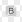

# 點陣圖繪製工具

本頁介紹了 2D View[&#128279;](../../../interface/2d-view/2d-view.md) 面板中可用於相容點陣圖的繪畫工具。

{width="512px"}

## 概觀

[2D View](../../../interface/2d-view/2d-view.md) 面板提供基本的點陣圖繪製工具，讓你能直接在應用程式內手動創建或編輯影像&#x200B;**。這些工具特別有用，例如快速繪製 *遮罩*。

這些工具支援筆輸入，包括 *筆壓*。 要善用手寫螢幕，你可以[先拔掉](../../../interface/customizing-your-wor/customizing-your-workspace.md) [2D視窗](../../../interface/2d-view/2d-view.md)面板，然後放置並調整大小，讓繪畫更舒適。

編輯可以 *單獨*&#x200B;還原，且在編輯圖片時，2D 檢視面板的其他功能仍 *可使用* ，例如 [直方圖](../../../interface/2d-view/2d-view.md) 面板、 [平鋪顯示](../../../interface/2d-view/2d-view.md)和 [背景影像](../../../interface/2d-view/2d-view.md)。

>[!IMPORTANT]
>
> 你只能&#x200B;*用新的或匯入[&#128279;](../../../resources/importing-linking-and-new/importing-linking-and-new-resources.md)的 8 位元*&#x200B;點陣資源[&#128279;](../../../resources/bitmap-resource/bitmap-resource.md)來繪製&#x200B;**。

>[!WARNING]
>
> **僅限 Windows**
> 
> 平板使用者應依以下頁面所述設定，以獲得最可靠的使用體驗： [設定筆與平板](https://docs.substance3d.com/display/SPDOC/Configuring+Pens+and+Tablets)

{width="512px"}

## 啟用繪畫工具

當符合以下關於點陣圖的條件時，繪圖工具會在2D檢視[&#128279;](../../../interface/2d-view/2d-view.md)面板中自動啟用：

* 點陣圖是[新資源或匯入資源](../../../resources/importing-linking-and-new/importing-linking-and-new-resources.md)
* 位圖精度為 *8 位元*
* 點陣圖會顯示在 2D 視圖[&#128279;](../../../interface/2d-view/2d-view.md)面板中

**&#x200B;新的點陣圖可透過以下方式建立：

* 在[檔案總管](https://helpx.adobe.com/tw/substance-3d/unlisted/documentation/sddoc/the-explorer-129368147.html)面板中，點擊 SBS 套件&#x200B;*上的 RMB*&#x200B;鍵，或套件內的&#x200B;*資料夾*，開啟其上下文選單，接著開啟<b>新子</b>選單並選擇<b>點陣圖</b>選項
* 在圖表[&#128279;](../../../interface/the-graph-view/the-graph-view.md)中，建立一個[點陣圖節點](../../../compositing-graphs/nodes-reference-for-com/atomic-nodes/bitmap/bitmap.md)，並在情境選單中選擇<b>「來自新資源...</b>」的選項

<b>新點陣</b>圖視窗會開啟，讓你設定&#x200B;*新點陣資源的名稱*、*解析度*&#x200B;和&#x200B;*背景色*。

>[!NOTE]
>
> *新的* 點陣圖資源 *總是* 有 *RGBA* 顏色和 *8位元* 精度。

>[!WARNING]
>
> 為了讓繪色工具達到最佳效能，我們建議使用解析度 *為二* 的冪次方的點陣圖——例如 128、256、512、1024、...

## 工具列

繪畫工具和選項排列在 *2D 視圖[&#128279;](../../../interface/2d-view/2d-view.md)面板的工具列*&#x200B;中。這些工具列可透過點擊並按住<b>左鍵&#x200B;**</b>（以三線表示）將工具列移至&#x200B;*面板任一側*&#x200B;或以&#x200B;*浮動工具列*&#x200B;形式移動，然後在指定位置放開<b>左鍵</b>。

啟用塗裝工具時會顯示兩個工具列： [工具選擇工具列](#bitmappaintingtools-toolselectiontoolbar) 和工具選項工具列，以下將說明。

## 工具選擇工具列

繪圖工具可在預設位於 2D 視圖面板左側&#x200B;*[的工具選取工具列&#x200B;***中找到**。](../../../interface/2d-view/2d-view.md)鍵盤快捷鍵讓你能快速存取這些工具，並在工具/函式名稱後方括號內標示：

<b>色彩選擇</b> <b>縮圖：</b>讓你定義原 *色* 和 *次色* 。 點擊任一縮圖即可顯示 <b>色彩編輯器</b> 視窗並定義顏色。 工具會使用 *原色* 。 主色與次色可 *隨時互換* （<b>X</b>）

<b>筆刷工具（B）：</b>當按下筆尖或<b>左鍵</b>按鈕時，依照工具選選項列中的選項，在游標位置套用&#x200B;*原色*

<b>印章工具（T）：</b>讓你能將圖像的一部分蓋章到另一個部分上。你可以按住 <b>Alt 鍵並點擊 <b>LMB</b> 來定義&#x200B;*應該蓋印的來源*</b>。當按下筆尖或<b>左鍵</b>按鈕時，該影像區域會依工具選集工具列中定義的選項，在游標位置的目標&#x200B;*區域上蓋*&#x200B;印。請注意，來源會&#x200B;*追蹤*&#x200B;目標的移動，且來源&#x200B;*區域的大小*&#x200B;會&#x200B;*與*&#x200B;畫筆大小相符&#x200B;**

<b>啟用對齊（印章工具選項）：</b>讓你能定義當新印章開始時，來源是否應該&#x200B;*保持原*&#x200B;位，或是應該&#x200B;*相對移至新印章位置*

<b> 橡皮擦（E）：</b>當按下筆尖或 <b>左鍵</b> 按鈕時，將游標位置的當前顏色替換為（0， 0， 0， 0），使用工具選項列中定義的選項。 請確保 [透明度顯示](../../../interface/2d-view/2d-view.md) 已啟用，以追蹤此工具對 <b>Alpha</b> 頻道的影響。

## 工具選項工具列

工具選擇工具列中可用的[工具選項可在預設位於 2D 視圖](../../../interface/2d-view/2d-view.md)面板上[方&#x200B;*的工具選集工具列*&#x200B;中找到。](#bitmappaintingtools-toolselectiontoolbar)

<table>
<tr style="border: 0;">
<td style="border: 0;" valign="top">

### 刷子選擇

筆刷選擇</b>讓你從可用的筆刷&#x200B;*預設*&#x200B;中選擇&#x200B;*預先設定*&#x200B;的筆刷，設定其<b>大小</b>與<b>硬度</b>（*見<b>筆刷編輯器的形狀</b>區塊），並顯示*&#x200B;筆觸的預覽*。 <b>

筆刷預設可以在筆刷編輯器中建立與編輯，並在函式庫&#x200B;*中進行*&#x200B;排列。這個面板中會出現的筆刷預設是 *所有已載入的筆刷預設函式庫的總和* 。 這些庫可透過筆<b>刷函式庫</b>選單管理（參見<b>筆刷編輯器的預設</b>區段）

選擇<b>背景色</b>按鈕可以讓你更改筆觸預覽&#x200B;*的*&#x200B;背景色。

</td>
<td style="border: 0;" valign="top">

</td>
</tr>
</table>

<table>
<tr style="border: 0;">
<td style="border: 0;" valign="top">

### 刷子編輯器

 <b>筆刷編輯器</b>提供細緻選項來定義筆刷的行為：

<b>預設音色</b>

畫筆可以自訂，然後儲存為<b>畫筆預設，這些預設</b>會在畫筆預設清單</b>和<b>畫筆選擇</b>面板中顯示<b>。

要建立預設，請將下方屬性設定成你喜歡的，然後點選<b>「新增畫筆預設</b>」按鈕，並在預設名稱</b>視窗中<b>設定畫筆名稱。新預設現在會自動在 <b>Brush 預設列表中</b>被選取，隨時可以<b>更新</b>為新的現有設定，或<b>刪除</b>它。

預設會被組織並儲存在&#x200B;*庫中，這些庫*&#x200B;可以在 Brush 庫</b>選單中管理<b>： 

<b>匯出函式庫：</b> *將目前的預設和所有設定存*&#x200B;到一個函式庫檔案

<b>從現有函式庫檔案匯入 library：</b>*load* 預設，並&#x200B;*將它們加入*&#x200B;目前清單——同&#x200B;*名預設會被函式庫檔案中的預設取代* 

<b>重設函式庫：</b> 透過預設函式庫重設目前的預設

<b>從現有函式庫檔案替換 library：</b> *load* 預設，並&#x200B;*關閉*&#x200B;目前的清單

</td>
<td style="border: 0;" valign="top">

</td>
</tr>
</table>

#### 畫筆設定

畫筆的設定分為以下幾個區塊：

+++形狀
<b>Shape 類型</b>參數控制筆刷的基本形狀。可用的形狀有：

* *橢圓*：預設為 *圓形* 的圓形

* *矩形*：預設為 *正方形* 的直線形狀

* *多邊形*：具有 *可* 自訂邊數和角度的直線形狀

<b>邊計數</b>（*僅限多邊形*&#x200B;形狀）：讓你選擇多邊形的面&#x200B;*數*

<b>內半徑 </b>（*僅限多邊形* 形狀）：提供對面 *中點* 與形狀中心距離的控制，有效形成 *星形* 圖案

<b>硬度</b>：定義&#x200B;*形狀的衰落半徑*

+++

+++變形
當對影像施加筆觸時，筆觸實際上是對筆刷圖案的重複壓印，遵循本節控制項所定義的行為。

<b>尺寸</b>：設定 *筆刷形狀的直徑* （像素單位）

<b>尺寸抖動：讓你隨機化&#x200B;*每個印章筆刷大小，以* Size</b> 值的百分比<b>*表示，並控制**隨機值範圍，從 <b>0</b> 到 <b>Size</b> 值*</b>

<b>尺寸控制</b>：如果你用支援 *筆壓*&#x200B;的筆輸入，可以用這個參數來控制筆刷大小

<b>間距</b>：控制 *每一枚印章* 沿筆觸的間距。 這有助於更清楚地區分和定義形狀圖案

<b>圓度</b>：預設情況下，<b>在形狀</b>區塊中選擇<b>的形狀類型</b>寬高比為 *1：1*。這個參數允許你透過降低寬度&#x200B;*與高度的百分比來改變這個比例*

<b>圓度抖動</b>：讓你隨機&#x200B;*化*&#x200B;每個郵票的圓度度，以&#x200B;*圓度</b>值的百分比*<b>表示，並控制&#x200B;**&#x200B;隨機值範圍，從 <b>0</b> 到 圓<b>度值</b>

<b>角度</b>：控制&#x200B;*刷子圖案的旋轉*&#x200B;度數&#x200B;**

<b>角度抖</b>動：讓你隨機&#x200B;*化*&#x200B;每個印章的旋轉，以&#x200B;*角度</b>值的百分比*<b>表示，並控制&#x200B;**&#x200B;隨機值範圍從 <b>0</b> 到 <b>360 </b>度

+++

+++散射
預設情況下，形狀圖案會嚴格沿著筆劃印上。 你也可以透過對形狀圖案施加偏移，讓它們散布在筆觸周圍，營造更自然或混亂的效果。

<b>散佈</b>：每枚郵票與筆劃之間應該有的最大&#x200B;*偏移距離*，以筆刷尺寸&#x200B;*的百分比*&#x200B;表示。請注意，這個距離預設是&#x200B;*從<b>* 0</b>隨機化到&#x200B;*刷子尺寸的設定百分比*，且&#x200B;*偏移方向*&#x200B;也是隨機的

<b>數量</b>：單張郵票散落的數量

+++

+++顏色
畫筆所施加的顏色由所選的原色定義&#x200B;*——如果目前已套用畫筆紋理，則是<b>畫筆材質</b>。*&#x200B;這個顏色可以透過本區的控制項動態改變。

<b>流動抖動</b>：讓你隨機&#x200B;*化*&#x200B;每個印章的流量，以最大流量的百分比&#x200B;*表示*

<b>流量控制</b>：如果你使用支援 *筆壓*&#x200B;的筆輸入，可以用這個參數來控制流量

<b>色相抖動</b>：讓你在 *每個印章中隨機化* 顏色色相 *偏移* ，以 *整個色相範圍的百分比* 表示

<b>飽和抖動</b>：讓你隨機 *化* 每個印章的色彩飽和 *偏移* ，以 *整個飽和度範圍的百分比* 表示

<b>亮度抖動</b>：讓你&#x200B;*隨機化*&#x200B;每個印章的顏色亮度&#x200B;*偏移*，以整個亮度範圍的百分比&#x200B;*表示*

+++

+++紋理
你可以套&#x200B;*用點陣檔案*&#x200B;到筆刷上，然後用它來&#x200B;**&#x200B;蓋印那個點陣圖，而不是用平面顏色。刷子材質的行為如下：

<b>紋理檔案： </b>定義&#x200B;*點陣圖的路徑*，應該用作筆刷貼圖。 你可以透過系統檔案瀏覽器，使用輸入欄位旁的按鈕選擇點陣圖

貼圖&#x200B;*只*&#x200B;取代了筆刷的基本平面色，表示&#x200B;*上述所有筆刷屬性仍可使用*&#x200B;並如描述功能

材質的顏色會&#x200B;*以色調偏*&#x200B;移，趨向&#x200B;*設定的原色*，意即如果設定的原色是白色，則貼圖顏色可以直接使用。 原色越飽和，材質顏色就越容易偏向該色調

+++

### 不透明度/流量

刷筆、蓋章與橡皮擦工具提供透明度與流動度的控制<b></b>：</b><b>

<b>不透明度</b> 控制 *郵票的最大不透明度* 。 它是&#x200B;*對不同筆劃*&#x200B;加法的，意即透過在該區域內多次獨立&#x200B;**&#x200B;筆劃，可以將該區域的不透明度回復到最大 100%

<b>流量</b> 控制 *工具在任何時刻施加的效果* 量。 它是&#x200B;*在同一筆劃*&#x200B;上的加法，意即可以透過在同一筆劃&#x200B;*中多次通過*，或多筆分開的筆劃，將該區域的不透明度回復到最大100%。

<table>
<tr style="border: 0;">
<td width="100.00%" style="border: 0;" valign="top">

### 平鋪模式

刷子、蓋章和橡皮擦工具也允許你設定平<b>鋪模式，這些模式</b>定義了當筆觸觸及影像範圍外區域時，它們能&#x200B;*繞回*&#x200B;影像另一側的能力：

<b>鋪平X和Y</b>：刷刷同時橫向和垂直平鋪&#x200B;**

<b>鋪磚X</b>：刷筆只會橫向鋪平板&#x200B;**

<b>平鋪Y</b>：刷筆只在垂直方向上鋪平&#x200B;**

<b>不鋪</b>磚：刷痕 *不會鋪磚*

</td>
<td width="25.00%" style="border: 0;" valign="top">

</td>
</tr>
</table>
