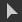

# 向量編輯工具

本頁介紹 2D 檢視](https://docs.substance3d.com/display/SDDOC/2D+view)面板中可用於[相容向量圖形的編輯工具。

## 概觀

<table>
<tr style="border: 0;">
<td style="border: 0;" valign="top">

[2D View](https://docs.substance3d.com/display/SDDOC/2D+view) 面板提供基本的向量編輯工具，讓你能直接在 Substance 3D Designer](https://www.adobe.com/products/substance3d-designer.html) 中[手動創建或編輯向量圖形&#x200B;**。這些工具特別有用，例如快速製作 *遮罩* 或 *圖案*。

這些工具支援筆輸入。 要善用手寫螢幕，你可以[先拔掉](https://docs.substance3d.com/display/SDDOC/Customizing+your+workspace)[2D視窗](https://docs.substance3d.com/display/SDDOC/2D+view)面板，然後放置並調整大小，讓繪畫更舒適。

編輯可以 *單獨*&#x200B;還原，而 2D 檢視面板的其他功能在編輯向量圖時仍 *可使用* ，例如 [直方圖](https://docs.substance3d.com/display/SDDOC/2D+view#id-2Dview-Histogram) 面板、 [平貼顯示](https://docs.substance3d.com/display/SDDOC/2D+view#id-2Dview-Viewport)和 [背景影像](https://docs.substance3d.com/display/SDDOC/2D+view#id-2Dview-Backgroundimage)。

</td>
<td style="border: 0;" valign="top">

{width="512px"}

</td>
</tr>
</table>

>[!TIP]
>
> **僅限 Windows**
> 
> 平板使用者應依以下頁面所述設定，以獲得 Designer 中最可靠的使用體驗： [設定筆與平板](https://docs.substance3d.com/display/SPDOC/Configuring+Pens+and+Tablets)

>[!IMPORTANT]
>
> 你只能&#x200B;*在全新或匯](https://docs.substance3d.com/display/SDDOC/Importing%2C+Linking+and+New+Resources)入的 8 位元*[向量圖形資源上繪圖&#x200B;*。*

{width="512px"}

## 啟用向量編輯工具

當符合向量圖形影像的以下條件時，向量編輯工具會在 2D 檢視](https://docs.substance3d.com/display/SDDOC/2D+view)面板中自動[啟用：

* 向量圖形影像是[新資源或匯入資源](https://docs.substance3d.com/display/SDDOC/Importing%2C+Linking+and+New+Resources)
* 點陣圖會顯示在 2D 視圖](https://docs.substance3d.com/display/SDDOC/2D+view)面板中[

**&#x200B;新的向量圖形影像可透過以下方式產生：

* 在[檔案總管](https://docs.substance3d.com/display/SDDOC/The+Explorer+Window)面板中，點擊 SBS 套件&#x200B;*上的 RMB*&#x200B;或套件內的&#x200B;*資料夾*，開啟其上下文選單，然後開啟&#x200B;**新子**&#x200B;選單並選擇 **SVG** 選項
* 在圖表中建立一個 [SVG 節點](../../../compositing-graphs/nodes-reference-for-com/atomic-nodes/svg/svg.md)，並在情境選單中選擇&#x200B;**「來自新資源......**」的選項

**新的向量資料**&#x200B;視窗會打開，讓你設定&#x200B;*新的向量圖形資源的名稱*&#x200B;和&#x200B;*解析度*。

>[!TIP]
>
> 為了讓向量編輯工具達到最佳效能，我們建議使用解析度 *為二* 的冪次方的向量圖像——例如 128、256、512、1024、...

### 從其他軟體匯出向量圖形

Designer *僅* 支援使用 **SVG** 檔案格式的向量圖形。

為了在 Designer 及其編輯工具中保持最佳相容性與可靠性，請確保所有物件都已轉換為輪廓&#x200B;*，並以平面色彩*&#x200B;拆分成&#x200B;*獨立*&#x200B;物件&#x200B;*，這樣*&#x200B;以下內容就不會被保留&#x200B;*：*

* **正文**
* **坡度**
* **圖案** （包括填充和筆劃輪廓）
* **風格**

**Adobe Illustrator** 使用者可參考附上的圖片以獲取推薦的 SVG *匯出設定。*

+++Adobe Illustrator 匯出選項

+++

>[!NOTE]
>
> 欲了解更多關於 SVG 限制、從其他軟體匯出及 Designer 中 SVG 屬性的資訊，請參閱 [向量圖形（SVG）資源](../../../resources/vector-graphics-svg-res/vector-graphics-svg-resource.md) 區塊。

## 工具

繪畫工具和選項排列在 *2D 視圖](https://docs.substance3d.com/display/SDDOC/2D+view)面板的工具[列*&#x200B;中。這些工具列可透過點擊並按住&#x200B;**左鍵&#x200B;****（以三線表示）將工具列移至&#x200B;*面板任一側*&#x200B;或以&#x200B;*浮動工具列*&#x200B;形式移動，然後在指定位置放開&#x200B;**左鍵**。

啟用向量編輯工具時，會顯示兩個工具列：

* **工具選擇****工具列**：讓你選擇&#x200B;*工具**以及填充/輪廓顏色*，預設位於 *2D 檢視面板的左側*
* **工具選項工具列**：讓你設定&#x200B;*目前選取工具**的選項*，預設位於 *2D 檢視面板的上方*

鍵盤快捷鍵讓你能快速存取工具，並在工具/函式名稱後的括號內標示：

+++色彩選擇
 **顏色選擇***縮圖*&#x200B;可以讓你為向量形狀定義&#x200B;*填色*&#x200B;和&#x200B;*輪廓*&#x200B;顏色。你可以用以下方式開啟 **每種顏色的色彩編輯器** ：

* **填色：** 點擊 *填色* 的縮圖（上方），或在畫布上雙擊 LMB

* **輪廓顏色：**&#x200B;點擊輪廓&#x200B;*顏色縮圖（底部），或*&#x200B;按住 Ctrl *鍵並雙擊畫布*&#x200B;上的 LMB 鍵

接著，這些設定的顏色會套用到目前選取的&#x200B;**&#x200B;形狀上。

如果目前&#x200B;*輪廓色是*&#x200B;黑色&#x200B;*——例如亮度 0 或 RGB（0， 0， 0）—在你*&#x200B;點擊輪廓顏色縮圖&#x200B;*之前，**輪廓*&#x200B;線不會套用到所選的形狀上。

+++

+++轉型
{width="512px"}

 <b>變換</b>工具（<b>V</b>）可以選擇形狀，這些形狀會被納入變形裝置中。這個裝置讓你能執行以下動作：

<b>移動：在</b>裝置內&#x200B;*點擊並長按左鍵*

<b>縮放</b>：點擊並長按裝置上任一個 *方形把手* ，可以 *讓物件水平、垂直或兩者皆可縮放* 。 預設情況下，縮放是相對到裝置另一&#x200B;*側的把*&#x200B;手。你可以按住 <b>Alt 鍵來相對調整到&#x200B;*裝置中心*，長按 <b>Shift</b> 鍵則鎖定&#x200B;**&#x200B;裝置寬高&#x200B;*比</b>*

<b>旋轉：</b>點擊並按住左鍵，靠近裝置&#x200B;*上任何*&#x200B;一個方形把手&#x200B;*，位於裝置外*&#x200B;側。

+++

+++節點
{width="512px"}

 <b>節點</b>工具（<b>A</b>）允許你選擇所選形狀的各個頂點（即節點），並編輯其位置與handle，並新增或移除頂點。一旦選擇了形狀，可以執行以下操作：

<b>新增頂點：</b> 在形狀輪廓上按 Ctrl+LMB

<b>移除頂點</b>：在頂點上按 Ctrl+左鍵

<b>移動頂點</b>：按住 LMB 在頂點上

<b>移動頂點手把</b>：按住左鍵握住手把

<b>獨立</b>移動頂點柄：按住 Alt+左鍵。 請注意，帳柄在此之後會被&#x200B;*解除連結*，直到重置&#x200B;**

<b>重置把柄</b>：點選頂點上的 Alt+LMB。 把柄會被重置到 *頂點位置*

<b>移動重置頂點手柄</b>：在頂點上按住 Alt+左鍵。 **&#x200B;連結的帳號將會出現

+++

+++形狀
{width="512px"}

 <b></b>形狀工具（<b>M</b>）提供一組基本形狀，使用當前填充&#x200B;**&#x200B;色，可從以下基礎建立並編輯：

* <b>矩形;</b>

* <b>橢圓;</b>

* <b>圓角矩形：</b> 圓角具有鎖定半徑;

* <b>多邊形：</b> 創造八邊形。

要畫一個基本圖形，從畫布的任一角落&#x200B;*按住<b>左鍵</b>。*&#x200B;按住<b>Alt+左鍵</b>，從中心&#x200B;*畫出形狀*。

+++

+++筆
{width="512px"}

 <b></b> Pen 工具（<b>P</b>）允許你用目前&#x200B;*的填充*&#x200B;顏色繪製新的自訂形狀。有兩種模式可供選擇：

在<b>路徑</b>模式中，圖形是一次繪&#x200B;*製*&#x200B;一個頂點。可用的控制措施如下：

新增 <b>直入/直出 </b>頂點：點擊 LMB

新增 <b>曲線入出</b> 頂點（*對* 齊切線）：按住左鍵並拖曳

加入 <b>曲線入出 </b>頂點（*未對齊* 的切線）\*：按住左鍵拖曳，然後按住 Alt+左鍵

新增 <b>曲線入/直出</b> 頂點\*：與曲線入/曲出頂點相同（未對齊的切線），但出線必須放在*&#x200B;新頂點上方*

加 <b>直線向內/向外</b> 彎曲頂點\*：按住Alt+左鍵拖曳

<b>關閉下一個&#x200B;*頂點的*&#x200B;形狀</b>：按住 Ctrl

<b>關閉目前&#x200B;*頂點的*&#x200B;形狀</b>：按 Enter，或點擊當前形狀的第一個頂點&#x200B;*LMB*&#x200B;鍵

<b>自由手繪 </b>模式允許你在按住左鍵時，直接在畫布上拖動筆來畫形狀。

頂點會 *自動沿筆劃排列* ，使得產生的路徑盡可能與筆劃相符。 當筆劃結束時，形狀會 *自動閉合* ，將筆劃中的第一個頂點連接到最後一個。

+++

+++外露
{width="512px"}

 **擠出**&#x200B;工具（E）*會將一個設定直徑*&#x200B;的形狀&#x200B;*組合起來*，沿路徑&#x200B;**&#x200B;繪製，並依&#x200B;*照選項工具列中設定的合併模式*&#x200B;將結果套用到畫布上。

*以下繪圖模式*&#x200B;可供選擇：

**自由形態**：按住左鍵，直接用筆在畫布上拖&#x200B;**&#x200B;動形狀。當筆劃結束時，形狀會加在一起。

**Polygonal**：透過點擊 LMB 來添加角度，一次繪製一個面&#x200B;*的形狀*。當按下 Enter 鍵時，這個形狀會被加在一起。

繪製的形狀可用以下參數控制：

<b>尺寸</b>：控制游標位置繪製的放射狀圖形直徑。

<b>平滑度</b>：控制在筆劃結束時，畫出的形狀應該 *被平滑化和簡化* 的程度。

完成圖紙後，該形狀會被加在一起，並透過以下可用的 *合併模式*&#x200B;之一與目前選中的形狀合併：

**禁止合併**：圖形會作為獨立物件&#x200B;*繪製*&#x200B;在所選形狀&#x200B;*上*&#x200B;方。

**Union**：將&#x200B;*形狀加入*&#x200B;所選形狀。

**減法**：將&#x200B;*該形狀從選取的形狀中切割出來*。

**交點**：只&#x200B;*剩下新形狀與所選形狀的重疊*&#x200B;部分。

+++

## 形狀操作

{width="512px"}

除了上述工具外，還可透過點擊右鍵時的情境選單對 *選取*&#x200B;的圖形執行多種操作。 這些操作幾乎都有鍵盤快捷鍵（括號內），並依下列類別組織：

+++新增與移除形狀
<b>複製選取範圍</b> （Ctrl+C）： *將選取的形狀複製* 到夾板

<b>剪掉選取範圍</b>（Ctrl+X）：*將選取的形狀複製*&#x200B;到剪貼板並&#x200B;*移除*

<b>貼上</b> （Ctrl+V）：在游標位置建立目前在剪貼板 *中複製的形狀*

<b>貼上原位</b> （Ctrl+Shift+V）：在複製的形狀位置建立目前已 *複製的形狀*

<b>刪除選取</b> 範圍（Del）： *移除* 選取的形狀

+++

+++排列形狀
形狀被 *堆疊成一堆*，決定 *了畫布中形狀的順序* ——也就是說，哪個形狀在上面。 預設情況下，新的形狀會在畫布上&#x200B;*方建立*，以下控制項可讓你改變這種排列方式：

<b>帶到最前面</b>（首頁）：*將*&#x200B;選中的形狀提升到&#x200B;*形狀堆疊的頂端*

<b>向前</b>移（PgUp）：*將*&#x200B;所選形狀&#x200B;*在形狀堆疊中提升一級*

<b>向後</b>傳送（PgDown）：*將*&#x200B;選取的形狀在形狀堆疊中降低&#x200B;*一級*

<b>返回</b>（結束）：*將*&#x200B;選取的形狀&#x200B;*降到形狀堆疊的底部*

+++

+++傳送到新的 SVG 映像檔
你可以在目前的圖片中使用形狀，在目前[的 SBS 套件](../../../getting-started/overview/overview.md)中建立&#x200B;*新的 [SVG 資源](../../../resources/vector-graphics-svg-res/vector-graphics-svg-resource.md)*。為此，可採取以下行動：

<b>將選取物&#x200B;**&#x200B;複製到新的 SVG</b>：建立新的 SVG 資源，並將選取的形狀複製到新影像中。

<b>將選取片段&#x200B;**&#x200B;切入新的 SVG</b>：建立新的 SVG 資源，將選取的形狀複製到新影像中，並&#x200B;*從目前影像*&#x200B;中移除&#x200B;**。

+++
