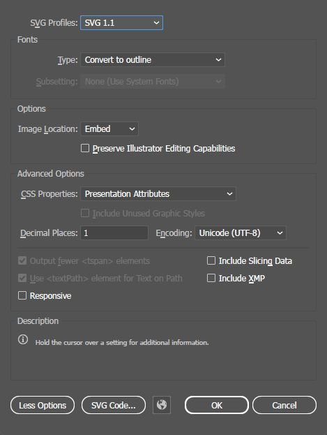

# 向量圖形（SVG）資源

Substance 3D Designer 支援有限形式的向量圖形，透過可縮放向量圖形格式。 SVG 檔案可以用不同方式作為資源，作為圖表的資源。

SVG 檔案 [可以透過原子 SVG 節點](../../compositing-graphs/nodes-reference-for-com/atomic-nodes/svg/svg.md) 建立或編輯，也可以由 [UV 轉 SVG 烘焙器建立。](https://experienceleague.adobe.com/en/docs/substance-3d/bakers/bakers-settings/convert-uv-to-svg)

>[!NOTE]
>
> Adobe Illustrator（**.ai**）檔案 *目前不* 支援。

## SVG 儲存

SVG 儲存取決於它們是連結還是匯入。 匯入的 SVG 檔案會嵌入 SBS 檔案中，[不需要像點陣](../../resources/bitmap-resource/bitmap-resource.md)圖那樣的外部檔案，並且可以使用向量編輯工具[&#128279;](../../resources/vector-graphics-svg-res/vector-editing-tools/vector-editing-tools.md)進行編輯。

## SVG 屬性

SVG 資源在套件中有許多屬性可供自訂。 大多數屬性沒有主要用途，主要用於函式庫過濾器，但少數屬性會影響渲染品質。

| 屬性名稱 | 目的 |
| --- | --- |
| 識別碼 | 用於在套件中引用 SVG 資源，必須是唯一的。 |
| 檔案路徑 | 資源參考的 SVG 檔案在磁碟上的路徑。 |
| 說明 | 此說明顯示於 [本資源的探索器](../../interface/the-explorer-window/the-explorer-window.md) 與 [圖書館](../../interface/the-library/the-library.md) 工具提示中。 |
| 類別 | 用於[圖書館的資源](../../interface/the-library/managing-custom-content/managing-custom-content-and-filters.md) [&#128279;](../../interface/the-library/the-library.md)整理與整理。 |
| 標籤 | 用於[圖書館的資源](../../interface/the-library/managing-custom-content/managing-custom-content-and-filters.md) [&#128279;](../../interface/the-library/the-library.md)整理與整理。 |
| 作者 | 用於[圖書館的資源](../../interface/the-library/managing-custom-content/managing-custom-content-and-filters.md) [&#128279;](../../interface/the-library/the-library.md)整理與整理。 |
| 作者網址 | 用於[圖書館的資源](../../interface/the-library/managing-custom-content/managing-custom-content-and-filters.md) [&#128279;](../../interface/the-library/the-library.md)整理與整理。 |
| 標記 | 用於[圖書館的資源](../../interface/the-library/managing-custom-content/managing-custom-content-and-filters.md) [&#128279;](../../interface/the-library/the-library.md)整理與整理。 |
| 使用者資料 | 可選的額外資料，向量圖形不常用。 |
| 圖書館節目 | 判斷 SVG 資源是否應該隱藏在[圖書館檢視中。](../../interface/the-library/the-library.md) |
| 向量圖形品質 | 影響渲染品質。 音域並非線性，最佳品質在0.5時可達。 |

## SVG 製作

由於僅支援有限的功能，SVG 的製作受到限制。

一般來說，以下情況成立：

* 只有簡單的基本形狀和路徑才能保證繪製正確;
* 支援筆劃，但筆劃寬度僅為 1 像素，筆劃樣式則被忽略;
* 虛線風格肯定會壞掉;
* 文字需要轉換成路徑/輪廓來渲染;
* [不支援複合路徑](https://helpx.adobe.com/ie/illustrator/using/combining-objects.html#compound_paths) ;
* 不支援像漸層這類進階功能;
* CSS 屬性的樣式元素不被支援。

## 推薦的匯出選項

每個應用程式的匯出選項略有不同：

### Adobe 插畫家

[如果你注意以下選項，Illustrator](https://www.adobe.com/tw/products/illustrator.html) 能讓你對 SVG 匯出有最大的控制權。

* 只 <b>用另存為</b>， *不要* 用匯出新為！
* <b>SVG 設定檔</b> 影響不大，不過 Tiny 設定檔（大多數時候）會預設為絕對正確的設定;
* <b>字型</b> 必須設定為 <b>「轉換為輪廓</b> 」才能使用;
* <b>CSS 屬性</b>不&#x200B;*應該*&#x200B;設為樣式元素，其他選項都能正常運作;
* 取消勾選 <b>保留 Illustrator 編輯功能</b>;
* 取消勾選 <b>響應式</b>;
* 筆觸效果不佳，請使用 <b>Object > Path > Outline Stroke</b> 來讓它們顯示出來。

右側圖片展示了推薦的匯出選項，點擊即可以全尺寸顯示。

>[!IMPORTANT]
>
> 美術板會影響產生的 SVG 檔案結果。 有些 Illustrator 檔案範本會引入多個美術板。\
> 盡量只有一個裁切好的美術板，並在存檔為 SVG 時，在美術板視窗中選擇它。

{width="512px"}

### 墨境

Inkscape 原生儲存為 SVG，但對檔案格式的控制較少。 Inkscape 檔案大多能在應用程式中原生運作，但有一些限制：

* 在 Substance 3D Designer 中，筆劃只顯示為 1px 寬度，請使用 <b>Path > Stroke to Path</b> 來讓它們運作，
* 文字無法運作，請使用 <b>Path > Object to Path</b> 來讓文字正常運作。

### Adobe Photoshop

Photoshop 的 SVG 匯出器非常有限（<b>檔案>匯出>匯出為新格式..</b>） 目前無法為 Substance 3D Designer 產生正確結果。 你可以取得形狀和路徑資訊，但樣式總是儲存為元素，這不相容。

它可用於簡單的黑白形狀遮罩，解決方案是使用 [Alpha Split](../../compositing-graphs/nodes-reference-for-com/node-library/filters/channels/alpha-split/alpha-split.md) 從 SVG 中擷取 Alpha。

或者，也可以匯 [入](../../resources/importing-linking-and-new/importing-linking-and-new-resources.md) Photoshop 匯出的 SVG，這樣你 [就能在應用程式內原生編輯樣式資訊。](../../compositing-graphs/nodes-reference-for-com/atomic-nodes/svg/svg.md)
