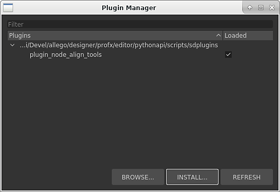

# 插件套件

支援 Python 套件來建立擴充應用程式的外掛。

它們是單一檔案，帶有 sdplugin 副檔名，包含插件運作所需的所有功能。 對開發者而言，套件簡化了外掛的分享與分發。 對使用者來說，套件安裝和管理更簡單。

## 安裝外掛套件

外掛套件可透過<b>外掛管理員</b>的工具<b></b>選單安裝：

1. 點選 <b>安裝</b> 按鈕，選擇要安裝的外掛套件
1. 該插件會安裝在主目錄中，也就是每個作業系統插件的預設路徑中
1. 安裝後，插件會自動載入
