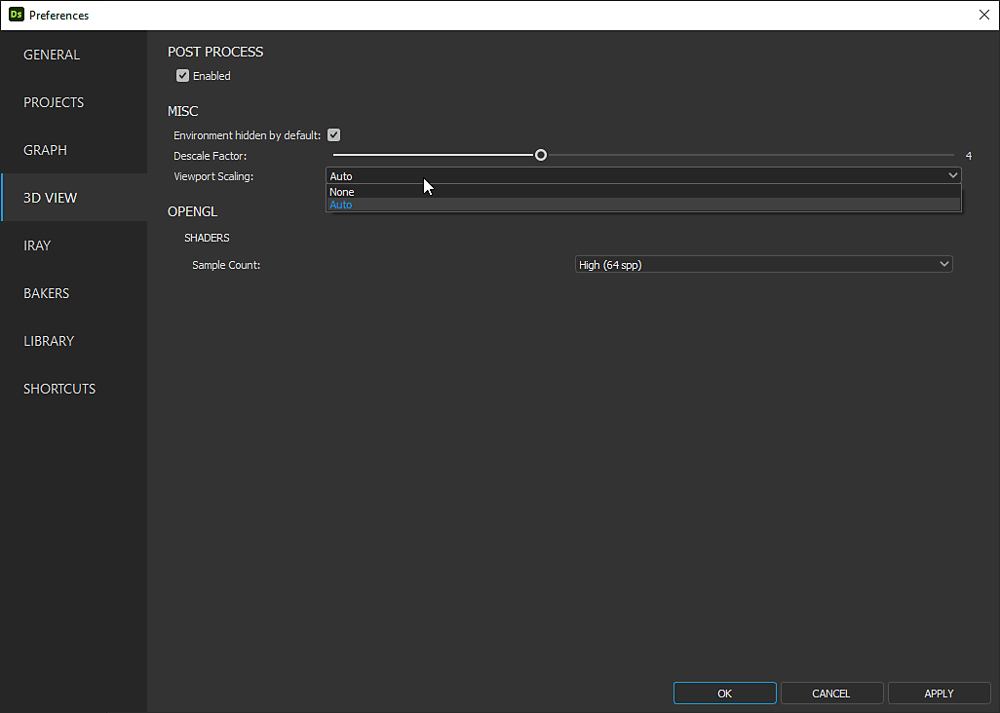

# 3D 視圖問題

本頁列出與 [Substance 3D Designer 中 3D 視圖](../../interface/3d-view/3d-view.md) 相關的技術問題，並提供各項故障排除步驟。

## 效能低：未使用獨立 GPU

** 子嗣**

Substance 3D Designer 不使用系統的 *獨立* GPU（<b>dGP</b>），而是使用 *整合* 式 GPU（<b>iGP</b>）。 這導致渲染圖表和/或 [3D 視圖](../../interface/3d-view/3d-view.md)時效能較低。

** 建議步驟**

具備可切換顯示卡的系統可以 *強制使用獨立顯示卡（dGPU* ），而該顯示卡應在專用軟體中用於 *特定應用* ，視 GPU 製造商而定。

例如，使用 <b>Nvidia 獨立顯卡</b> 的使用者可以做以下操作：

1. Close Substance 3D 設計師
2. 打開 <b>NVIDIA 控制面板</b>
3. 到<b>3D設定</b>區塊的<b>「管理3D設定</b>」畫面
4. 在程式設定</b>標籤中尋找「Substance 3D Designer」的條目<b>
5. 在偏好 GPU</b> 組合盒中<b>選擇<b>高效能 NVIDIA 處理器</b>
6. Start Substance 3D 設計師

>[!WARNING]
>
> 請注意，不 *支援*&#x200B;內建顯示卡（iGPU）。 你可以在 [系統需求](../../getting-started/system-requirements/system-requirements.md) 頁面了解更多。

## 3D 物體是平面的

** 子嗣**

一個在一個工作階段有詳細體積的 3D 物件，在下一個工作階段會變成平面化，但圖形並未改變，且高度圖所攜帶的資料相同。

** 建議步驟**

根據高度圖對三維物體的變形效果，是利用一種稱為 **「剖面位移**」的技術來實現的。 此技術包含兩個步驟：

1. **鑲嵌**：將物件幾何 *細分為* 頂點，形成 *更密集的幾何* 結構以支持更細緻的體積細節
2. **位移**：頂點沿其&#x200B;*法向量*&#x200B;移動&#x200B;**——即位移。法向量沿著多邊形所面向的方向移動，且長度（即大小）為 1

位移 *方向* 已知：法向量的方向。\
頂點移動的位移 *距離* 計算公式如下： `Distance = Height scale * Height map`。 因為圖中的高度圖沒有 *改變* ，所以只剩 **下高度刻度**。

預設的高度縮放值為 **1.0**，這可能會產生位移效應，但視 3D 視圖中顯示的網格及其套用的高度圖不同，這些效果不 *易察* 覺。

此值可透過以下方式調整：

| 在 3D 視圖中 | 在圖視圖中 |
|:--------------------------------------------------------------------------------------------------------------------------------------------------|:-----------------------------------------------------------------------------------------------------------------------------------------------------------------------------------------------------------------------------------------------------------------------------------------------------------------------------------------------------------------------------------------|
| 請使用 **左側工具列的位移彈出視窗** 。<br>詳情請見 [專屬頁面](../../interface/3d-view/displacement/displacement.md)。 | 建立一個 [輸出](../../compositing-graphs/nodes-reference-for-com/atomic-nodes/output/output.md) 節點，並在其屬性中設定使用量 `heightScale` 。<br>為此輸出提供一個值，例如使用 [常數浮點節點](../../compositing-graphs/nodes-reference-for-com/node-library/values/constant.md#floats) ，然後 *在 3D View 中重新套用該圖* 。 |

>[!TIP]
>
> 透過這種方法，你可以為每個圖表&#x200B;*設定自訂的高度刻度值*，讓你能調整它以符合該圖表的特定材質。

## 3D 視角完全是黑色

** 子嗣**

在 15.0.0 及以上版本中，3D 視圖的視窗呈現平面黑色。 我看到一些文字疊加（例如取樣和渲染時間），但 3D 場景看不到。

** 建議步驟**

版本 15.1 及以上

新的 3D 渲染器在 15.1 版本中升級，並需要更新的 GPU 驅動程式。 請將系統的顯示卡驅動程式更新到最新版本。

你可以在這裡找到驅動程式：   [NVIDIA](https://www.nvidia.com/Download/index.aspx?lang=en-us)  |  [AMD](https://www.amd.com/en/support)  |  [Intel](https://downloadcenter.intel.com/product/80939/Graphics-Drivers)

版本 15.0 及以上

Designer [15.0.0](../../release-notes/version-15-0/version-15-0.md) 推出了我們全新的自家 [3D 渲染器，這些渲染器](../../interface/3d-view/3d-renderers/3d-renderers.md)採用現代技術，因此舊款 GPU 不支援。

支援的 GPU 包括 NVIDIA RTX 20 系列（圖靈）或更高版本，依據 Designer 的 [系統需求](../../getting-started/system-requirements/system-requirements.md)。

你可以預設繼續使用 OpenGL 渲染器，方法是在專案設定[&#128279;](../../interface/preferences-window/project-settings/project-settings.md)中新增選項：

1. 前往編輯>偏好設定>專案
2. 選擇列表中最後一個專案檔案
3. 在專案檔案清單中，選擇 3D View 標籤
4. 把「預設渲染器」選項設為「OpenGL（已棄用）」
5. 點擊「確定」以驗證變更

現在，所有新的 3D View 預設都會使用 OpenGL 渲染器，讓你能繼續像以前一樣工作。

>[!NOTE]
>
> 同樣的問題和故障排除步驟也適用於大多數 AMD 和 Intel 顯示卡，目前 *我們的新 3D 渲染器並不支援* 這些顯卡。

>[!IMPORTANT]
>
> OpenGL 渲染器已被 *棄用* ，未來可能會從 Designer 中移除。 我們建議升級系統的 GPU，以防止工作流程中斷並確保持續的支援。

## 顯示「不支援渲染器」訊息

** 子嗣**

在 15.0.0 及以上版本中，使用新 3D 渲染器（Rasterizer、GPU pathtracer）時，視窗右下角會出現「不支援渲染器」的訊息。 3D 場景是看不到的。

** 建議步驟**

Designer [15.0.0](../../release-notes/version-15-0/version-15-0.md) 推出了我們全新的自家 [3D 渲染器，這些渲染器](../../interface/3d-view/3d-renderers/3d-renderers.md)採用現代技術，因此舊款 GPU 不支援。

支援的 GPU 包括 NVIDIA RTX 20 系列（圖靈）或更高版本，依據 Designer 的 [系統需求](../../getting-started/system-requirements/system-requirements.md)。

在預設設定下，如果專案設定[&#128279;](../../interface/preferences-window/project-settings/project-settings.md)中的「預設渲染器」選項設為「預設（預設渲染器）」，3D 視圖會自動退回到 OpenGL 渲染器。

你可以依照以下步驟找到並調整這個選項：

1. 前往編輯>偏好設定>專案
2. 選擇列表中最後一個專案檔案
3. 在專案檔案清單中，選擇 3D View 標籤
4. 「預設渲染器」選項在分頁的設定裡有列出

>[!NOTE]
>
> 目前只有 NVIDIA GTX 系列</b>的 GPU <b>被偵測為不支援。
> 
> 然而，大多數 AMD 和 Intel GPU 也不支援，會產生黑色渲染且沒有訊息。 請參考上面「3D 視圖完全是黑色」的說明，了解這些 GPU 的使用指引。

>[!IMPORTANT]
>
> OpenGL 渲染器已被 *棄用* ，未來可能會從 Designer 中移除。 我們建議升級系統的 GPU，以防止工作流程中斷並確保持續的支援。

## 3D 物件看起來完全平滑

** 子嗣**

在處理傳送到&#x200B;**高度**&#x200B;[輸出](../../compositing-graphs/nodes-reference-for-com/atomic-nodes/output/output.md)的資料後，物件看起來有些體積，但&#x200B;*看起來完全平滑*，彷彿在陰影中忽略了高度資訊。

<table style="margin-left: 0; margin-right: 0;">
<tr style="border: 0;">
<td style="border: 0; width: 60%; vertical-align: top">

** 建議步驟**

確保高度資料已轉換為連接到&#x200B;**法線**&#x200B;[輸出](../../compositing-graphs/nodes-reference-for-com/atomic-nodes/output/output.md)的法線&#x200B;*。*

使用 **鑲嵌位移技術（Tessellation Displacement** technique）時（見上文「3D 物件是平面的」），物件可能會 *隨高度資料變形* ，但其表面 *不會對光有* 不同反應，除非 *法線* 也被修改以考慮高度資料。

解決方案很簡單：將流中最後一個節點連接到 Normal [&#128279;](../../compositing-graphs/nodes-reference-for-com/atomic-nodes/normal/normal.md) 節點。根據你正在處理的材質調整該節點的 **強度** 參數，並將法線節點連接到 **法線** 輸出。

</td>
<td style="border: 0; width: 40%; vertical-align: top">

{width="256px"}

</td>
</tr>
</table>

## 渲染模糊/像素化

** 子嗣**

當系統使用 *顯示縮放*&#x200B;時，渲染出來的影像會變得模糊或像素化。

<table style="margin-left: 0; margin-right: 0;">
<tr style="border: 0;">
<td style="border: 0; width: 60%; vertical-align: top">

** 建議步驟**

預設情況下，Designer 使用 *縮放後* 的顯示解析度來定義 [3D 視圖](../../interface/3d-view/3d-view.md)的渲染解析度。 你可以改成 *用原生* 顯示解析度來呈現清晰的畫面。

打開 **編輯** 選單，選擇 **偏好設定...** 選項。 在[偏好設定](../../interface/preferences-window/preferences-window.md)視窗中，打開 **3D 視圖**&#x200B;區塊，並將視窗縮放&#x200B;**參數設**&#x200B;為 *None*。

</td>
<td style="border: 0; width: 40%; vertical-align: top">

{width="256px"}

</td>
</tr>
</table>

## 我找不到「鑲嵌因子」這個特性

** 子嗣**

在將 Designer 升級到 15.0.0 版本後，我在原本所在的材質屬性中找不到「Tessellation factor」參數。

** 建議步驟**

使用新渲染器（Rasterizer 和 GPU Pathtracer）時，「Tessellation factor」會發現在這些渲染器的屬性中。 在 3D 視圖中，進入 <b>渲染器>編輯設定</b>。 該物業將列入物業登記冊。

>[!NOTE]
>
> 鑲嵌的範圍會依渲染者而異：
> 
> * 光柵化器/GPU 路徑追蹤器：一個全域套用於整個場景的唯一值。
> * OpenGL：每種材料只有一個值。
> * Iray：每個網格一個數值。

## 3D 物件看起來不對勁：它們的陰影與光線不符

** 子嗣**

物體的著色依賴於其法線、切線和雙法向量。 它們的座標使用 `[-1, 1]` 距離，而法線貼圖在大多數情況下使用 `[0, 1]` 範圍。 為了將數值從一個調整到另一個<b>，需要施加偏差和刻度</b>： `value * scale + bias`

例如，刻度為 2 且偏壓為 -1，將 x 值 `[0, 1]` 從 調整到 `[-1, 1]` 如下： `x * 2 - 1`。

除非由 3D 網格指定，否則 Designer 不會套用法線縮放和偏壓。 若缺少該資訊，覆蓋任何資料[&#128279;](../../working-with-3d-scenes/overriding-scene-mat/overriding-scene-materials.md)時，控制台會發出警告：

```
[SceneGraph]No 'scale' or 'bias' defined on the UsdUVTexture shader '/root/material/<materialName>' (the rendering may be incorrect)
```


** 建議步驟**

對於之前匯出成 USD 格式的場景：用最新版本的 USD 重新匯出場景，該版本會包含必要的資料。 如果有與正常比例和偏壓相關的屬性，請特別注意，這會依匯出場景的軟體而異。

在覆寫材質[&#128279;](../../working-with-3d-scenes/overriding-scene-mat/overriding-scene-materials.md)時，Designer 會處理網格並計算與其法線、切線和雙法線相關的缺失資料。如果 Designer 預設的縮放和偏壓恰好符合網格所需的，那麼覆蓋後的網格看起來就會正確。

## 啟動 3D 檢視時當機

** 子嗣**

設計器在啟動 3D 視圖時、建立專案、載入專案或手動啟動 3D 視圖時會當機。

** 建議步驟**

首先，確保你的系統符合 Designer 的 [系統要求](../../getting-started/system-requirements/system-requirements.md)。

接著，更新你的顯示卡驅動程式。 你可以透過以下連結找到你 GPU 的最新驅動程式：   [NVIDIA](https://www.nvidia.com/Download/index.aspx?lang=en-us)  |  [AMD](https://www.amd.com/en/support)  |  [Intel](https://downloadcenter.intel.com/product/80939/Graphics-Drivers)

如果你的系統同時包含一體式 GPU（iGPU）和獨立 GPU（獨立 GPU），務必更新 *兩者*&#x200B;的驅動程式！

接著，關閉任何可能在 3D 圖形流程中注入或疊加資料的軟體。 範例包括：

* 後製程注射器如 ReShade
* 像是自訂準星或 GPU 效能指標等疊加層
* 用於即時錄製、串流或分享 3D 圖形的螢幕擷取軟體
