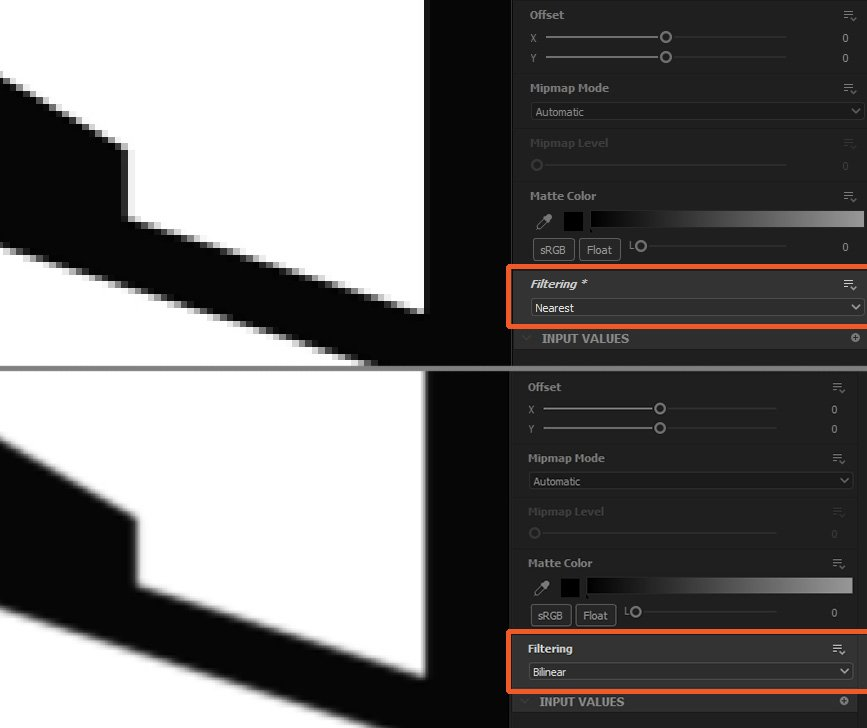

# 影像輸出錯誤

本頁列出 Substance 3D Designer 中導致影像輸出錯誤或意外的技術問題，並提供各項故障排除步驟。

## 可見的階梯/帶狀結構

<table>
<tr style="border: 0;">
<td width="58.30%" style="border: 0;" valign="top">

** 子嗣**

影像輸出的漸層是階梯式的，而非平滑的。 階梯移動是因為 *影像所使用的明值範圍過於狹窄*&#x200B;所致。\
這表示沒有足夠的數值來平滑地從梯度的一個步驟過渡到下一個階段。

亮度/RGBA 值可用整數或浮點值編碼，影響其 *精度*：

* **整數** 提供 8 位元精度（0-255，即 256 種可能值）與 16 位元精度（0-65535，約 65536 種可能值）來儲存 0-1 範圍內的值。
* **浮點** 運算提供 16 位元（HDR 16F）與 32 位元（HDR 32F）的精度，並能儲存 0-1 範圍外的值，包括負值。 這讓你能處理高動態範圍（HDR）影像，亮度值可能遠高於1.0。

如果你不特別需要處理 HDR 影像，那麼大多數節點可能會輸出 0-1 的數值，並用整數編碼。 若影像的輸出格式為 8-bit，則影像只能使用 256 個值，這通常會導致漸層上可見的階梯現象。 這尤其會影響 Normal 節點的輸出。

</td>
<td width="41.60%" style="border: 0;" valign="top">

{width="256px"}{width="256px"}{width="256px"}

</td>
</tr>
</table>

** 建議步驟**

檢查 **節點及所有上游節點的輸出格式** （即位元深度），並確保這些節點至少使用 *16位元整數精度*。

輸出格式參數通常設為&#x200B;*相對於輸入*[的繼承方法](../../compositing-graphs/inheritance-compositing/inheritance-in-substance-compositing-graphs.md)，這會將低精度傳遞到整個圖中。理想狀況下，透過往上游的圖尋找問題的根本原因。

你可以快速判斷節點輸出的精確度，只要查看節點下方顯示的文字資訊：

* **L/C** 指的是影像為灰階（即亮度）或彩色
* **8/16** 表示整數編碼
* **16F/32F** 表示浮點編碼

例如：

* L8：灰階 8 位元整數
* C16：顏色16位元整數
* C32F：彩色32位元浮點（HDR）

## 已發表的SBSAR品質損失

<table>
<tr style="border: 0;">
<td width="58.30%" style="border: 0;" valign="top">

<b> 子嗣</b>

Substance 3D 檔案庫（SBSAR）輸出的影像品質明顯低於其發布的 Substance 3D 檔案圖，如右側圖片所示。\
輸出看起來解析度很低。

</td>
<td width="41.60%" style="border: 0;" valign="top">

{width="256px"}

</td>
</tr>
</table>

<b> 建議步驟</b>

確保所有位圖](../../compositing-graphs/nodes-reference-for-com/atomic-nodes/bitmap/bitmap.md)節點的輸出大小](../../compositing-graphs/output-size/output-size.md)屬性都設定為&#x200B;*絕對[*&#x200B;繼承方法](../../compositing-graphs/inheritance-compositing/inheritance-in-substance-compositing-graphs.md)。[[

若非如此，其參考 [點陣資源](../../resources/bitmap-resource/bitmap-resource.md) 將以預設的 256\*256 解析度儲存在已發佈的 Substance 3D 檔案庫中，這會影響*&#x200B;一個或多個輸出的品質* 。

## 影像模糊

<table>
<tr style="border: 0;">
<td width="58.30%" style="border: 0;" valign="top">

** 子嗣**

使用某些節點後，形狀會稍微模糊，例如 [轉換 2D](../../compositing-graphs/nodes-reference-for-com/atomic-nodes/transformation-2d/transformation-2d.md) 或 [混合](../../compositing-graphs/nodes-reference-for-com/atomic-nodes/blend/blend.md)。

</td>
<td width="41.60%" style="border: 0;" valign="top">

{width="256px"}

</td>
</tr>
</table>

** 建議步驟**

當重新排列影像中的像素時，例如調整形狀大小或改變影像解析度時，有兩種方法可以決定來源像素應 *如何映射* 到目的地：

* **最近**：像素會依照原樣&#x200B;*映射到目標*，並匹配座標。若目標解析度較低，該像素可能會被完全忽略。 若目標解析度較高;則會映射至涵蓋其跨度的所有像素。 輸出會 *更* 清晰，會看起來有點 *鋸齒*。
* **雙線性濾波**：對來源影像施加濾波處理，使其像素映射到目標解析度 *，以平滑* 像素間的過渡。 輸出較 *為平滑* ，且看起來會稍微 *模糊*。

[轉換二維](../../compositing-graphs/nodes-reference-for-com/atomic-nodes/transformation-2d/transformation-2d.md)節點提供&#x200B;**篩選方法**&#x200B;選項，讓你選擇應該使用哪一種映射方法。

大多數節點（例如 [Blend](../../compositing-graphs/nodes-reference-for-com/atomic-nodes/blend/blend.md) ）在取樣不同解析度的輸入貼圖時，預設採用 *雙線性濾波* ，這可能會造成不必要的模糊。\
因為 Transformation 2D 節點是原子式&#x200B;*的——非常輕量級——即使不需要轉換*，也可以用 *Output [size](../../compositing-graphs/output-size/output-size.md) 特性來改變材質解析度，然後再傳送到另一個節點，這樣你就能*&#x200B;控制調整大小的影響&#x200B;*。*

在 Pixel 處理器](../../compositing-graphs/nodes-reference-for-com/atomic-nodes/pixel-processor/pixel-processor.md)節點的功能[圖](../../function-graphs/function-graphs.md)中[，**取樣**&#x200B;節點也包含&#x200B;*相同的選項*，用以控制取樣紋理如何映射到節點的解析度。
