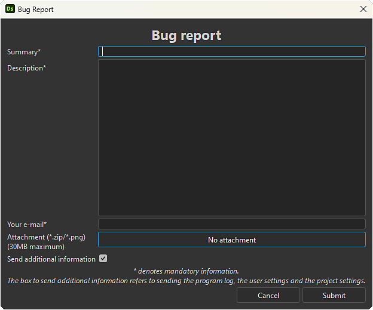

# 技術問題

此頁面讓您能找到使用者在使用 Substance 3D Designer 時可能遇到的常見技術問題資訊，並依類別分類整理。\
在列出的每個頁面中，你都可以找到 *解決或緩解這些問題的故障排除步驟* 。

* [警告與錯誤](../technical-issues/warnings-and-errors/warnings-and-errors.md)
* [無法建立或載入專案](../technical-issues/cannot-create-load-pro/cannot-create-load-a-project.md)
* [申請不會開始](../technical-issues/application-does-not-sta/application-does-not-start.md)
* [渲染圖表時崩潰](../technical-issues/crash-when-rendering-gra/crash-when-rendering-graphs.md)
* [參數未如預期運作](../technical-issues/parameters-not-working/parameters-not-working-as-expected.md)
* [影像輸出錯誤](../technical-issues/incorrect-image-output/incorrect-image-output.md)
* [3D 視圖問題](../technical-issues/3d-view-issues/3d-view-issues.md)
* [烘焙問題](../technical-issues/baking-issues/baking-issues.md)
* [使用者介面問題](../technical-issues/user-interface-issues/user-interface-issues.md)
* [Python 問題](../technical-issues/python-issues/python-issues.md)
* [缺少 Substance 模型圖功能](../technical-issues/model-graph-eol/substance-model-graph-eol.md)

## 回報問題

Designer 包含直接回報當機和錯誤的功能。

>[!TIP]
>
> 請詳細描述！
> 
> *您寄給我們的每一份*&#x200B;當機與錯誤報告，都會由&#x200B;*設計師團隊成員*&#x200B;審核。
> 
> 在回報問題時， <b>請盡可能包含更多細節和背景</b>，這樣能更快更輕鬆地理解問題並找到解決方案。
> 
> 如果你有任何改進 Designer 的回饋或建議，請在 [我們的專屬論壇](https://community.adobe.com/t5/substance-3d-designer/ct-p/ct-substance-3d-designer)告訴我們。 社群可以對建議按讚，我們也會追蹤這些資訊。

### 事故報告

<table>
<tr style="border: 0;">
<td style="border: 0;" valign="top">

當應用程式當機時，大多數情況下會顯示「當機報告」對話框。

你可以在描述欄位告訴我們當機的具體情況，這樣我們才能調查，並希望未來的 Designer 版本能修復。

請提供 <b>有效的電子郵件地址</b> ，以便我們若需要更多細節或提供解決你遭遇的崩潰方案，可以與你聯繫。

</td>
<td style="border: 0;" valign="top">

{zoomable="yes"}

*點擊放大*

</td>
</tr>
</table>

>[!NOTE]
>
> 當機報告預設&#x200B;*包含 Designer 的日誌檔、偏好設定和專案檔案*。因此，這些檔案中可能會出現</b>一些<b>系統與檔案路徑。
> 
> 這些檔案的使用僅限 <b>於內部，且僅限</b> 於調查報告問題的範圍。

### 錯誤回報

<table>
<tr style="border: 0;">
<td style="border: 0;" valign="top">

你可以隨時在 Designer 裡回報錯誤。 在主選單中，請前往 <b>「幫助>回報錯誤」......</b> 以開啟錯誤回報對話框。

你可以在描述欄位告訴我們關於這個 iisue 的資訊，這樣我們就能調查並告訴你我們的發現。

</td>
<td style="border: 0;" valign="top">

{zoomable="yes"}

*點擊放大*

</td>
</tr>
</table>

請提供 <b>有效的電子郵件地址</b> ，以便我們若需要更多細節或提供解決方法，隨時聯絡您。

請檢查 <b>「傳送額外資訊</b> 」選項，在報告中包含設計師的日誌檔案、偏好設定和專案檔案。

>[!NOTE]
>
> 這些額外檔案中可能會顯示</b>部分<b>系統與檔案路徑。
> 
> 這些檔案的使用僅限 <b>於內部，且僅限</b> 於調查報告問題的範圍。

點擊 <b>附件</b> 按鈕，可將檔案附加到您的報告中，以協助我們更準確評估問題。 歡迎附上專案檔案、截圖、螢幕錄影或其他你認為與問題相關的檔案。
